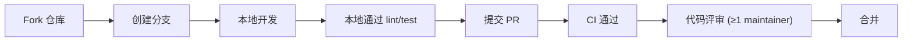

# Contributing to AreaMatrix

感谢你愿意为 AreaMatrix 贡献。本文档说明如何提 issue、提 PR、本地开发和代码规范。

阅读时长：约 5 分钟。

---

## 行为准则

参与本项目即代表你同意遵守 [行为准则](CODE_OF_CONDUCT.md)。

## 在开始之前

1. 阅读 [项目文档导航](docs/README.md) 了解整体架构
2. 浏览 [docs/adr/](docs/adr/) 了解关键决策的来龙去脉，避免重复讨论已定结论
3. 在 [Issues](https://github.com/<your-org>/AreaMatrix/issues) 搜索是否有人已经提过相同需求/问题
4. 涉及工程治理、CI、安全或依赖时，先读 [CODE_REVIEW.md](CODE_REVIEW.md) 和 `docs/development/`

## 贡献的几种方式

### 1. 提交 Bug Report

使用 [bug_report.md](.github/ISSUE_TEMPLATE/bug_report.md) 模板。**最重要的是可复现步骤**。

### 2. 提交 Feature Request

使用 [feature_request.md](.github/ISSUE_TEMPLATE/feature_request.md) 模板。请说明：
- 解决的真实痛点（**why** 比 what 重要）
- 期望的用户交互
- 是否考虑过其他方案

### 3. 提交 Pull Request

PR 流程：



### 4. 改进文档

文档改动是最受欢迎的 PR 之一。docs/ 目录下任何文件的拼写、表述、信息缺失都欢迎修正。

## 本地开发

详见 [docs/development/setup.md](docs/development/setup.md)。

简短版：

```bash
git clone https://github.com/<your-org>/AreaMatrix.git
cd AreaMatrix
./dev build core
open apps/macos/AreaMatrix.xcodeproj
```

## 分支与 Commit 规范

详见 [docs/development/git-workflow.md](docs/development/git-workflow.md)。

简短版：

- 主分支：`main`（始终可发布）
- 功能分支：`feat/xxx`、`fix/xxx`、`docs/xxx`、`refactor/xxx`、`test/xxx`
- Commit 规范：[Conventional Commits](https://www.conventionalcommits.org/)
  - `feat(classify): 关键词匹配支持大小写折叠`
  - `fix(storage): 修复 staging 区残留清理时的 race condition`
  - `docs(adr): 增补 0010 关于全文搜索的决策`

## 代码评审

详见 [CODE_REVIEW.md](CODE_REVIEW.md)。

简短版：

- 所有 PR 都需要至少 1 位维护者 review。
- High / Mission-Critical 改动必须说明影响、风险、验证和回滚。
- 用户文件、DB、staging、FSEvents/iCloud、隐私、安全或 Core API 破坏性变化不能只靠口头确认。
- task-loop 自动生成的 PASS commit 仍需 CI 和 review，不能直接视为可合并。

## 编码规范

详见 [docs/development/coding-standards.md](docs/development/coding-standards.md)。

简短版：

- **Rust**：`cargo fmt` + `cargo clippy -- -D warnings`，所有 public API 必须有 rustdoc
- **Swift**：SwiftFormat + SwiftLint，遵循 Apple 的 [Swift API Design Guidelines](https://www.swift.org/documentation/api-design-guidelines/)
- **Markdown**：每行不超过 120 字符（中文按视觉宽度估算），标题层级不跳级
- **Mermaid**：节点 ID 用 camelCase，标签可中文，避免空格作 ID

## 测试要求

- 新增功能必须附带单元测试或集成测试
- Rust：`cargo test` 必须全部通过
- Swift：Xcode → Test 必须全部通过
- 测试覆盖率门槛：核心模块 ≥ 70%（CI 会检查）

详见 [docs/development/testing.md](docs/development/testing.md)。

## 依赖、许可证与供应链

详见 [docs/development/dependency-policy.md](docs/development/dependency-policy.md)。

新增依赖必须说明用途、版本、许可证、替代方案、供应链风险和验证方式。许可证不兼容、来源不明或无法锁定的依赖不得合并。

## CI 与治理门禁

详见 [docs/development/ci-governance.md](docs/development/ci-governance.md)。

所有 PR 都会运行 core、macOS、prompt、skill 和 governance 检查。CI 失败默认阻断合并；环境性失败必须在 PR 中记录命令、错误和补跑计划。

## AI task-loop 贡献

自动任务循环会按 `copy -> verify(read-only) -> repair retry -> PASS -> Git checkpoint -> next` 执行。相关贡献必须保留：

- `tasks/prompts/_shared/progress.json`
- `.codex/task-loop-logs/**`
- `.codex/task-loop-runs/**`
- PASS task 的 Git checkpoint 证据

## 文档要求

- 添加新模块 → 在 `docs/modules/` 下加一篇说明文档
- 重大架构变更 → 在 `docs/adr/` 下加一篇 ADR
- 新增/修改 Core API → 同步更新 `docs/api/core-api.md`
- 用户可见行为变更 → 在 `CHANGELOG.md` 的 `[Unreleased]` 段落记录

## PR 检查清单

提交 PR 前请自查：

- [ ] 代码通过 `cargo fmt && cargo clippy && cargo test`
- [ ] Swift 代码通过 SwiftLint 与 Xcode Test
- [ ] 已更新相关文档
- [ ] 已在 `CHANGELOG.md` 的 `[Unreleased]` 段落添加条目
- [ ] Commit message 符合 Conventional Commits
- [ ] 已按 [CODE_REVIEW.md](CODE_REVIEW.md) 自查风险、验证和回滚
- [ ] 新增依赖已按 dependency policy 说明许可证和供应链风险
- [ ] CI / governance 检查通过或已说明阻塞原因
- [ ] PR 标题清晰描述改动（不超过 72 字符）
- [ ] PR 描述说明了 **why**、**what**、**how to test**
- [ ] 不包含未授权的第三方资源 / 商业 logo / 与许可证不兼容的代码

## 评审节奏

- 简单 PR（< 100 行）：通常 2-3 个工作日内有反馈
- 复杂 PR（> 500 行）：先开 issue 讨论方案再提 PR
- 涉及架构变更：必须先有 ADR 通过

## 知识产权与许可证

向本仓库提交的所有贡献，默认采用与项目相同的 [PolyForm Noncommercial 1.0.0](LICENSE) 许可。

如果你提交的代码包含来自其他项目的片段，请在 PR 描述中明确标注来源、原许可证，并确认许可证兼容。**不接受**许可证不兼容的代码。

## 问题求助

- GitHub Discussions：架构讨论、产品建议
- GitHub Issues：明确的 bug、明确的 feature
- 不要在 issue 里直接问"how do I use X"，去 Discussions
