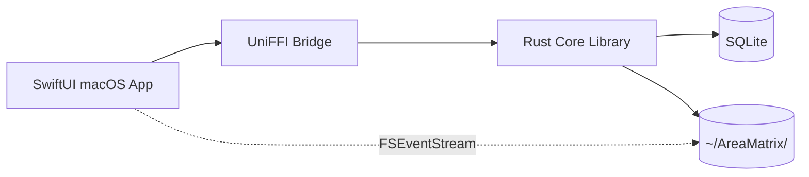

# AreaMatrix

> Drag, drop, and your files organize themselves.
>
> A native macOS desktop app for visual file management with auto classification, change tracking, and a tree-view of everything you own.

[简体中文](./README.zh-CN.md) | English

---

## What is AreaMatrix

AreaMatrix is a **source-available** desktop application that turns the chaos of personal files into a navigable, self-organizing knowledge repository.

Drop a file in. AreaMatrix figures out what it is, where it belongs, and how to name it. Every change is logged, every category gets a living `README.md`, and the entire tree is browsable in a single window.

## Highlights

- **Drag-to-archive** — drop files onto any window region; smart categorization happens locally.
- **Hybrid classification** — extension + keyword rules first, optional AI fallback (Stage 3).
- **Three storage modes** — *Move*, *Copy*, or *Index-only* (decide per drop).
- **Living README.md** — each category folder maintains an auto-generated overview with recent changes.
- **Tree-view navigation** — full repository structure in a sidebar, virtualized for large libraries.
- **Two-way sync** — external Finder/Terminal modifications are picked up via FSEvents.
- **Crash-safe** — transactional staging area; no half-moved files after a hard kill.
- **iCloud aware** — placeholder files are coordinated through `NSFileCoordinator`.
- **100% native macOS UI** — SwiftUI, not a WebView.

## Architecture at a glance

The Rust core library is platform-agnostic. macOS is the first target; Windows / Linux / iOS can be added later by writing a new UI layer against the same core.

## Status

Pre-alpha. The repository currently ships **documentation only**. Implementation will start when the docs are accepted by the development team.

See [docs/roadmap/milestones.md](docs/roadmap/milestones.md) for the four-stage release plan.

## Quick links

| For | Read |
|---|---|
| Product overview | [docs/product/prd.md](docs/product/prd.md) |
| Architecture | [docs/architecture/overview.md](docs/architecture/overview.md) |
| Module designs | [docs/modules/](docs/modules/) |
| API reference | [docs/api/core-api.md](docs/api/core-api.md) |
| Setup & build | [docs/development/setup.md](docs/development/setup.md) |
| Decision records | [docs/adr/](docs/adr/) |
| Contributing | [CONTRIBUTING.md](CONTRIBUTING.md) |

## Requirements

- macOS 14 Sonoma or later
- Xcode 15+
- Rust 1.75+ (stable)
- Apple Silicon or Intel (universal binaries built by default)

## License

AreaMatrix is distributed under the **[PolyForm Noncommercial License 1.0.0](LICENSE)**.

You may use, modify, and redistribute the source for **noncommercial** purposes (personal use, education, research, internal business operations). The original copyright notice and license must be preserved.

For **commercial use** (selling, SaaS hosting, embedding in commercial products), see [COMMERCIAL_LICENSE.md](COMMERCIAL_LICENSE.md) for how to obtain a separate commercial license.

> **Note**: PolyForm-NC is *source-available*, not OSI-certified open source. Anyone can read the code, contribute, and use it noncommercially — but commercial use requires a separate agreement.

## Contributing

Issues, pull requests, and discussions are welcome. Please read [CONTRIBUTING.md](CONTRIBUTING.md) and [CODE_OF_CONDUCT.md](CODE_OF_CONDUCT.md) before submitting.

## Acknowledgements

AreaMatrix borrows architectural ideas from Obsidian (vault model), Eagle (visual library), and DEVONthink (auto classification). It is not affiliated with any of them.
