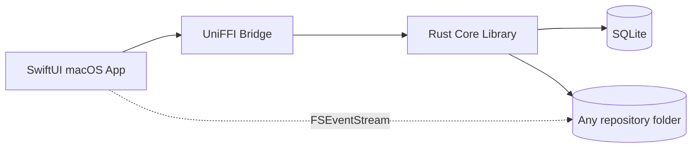

# AreaMatrix

> Drag, drop, and your files organize themselves.
>
> A native macOS desktop app for visual file management with auto classification, change tracking, and a tree-view of everything you own.

[简体中文](./README.zh-CN.md) | English

---

## What is AreaMatrix

AreaMatrix is a **source-available** desktop application that turns the chaos of personal files into a navigable, self-organizing knowledge repository.

Choose any folder as a repository, even one that already contains years of files. AreaMatrix indexes it without moving, renaming, or overwriting existing content. After that, drop a file in and AreaMatrix figures out what it is, where it belongs, and how to name it. Every change is logged, dedicated overview files stay up to date, and the entire tree is browsable in a single window.

## Highlights

- **Drag-to-archive** — drop files onto any window region; smart categorization happens locally.
- **Adopt existing folders** — any non-empty folder can become the repository root; first open scans and indexes it.
- **Hybrid classification** — extension + keyword rules first, optional AI fallback (Stage 3).
- **Three storage modes** — *Move*, *Copy*, or *Index-only* (decide per drop).
- **Dedicated repository overviews** — generated under `.areamatrix/generated/` by default, with optional `AREAMATRIX.md`; existing `README.md` files are never overwritten.
- **Tree-view navigation** — full repository structure in a sidebar, virtualized for large libraries.
- **Two-way sync** — external Finder/Terminal modifications are picked up via FSEvents.
- **Crash-safe** — transactional staging area; no half-moved files after a hard kill.
- **iCloud aware** — placeholder files are coordinated through `NSFileCoordinator`.
- **100% native macOS UI** — SwiftUI, not a WebView.

## Architecture at a glance

```mermaid
flowchart LR
    UI[SwiftUI macOS App]
    FFI[UniFFI Bridge]
    Core[Rust Core Library]
    DB[(SQLite)]
    Repo[(Any repository folder)]

    UI --> FFI --> Core
    Core --> DB
    Core --> Repo
    UI -.FSEventStream.-> Repo
```

The Rust core library is platform-agnostic. macOS is the first target; Windows / Linux / iOS can be added later by writing a new UI layer against the same core.

## Status

Implementation-stage pre-alpha. The `v1-mvp` technical prompt queue is complete
(`637/637`), and the repository now contains the Rust core, the SwiftUI macOS
app, tests, and early iOS / Windows / Linux surfaces.

`v0.1.0-unnotarized-preview.2` is prepared as a GitHub prerelease track for
trusted testers. It is ad-hoc signed, not Developer ID signed, and not notarized.
`0.1.0-local-qa` remains an internal QA artifact only. Formal alpha distribution
is still blocked on release evidence such as iCloud placeholder smoke testing,
Developer ID signing, notarization, clean-Mac first launch validation, and the
final `v0.1.0` tag.

See [docs/roadmap/milestones.md](docs/roadmap/milestones.md) for the four-stage release plan.

## Repository layout

AreaMatrix keeps source, planning, and local runtime material separate:

| Layer | Paths | Notes |
|---|---|---|
| Product source | `core/`, `apps/`, `docs/` | Rust core, native app surfaces, and authoritative product docs. |
| Product assets and prototypes | `assets/brand/`, `assets/prototypes/` | Canonical brand assets plus non-authoritative landing / workspace visual prototypes. |
| Planning and governance | `.ai-governance/`, `workflow/`, `tasks/` | AI collaboration rules, version planning gates, version-local execution queues, lightweight task progress, and backlog material. |
| Codex runtime | `.codex/`, `.agents/skills/`, `dev`, `task-loop`, `scripts/` | Repo-local Codex skills, discovery entrypoints, and task-loop tooling. These are stable tool entrypoints and should not be moved just to reduce visual clutter. |
| Local generated output | `.build/`, `build/`, `core/target/`, `apps/*/.build`, `apps/**/bin`, `apps/**/obj`, `apps/macos/DerivedData/` | Ignored local build products. They are not part of the source layout. |

Fixed paths such as `.codex/skills-src/`, `.agents/skills/`, `workflow/`, `dev`, and `task-loop` are intentionally kept in place because local Codex skills and task-loop scripts rely on them. The historical v1 prompt queue now lives under `workflow/versions/v1-mvp/execution/`. Lightweight independent tasks live under `tasks/active/` and `tasks/done/`; `tasks/backlog/` remains a candidate pool, not current task progress.

Status boundaries: product facts come from `docs/`, `core/`, `apps/`, and
`assets/brand/final/`; planning, archive, and reference material lives under
`workflow/`; lightweight task state lives in `tasks/active/` and `tasks/done/`;
closed backlog prompt packages are historical candidates; Codex runtime
material in `.codex/`, `.agents/skills/`, `dev`, `task-loop`, and `scripts/`
is tooling, not product source of truth.
Residual release / reference / template items are indexed under
`workflow/residuals/` and `workflow/versions/<version>/residuals/`; those indexes
link back to their source files and do not replace `docs/`, release evidence, or
task state.

## Quick links

| For | Read |
|---|---|
| Product overview | [docs/product/prd.md](docs/product/prd.md) |
| Architecture | [docs/architecture/overview.md](docs/architecture/overview.md) |
| Module designs | [docs/modules/](docs/modules/) |
| API reference | [docs/api/core-api.md](docs/api/core-api.md) |
| Setup & build | [docs/development/setup.md](docs/development/setup.md) |
| Decision records | [docs/adr/](docs/adr/) |
| Visual prototypes | [assets/prototypes/](assets/prototypes/) |
| Contributing | [CONTRIBUTING.md](CONTRIBUTING.md) |

## Requirements

- macOS 14 Sonoma or later
- Xcode 15+
- Rust 1.75+ (stable)
- Apple Silicon or Intel (universal binaries built by default)

## License

AreaMatrix is distributed under the **[PolyForm Noncommercial License 1.0.0](LICENSE)**.

You may use, modify, and redistribute the source for **noncommercial** purposes (personal use, education, research, internal business operations). The original copyright notice and license must be preserved.

For **commercial use** (selling, SaaS hosting, embedding in commercial products), see [COMMERCIAL_LICENSE.md](COMMERCIAL_LICENSE.md) for how to obtain a separate commercial license.

> **Note**: PolyForm-NC is *source-available*, not OSI-certified open source. Anyone can read the code, contribute, and use it noncommercially — but commercial use requires a separate agreement.

## Contributing

Issues, pull requests, and discussions are welcome. Please read [CONTRIBUTING.md](CONTRIBUTING.md) and [CODE_OF_CONDUCT.md](CODE_OF_CONDUCT.md) before submitting.

## Acknowledgements

AreaMatrix borrows architectural ideas from Obsidian (vault model), Eagle (visual library), and DEVONthink (auto classification). It is not affiliated with any of them.
