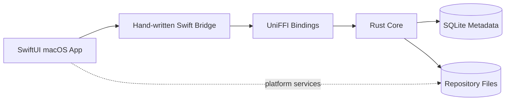

# AreaMatrix

<picture>
  <source media="(prefers-color-scheme: dark)" srcset="./assets/brand/final/areamatrix-logo-lockup-outlined-dark.svg">
  <source media="(prefers-color-scheme: light)" srcset="./assets/brand/final/areamatrix-logo-lockup-outlined-light.svg">
  
</picture>

> Drag files in. Keep control of where they live.

AreaMatrix is a source-available, native macOS application for organizing personal files into a searchable, auditable repository. It combines safe folder adoption, transactional imports, rules and optional AI classification, tree navigation, tags, search, change history, and recovery tools without locking files into a proprietary container.

[简体中文](./README.zh-CN.md) | English

## What AreaMatrix Does

- Adopts an existing folder without moving, renaming, deleting, or overwriting its files.
- Imports files using Move, Copy, or Index-only storage modes with duplicate and name-conflict review.
- Organizes content with rules, editable classifier configuration, tags, batch actions, and undo/redo history.
- Provides a native three-pane workspace for the repository tree, file list, metadata, notes, and change log.
- Searches filenames, notes, metadata, saved searches, Smart Lists, and optional semantic indexes.
- Supports optional local or remote AI classification, summaries, and tag suggestions behind explicit settings and privacy rules.
- Reconciles external Finder changes, exposes iCloud and sync-conflict review, and provides startup recovery and metadata repair flows.
- Writes generated overviews under `.areamatrix/generated/` by default and never overwrites an existing `README.md`.

## Product Surfaces

AreaMatrix uses one native macOS window with routed product surfaces rather than a collection of unrelated windows:

| Surface | Purpose |
|---|---|
| Onboarding and repository setup | Choose, validate, create, open, or safely adopt a repository folder |
| Repository workspace | Browse the tree, sort and select files, inspect details, edit notes, and run file actions |
| Import and conflict review | Preview imports, choose storage modes, resolve duplicates and name conflicts, and review results |
| Search and organization | Search, filter, save queries, use Smart Lists, manage tags, and run batch actions |
| AI and privacy | Inspect local-model status, configure remote providers, control data access, review suggestions, and inspect call history |
| Settings and diagnostics | Manage repository, classifier, integration, advanced, and application settings |
| Sync and recovery | Review iCloud or external conflicts, retry startup recovery, and confirm metadata repair |

See the [product surface map](docs/product/product-surfaces.md) and [user guides](docs/user-guide/README.md) for the complete behavior and entry points.

## Build From Source

AreaMatrix is currently distributed as source. A signed and notarized installer is not yet provided.

Requirements:

- macOS 14 Sonoma or later
- Xcode 15 or later
- Rust stable 1.75 or later

```bash
./dev build core
./dev bindings update \
  --udl core/area_matrix.udl \
  --out-dir apps/macos/AreaMatrix/Bridge/UniFFI
xcodebuild \
  -project apps/macos/AreaMatrix.xcodeproj \
  -scheme AreaMatrix \
  -destination 'generic/platform=macOS' \
  build CODE_SIGNING_ALLOWED=NO
```

Detailed setup and run instructions are in [Getting Started](docs/user-guide/getting-started.md) and the [development setup guide](docs/development/setup.md).

## Architecture


```mermaid
flowchart LR
    UI[SwiftUI macOS App]
    Bridge[Hand-written Swift Bridge]
    FFI[UniFFI Bindings]
    Core[Rust Core]
    DB[(SQLite Metadata)]
    FS[(Repository Files)]

    UI --> Bridge --> FFI --> Core
    Core --> DB
    Core --> FS
    UI -. platform services .-> FS
```

The filesystem is authoritative for file existence, content, and location. SQLite stores AreaMatrix metadata such as tags, notes, history, configuration, and indexes. External filesystem changes are reconciled back into metadata; the database must not override a user's direct filesystem action.

## Documentation

| Need | Entry point |
|---|---|
| Product overview and capabilities | [Product docs](docs/product/overview.md) |
| Install and use AreaMatrix | [User guide](docs/user-guide/README.md) |
| Understand product concepts and safety | [Architecture](docs/architecture/overview.md) |
| Integrate with the Rust Core | [Core API](docs/api/core-api.md) |
| Build, test, and contribute | [Development docs](docs/development/setup.md) |
| Review technical decisions | [ADRs](docs/adr/README.md) |
| Browse all long-lived documentation | [Documentation index](docs/README.md) |

Historical plans, execution evidence, and release records are indexed separately under [workflow versions](workflow/versions/README.md). They are not current product documentation.

## Safety And Privacy

- Existing files in an adopted folder remain untouched.
- Failed imports must not leave final-directory half-products.
- Removing `.areamatrix/` metadata must not remove user files.
- Remote AI is optional, explicitly configured, and evaluated against user-controlled privacy rules.
- Credentials stay in the macOS platform layer; the Rust Core does not read Keychain secrets or initiate network requests.

Read the [privacy and data handling policy](docs/product/privacy.md) and [security policy](SECURITY.md) for details.

## License And Contributions

AreaMatrix is licensed under the [PolyForm Noncommercial License 1.0.0](LICENSE). Commercial use requires a separate license described in [COMMERCIAL_LICENSE.md](COMMERCIAL_LICENSE.md).

Contributions are welcome. Read [CONTRIBUTING.md](CONTRIBUTING.md), [CODE_OF_CONDUCT.md](CODE_OF_CONDUCT.md), and [CODE_REVIEW.md](CODE_REVIEW.md) before opening a change.
