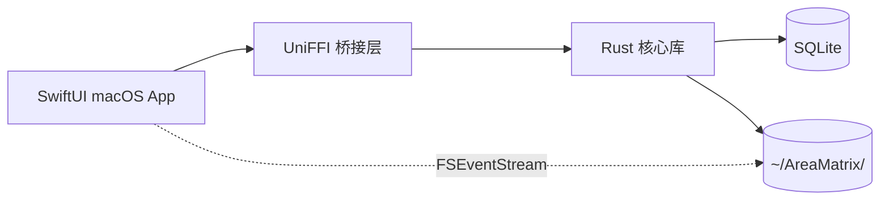

# AreaMatrix（领域矩阵）

> 拖进来，文件自己整理自己。
>
> 一款 macOS 原生桌面应用，用拖拽、自动分类、改动追踪和树状视图，把散乱的资料变成可导航的知识仓库。

简体中文 | [English](./README.md)

---

## 项目定位

AreaMatrix 是一款 **source-available（源码可得）** 的桌面端资料管理工具。它把个人文件的混乱状态，转化成一个**自组织、可追溯、可视化**的知识仓库。

拖一个文件进来。AreaMatrix 自动识别它是什么、归到哪一类、建议怎么命名。每次改动都有日志，每个分类目录都有一份会自动更新的 `README.md`，整个仓库结构在侧边栏树状图里一眼看清。

## 核心特性

- **拖拽即归档** — 把文件拖进窗口任意位置，本地完成智能分类
- **混合分类策略** — 先走扩展名 + 关键词规则；AI 兜底可选（Stage 3）
- **三种存储模式** — 每次拖入可选 *移动 / 复制 / 仅索引*
- **会自更新的 README.md** — 每个分类目录维护当前文件清单和近 30 天改动
- **树状图导航** — 完整仓库结构展示在侧边栏，大资料库下虚拟化渲染
- **双向同步** — 在 Finder/终端的外部改动通过 FSEventStream 实时回流
- **崩溃安全** — staging 区事务式导入，强杀进程也不会留下半移动文件
- **iCloud 兼容** — 占位符文件通过 `NSFileCoordinator` 协调下载
- **100% 原生 macOS 界面** — SwiftUI 实现，不是 WebView

## 架构一览

Rust 核心库与平台无关。macOS 是第一个目标平台，未来扩展 Windows / Linux / iOS 时，只需为同一份核心库写一层新的原生 UI。

## 设计哲学

AreaMatrix 的所有架构决策围绕三条原则：

1. **真相在 SQLite**：DB 是元数据真相源，文件系统是它的物化视图。但用户在外部的修改也会被监听并回流，保证两者最终一致。
2. **任何中断都不丢数据**：所有写操作走 staging 区 → 校验哈希 → 原子提交 → 落位的事务流程。
3. **核心与平台分离**：业务逻辑写一次（Rust），UI 每个平台各写各的（SwiftUI/WinUI/...）。未来扩端不浪费业务代码。

## 项目状态

预 alpha 阶段。当前仓库**只提供完整的项目文档**，开发尚未启动。文档经开发团队 review 后，按 [docs/roadmap/stage-1-mvp.md](docs/roadmap/stage-1-mvp.md) 开始 Stage 1 实施。

四阶段路线图见 [docs/roadmap/milestones.md](docs/roadmap/milestones.md)。

## 文档导览

| 你是 | 推荐阅读 |
|---|---|
| 产品视角想了解做什么 | [docs/product/prd.md](docs/product/prd.md) |
| 架构师想了解怎么搭 | [docs/architecture/overview.md](docs/architecture/overview.md) |
| 实现者想了解每块怎么写 | [docs/modules/](docs/modules/) |
| 集成方想了解 API | [docs/api/core-api.md](docs/api/core-api.md) |
| 新加入想搭环境 | [docs/development/setup.md](docs/development/setup.md) |
| 想了解决策来龙去脉 | [docs/adr/](docs/adr/) |
| 想贡献代码 | [CONTRIBUTING.md](CONTRIBUTING.md) |

## 系统要求

- macOS 14 Sonoma 或更高版本
- Xcode 15+
- Rust 1.75+（stable 通道）
- Apple Silicon 或 Intel（默认产出 universal binary）

## 许可证

AreaMatrix 采用 **[PolyForm Noncommercial 1.0.0](LICENSE)** 许可证发布。

你可以为**非商业目的**（个人使用、教育、研究、内部业务运营）自由使用、修改和再分发源代码。原始 copyright 声明和许可证文件必须保留。

如需**商业使用**（销售、SaaS 托管、嵌入商业产品中），请阅读 [COMMERCIAL_LICENSE.md](COMMERCIAL_LICENSE.md) 了解如何申请商业授权。

> **说明**：PolyForm-NC 是 *source-available（源码可得）*，并非 OSI 认证的"开源"许可证。任何人都可以阅读代码、贡献代码、非商业使用 —— 但商业使用需要单独签订协议。

## 贡献

欢迎提 issue、PR 和 discussion。提交前请阅读 [CONTRIBUTING.md](CONTRIBUTING.md) 和 [CODE_OF_CONDUCT.md](CODE_OF_CONDUCT.md)。

## 致谢

AreaMatrix 在架构思路上参考了 Obsidian（vault 模型）、Eagle（视觉化资料库）、DEVONthink（自动分类）。本项目与上述产品无任何关联。
