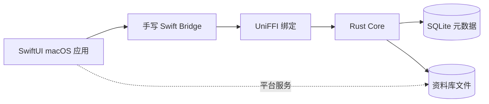

# AreaMatrix（领域矩阵）

<picture>
  <source media="(prefers-color-scheme: dark)" srcset="./assets/brand/final/areamatrix-logo-lockup-outlined-dark.svg">
  <source media="(prefers-color-scheme: light)" srcset="./assets/brand/final/areamatrix-logo-lockup-outlined-light.svg">
  
</picture>

> 把文件拖进来，同时保留对文件位置和数据流向的控制权。

AreaMatrix 是一款源码可得的 macOS 原生资料管理应用。它通过安全接管已有目录、事务式导入、规则与可选 AI 分类、目录树、标签、搜索、改动历史和恢复工具，把散乱文件整理成可搜索、可追溯、可继续用 Finder 管理的资料库。

简体中文 | [English](./README.md)

## AreaMatrix 能做什么

- 接管已有文件夹时不移动、不重命名、不删除、不覆盖其中的用户文件。
- 使用移动、复制或仅索引三种模式导入文件，并处理重复文件和同名冲突。
- 使用分类规则、可视化规则编辑、标签、批量操作和撤销/重做整理资料。
- 在原生三栏工作区中浏览目录树、文件列表、元数据、笔记和改动日志。
- 搜索文件名、笔记和元数据，保存查询、使用智能列表，并按需建立语义索引。
- 在明确配置和隐私规则约束下使用本地或远程 AI 分类、摘要和标签建议。
- 同步 Finder 外部改动，审阅 iCloud 与同步冲突，并提供启动恢复和元数据修复流程。
- 自动内容默认写入 `.areamatrix/generated/`，绝不覆盖用户已有的 `README.md`。

## 产品界面

AreaMatrix 使用一个 macOS 原生主窗口，通过稳定的产品界面承载不同任务：

| 界面 | 用途 |
|---|---|
| 首次启动与资料库设置 | 选择、校验、创建、打开或安全接管资料库目录 |
| 资料库工作区 | 浏览目录树和文件列表，查看详情、编辑笔记并执行文件操作 |
| 导入与冲突审阅 | 预览导入、选择存储模式、处理重复和同名冲突、查看结果 |
| 搜索与组织 | 搜索、筛选、保存查询、使用智能列表、标签和批量操作 |
| AI 与隐私 | 查看本地模型状态、配置远程 Provider、控制数据范围、审阅建议和查看调用记录 |
| 设置与诊断 | 管理资料库、分类器、集成、高级设置和应用信息 |
| 同步与恢复 | 处理 iCloud 或外部冲突、启动恢复和元数据修复 |

完整入口和功能见[产品界面地图](docs/product/product-surfaces.md)与[用户指南](docs/user-guide/README.md)。

## 从源码构建

AreaMatrix 目前以源码形式提供，尚未提供完成签名与公证的安装包。

环境要求：

- macOS 14 Sonoma 或更高版本
- Xcode 15 或更高版本
- Rust stable 1.75 或更高版本

```bash
./dev build core
./dev bindings update \
  --udl core/area_matrix.udl \
  --out-dir apps/macos/AreaMatrix/Bridge/UniFFI
xcodebuild \
  -project apps/macos/AreaMatrix.xcodeproj \
  -scheme AreaMatrix \
  -destination 'generic/platform=macOS' \
  build CODE_SIGNING_ALLOWED=NO
```

完整步骤见[开始使用](docs/user-guide/getting-started.md)和[开发环境搭建](docs/development/setup.md)。

## 架构


```mermaid
flowchart LR
    UI[SwiftUI macOS 应用]
    Bridge[手写 Swift Bridge]
    FFI[UniFFI 绑定]
    Core[Rust Core]
    DB[(SQLite 元数据)]
    FS[(资料库文件)]

    UI --> Bridge --> FFI --> Core
    Core --> DB
    Core --> FS
    UI -. 平台服务 .-> FS
```

文件是否存在、文件内容和文件位置以文件系统为准。SQLite 保存标签、笔记、改动历史、配置和索引等 AreaMatrix 元数据。外部文件系统改动会同步回元数据，数据库不得否决用户直接进行的文件系统操作。

## 文档入口

| 需求 | 入口 |
|---|---|
| 了解产品与正式能力 | [产品文档](docs/product/overview.md) |
| 安装和使用 AreaMatrix | [用户指南](docs/user-guide/README.md) |
| 理解架构和安全边界 | [架构总览](docs/architecture/overview.md) |
| 集成 Rust Core | [Core API](docs/api/core-api.md) |
| 构建、测试和贡献 | [开发文档](docs/development/setup.md) |
| 查看技术决策 | [ADR](docs/adr/README.md) |
| 浏览全部长期文档 | [文档总览](docs/README.md) |

历史计划、执行证据和发布记录统一从 [workflow versions](workflow/versions/README.md) 查阅，不属于产品文档。

## 文件安全与隐私

- 接管目录中的已有文件保持原样。
- 失败导入不得在最终目录留下半成品。
- 删除 `.areamatrix/` 元数据不得删除用户文件。
- 远程 AI 默认不启用，必须由用户明确配置并通过隐私规则评估。
- 凭据保留在 macOS 平台层；Rust Core 不读取 Keychain 密钥，也不直接发起网络请求。

详细说明见[隐私与数据处理](docs/product/privacy.md)和[安全政策](SECURITY.md)。

## 许可证与贡献

AreaMatrix 使用 [PolyForm Noncommercial License 1.0.0](LICENSE)。商业使用需按 [COMMERCIAL_LICENSE.md](COMMERCIAL_LICENSE.md) 获取单独授权。

欢迎贡献。提交变更前请阅读 [CONTRIBUTING.md](CONTRIBUTING.md)、[CODE_OF_CONDUCT.md](CODE_OF_CONDUCT.md) 和 [CODE_REVIEW.md](CODE_REVIEW.md)。
