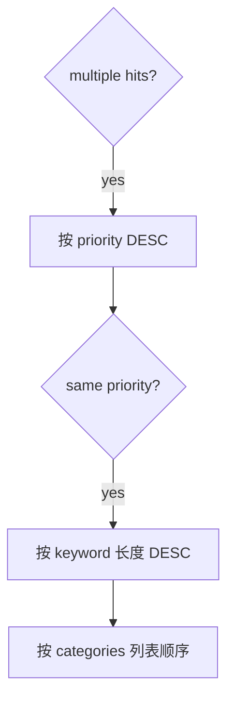
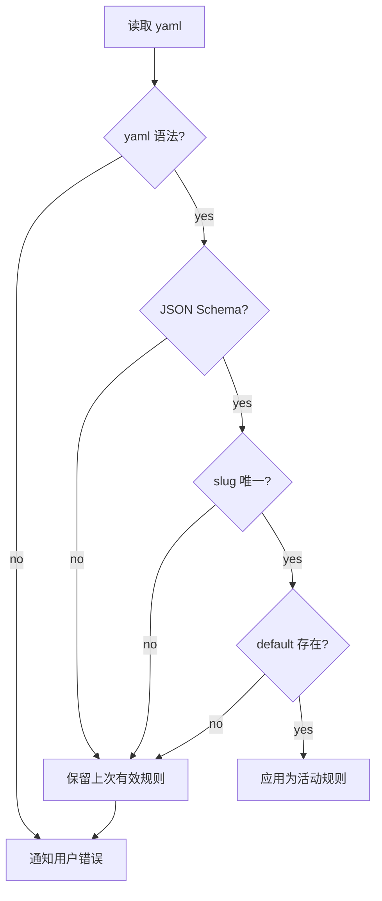
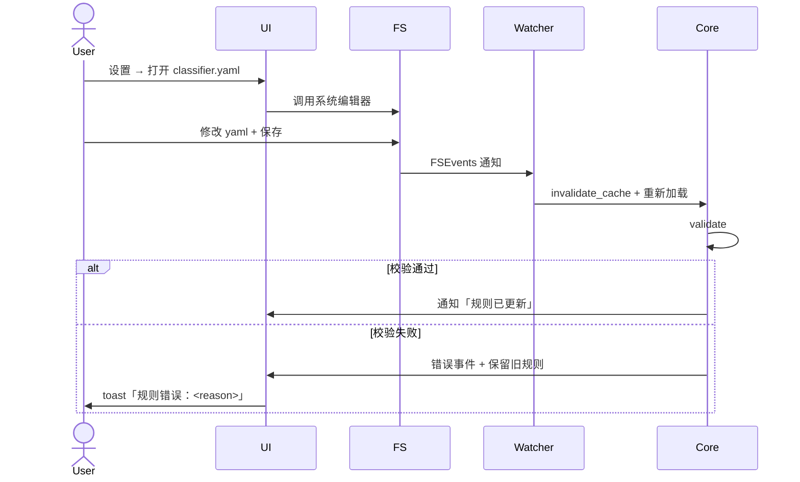

# classifier.yaml 配置规范

> 用户可编辑的分类规则文件，位于 `<repo>/.areamatrix/classifier.yaml`。本文给出 schema、JSON Schema、默认值、10 个配置案例、校验规则、迁移策略。
>
> 阅读时长：约 12 分钟。

---

## 文件位置

`<repo_root>/.areamatrix/classifier.yaml`

每个资料库一份，与 DB 同目录。这样资料库迁移 / 备份时分类规则自动跟随。

---

## 完整 Schema

```yaml
# Required: schema version
version: 1

# Required: 兜底分类的 slug
default: inbox

# Required: 至少一个分类
categories:
  - slug: docs
    display_name:
      zh-Hans: 文档
      en: Documents
    description:
      zh-Hans: ""
      en: ""
    extensions: [pdf, docx, txt, md, rtf]
    keywords: [report, manual, doc, 报告, 手册]
    priority: 0
    naming_template: ""
```

---

## JSON Schema

下面的 JSON Schema 用于 IDE 验证 / CI 自动校验：

```json
{
  "$schema": "http://json-schema.org/draft-07/schema#",
  "title": "AreaMatrix classifier.yaml",
  "type": "object",
  "required": ["version", "default", "categories"],
  "properties": {
    "version": {
      "type": "integer",
      "minimum": 1,
      "maximum": 1
    },
    "default": {
      "type": "string",
      "pattern": "^[a-z][a-z0-9_-]*$",
      "minLength": 1,
      "maxLength": 32
    },
    "categories": {
      "type": "array",
      "minItems": 1,
      "maxItems": 64,
      "items": { "$ref": "#/$defs/category" }
    }
  },
  "$defs": {
    "category": {
      "type": "object",
      "required": ["slug"],
      "additionalProperties": false,
      "properties": {
        "slug": {
          "type": "string",
          "pattern": "^[a-z][a-z0-9_-]*$",
          "minLength": 1,
          "maxLength": 32
        },
        "display_name": {
          "type": "object",
          "additionalProperties": { "type": "string", "minLength": 1, "maxLength": 32 }
        },
        "description": {
          "type": "object",
          "additionalProperties": { "type": "string", "maxLength": 200 }
        },
        "extensions": {
          "type": "array",
          "items": {
            "type": "string",
            "pattern": "^[a-z0-9]+$",
            "minLength": 1,
            "maxLength": 16
          },
          "uniqueItems": true,
          "default": []
        },
        "keywords": {
          "type": "array",
          "items": { "type": "string", "minLength": 1, "maxLength": 32 },
          "uniqueItems": true,
          "default": []
        },
        "priority": {
          "type": "integer",
          "minimum": -1000,
          "maximum": 1000,
          "default": 0
        },
        "naming_template": {
          "type": "string",
          "maxLength": 200,
          "default": ""
        }
      }
    }
  }
}
```

存放路径：`core/resources/classifier.schema.json`，CI 跑 `ajv validate` 检查内置默认 yaml。

---

## 字段详解

### 顶层

| 字段 | 类型 | 必填 | 默认 | 说明 |
|---|---|---|---|---|
| `version` | int | yes | — | schema 版本，便于未来迁移 |
| `default` | string | yes | "inbox" | 兜底分类的 slug，必须出现在 `categories` 中 |
| `categories` | list | yes | — | 至少一个；最多 64 个 |

### Category

| 字段 | 类型 | 必填 | 校验 |
|---|---|---|---|
| `slug` | string | yes | `^[a-z][a-z0-9_-]*$`、长度 1-32、唯一 |
| `display_name` | map<locale, name> | no | locale 是 BCP 47 标识符，name 长度 1-32 |
| `description` | map<locale, text> | no | text 长度 ≤ 200 |
| `extensions` | list&lt;string&gt; | no | 每个 1-16 字符、`^[a-z0-9]+$`、不含 `.`、唯一 |
| `keywords` | list&lt;string&gt; | no | 每个 1-32 字符、唯一 |
| `priority` | int | no | -1000..1000，越大越优先 |
| `naming_template` | string | no | 含占位符 `{original}` `{stem}` `{ext}` `{date}` `{slug}` |

---

## 匹配语义

### Keyword 匹配

- 文件名先 NFKC 归一化、再小写
- 关键词如果含 CJK 字符 → `contains` 子串匹配
- 关键词如果纯 ASCII → tokenize（按 `[ _\-\.\\/\(\)\[\]]` 切分）后做 token 等值匹配

```text
filename:    "Invoice_2026_Q1.pdf"
normalized:  "invoice_2026_q1.pdf"
tokens:      ["invoice", "2026", "q1", "pdf"]
keyword "invoice" → tokens 含 "invoice" → 命中
```

```text
filename:    "2026年Q1发票.pdf"
normalized:  "2026年q1发票.pdf"
keyword "发票" (CJK) → contains "发票" → 命中
```

### Extension 匹配

- 取最后一个 `.` 之后的子串，转小写
- 与 `extensions` 列表逐项相等比较

```text
filename: "report.PDF" → ext "pdf" → 匹配 docs.extensions
filename: "archive.tar.gz" → ext "gz" → 不匹配（tar.gz 视为 gz）
```

### 优先级



`keywords` 优先级整体高于 `extensions`：keyword 命中即返回，不再走 extension。

---

## 配置案例（10 个）

### 案例 1：极简（仅默认）

```yaml
version: 1
default: inbox
categories:
  - slug: inbox
    display_name: { zh-Hans: 收件箱, en: Inbox }
```

所有文件都归 inbox。等于禁用分类。

### 案例 2：默认 6 类

```yaml
version: 1
default: inbox
categories:
  - slug: docs
    display_name: { zh-Hans: 文档, en: Documents }
    extensions: [pdf, docx, txt, md, rtf]
    keywords: [report, manual, doc, 报告, 手册]

  - slug: code
    display_name: { zh-Hans: 代码, en: Code }
    extensions: [rs, swift, py, js, ts, go, java, cpp, h, hpp, c]

  - slug: design
    display_name: { zh-Hans: 设计, en: Design }
    extensions: [psd, ai, sketch, fig, xd]
    keywords: [design, mockup, wireframe, 设计稿, 原型]

  - slug: media
    display_name: { zh-Hans: 媒体, en: Media }
    extensions: [png, jpg, jpeg, gif, mp4, mov, mp3, wav]

  - slug: finance
    display_name: { zh-Hans: 财务, en: Finance }
    keywords: [invoice, receipt, tax, contract, 发票, 收据, 税务, 合同, 报销]
    priority: 10

  - slug: inbox
    display_name: { zh-Hans: 未分类, en: Inbox }
```

`finance.priority=10` 高于 docs 的 0，`Invoice.pdf` 优先归 finance。

### 案例 3：研究者（论文 + 数据 + 笔记）

```yaml
version: 1
default: inbox
categories:
  - slug: papers
    display_name: { zh-Hans: 论文, en: Papers }
    extensions: [pdf]
    keywords: [paper, arxiv, doi, abstract, 论文]
    priority: 20

  - slug: data
    display_name: { zh-Hans: 数据, en: Datasets }
    extensions: [csv, tsv, parquet, h5, npz, json, xlsx]
    keywords: [dataset, train, test, valid, 数据集]

  - slug: notes
    display_name: { zh-Hans: 笔记, en: Notes }
    extensions: [md, org, txt]

  - slug: code
    display_name: { zh-Hans: 代码, en: Code }
    extensions: [py, ipynb, r, rmd, jl]

  - slug: inbox
    display_name: { zh-Hans: 未分类, en: Inbox }
```

### 案例 4：设计师（素材 + 客户 + 合同）

```yaml
version: 1
default: inbox
categories:
  - slug: assets
    display_name: { zh-Hans: 素材, en: Assets }
    extensions: [psd, ai, sketch, fig, png, jpg, svg, webp]
    keywords: []

  - slug: clients
    display_name: { zh-Hans: 客户, en: Clients }
    keywords: [客户, brief, brand-guide, logo]
    priority: 5

  - slug: contracts
    display_name: { zh-Hans: 合同, en: Contracts }
    extensions: [pdf]
    keywords: [contract, agreement, 合同, 协议]
    priority: 15

  - slug: invoices
    display_name: { zh-Hans: 发票, en: Invoices }
    extensions: [pdf]
    keywords: [invoice, 发票, 账单]
    priority: 20

  - slug: inbox
    display_name: { zh-Hans: 未分类, en: Inbox }
```

### 案例 5：法务（按案件类型分）

```yaml
version: 1
default: inbox
categories:
  - slug: contracts
    display_name: { zh-Hans: 合同, en: Contracts }
    keywords: [contract, agreement, mou, nda, 合同, 协议, 备忘录]
    priority: 30

  - slug: litigation
    display_name: { zh-Hans: 诉讼, en: Litigation }
    keywords: [petition, claim, judgment, 起诉书, 判决, 申诉]
    priority: 25

  - slug: regulatory
    display_name: { zh-Hans: 合规, en: Regulatory }
    keywords: [compliance, gdpr, ccpa, 合规, 监管]

  - slug: research
    display_name: { zh-Hans: 研究, en: Research }
    extensions: [pdf, docx]
    keywords: [memo, research, 研究, 备忘]

  - slug: inbox
    display_name: { zh-Hans: 未分类, en: Inbox }
```

### 案例 6：开发者（按项目阶段分）

```yaml
version: 1
default: inbox
categories:
  - slug: specs
    display_name: { zh-Hans: 规格, en: Specs }
    extensions: [md, pdf]
    keywords: [spec, rfc, design-doc, 规格, 设计文档]
    priority: 15

  - slug: code
    display_name: { zh-Hans: 代码, en: Code }
    extensions: [rs, swift, py, js, ts, go, java]

  - slug: builds
    display_name: { zh-Hans: 构建产物, en: Build Artifacts }
    extensions: [dmg, app, ipa, apk, exe, deb, zip, tar]

  - slug: docs
    display_name: { zh-Hans: 文档, en: Documents }
    extensions: [pdf, docx, md]

  - slug: inbox
    display_name: { zh-Hans: 未分类, en: Inbox }
```

### 案例 7：用 priority 解决重叠

```yaml
version: 1
default: inbox
categories:
  - slug: receipts
    display_name: { zh-Hans: 收据, en: Receipts }
    keywords: [receipt, 收据]
    priority: 30

  - slug: contracts
    display_name: { zh-Hans: 合同, en: Contracts }
    keywords: [contract, 合同]
    priority: 20

  - slug: docs
    display_name: { zh-Hans: 文档, en: Documents }
    extensions: [pdf, docx]
    priority: 0

  - slug: inbox
    display_name: { zh-Hans: 未分类, en: Inbox }
```

文件 `Receipt-Contract-2026.pdf` 同时含 receipt 和 contract → receipts.priority=30 > contracts.priority=20 → 归 receipts。

### 案例 8：使用 naming_template（Stage 2+）

```yaml
version: 1
default: inbox
categories:
  - slug: invoices
    display_name: { zh-Hans: 发票, en: Invoices }
    keywords: [invoice, 发票]
    priority: 20
    naming_template: "{date}_{slug}_{stem}.{ext}"
    # Invoice-Q1.pdf → 2026-04-28_invoices_Invoice-Q1.pdf

  - slug: photos
    display_name: { zh-Hans: 照片, en: Photos }
    extensions: [jpg, jpeg, heic]
    naming_template: "{date}_{stem}.{ext}"

  - slug: inbox
    display_name: { zh-Hans: 未分类, en: Inbox }
```

### 案例 9：多 locale（含日韩）

```yaml
version: 1
default: inbox
categories:
  - slug: docs
    display_name:
      zh-Hans: 文档
      zh-Hant: 文件
      en: Documents
      ja: ドキュメント
      ko: 문서
    extensions: [pdf, docx, md]

  - slug: inbox
    display_name:
      zh-Hans: 未分类
      zh-Hant: 未分類
      en: Inbox
      ja: 受信箱
      ko: 받은편지함
```

### 案例 10：保守极简（只用扩展名）

```yaml
version: 1
default: inbox
categories:
  - slug: docs
    display_name: { zh-Hans: 文档, en: Documents }
    extensions: [pdf, docx, txt, md]

  - slug: code
    display_name: { zh-Hans: 代码, en: Code }
    extensions: [rs, swift, py, js, ts]

  - slug: media
    display_name: { zh-Hans: 媒体, en: Media }
    extensions: [png, jpg, mp4, mov, mp3]

  - slug: inbox
    display_name: { zh-Hans: 未分类, en: Inbox }
```

不用 keywords，避免误分类。新手友好。

---

## 校验流程



校验失败 = **不替换**当前规则，UI 显示具体哪个字段出错。

---

## 校验失败的具体报错样例

### 错误 1：default 不在 categories 里

```yaml
version: 1
default: nonexistent
categories:
  - slug: docs
    display_name: { en: Documents }
```

报错（CoreError::Config）：

```text
default 'nonexistent' not found in categories
```

UI 文案：

> 配置错误：兜底分类 'nonexistent' 没有出现在 categories 列表中。请检查 default 字段或添加对应分类。

### 错误 2：slug 含大写

```yaml
version: 1
default: docs
categories:
  - slug: Docs
    display_name: { en: Documents }
```

报错：

```text
invalid slug: Docs
```

UI 文案：

> 配置错误：slug 'Docs' 不合法。slug 必须以小写字母开头，仅含 a-z, 0-9, -, _。

### 错误 3：slug 重复

```yaml
version: 1
default: docs
categories:
  - slug: docs
    display_name: { en: Documents }
  - slug: docs
    display_name: { en: Docs2 }
```

报错：

```text
duplicate slug: docs
```

### 错误 4：extension 含点

```yaml
version: 1
default: docs
categories:
  - slug: docs
    display_name: { en: Documents }
    extensions: [".pdf"]
```

报错：

```text
invalid extension '.pdf' in docs (must be lowercase letters/digits, no dot)
```

### 错误 5：YAML 语法错误

```yaml
version: 1
default: docs
categories:
  - slug: docs
    display_name { en: Documents }   # 漏了冒号
```

报错：

```text
yaml parse error: while parsing a block mapping at line 5 column 5, did not find expected ':'
```

### 错误 6：version 不支持

```yaml
version: 99
default: docs
categories:
  - slug: docs
    display_name: { en: Documents }
```

报错：

```text
unsupported version: 99 (this build supports version 1)
```

### 错误 7：categories 为空

```yaml
version: 1
default: inbox
categories: []
```

报错：

```text
categories must not be empty
```

### 错误 8：超过 64 类

报错：

```text
too many categories (65 > 64 max)
```

### 错误 9：display_name 中 locale 值为空字符串

```yaml
version: 1
default: docs
categories:
  - slug: docs
    display_name: { en: "" }
```

报错：

```text
display_name['en'] must not be empty in category 'docs'
```

### 错误 10：未识别字段

```yaml
version: 1
default: docs
categories:
  - slug: docs
    display_name: { en: Documents }
    extensoins: [pdf]   # 拼错
```

报错（serde strict mode）：

```text
unknown field `extensoins`, expected one of `slug`, `display_name`, `description`, `extensions`, `keywords`, `priority`, `naming_template`
```

---

## naming_template 占位符

| 占位符 | 替换为 | 示例 |
|---|---|---|
| `{original}` | 原文件名（含扩展名） | `report.pdf` |
| `{stem}` | 原文件名不带扩展名 | `report` |
| `{ext}` | 扩展名（不带点） | `pdf` |
| `{date}` | 当前日期 `YYYY-MM-DD` | `2026-04-28` |
| `{date_iso}` | ISO 8601 日期时间 | `2026-04-28T10:30:00Z` |
| `{slug}` | 当前分类 slug | `docs` |

未识别的占位符保留原样：`{unknown}` 不被替换。

MVP 不启用模板（保持 original），避免用户被改名困扰。

---

## 默认 classifier.yaml 来源

文件：`core/resources/classifier.default.yaml`

应用 `init_repo` 时复制到 `<repo>/.areamatrix/classifier.yaml`。

后续 Core 升级**不**自动覆盖用户的 yaml。如果新版本引入了新的默认分类，提示用户「我们建议加入 xxx 分类」+ 一键合并按钮（Stage 2）。

---

## 用户编辑流程



Stage 2 起加图形化编辑器（设置面板内）。

---

## CI 校验

`.github/workflows/core-ci.yml` 加一步：

```yaml
- name: Validate default classifier.yaml
  run: |
    npm install -g ajv-cli
    ajv validate \
      --spec=draft7 \
      -s core/resources/classifier.schema.json \
      -d core/resources/classifier.default.yaml
```

---

## Related

- [core-api.md](core-api.md)
- [error-codes.md](error-codes.md)
- [../modules/classify.md](../modules/classify.md)
- [../adr/0008-naming-and-i18n.md](../adr/0008-naming-and-i18n.md)
