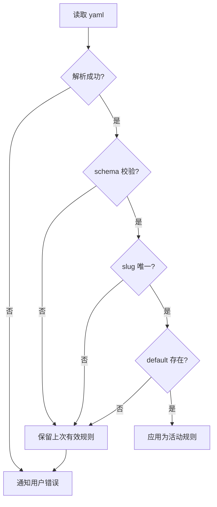

# classifier.yaml 配置规范

> 用户可编辑的分类规则文件，位于 `<repo>/.areamatrix/classifier.yaml`。本文给出 schema、默认值、校验规则、迁移策略。
>
> 阅读时长：约 4 分钟。

---

## 文件位置

`<repo_root>/.areamatrix/classifier.yaml`

每个资料库一份，与 DB 同目录。这样资料库迁移 / 备份时分类规则自动跟随。

---

## 完整 Schema

```yaml
# Required: schema version, integer >= 1
version: 1

# Required: 兜底分类的 slug；当所有规则都没命中时归到这里
default: inbox

# Required: 至少一个分类
categories:
  - slug: docs                    # required, ^[a-z][a-z0-9_-]*$, 唯一
    display_name_zh: 文档         # required, 非空
    display_name_en: Documents    # required, 非空
    description_zh: ""            # optional
    description_en: ""            # optional
    extensions: []                # required, 列表（可空），小写、不带点
    keywords: []                  # required, 列表（可空），不区分大小写
    naming_template: "{original}" # optional, 默认 "{original}"

  - slug: code
    display_name_zh: 代码
    display_name_en: Code
    extensions: [rs, swift, py, js, ts, go, java, cpp, h, hpp, c]
    keywords: []

  - slug: design
    display_name_zh: 设计
    display_name_en: Design
    extensions: [psd, ai, sketch, fig, xd]
    keywords: [design, mockup, wireframe, 设计稿, 原型]

  - slug: media
    display_name_zh: 媒体
    display_name_en: Media
    extensions: [png, jpg, jpeg, gif, mp4, mov, mp3, wav]
    keywords: []

  - slug: finance
    display_name_zh: 财务
    display_name_en: Finance
    extensions: []
    keywords: [invoice, receipt, tax, contract, 发票, 收据, 税务, 合同, 报销]

  - slug: inbox
    display_name_zh: 未分类
    display_name_en: Inbox
    extensions: []
    keywords: []
```

---

## 字段详解

### 顶层

| 字段 | 类型 | 必填 | 默认 | 说明 |
|---|---|---|---|---|
| `version` | int | √ | - | schema 版本，便于未来迁移 |
| `default` | string | √ | "inbox" | 兜底分类的 slug，必须出现在 `categories` 中 |
| `categories` | list | √ | - | 至少一个；最多 64 个 |

### Category

| 字段 | 类型 | 必填 | 校验 |
|---|---|---|---|
| `slug` | string | √ | `^[a-z][a-z0-9_-]*$`、长度 1-32、唯一 |
| `display_name_zh` | string | √ | 非空、长度 1-32 |
| `display_name_en` | string | √ | 非空、长度 1-32 |
| `description_zh` | string | × | |
| `description_en` | string | × | |
| `extensions` | list&lt;string&gt; | √ | 每个 0-16 字符、小写、不含 `.` |
| `keywords` | list&lt;string&gt; | √ | 每个 1-32 字符 |
| `naming_template` | string | × | 占位符 `{original}`、`{stem}`、`{ext}`、`{date}` |

---

## 匹配语义

### Keyword 匹配

- 字符串 `contains` 检查（标准化后），不区分大小写
- 中文按 NFKC 归一后逐字符匹配（不分词）

```
filename: "Invoice_2026_Q1.pdf"
normalized: "invoice_2026_q1.pdf"
keyword "invoice" 命中
```

### Extension 匹配

- 取最后一个 `.` 之后的子串，转小写
- 与 `extensions` 列表逐项相等比较

```
filename: "report.PDF"
ext: "pdf"
matches docs.extensions
```

### 优先级

`keywords` 优先级高于 `extensions`。同优先级内按 categories 列表顺序，第一个命中即停。

---

## 校验流程

应用启动时（或 yaml 改动后）执行：



校验失败 = **不替换**当前规则，UI 显示具体哪个字段出错。

---

## naming_template（Stage 2 起激活）

支持占位符：

| 占位符 | 替换为 |
|---|---|
| `{original}` | 原文件名（含扩展名） |
| `{stem}` | 原文件名不带扩展名 |
| `{ext}` | 扩展名（不带点） |
| `{date}` | 当前日期 `YYYY-MM-DD` |
| `{date_iso}` | ISO 8601 日期时间 |
| `{slug}` | 当前分类 slug |

示例：

```yaml
naming_template: "{date}_{stem}.{ext}"
# Invoice_Q1.pdf → 2026-04-28_Invoice_Q1.pdf
```

MVP 不启用模板（保持 original），避免用户被改名困扰。

---

## 默认 classifier.yaml 来源

文件：`core/resources/classifier.yaml`

应用 `init_repo` 时复制到 `<repo>/.areamatrix/classifier.yaml`。

后续 Core 升级**不**自动覆盖用户的 yaml。如果新版本引入了新的默认分类，提示用户「我们建议加入 xxx 分类」+ 一键合并按钮（Stage 2）。

---

## 反例（会触发校验失败）

```yaml
version: 1
default: nonexistent  # ❌ default 不在 categories 中
categories:
  - slug: Docs       # ❌ slug 大写
    display_name_zh: 文档
    display_name_en: Documents
    extensions: [.pdf]  # ❌ 含点
    keywords: []

  - slug: docs        # ❌ slug 重复（与上面 Docs 大小写折叠后冲突；Stage 1 严格分大小写但 slug 必须全小写）
    ...
```

---

## 校验代码骨架

```rust
// core/src/classify/rules.rs
use serde::Deserialize;
use std::collections::HashSet;

#[derive(Deserialize, Debug, Clone)]
pub struct ClassifierConfig {
    pub version: u32,
    pub default: String,
    pub categories: Vec<CategoryDef>,
}

#[derive(Deserialize, Debug, Clone)]
pub struct CategoryDef {
    pub slug: String,
    pub display_name_zh: String,
    pub display_name_en: String,
    #[serde(default)]
    pub description_zh: String,
    #[serde(default)]
    pub description_en: String,
    pub extensions: Vec<String>,
    pub keywords: Vec<String>,
    #[serde(default = "default_template")]
    pub naming_template: String,
}

fn default_template() -> String { "{original}".into() }

pub fn validate(cfg: &ClassifierConfig) -> Result<(), String> {
    if cfg.version != 1 {
        return Err(format!("unsupported version: {}", cfg.version));
    }
    if cfg.categories.is_empty() {
        return Err("categories must not be empty".into());
    }
    if cfg.categories.len() > 64 {
        return Err("too many categories (max 64)".into());
    }
    let slug_re = regex::Regex::new(r"^[a-z][a-z0-9_-]*$").unwrap();
    let mut seen: HashSet<&str> = HashSet::new();
    for cat in &cfg.categories {
        if !slug_re.is_match(&cat.slug) {
            return Err(format!("invalid slug: {}", cat.slug));
        }
        if !seen.insert(&cat.slug) {
            return Err(format!("duplicate slug: {}", cat.slug));
        }
        if cat.display_name_zh.is_empty() || cat.display_name_en.is_empty() {
            return Err(format!("category {} missing display_name", cat.slug));
        }
        for ext in &cat.extensions {
            if ext.contains('.') || ext.is_empty() {
                return Err(format!("invalid extension '{}' in {}", ext, cat.slug));
            }
        }
    }
    if !seen.contains(cfg.default.as_str()) {
        return Err(format!("default '{}' not found in categories", cfg.default));
    }
    Ok(())
}
```

---

## 用户编辑流程

1. 设置面板 → 「打开 classifier.yaml」 → 系统编辑器
2. 用户保存 → FSEvents 监听到改动 → Core reload + validate
3. 校验通过 → 通知 UI「规则已更新」
4. 校验失败 → toast 显示具体错误 + 保留旧规则

Stage 2 起加图形化编辑器（设置面板内）。

---

## Related

- [core-api.md](core-api.md)
- [../modules/classify.md](../modules/classify.md)
- [../adr/0008-naming-and-i18n.md](../adr/0008-naming-and-i18n.md)
