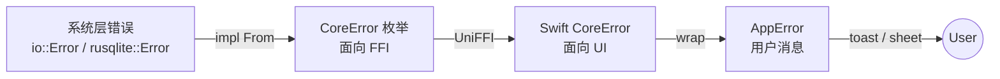
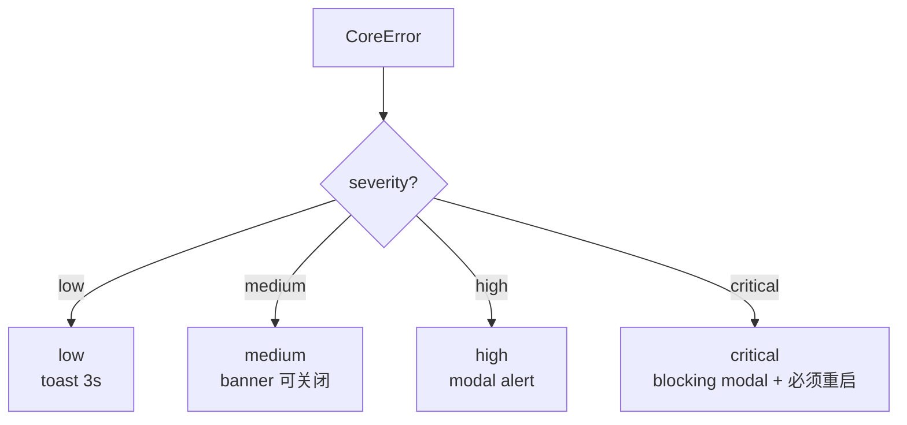

# 错误码表（CoreError）

> AreaMatrix Core 暴露的所有错误类型与处理建议。Swift 侧通过 `do/try/catch` 捕获并转换为用户消息。
>
> 阅读时长：约 12 分钟。

---

## 错误体系层级



---

## CoreError 完整定义

```rust
// core/src/error.rs
use thiserror::Error;

pub type CoreResult<T> = Result<T, CoreError>;

#[derive(Error, Debug)]
pub enum CoreError {
    #[error("io error: {0}")]
    Io(String),

    #[error("db error: {0}")]
    Db(String),

    #[error("config error: {reason}")]
    Config { reason: String },

    #[error("classification failed: {reason}")]
    Classify { reason: String },

    #[error("path conflict: {path}")]
    Conflict { path: String },

    #[error("duplicate file already exists at: {existing_path}")]
    DuplicateFile { existing_path: String },

    #[error("file not found: {path}")]
    FileNotFound { path: String },

    #[error("repo not initialized at: {path}")]
    RepoNotInitialized { path: String },

    #[error("invalid path: {path}")]
    InvalidPath { path: String },

    #[error("iCloud placeholder not downloaded: {path}")]
    ICloudPlaceholder { path: String },

    #[error("permission denied: {path}")]
    PermissionDenied { path: String },

    #[error("internal error: {message}")]
    Internal { message: String },
}

impl From<std::io::Error> for CoreError {
    fn from(e: std::io::Error) -> Self {
        match e.kind() {
            std::io::ErrorKind::NotFound => {
                CoreError::FileNotFound { path: e.to_string() }
            }
            std::io::ErrorKind::PermissionDenied => {
                CoreError::PermissionDenied { path: e.to_string() }
            }
            _ => CoreError::Io(e.to_string()),
        }
    }
}

impl From<rusqlite::Error> for CoreError {
    fn from(e: rusqlite::Error) -> Self {
        CoreError::Db(e.to_string())
    }
}

impl From<serde_json::Error> for CoreError {
    fn from(e: serde_json::Error) -> Self {
        CoreError::Internal { message: format!("json: {}", e) }
    }
}

impl From<walkdir::Error> for CoreError {
    fn from(e: walkdir::Error) -> Self {
        CoreError::Io(e.to_string())
    }
}
```

---

## 错误码总表

| Variant | 触发场景 | 自动重试 | UI 处理 | 严重程度 |
|---|---|---|---|---|
| `Io(msg)` | 文件读写失败、磁盘空间、损坏 | 视情况 | toast「文件操作失败：{}」 | medium |
| `Db(msg)` | SQLite 执行失败、schema 损坏 | 否 | 弹窗：建议从备份恢复或重建索引 | high |
| `Config { reason }` | classifier.yaml 解析失败、必填字段缺失 | 否 | 弹窗：跳转到设置 → 显示具体字段错误 | medium |
| `Classify { reason }` | 分类引擎内部错误 | 否 | toast「分类失败」+ 落到 inbox | low |
| `Conflict { path }` | 路径冲突（应已被 conflict::resolve 解决） | 否 | toast「路径冲突」 | medium |
| `DuplicateFile { existing_path }` | 拖入重复 hash 文件且 strategy=Skip | 否 | 弹窗：跳过 / 覆盖 / 保留两份 | low |
| `FileNotFound { path }` | 引用的 file_id 不存在或物理文件已消失 | 否 | toast「文件已不存在」+ 刷新列表 | low |
| `RepoNotInitialized { path }` | 资料库目录未 init | 否 | 触发首次启动向导 | high |
| `InvalidPath { path }` | 路径含非法字符、空、超长 | 否 | toast「路径不合法」+ 让用户改名 | low |
| `ICloudPlaceholder { path }` | 操作占位符文件 | 自动重试 | 静默触发下载 + retry | medium |
| `PermissionDenied { path }` | 资料库不可写、SQLite 文件锁定 | 否 | 弹窗：解释权限问题 + 链接帮助 | high |
| `Internal { message }` | Rust panic / unwrap 兜底 | 否 | 弹窗「应用内部错误」+ 提交日志 | critical |

---

## 每个错误的触发用例

### `Io`

```rust
#[test]
fn io_when_disk_full() {
    let mock = mock_disk_full_writer();
    let r = import_file(&repo, &src, opts);
    assert!(matches!(r, Err(CoreError::Io(_))));
}

#[test]
fn io_when_source_corrupt() {
    let bad_src = create_unreadable_file();
    let r = import_file(&repo, &bad_src, opts);
    assert!(matches!(r, Err(CoreError::Io(_)) | Err(CoreError::FileNotFound { .. })));
}
```

Swift 处理：

```swift
catch CoreError.Io(let msg) {
    Toast.show("文件操作失败：\(truncate(msg, 80))")
    Logger.shared.error("io", metadata: ["raw": msg])
}
```

### `Db`

```rust
#[test]
fn db_when_corrupted() {
    let repo = setup();
    let db_path = repo.path().join(".areamatrix/index.db");
    std::fs::write(&db_path, b"not-a-sqlite-file").unwrap();
    let r = list_files(&repo.path(), FileFilter::default());
    assert!(matches!(r, Err(CoreError::Db(_))));
}
```

Swift 处理（高严重，必须弹窗）：

```swift
catch CoreError.Db(let msg) {
    await showAlert(
        title: "数据库错误",
        message: """
        AreaMatrix 数据库无法访问。
        建议：
        1. 重启应用
        2. 重建索引（设置 → 高级 → 重建索引）
        3. 从备份恢复

        详细：\(truncate(msg, 200))
        """,
        actions: [.rebuild, .quit]
    )
}
```

### `Config`

```rust
#[test]
fn config_when_yaml_invalid() {
    let repo = setup();
    std::fs::write(
        repo.path().join(".areamatrix/classifier.yaml"),
        "version: 1\ndefault: nonexistent\ncategories: []"
    ).unwrap();
    classify::rules::invalidate_cache(&repo.path());
    let r = classify::rules::load_or_default(&repo.path());
    assert!(matches!(r, Err(CoreError::Config { reason }) if reason.contains("default")));
}
```

Swift 处理：

```swift
catch CoreError.Config(let reason) {
    await showSheet(
        title: "配置错误",
        message: reason,
        primaryAction: .openSettings("打开设置"),
        secondaryAction: .restoreDefault("恢复默认配置")
    )
}
```

### `DuplicateFile`

```rust
#[test]
fn duplicate_when_same_hash() {
    let repo = setup();
    let src = repo.write_source("a.pdf", b"same");
    import_file(&repo.path(), &src, ImportOptions::default()).unwrap();
    let src2 = repo.write_source("b.pdf", b"same");
    let r = import_file(&repo.path(), &src2, ImportOptions::default());
    assert!(matches!(r, Err(CoreError::DuplicateFile { .. })));
}
```

Swift 处理（用户决策，sheet 而非 toast）：

```swift
catch CoreError.DuplicateFile(let existing) {
    let choice = await DuplicateChoiceSheet(
        existingPath: existing,
        newSource: sourceURL.path
    ).present()

    switch choice {
    case .skip:
        return
    case .overwrite:
        var opts = options
        opts.duplicateStrategy = .overwrite
        try await retryImport(opts: opts)
    case .keepBoth:
        var opts = options
        opts.duplicateStrategy = .keepBoth
        try await retryImport(opts: opts)
    case .cancel:
        throw CancellationError()
    }
}
```

### `FileNotFound`

```rust
#[test]
fn file_not_found_after_external_delete() {
    let repo = setup();
    let entry = import_simple(&repo);
    std::fs::remove_file(repo.path().join(&entry.path)).unwrap();
    let r = delete_file(&repo.path(), entry.id, true);
    assert!(matches!(r, Err(CoreError::FileNotFound { .. }) | Ok(_)));
}
```

Swift 处理（用户感知低）：

```swift
catch CoreError.FileNotFound(let path) {
    Toast.show("文件已不存在：\(URL(fileURLWithPath: path).lastPathComponent)")
    appState.removeFile(id: entry.id)
    appState.refreshList()
}
```

### `InvalidPath`

```rust
#[test]
fn invalid_path_when_filename_has_slash() {
    let repo = setup();
    let r = rename_file(&repo.path(), 1, "bad/name.pdf");
    assert!(matches!(r, Err(CoreError::InvalidPath { .. })));
}

#[test]
fn invalid_path_when_too_long() {
    let repo = setup();
    let long_name = "a".repeat(300) + ".pdf";
    let r = rename_file(&repo.path(), 1, &long_name);
    assert!(matches!(r, Err(CoreError::InvalidPath { .. })));
}
```

Swift 处理：

```swift
catch CoreError.InvalidPath(let path) {
    Toast.show("文件名不允许：\(path)")
    nameField.becomeFirstResponder()
    nameField.shake()
}
```

### `ICloudPlaceholder`

```rust
#[test]
fn icloud_placeholder_when_undownloaded() {
    let repo = setup();
    let placeholder = repo.path().join("docs/.contract.pdf.icloud");
    std::fs::write(&placeholder, b"").unwrap();
    let r = import_file(&repo.path(), &placeholder, ImportOptions::default());
    assert!(matches!(r, Err(CoreError::ICloudPlaceholder { .. })));
}
```

Swift 处理（自动重试）：

```swift
func importWithICloudRetry(src: URL, opts: ImportOptions) async throws -> FileEntry {
    var attempts = 0
    while attempts < 3 {
        do {
            return try await coreBridge.importFile(from: src, options: opts)
        } catch CoreError.ICloudPlaceholder(let path) {
            attempts += 1
            await iCloudCoordinator.triggerDownload(URL(fileURLWithPath: path))
            try await Task.sleep(nanoseconds: UInt64(2_000_000_000 * attempts))
        }
    }
    throw AppError.icloudPlaceholder(path: src.path)
}
```

### `PermissionDenied`

```rust
#[test]
fn permission_denied_readonly_repo() {
    let repo = setup();
    set_readonly(repo.path()).unwrap();
    let r = import_file(&repo.path(), &src, opts);
    assert!(matches!(r, Err(CoreError::PermissionDenied { .. }) | Err(CoreError::Io(_))));
}
```

Swift 处理（高严重）：

```swift
catch CoreError.PermissionDenied(let path) {
    let action = await showAlert(
        title: "无写入权限",
        message: "AreaMatrix 无法写入资料库目录：\(path)\n\n请在系统设置中授予完整磁盘访问权限。",
        actions: [.openSystemSettings, .relocate, .cancel]
    )
    if action == .openSystemSettings {
        NSWorkspace.shared.open(URL(string: "x-apple.systempreferences:com.apple.preference.security?Privacy_AllFiles")!)
    }
}
```

### `RepoNotInitialized`

```swift
catch CoreError.RepoNotInitialized {
    appState.showFirstLaunchWizard = true
}
```

### `Conflict`

罕见，正常流程已被 `conflict::resolve_target` 解决。出现时为内部 bug。

```swift
catch CoreError.Conflict(let path) {
    Toast.show("路径冲突，请重试")
    Logger.shared.error("unexpected_conflict", metadata: ["path": path])
}
```

### `Classify`

```swift
catch CoreError.Classify(let reason) {
    Toast.show("分类失败，已落入 inbox")
    Logger.shared.warning("classify_fail", metadata: ["reason": reason])
}
```

### `Internal`

```swift
catch CoreError.Internal(let msg) {
    let traceId = UUID().uuidString.prefix(8)
    Logger.shared.error("internal", metadata: ["msg": msg, "trace": String(traceId)])
    await showAlert(
        title: "应用内部错误",
        message: """
        发生未预期错误，可能影响后续操作。
        Trace ID: \(traceId)

        建议：
        1. 复制 Trace ID 反馈到 GitHub Issue
        2. 重启应用
        """,
        actions: [.copyTrace, .submitIssue, .restart]
    )
}
```

---

## 重试策略

### 自动重试（无需用户介入）

| 错误 | 策略 |
|---|---|
| `ICloudPlaceholder` | 触发下载 → 等待 → 重试操作（最多 3 次，每次 2s/4s/8s） |
| `Io: ResourceBusy`（macOS spotlight 短暂锁文件） | 100ms 退避，最多 3 次 |
| `Db: Busy` (SQLITE_BUSY) | rusqlite `busy_timeout(5000)` 自动 |

### 不应自动重试

- 任何 `PermissionDenied`：等用户处理权限
- `DuplicateFile`：用户决策
- `Internal`：先排查
- `Db` 其他场景：可能是 schema 损坏，不要硬来

### 重试代码模板

```swift
func withRetry<T>(
    _ retriable: Set<String> = ["icloud_placeholder", "io_busy"],
    maxAttempts: Int = 3,
    operation: @escaping () async throws -> T
) async throws -> T {
    var attempt = 0
    while attempt < maxAttempts {
        do {
            return try await operation()
        } catch let error as CoreError where shouldRetry(error, retriable) {
            attempt += 1
            if attempt >= maxAttempts { throw error }
            let backoff = UInt64(pow(2.0, Double(attempt))) * 1_000_000_000
            try await Task.sleep(nanoseconds: backoff)
        }
    }
    fatalError("unreachable")
}

func shouldRetry(_ error: CoreError, _ retriable: Set<String>) -> Bool {
    switch error {
    case .ICloudPlaceholder: return retriable.contains("icloud_placeholder")
    case .Io(let msg) where msg.contains("busy"): return retriable.contains("io_busy")
    default: return false
    }
}
```

---

## Swift 侧 AppError 映射

```swift
// apps/macos/AreaMatrix/Bridge/AppError.swift
import Foundation

public enum AppError: Error, LocalizedError {
    case io(String)
    case db(String)
    case config(reason: String)
    case classify(reason: String)
    case conflict(path: String)
    case duplicate(existingPath: String)
    case fileNotFound(path: String)
    case repoNotInitialized(path: String)
    case invalidPath(path: String)
    case icloudPlaceholder(path: String)
    case permissionDenied(path: String)
    case internalError(message: String)

    public var errorDescription: String? {
        switch self {
        case .io(let msg): return String(localized: "core.io.\(msg)")
        case .db(let msg): return String(localized: "core.db.\(msg)")
        case .config(let r): return String(localized: "core.config.\(r)")
        case .classify(let r): return String(localized: "core.classify.\(r)")
        case .conflict(let p): return String(localized: "core.conflict.\(p)")
        case .duplicate(let p): return String(localized: "core.dup.\(p)")
        case .fileNotFound(let p): return String(localized: "core.notfound.\(p)")
        case .repoNotInitialized(let p): return String(localized: "core.uninitialized.\(p)")
        case .invalidPath(let p): return String(localized: "core.invalid.\(p)")
        case .icloudPlaceholder(let p): return String(localized: "core.icloud.\(p)")
        case .permissionDenied(let p): return String(localized: "core.perm.\(p)")
        case .internalError(let m): return String(localized: "core.internal.\(m)")
        }
    }
}

extension CoreError {
    public func toAppError() -> AppError {
        switch self {
        case .Io(let m): return .io(m)
        case .Db(let m): return .db(m)
        case .Config(let r): return .config(reason: r)
        case .Classify(let r): return .classify(reason: r)
        case .Conflict(let p): return .conflict(path: p)
        case .DuplicateFile(let p): return .duplicate(existingPath: p)
        case .FileNotFound(let p): return .fileNotFound(path: p)
        case .RepoNotInitialized(let p): return .repoNotInitialized(path: p)
        case .InvalidPath(let p): return .invalidPath(path: p)
        case .ICloudPlaceholder(let p): return .icloudPlaceholder(path: p)
        case .PermissionDenied(let p): return .permissionDenied(path: p)
        case .Internal(let m): return .internalError(message: m)
        }
    }
}
```

---

## 用户消息中英对照

```text
// apps/macos/AreaMatrix/Localizations/zh-Hans.lproj/Errors.strings
"core.io.short" = "文件操作失败";
"core.db.short" = "数据库错误";
"core.config.short" = "配置错误";
"core.duplicate.short" = "文件已存在";
"core.invalid.short" = "文件名不合法";
"core.icloud.short" = "iCloud 文件未下载";
"core.permission.short" = "无访问权限";
"core.notfound.short" = "文件不存在";
"core.uninitialized.short" = "资料库未初始化";
"core.internal.short" = "应用内部错误";

"core.duplicate.detail" = "此文件已在 %@ 中存在。";
"core.duplicate.action.skip" = "跳过";
"core.duplicate.action.overwrite" = "覆盖现有";
"core.duplicate.action.keep_both" = "保留两份";

"core.permission.action.system_settings" = "打开系统设置";
"core.permission.action.relocate" = "更换资料库位置";
```

```text
// en.lproj/Errors.strings
"core.io.short" = "File operation failed";
"core.db.short" = "Database error";
"core.config.short" = "Configuration error";
"core.duplicate.short" = "File already exists";
"core.invalid.short" = "Invalid filename";
"core.icloud.short" = "iCloud file not downloaded";
"core.permission.short" = "Permission denied";
"core.notfound.short" = "File not found";
"core.uninitialized.short" = "Repository not initialized";
"core.internal.short" = "Internal error";

"core.duplicate.detail" = "This file already exists at %@.";
"core.duplicate.action.skip" = "Skip";
"core.duplicate.action.overwrite" = "Overwrite";
"core.duplicate.action.keep_both" = "Keep both";

"core.permission.action.system_settings" = "Open System Settings";
"core.permission.action.relocate" = "Choose another location";
```

---

## 用户消息原则

### 应该

- **告诉用户发生了什么**：「文件已在 docs/contract.pdf 中存在」
- **告诉用户能怎么做**：「跳过 / 覆盖 / 保留两份」
- **保留技术细节供日志**：toast 短，详细错误进 OSLog
- **本地化**：所有用户可见错误用 `String(localized:)`

### 不应该

- 暴露内部路径 / SQL 语句 / Rust panic 堆栈
- 用技术术语吓退用户（"FFI binding deserialization failed"）
- 在不可恢复错误时显示"重试"按钮
- 把 `error.localizedDescription` 直接显示（可能含技术细节）

---

## 日志要求

每个 CoreError 必须有 tracing 日志：

```rust
fn import_file(...) -> CoreResult<FileEntry> {
    // ...
    if let Some(existing) = db::find_by_hash(...)? {
        tracing::warn!(
            existing_path = %existing.path,
            new_source = %src.display(),
            hash = %new_hash,
            "duplicate file detected"
        );
        return Err(CoreError::DuplicateFile { existing_path: existing.path });
    }
    Ok(...)
}
```

Swift 端弹错误时同时把 trace_id 显示在 toast 角落，便于用户在 issue 中报上下文：

```swift
struct ErrorToast: View {
    let error: AppError
    let traceId: String

    var body: some View {
        VStack(alignment: .leading) {
            Text(error.errorDescription ?? "")
            Text("ID: \(traceId)")
                .font(.caption2)
                .foregroundStyle(.secondary)
        }
    }
}
```

详见 [../development/observability.md](../development/observability.md)。

---

## 严重程度处理矩阵



| 严重程度 | UI | 用户体验 |
|---|---|---|
| low | toast 3s 自动消失 | 几乎不打断 |
| medium | banner 可手动关闭 | 提醒但允许继续 |
| high | modal alert | 必须用户响应 |
| critical | blocking modal | 必须重启 / 修复 |

---

## 错误测试矩阵

每个 variant 至少一个 test：

| Variant | 测试 |
|---|---|
| `Io` | `io_when_disk_full`, `io_when_source_corrupt` |
| `Db` | `db_when_corrupted`, `db_when_busy_recovers` |
| `Config` | `config_when_yaml_invalid`, `config_when_default_missing` |
| `Classify` | `classify_when_engine_panics` |
| `Conflict` | （罕见，仅 stress test） |
| `DuplicateFile` | `duplicate_when_same_hash`, `duplicate_skip_strategy` |
| `FileNotFound` | `file_not_found_after_external_delete` |
| `RepoNotInitialized` | `repo_not_initialized_when_no_db` |
| `InvalidPath` | `invalid_path_with_slash`, `invalid_path_too_long`, `invalid_path_empty` |
| `ICloudPlaceholder` | `icloud_placeholder_when_undownloaded` |
| `PermissionDenied` | `permission_denied_readonly_repo` |
| `Internal` | `internal_when_panic_caught` |

---

## Related

- [core-api.md](core-api.md)
- [uniffi-recipes.md](uniffi-recipes.md)
- [../architecture/ffi-design.md](../architecture/ffi-design.md)
- [../development/observability.md](../development/observability.md)
- [../modules/storage.md](../modules/storage.md)
