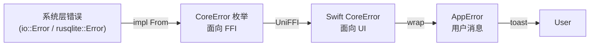

# 错误码表（CoreError）

> AreaMatrix Core 暴露的所有错误类型与处理建议。Swift 侧通过 `do/try/catch` 捕获并转换为用户消息。
>
> 阅读时长：约 4 分钟。

---

## 错误体系层级



---

## CoreError 枚举

```rust
#[derive(Error, Debug)]
pub enum CoreError {
    #[error("io error: {0}")]
    Io(String),

    #[error("db error: {0}")]
    Db(String),

    #[error("config error: {reason}")]
    Config { reason: String },

    #[error("classification failed: {reason}")]
    Classify { reason: String },

    #[error("path conflict: {path}")]
    Conflict { path: String },

    #[error("duplicate file already exists at: {existing_path}")]
    DuplicateFile { existing_path: String },

    #[error("file not found: {path}")]
    FileNotFound { path: String },

    #[error("repo not initialized at: {path}")]
    RepoNotInitialized { path: String },

    #[error("invalid path: {path}")]
    InvalidPath { path: String },

    #[error("iCloud placeholder not downloaded: {path}")]
    ICloudPlaceholder { path: String },

    #[error("permission denied: {path}")]
    PermissionDenied { path: String },

    #[error("internal error: {message}")]
    Internal { message: String },
}
```

---

## 错误码总表

| Variant | 触发场景 | 是否重试 | UI 处理建议 |
|---|---|---|---|
| `Io` | 文件读写失败、磁盘空间、损坏 | 视情况 | toast：「文件操作失败：{}」 |
| `Db` | SQLite 执行失败、schema 损坏 | 否 | 弹窗：建议从备份恢复或重建索引 |
| `Config` | classifier.yaml 解析失败、必填字段缺失 | 否 | 弹窗：跳转到设置 → 显示具体字段错误 |
| `Classify` | 分类引擎内部错误（不应在 MVP 触发） | 否 | toast：「分类失败」+ 落到 inbox |
| `Conflict` | 路径冲突（应已被 conflict::resolve 解决，触发 = 异常） | 否 | toast：「路径冲突，已自动重命名失败」 |
| `DuplicateFile` | 拖入重复 hash 文件且 strategy=Ask | 否 | 弹窗：选择跳过 / 覆盖 / 保留两份 |
| `FileNotFound` | 引用的 file_id 不存在或物理文件已消失 | 否 | toast：「文件已不存在，可能被外部删除」+ 刷新列表 |
| `RepoNotInitialized` | 资料库目录未 init | 否 | 弹窗：触发首次启动向导 |
| `InvalidPath` | 路径含非法字符、空、超长 | 否 | toast：「路径不合法」+ 让用户改名 |
| `ICloudPlaceholder` | 操作占位符文件 | 自动重试 | 静默触发下载 + retry |
| `PermissionDenied` | 资料库不可写、SQLite 文件锁定 | 否 | 弹窗：解释权限问题 + 链接帮助 |
| `Internal` | Rust panic / unwrap 兜底 | 否 | 弹窗：「应用内部错误」+ 提交日志 |

---

## 重试策略

### 自动重试（无需用户介入）

| 错误 | 策略 |
|---|---|
| `ICloudPlaceholder` | 触发下载 → 等待 → 重试操作（最多 30s） |
| `Io: ResourceBusy`（macOS spotlight 短暂锁文件） | 100ms 退避，最多 3 次 |
| `Db: Busy` (SQLITE_BUSY) | rusqlite `busy_timeout(5000)` 自动 |

### 不应自动重试

- 任何 `PermissionDenied`：等用户处理权限
- `DuplicateFile`：用户决策
- `Internal`：先排查

---

## Swift 侧映射

```swift
// apps/macos/AreaMatrix/Bridge/AppError.swift
public enum AppError: Error, LocalizedError {
    case io(String)
    case db(String)
    case duplicate(existingPath: String)
    case config(reason: String)
    case fileNotFound(path: String)
    case invalidPath(path: String)
    case icloudPlaceholder(path: String)
    case permissionDenied(path: String)
    case repoNotInitialized
    case unknown(String)

    public var errorDescription: String? {
        switch self {
        case .io(let msg): return "文件操作失败：\(msg)"
        case .db(let msg): return "数据库错误：\(msg)"
        case .duplicate(let path): return "此文件已在 \(path) 中存在"
        case .config(let reason): return "配置错误：\(reason)"
        case .fileNotFound(let path): return "文件不存在：\(path)"
        case .invalidPath(let path): return "路径不合法：\(path)"
        case .icloudPlaceholder: return "iCloud 文件正在下载，请稍候"
        case .permissionDenied(let path): return "无访问权限：\(path)"
        case .repoNotInitialized: return "资料库未初始化"
        case .unknown(let msg): return "出现未知错误：\(msg)"
        }
    }
}

extension CoreError {
    public func toAppError() -> AppError {
        switch self {
        case .io(let m): return .io(m)
        case .db(let m): return .db(m)
        case .duplicateFile(let path): return .duplicate(existingPath: path)
        case .config(let r): return .config(reason: r)
        case .fileNotFound(let p): return .fileNotFound(path: p)
        case .invalidPath(let p): return .invalidPath(path: p)
        case .iCloudPlaceholder(let p): return .icloudPlaceholder(path: p)
        case .permissionDenied(let p): return .permissionDenied(path: p)
        case .repoNotInitialized: return .repoNotInitialized
        case .classify, .conflict, .internal:
            return .unknown(String(describing: self))
        }
    }
}
```

---

## 用户消息原则

### 应该

- **告诉用户发生了什么**：「文件已在 docs/contract.pdf 中存在」
- **告诉用户能怎么做**：「跳过 / 覆盖 / 保留两份」
- **保留技术细节供日志**：toast 短，详细错误进 OSLog

### 不应该

- 暴露内部路径 / SQL 语句 / Rust panic 堆栈
- 用技术术语吓退用户（「FFI binding deserialization failed」）
- 在不可恢复错误时显示「重试」按钮

---

## 日志要求

每个 CoreError 必须有 tracing 日志：

```rust
fn import_file(...) -> CoreResult<FileEntry> {
    // ...
    if let Some(existing) = db::find_by_hash(...)? {
        tracing::warn!(
            existing_path = %existing.path,
            new_source = %src.display(),
            "duplicate file detected"
        );
        return Err(CoreError::DuplicateFile { existing_path: existing.path });
    }
}
```

UI 弹错误时同时把 trace_id（如有）显示在 toast 角落，便于用户在 issue 中报上下文。

---

## 错误测试

每个 CoreError 变体都需要至少一个测试覆盖：

```rust
#[test]
fn returns_duplicate_when_hash_matches() {
    let repo = setup();
    let _ = import_file(&repo, &src, opts.clone()).unwrap();
    let result = import_file(&repo, &src, opts);
    assert!(matches!(result, Err(CoreError::DuplicateFile { .. })));
}
```

---

## Related

- [core-api.md](core-api.md)
- [../architecture/ffi-design.md](../architecture/ffi-design.md)
- [../modules/storage.md](../modules/storage.md)
