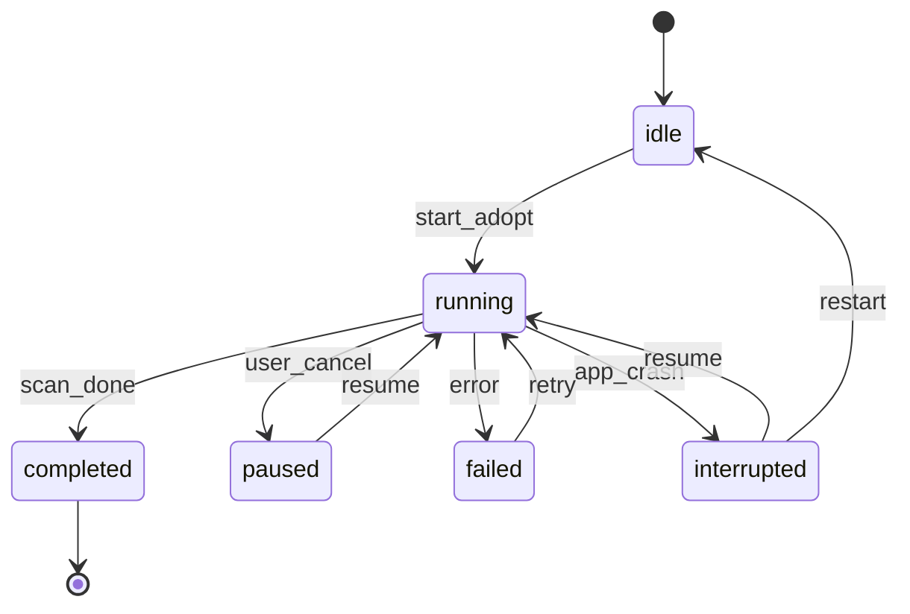

# 接管已有目录规则

> 定义 AreaMatrix 接管非空目录后的分类、拖入目标、概览粒度、扫描恢复、忽略规则与数据标记。
>
> 阅读时长：约 10 分钟。

---

## 核心原则

接管已有目录不是“重排目录”，而是“加一层索引”：

1. **不改用户文件**：首次接管不移动、不重命名、不删除、不覆盖任何已有内容。
2. **目录结构优先**：已有目录树在 UI 中完整保留，分类只是导入和筛选时的辅助语义。
3. **分类不绑架路径**：只有拖入新文件且用户选择自动分类时，AreaMatrix 才创建/使用系统分类目录。
4. **忽略规则统一**：首次扫描、reindex、FSEvents、树扫描使用同一套 ignore 规则。
5. **可恢复扫描**：接管扫描必须可中断、可恢复、可重跑。

---

## 目录与分类规则

接管后的一级目录分三类：

| 类型 | 判断规则 | UI 显示 | DB `category` |
|---|---|---|---|
| 系统分类 | 一级目录名命中 `classifier.yaml` 的 category slug | 本地化显示名，如「文档」 | 该 slug，如 `docs` |
| 用户文件夹 | 一级目录名未命中 category slug | 原目录名 | 该目录名，如 `project-a` |
| 根目录文件 | 文件直接位于 repo 根 | `资料库根` | `__root__` |

示例：

```text
/1/1/1/
├── README.md
├── project-a/
├── 合同/
├── docs/
└── screenshot.png
```

对应：

| 路径 | 类型 | category |
|---|---|---|
| `README.md` | 根目录文件 | `__root__` |
| `screenshot.png` | 根目录文件 | `__root__` |
| `project-a/main.rs` | 用户文件夹 | `project-a` |
| `合同/a.pdf` | 用户文件夹 | `合同` |
| `docs/spec.pdf` | 系统分类 | `docs` |

规则含义：

- `category` 字段记录顶层归属，不强制代表“文件类型”。
- UI 可以用 `NodeKind` 区分系统分类与用户文件夹。
- `README.md` 是普通用户文件，会被索引和搜索，但不会被应用自动改写。

---

## 拖入目标规则

拖入目标由用户手势决定，优先级如下：

| 入口 | 默认目标 | 是否自动分类 | 说明 |
|---|---|---|---|
| 拖到侧边栏某节点 | 该节点目录 | 否 | 用户显式选择目标，尊重目录 |
| 拖到文件列表 | 当前选中节点目录 | 否 | 与 Finder 当前目录语义一致 |
| 拖到窗口空白区 | 自动分类 | 是 | 根据 classifier 推断目标分类 |
| 菜单 `Import...` | 自动分类 | 是 | 无上下文目标时走自动分类 |
| 拖到根节点 | repo 根目录 | 否 | 明确 drop 到根时允许放根目录 |

自动分类时：

- 命中 `docs` / `finance` / `code` 等系统分类，但目录不存在，则 ImportSheet 预告“将创建 `<slug>/`”。
- 分类置信度低或未命中时，默认进入 `inbox/`；若 `inbox/` 不存在，则创建。
- 用户可在 ImportSheet 改成任意已有目录或系统分类。

伪代码：

```rust
fn resolve_import_destination(ctx: DropContext, predicted: ClassifyResult) -> Target {
    match ctx {
        DropContext::TreeNode(path) => Target::Directory(path),
        DropContext::ListNode(path) => Target::Directory(path),
        DropContext::RootNode => Target::Directory(""),
        DropContext::WindowBlank | DropContext::MenuImport => {
            Target::AutoCategory(predicted.category)
        }
    }
}
```

---

## 概览生成粒度

Stage 1 只生成两层概览：

| 粒度 | 路径 | 说明 |
|---|---|---|
| 根概览 | `.areamatrix/generated/root.md` | 全库统计、顶层目录/分类、近期改动 |
| 顶层节点概览 | `.areamatrix/generated/nodes/<slug>.md` | 系统分类或用户一级目录的统计与文件清单 |

可选根目录入口：

```text
AREAMATRIX.md
```

不做：

- 不为每个深层子目录生成文件。
- 不在任何目录生成 `README.md`。
- 不把概览文件写到用户目录里。

Stage 2 可考虑“当前选中目录按需导出概览”，但不进入 MVP 默认行为。

---

## 忽略规则

默认跳过：

```yaml
version: 1
patterns:
  - ".areamatrix/"
  - ".git/"
  - ".hg/"
  - ".svn/"
  - "node_modules/"
  - ".venv/"
  - "venv/"
  - "target/"
  - "build/"
  - "dist/"
  - ".next/"
  - ".cache/"
  - ".DS_Store"
  - "*.tmp"
  - "*.swp"
```

文件位置：

```text
<repo>/.areamatrix/ignore.yaml
```

规则：

- `ignore.yaml` 在 `init_repo` 时创建。
- 用户可在设置中打开编辑。
- 首次扫描、reindex、tree-scan、FSEvents 同步必须共用同一 matcher。
- `README.md` 不在默认忽略列表中。
- `AREAMATRIX.md` 与 `.areamatrix/generated/` 属于应用产物，始终忽略。

---

## 扫描状态机

接管扫描必须有 session：



DB 建议表：

```sql
CREATE TABLE IF NOT EXISTS scan_sessions (
  id INTEGER PRIMARY KEY AUTOINCREMENT,
  kind TEXT NOT NULL CHECK (kind IN ('adopt', 'reindex')),
  status TEXT NOT NULL CHECK (status IN (
    'running','completed','paused','failed','interrupted'
  )),
  started_at INTEGER NOT NULL,
  updated_at INTEGER NOT NULL,
  finished_at INTEGER,
  last_path TEXT,
  inserted INTEGER NOT NULL DEFAULT 0,
  updated INTEGER NOT NULL DEFAULT 0,
  skipped INTEGER NOT NULL DEFAULT 0,
  errors_json TEXT NOT NULL DEFAULT '[]'
);
```

恢复规则：

- 每批处理后更新 `last_path` 与计数，批大小建议 100-500。
- 启动时发现 `running` 且进程不是当前实例，标记为 `interrupted`。
- 默认向用户提供 `Resume`，也允许 `Restart scan`。
- 扫描是幂等的：同一路径重复处理时按 `path + hash` upsert，不重复插入。

---

## 数据来源标记

`storage_mode = indexed` 不足以表达来源，必须增加 `origin`：

| origin | 场景 | storage_mode |
|---|---|---|
| `imported` | 用户通过拖拽/菜单导入 | moved / copied / indexed |
| `adopted` | 首次接管已有目录扫描出的文件 | indexed |
| `external` | Finder/终端/iCloud 在 repo 内新增的文件 | indexed |

`change_log`：

- 接管已有文件写 `adopted`。
- 外部新增文件写 `imported`，detail 中 `by = "external"`。
- 用户拖入文件写 `imported`，detail 中 `by = "user"`。

---

## UI 呈现

侧边栏建议分组：

```text
资料库
├── 系统分类
│   ├── 文档 (docs)
│   └── 财务 (finance)
└── 文件夹
    ├── project-a
    └── 合同
```

规则：

- 如果没有任何系统分类目录存在，系统分类组可以折叠或隐藏。
- 用户文件夹默认按目录名排序。
- 根目录文件显示在 `资料库根` 节点下。
- 详情面板显示 `origin`：导入 / 接管 / 外部新增。

---

## Related

- [overview.md](overview.md)
- [data-model.md](data-model.md)
- [source-of-truth.md](source-of-truth.md)
- [../api/core-api.md](../api/core-api.md)
- [../modules/storage.md](../modules/storage.md)
- [../modules/tree-scan.md](../modules/tree-scan.md)
- [../modules/overview-gen.md](../modules/overview-gen.md)
- [../ux/drag-import-flow.md](../ux/drag-import-flow.md)
- [../ux/first-launch.md](../ux/first-launch.md)
- [../adr/0010-adopt-existing-folders-and-overviews.md](../adr/0010-adopt-existing-folders-and-overviews.md)
