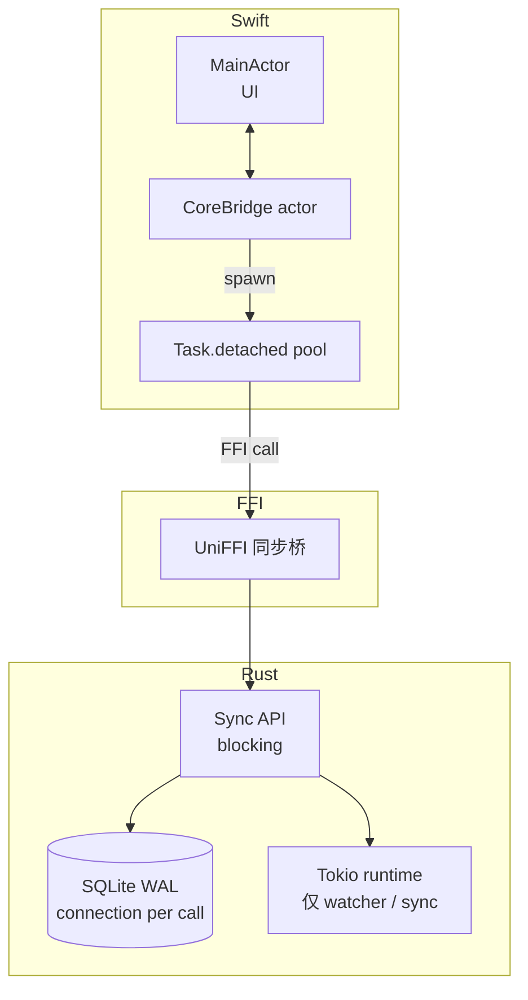
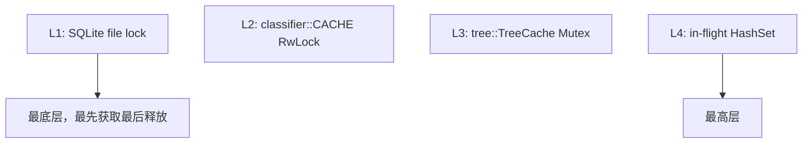
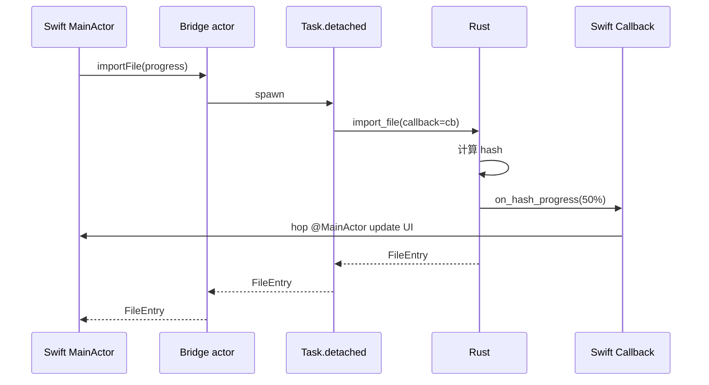
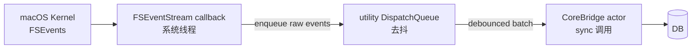

# 并发模型

> AreaMatrix 跨越 Rust + Swift + UniFFI 三层。每层有独立并发模型；如何让它们协同工作而不死锁、不数据竞争、不丢取消信号？本文给出完整规则。
>
> 阅读时长：约 18 分钟。

---

## 三层并发模型



关键约束：

- **Rust Core API 是同步的**（UniFFI 0.x 异步支持有限，避免）
- **Swift 端在 Task.detached 调用 Core**（避免阻塞 MainActor）
- **CoreBridge 是 Swift Actor**（串行化所有写操作）
- **DB 连接每次调用打开 / 关闭**（无连接池，避免锁）

---

## Rust 端：同步 + Tokio runtime

### Core API 是同步的

UniFFI 0.x 对 async 函数的支持仍不稳定，且会引入复杂的 cancellation 语义。我们选择：

```rust
// ✅ 同步 API
pub fn import_file(repo: &Path, src: &Path, options: ImportOptions) -> CoreResult<FileEntry> {
    // ... 同步阻塞实现 ...
}

// ❌ 不暴露异步 API
pub async fn import_file_async(...) -> CoreResult<FileEntry> { ... }
```

Swift 端用 `Task.detached` 把同步调用包装成 async。

### Tokio runtime（仅内部用）

Watcher 与后台任务（README 重生成 debounce、staging GC 调度）需要异步：

```rust
// core/src/runtime.rs
use std::sync::OnceLock;
use tokio::runtime::{Builder, Runtime};

static RUNTIME: OnceLock<Runtime> = OnceLock::new();

pub fn runtime() -> &'static Runtime {
    RUNTIME.get_or_init(|| {
        Builder::new_multi_thread()
            .worker_threads(4)
            .thread_name("areamatrix-bg")
            .enable_all()
            .build()
            .expect("tokio runtime")
    })
}

pub fn spawn<F>(future: F)
where
    F: std::future::Future<Output = ()> + Send + 'static,
{
    runtime().spawn(future);
}
```

不在 FFI 边界跨越 await。

### Send + Sync 边界

```rust
pub struct CoreError { ... }
unsafe impl Send for CoreError {}
unsafe impl Sync for CoreError {}

pub trait ImportProgressCallback: Send + Sync {
    fn on_hash_progress(&self, done: u64, total: u64);
}
```

UniFFI 要求所有跨 FFI 类型自动 `Send + Sync`。callback trait 必须显式标注。

### DB 连接策略

```rust
pub fn with_repo<F, T>(repo: &Path, f: F) -> CoreResult<T>
where
    F: FnOnce(&mut rusqlite::Connection) -> CoreResult<T>,
{
    let mut conn = open_connection(repo)?;
    let result = f(&mut conn);
    drop(conn);
    result
}
```

每次调用开一个新连接、用完关闭。避免连接池的复杂锁管理；SQLite 连接打开成本 < 1ms。

并发场景靠 SQLite WAL：多 reader 不阻塞，single writer 用 `BEGIN IMMEDIATE` 抢锁 + `busy_timeout` 重试。

### 锁层次结构



获取顺序必须严格 L1 → L2 → L3 → L4。永远不允许反向。

死锁防止规则：

- 同一线程不能同时持有 2 个同级别锁
- 不在锁内调用可能再获取锁的函数（避免重入）
- 锁内只做必要工作，复杂逻辑提前 / 推后

---

## Swift 端：MainActor + 自定义 Actor

### MainActor 用于 UI 状态

```swift
@MainActor
final class AppState: ObservableObject {
    @Published var files: [FileEntry] = []
    @Published var selectedCategory: String?
    @Published var loading = false

    func refresh() async throws {
        loading = true
        defer { loading = false }
        let entries = try await coreBridge.listFiles(filter: makeFilter())
        self.files = entries
    }
}
```

`@Published` 必须在 MainActor 上更新，否则 SwiftUI 警告 publishing changes from background。

### CoreBridge 是 actor

```swift
public actor CoreBridge {
    private let repoPath: String
    private let inflightTracker: InFlightTracker
    private let metrics: MetricsCollector

    public init(repoPath: String) {
        self.repoPath = repoPath
        self.inflightTracker = InFlightTracker()
        self.metrics = MetricsCollector()
    }

    public func importFile(from src: URL, options: ImportOptions) async throws -> FileEntry {
        let staging = expectedStagingPath(src)
        let final = expectedFinalPath(src, options)

        await inflightTracker.mark([staging, final])
        defer {
            Task { await inflightTracker.unmark(staging); await inflightTracker.unmark(final) }
        }

        let started = Date()
        let entry = try await Task.detached(priority: .userInitiated) { [repoPath] in
            try AreaMatrix.importFile(
                repoPath: repoPath,
                sourcePath: src.path,
                options: options
            )
        }.value
        await metrics.record(.importMs(Date().timeIntervalSince(started) * 1000))
        return entry
    }
}
```

为什么用 actor 而不是 `@MainActor`：

- import 是耗时操作，不能阻塞 UI
- 多个 import 可能并发到达，actor 串行化它们防 DB 写冲突
- `inflightTracker` 是状态，由 actor 保护

### Task.detached 的何时用

| 场景 | API |
|---|---|
| 调用同步 Core API | `Task.detached(priority:)` |
| MainActor 上的 async 内部串行 | `await someAsyncOp()` |
| 后台周期任务（fps 监控） | `Task { while !Task.isCancelled { ... } }` |
| 取消传播（用户关闭面板） | `Task` + 子任务 cancellation |

### priority 选择

```swift
// 用户交互（拖入）
Task.detached(priority: .userInitiated) { ... }

// 后台索引
Task.detached(priority: .background) { ... }

// 默认
Task.detached(priority: .medium) { ... }
```

不要在 `.background` 跑用户感知的工作。

---

## FFI 边界并发

### UniFFI 的同步调用

```text
Swift Task                    Rust 线程
   |                            |
   | call AreaMatrix.importFile |
   |--------------------------->|
   |                            | (阻塞执行)
   |        FileEntry           |
   |<---------------------------|
   |                            |
```

UniFFI 同步函数会阻塞 Swift 调用方所在的线程。所以：

- 永不在 MainActor 直接调
- 永远用 `Task.detached`

### Callback 反向调用



callback 在 Rust 后台线程触发。Swift 实现必须自己 hop 回 MainActor：

```swift
class ProgressCallback: ImportProgressCallback {
    weak var ui: UIController?

    func onHashProgress(bytesDone: Int64, bytesTotal: Int64) {
        Task { @MainActor in
            self.ui?.updateProgress(bytesDone, bytesTotal)
        }
    }
}
```

详见 [../api/uniffi-recipes.md](../api/uniffi-recipes.md)。

### 数据所有权

UniFFI 的所有跨 FFI 数据是值传递（Rust `Clone` / Swift `Copyable`）。无引用循环风险。

但 callback / closure 是引用传递。必须确保：

- Rust 端持有 `Arc<dyn ImportProgressCallback>`
- Swift 端不在 callback 持有强引用循环

---

## 取消传播

### Swift 端取消

```swift
let task = Task.detached {
    try await coreBridge.reindexFromFilesystem()
}

await Task.sleep(nanoseconds: 5_000_000_000)
task.cancel()
```

### Rust 端响应

UniFFI 0.x 不支持自动 cooperative cancellation。Swift `Task.cancel()` 只取消 Swift Task，Rust 同步调用继续跑。

应对策略：

1. **拆小任务**：reindex 内部分批，每批之间检查取消标志

```rust
pub fn reindex_with_cancel(
    repo: &Path,
    cancel: Arc<AtomicBool>,
) -> CoreResult<ReindexReport> {
    let mut report = ReindexReport::default();
    for batch in walk_in_chunks(repo, 100) {
        if cancel.load(Ordering::Relaxed) {
            return Err(CoreError::Internal { message: "cancelled".into() });
        }
        process_batch(batch, &mut report)?;
    }
    Ok(report)
}
```

2. **暴露 cancel handle**：

```idl
interface CancelHandle {
    void cancel();
};

[Throws=CoreError]
ReindexReport reindex_with_cancel(string repo_path, CancelHandle handle);
```

```swift
let handle = CancelHandle()
let task = Task.detached {
    try AreaMatrix.reindexWithCancel(repoPath: path, handle: handle)
}
// 用户点取消
handle.cancel()
```

3. **超时不强杀**：UI 显示 "正在取消…" 直到任务自然结束（最多几秒）。

---

## 死锁场景与规避

### 场景 1：actor 重入

```swift
// ❌ 死锁
public actor Store {
    var items: [Item] = []

    func add(_ item: Item) async {
        items.append(item)
        await observers.notify(item)  // observers 是另一 actor，可能回调 add
    }
}

// ✅ 拆开，先放数据再通知
public actor Store {
    var items: [Item] = []

    func add(_ item: Item) async {
        items.append(item)
        let snapshot = items
        Task.detached { await observers.notify(snapshot) }
    }
}
```

### 场景 2：MainActor + actor 互等

```swift
// ❌
@MainActor
func foo() async {
    await bridge.bar()
}

actor Bridge {
    func bar() async {
        await MainActor.run { /* ... */ }   // bridge 等 main 等 bridge
    }
}
```

规则：actor 内不要等 MainActor。如必须更新 UI，用 `Task { @MainActor in ... }` 而非 `await MainActor.run`。

### 场景 3：SQLite + 锁顺序倒置

```rust
// ❌
fn op_a(repo: &Path) {
    let _cache = CACHE.write().unwrap();
    db::with_repo(repo, |conn| { /* ... */ })?;  // tx 内访问 cache 又锁 → 死锁
}

// ✅
fn op_a(repo: &Path) {
    let cache_snapshot = {
        let cache = CACHE.read().unwrap();
        cache.clone()
    };
    db::with_repo(repo, |conn| {
        // 用 snapshot
    })
}
```

### 场景 4：FFI callback 持锁回调

```rust
// ❌
fn import_file(...) -> CoreResult<...> {
    let lock = MY_MUTEX.lock().unwrap();
    callback.on_progress(50);   // callback 可能再调 Core 函数 → 死锁
}

// ✅ 持锁内不调 callback
fn import_file(...) -> CoreResult<...> {
    let _data = {
        let lock = MY_MUTEX.lock().unwrap();
        lock.snapshot()
    };
    callback.on_progress(50);
}
```

---

## 数据竞争模式与防御

### 共享可变状态最小化

Rust 端用 `Arc<RwLock<T>>` 仅在必要时（cache）。优先：

- 局部变量
- 不可变 + Clone
- channel（mpsc / broadcast）

### Send + Sync 静态校验

让编译器帮我们：

```rust
fn assert_send_sync<T: Send + Sync>() {}

#[test]
fn types_are_send_sync() {
    assert_send_sync::<crate::api::types::FileEntry>();
    assert_send_sync::<crate::error::CoreError>();
}
```

### Swift Sendable

Swift 6 strict mode：

```swift
public struct FileEntry: Sendable {
    public let id: Int64
    public let path: String
    // ...
}

public enum CoreError: Error, Sendable {
    case Io(String)
    // ...
}
```

跨 actor 边界传递的类型必须 Sendable。UniFFI 生成的 struct 已自动 Sendable。

---

## Watcher 内部并发

### 多层 queue



每层都有独立线程：

- StreamCB：系统线程，禁忌阻塞
- UtilQ：global utility queue
- SyncQ：actor 内部串行队列

回调内只 enqueue，不做实际工作。

### 反向广播

```swift
public final class RepoChangeNotifier {
    private let stream: AsyncStream<Void>.Continuation
    public let changes: AsyncStream<Void>

    public init() {
        var cont: AsyncStream<Void>.Continuation!
        changes = AsyncStream { c in cont = c }
        stream = cont
    }

    func notify() { stream.yield(()) }
}

@MainActor
final class FilesViewModel {
    func bind(notifier: RepoChangeNotifier) {
        Task {
            for await _ in notifier.changes {
                try? await refresh()
            }
        }
    }
}
```

`AsyncStream` 用于 Rust → Swift 单向广播，多个 view 订阅。

---

## 测试并发代码

### Rust 端

```rust
#[test]
fn import_concurrent_no_dup() {
    let repo = setup();
    let repo_arc = Arc::new(repo);

    let handles: Vec<_> = (0..10).map(|i| {
        let r = Arc::clone(&repo_arc);
        std::thread::spawn(move || {
            let src = r.path().join(format!("__c{}.pdf", i));
            std::fs::write(&src, format!("content-{}", i)).unwrap();
            import_file(r.path(), &src, ImportOptions::default())
        })
    }).collect();

    let results: Vec<_> = handles.into_iter().map(|h| h.join().unwrap()).collect();
    let success = results.iter().filter(|r| r.is_ok()).count();
    assert!(success >= 8);
}

#[test]
fn loom_no_deadlock() {
    loom::model(|| {
        let lock = loom::sync::Arc::new(loom::sync::Mutex::new(0));
        let l1 = Arc::clone(&lock);
        let h = loom::thread::spawn(move || {
            *l1.lock().unwrap() += 1;
        });
        *lock.lock().unwrap() += 1;
        h.join().unwrap();
    });
}
```

Loom 用于穷举并发交错检测死锁，仅对核心同步原语跑（开销大）。

### Swift 端

```swift
func test_concurrent_imports() async throws {
    let bridge = CoreBridge(repoPath: tmpRepo)
    let urls = (0..<20).map { tmpDir.appendingPathComponent("\($0).pdf") }
    for url in urls {
        try Data("content-\(url.lastPathComponent)".utf8).write(to: url)
    }

    try await withThrowingTaskGroup(of: FileEntry.self) { group in
        for url in urls {
            group.addTask {
                try await bridge.importFile(from: url, options: .default)
            }
        }
        var count = 0
        for try await _ in group { count += 1 }
        XCTAssertEqual(count, 20)
    }
}
```

### Thread Sanitizer

```bash
cargo test --release -Z sanitizer=thread
```

Xcode：Edit Scheme → Diagnostics → Thread Sanitizer。

---

## 事件循环与背压

### 拖入 1000 个文件


Swift 端：

```swift
@MainActor
final class ImportQueue {
    @Published var pending: Int = 0
    @Published var done: Int = 0
    private let bridge: CoreBridge

    func enqueue(_ urls: [URL]) {
        pending += urls.count
        Task.detached { [bridge] in
            for url in urls {
                _ = try? await bridge.importFile(from: url, options: .default)
                await self.markDone()
            }
        }
    }

    @MainActor
    private func markDone() {
        pending -= 1
        done += 1
    }
}
```

不并发 import（避免 DB 写争抢），用进度条给反馈。

### 背压策略

如果 Swift 提交速度 > Rust 处理速度：

- 队列累积 → 内存涨
- UI 进度条不动 → 用户焦虑

对策：

- 限制队列长度（如 10000），满了拒绝拖入
- 设置面板显示队列状态

---

## 长任务取消的 UX

| 用户操作 | 系统响应 |
|---|---|
| 点 ⌘. (cancel shortcut) | 设置 cancel flag → 显示 "正在取消…" |
| 任务在合理时间内停止（< 3s） | 隐藏进度，显示 "已取消" toast |
| 任务超过 5s 未停 | 升级为强制中断（kill thread）警告 |

强制中断风险：DB 事务回滚 + staging 残留。下次启动 recover 自愈。

---

## 总结：黄金规则

1. **MainActor 不阻塞**：耗时调用必须 `Task.detached`
2. **CoreBridge 串行写**：actor 保护
3. **Rust 同步 + 内部 tokio**：FFI 边界不暴露异步
4. **callback 自己 hop**：Swift 实现自己回 MainActor
5. **锁层次单调**：永不反向获取
6. **持锁不回调**：避免重入死锁
7. **每写必有 cancel 可能**：长任务暴露 cancel handle
8. **测有并发**：单测 + loom + sanitizer 三层

---

## Related

- [overview.md](overview.md)
- [ffi-design.md](ffi-design.md)
- [transactional-import.md](transactional-import.md)
- [fs-watcher.md](fs-watcher.md)
- [../api/uniffi-recipes.md](../api/uniffi-recipes.md)
- [../development/performance.md](../development/performance.md)
- [../development/testing.md](../development/testing.md)
