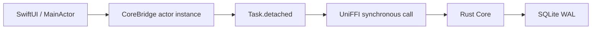

# 并发模型

> 记录 AreaMatrix 当前 SwiftUI、CoreBridge、同步 Rust Core、SQLite 与批量导入的并发边界。
>
> 阅读时长：约 7 分钟。

---

## 总览


```mermaid
flowchart LR
    mainActor["SwiftUI / MainActor"]
    bridge["CoreBridge actor instance"]
    detached["Task.detached"]
    ffi["UniFFI synchronous call"]
    core["Rust Core"]
    sqlite["SQLite WAL"]

    mainActor --> bridge
    bridge --> detached
    detached --> ffi
    ffi --> core
    core --> sqlite
```

核心规则：

- Rust Core 的公开 UniFFI API 是同步函数。
- Swift Bridge 用 `Task.detached` 执行耗时 Core 调用，避免阻塞 MainActor。
- `CoreBridge` 是 actor，但隔离只作用于同一个实例。
- 应用可以创建多个 `CoreBridge` 实例，不存在进程级全局写队列。
- 跨实例和跨调用的数据库协调依赖 SQLite WAL、事务和 `busy_timeout`。
- 当前 Core 不使用 Tokio runtime，也不暴露 async FFI、cancel handle 或 progress callback。

## SwiftUI 与 MainActor

SwiftUI View 和可观察 UI model 在 MainActor 更新：

- 路由、列表、详情、toast、sheet 和进度状态在 MainActor 变更。
- View 不直接做文件 IO、SQLite 或 UniFFI 调用。
- 平台副作用通过 PlatformServices 注入。
- Core 返回后再切回 actor 上下文更新 UI。

UI model 不应在 MainActor 同步等待 hash、扫描、导入、搜索或外部同步。

## CoreBridge actor

`CoreBridge` 为 actor，负责 Swift 手写 Bridge 边界和同实例状态隔离。它不等于全局锁：

- `AppCoreServices` 的多个 computed service 可以创建不同 `CoreBridge()`。
- 高风险 feature 也可以保留独立实例。
- actor 方法在等待 `Task.detached(...).value` 时允许重入。
- 因此不能依赖 `CoreBridge` 保证整个进程的写操作严格串行。

需要跨调用一致性的行为必须由 Core 事务、文件回滚 guard、幂等 token 或显式 feature 状态实现。

## Task.detached

Bridge 常用形式：

```swift
let result = try await Task.detached(priority: .userInitiated) {
    try syncExternalChanges(repoPath: repoPath, events: events)
}.value
```

约束：

- detached closure 只捕获 Sendable 值或不可变快照。
- closure 内不更新 SwiftUI 状态。
- 错误原样返回 Bridge，再映射为 App 语义。
- Swift Task cancellation 不会自动中断正在执行的同步 Rust 调用。

需要停止的长流程由调用层在单次 Core 调用之间检查控制状态，例如批量导入的 stop-after-current-file。

## Rust Core

Core 函数在调用线程同步执行。耗时来源包括：

- 文件 metadata 和 hash。
- SQLite 查询与事务。
- 文件复制、移动和 Trash 协调前后的 Core 工作。
- 扫描、恢复和概览生成。

Core 不持有 macOS watcher，不调用 AppKit，也不启动内部 Tokio worker。平台并发由 Swift 管理，Core 负责单次调用的业务一致性。

## SQLite

Core 通常为每次 DB helper 打开连接。写连接的完整配置为：

```sql
PRAGMA journal_mode = WAL;
PRAGMA foreign_keys = ON;
PRAGMA synchronous = NORMAL;
PRAGMA temp_store = MEMORY;
PRAGMA mmap_size = 268435456;
PRAGMA cache_size = -65536;
PRAGMA busy_timeout = 5000;
```

只读连接使用 `SQLITE_OPEN_READ_ONLY`，并启用 `query_only` 与同样的 5 秒 busy timeout。

WAL 允许读写并行，但 SQLite 同时仍只有一个 writer。写冲突由 SQLite 等待或返回错误；调用方不能假定所有写已由 Swift actor 排队。

事务边界按业务操作定义：

- 同一批 DB row 和 change log 在一个事务中提交。
- 文件系统和 DB 无法共享一个原生事务，使用 staging、rollback guard 和恢复流程协调。
- generated overview 使用多文件写计划和回滚快照。
- 外部同步先提交 DB batch，再生成 overview，最后写 cursor。

## 外部同步顺序

`sync_external_changes` 的顺序为：

1. 校验并规划整批事件。
2. 在一个 SQLite 事务中写 files 和 change_log。
3. 重新生成受影响分类和根概览。
4. 单独持久化批次最大 FSEvent cursor。

overview 或 cursor 失败时 cursor 不推进，下一次会重放事件。由于 DB 可能已经提交，created、renamed、removed 和 modified 分支必须保持幂等。

## 批量导入

当前批量导入由 Swift 逐项串行执行：

- 每次只启动一个单文件 Core 导入。
- 当前项完成后更新进度和 session。
- stop-after-current-file 在当前调用返回后阻止下一项启动。
- 当前没有并行 worker pool，也没有 Core batch import callback。

串行策略降低同时修改用户文件、staging 和 DB 的竞争范围。未来若引入并行导入，需要重新定义磁盘压力、SQLite writer 竞争、停止语义和文件安全证据。

## FSEvents

macOS watcher 在 MainActor 接收回调，将事件按路径合并并在 200ms 后发布。InFlight tracker 是独立 actor，使用引用计数和 TTL 过滤 AreaMatrix 自身产生的文件事件。

watcher 不直接调用 Core；relay 把有序窗口交给当前资料库 model，model 严格一次只处理队首一个窗口。
每个窗口携带整个回调窗口的 `cursorWatermark`；即使业务事件全部被路径规则或 InFlight 过滤，
也会把空窗口排入同一队列，不能越过更早窗口直接确认 cursor。

业务窗口先调用 Core；Core 成功后，如果 `cursorWatermark` 高于实际业务 signal 的最大 event ID，Swift 再
补写 cursor。filtered-only 窗口到达队首后直接确认 watermark。Core 或 cursor 失败时保留队首并阻塞后续
窗口，显式重试仍从同一窗口开始。Core batch 和 cursor 已提交后，列表或详情 reload 失败只记录呈现错误并
消费该窗口，不重新提交已经完成的 Core batch。

## 取消、超时与恢复

- Swift Task cancellation 只取消尚未开始或位于 Swift 检查点的工作。
- 同步 Core 调用必须自行完成或返回错误，不能从 Swift 强制终止。
- SQLite 最长等待由 5 秒 busy timeout 控制。
- 应用退出或崩溃后的恢复由 startup recovery、scan session 和 import session 处理。
- 不通过删除用户文件来解决并发或恢复冲突。

## 验证重点

- MainActor 不同步执行耗时 Core 调用。
- 多 `CoreBridge` 实例下 DB 事务仍正确。
- DB busy/失败不会留下部分 metadata。
- 外部同步重放幂等，cursor 不越过失败批次。
- ordered window 严格串行 drain，filtered-only watermark 不越过失败的队首窗口。
- 已提交外部同步后的 UI reload 失败不重放 Core batch。
- 批量导入停止后不启动下一项。
- InFlight 引用计数和 TTL 不误丢其他路径事件。

## Related

- [layered-design.md](layered-design.md)
- [ffi-design.md](ffi-design.md)
- [fs-watcher.md](fs-watcher.md)
- [transactional-import.md](transactional-import.md)
- [../development/testing.md](../development/testing.md)
