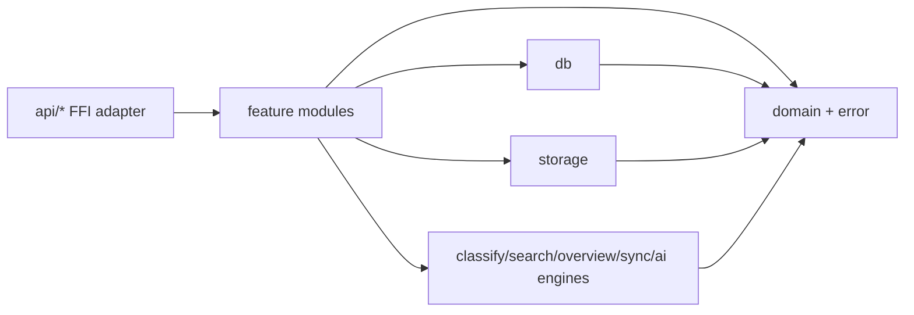

# Core 内部架构

> AreaMatrix Core 在四层架构中的 L1 层采用单 crate 优先、按能力拆模块、按稳定边界再拆 crate 的 Rust 后端结构。本文规定 Core 内部目录、依赖方向和后续功能插入方式。
>
> 阅读时长：约 7 分钟。

---

## 目标

Core 已经承担导入、分类、搜索、同步、AI、批量操作、恢复和 SQLite 元数据等能力。为了支持后续持续增加功能，Core 内部需要固定增长规则：

1. 新功能有明确落点，不继续向大文件和平级模块自然堆叠。
2. FFI 对外合同稳定，内部实现可以小步拆分。
3. 文件安全、DB 事务、平台无关性和测试边界可追踪。
4. 先在单 crate 内完成结构化，只有边界稳定后才拆 workspace crate。

这不是 Java 式 controller/service/dao 模板。Rust Core 的主要边界按“对外合同、业务用例、领域类型、持久化、文件系统能力、可复用引擎”划分。

## 目标结构

```text
core/src/
├── lib.rs                  # 轻量 module declaration 和必要 re-export
├── api/                    # UniFFI 对外门面；函数名与 UDL 合同保持一致
├── domain/                 # 领域类型、不变量、跨模块共享语义
├── error/                  # CoreError / CoreResult / error mapping
├── db/                     # SQLite schema、查询、事务、migration 边界
├── storage/                # 文件系统、staging、hash、安全移动、导入/删除/重命名
├── classify/               # 分类规则引擎
├── search/                 # 搜索、facet、saved search、ranking
├── overview/               # 自动概览生成
├── sync/                   # 外部变化回流与同步协调
├── batch_*/                # 批量操作用例，后续可收敛到 features/batch/*
├── ai_*/                   # AI 设置、隐私、执行、日志和建议用例
├── repo_*                  # repository 初始化、路径验证、扫描、修复用例
└── support/                # 未来纯工具模块：path/hash/time/validation 等
```

当前代码可以保留既有模块名逐步迁移。新增能力应优先按本结构落位；旧模块只有在无行为变化重构时才移动。

`db/` 目录继续按 SQLite 边界拆分，`db/mod.rs` 只作为 facade（门面）保留模块声明和
内部 re-export。共享 DB 基础设施按以下文件落位：

- `db/schema.rs`：初始 schema、schema version 和 migration helper。
- `db/connection.rs`：DB 路径、初始化检查、连接打开和 SQLite pragma。
- `db/repo_config.rs`：`repo_config` 读写、配置更新事务和配置写权限检查。
- `db/read_models.rs`：跨功能 read model，例如文件列表和 availability status。
- `db/codec.rs`：领域枚举与 DB 标量值之间的转换。

具体功能表和查询继续按能力放在 `db/import.rs`、`db/scan.rs`、`db/saved_search.rs`
等文件中；新增 DB 能力不要直接塞回 `db/mod.rs`。

## 依赖方向



依赖规则：

- `api/*` 可以调用业务模块，但不承载业务流程、SQL、文件移动或平台探测。
- `domain` 和 `error` 不依赖 `api`、`db`、`storage` 或平台层。
- `db` 只处理 SQLite、schema、事务和行转换，不做用户文件移动。
- `storage` 只处理平台无关文件系统能力，不调用 macOS、SwiftUI、FSEvents、AppKit 或 UI。
- 功能模块编排用例，可以同时调用 `db`、`storage`、`classify`、`overview`、`sync` 等能力。
- 引擎模块应保持可测试和可复用，避免反向依赖 FFI 门面。
- 新的共享工具只有在两个以上模块真实复用时才进入 `support/`。

## API 门面规则

`api/` 是 UniFFI 对外门面（adapter，适配层），不是业务层。它负责：

- 保持 UDL 函数名、参数和返回类型稳定。
- 承载 public rustdoc，说明 FFI 合同、安全边界和错误语义。
- 做轻量参数传递、错误返回和模块分发。
- 将真实执行交给 `repo_*`、`storage`、`batch_*`、`ai_*`、`search`、`sync` 等模块。

`api/` 不应：

- 直接写 SQL。
- 直接执行复杂文件移动、删除、覆盖、Trash 或 staging 流程。
- 隐藏跨功能副作用。
- 为了 UI 便利合并多个需要确认的高风险操作。
- 引入平台特定 API 或假设调用线程。

当 `docs/api/core-api.md` 或 `core/area_matrix.udl` 需要新增函数时，先更新 API 源事实，再在 `api/` 增加对应门面函数，最后补实现和测试。

## 功能模块规则

功能模块（use case，用例模块）负责一条业务能力的编排，例如导入、批量重命名、AI 摘要、缺失文件恢复、同步冲突解决。它们可以包含：

- 输入验证和确认 token 校验。
- 对 `db` 与 `storage` 的事务顺序编排。
- 对 `overview`、`change_log`、`undo/redo`、AI call log 等相邻能力的显式调用。
- 面向测试的小函数和内部类型。

功能模块不应把所有能力抽象成一套统一接口。当前只有一个实现时，不引入工厂、策略或 trait；只有出现真实替换需求、测试隔离需求或跨平台实现差异时再抽象。

## DB 与 Storage 边界

`db/` 是元数据真相的持久化边界：

- 允许打开 SQLite、初始化 schema、执行 migration、读写表、管理事务。
- 不允许移动、删除、重命名或覆盖用户文件。
- 不允许调用 `api/`。

`storage/` 是文件系统物化视图的安全边界：

- 允许读写 AreaMatrix-owned metadata、staging、hash、导入目标、Trash 或安全移动。
- 必须遵守“不移动、不重命名、不删除、不覆盖未确认用户原文件”的不变量。
- 需要 DB 一致性时，由功能模块或明确的事务函数编排，不把隐藏副作用散落到调用方看不见的位置。

## 测试落点

测试继续按合同、实现、失败恢复、验证、集成回归的粒度组织。后续可以增加：

```text
core/tests/support/
```

测试支撑层只放 fixture、临时资料库构造、断言工具和重复数据准备，不承载业务实现。生产代码不得依赖 `tests/support`。

## 何时拆多 crate

当前阶段保持单 crate。只有满足以下条件之一，才考虑 workspace 多 crate：

- 某个边界已经稳定，并且需要被其他二进制、工具或平台独立复用。
- 编译时间、feature flag 或依赖体积已经明显影响日常开发。
- 某个组件需要独立发布、独立测试或独立安全审计。
- FFI/bindings、DB、storage、test support 的边界已经稳定到可以独立版本化。

潜在候选包括：

- `area_matrix_db`
- `area_matrix_storage`
- `area_matrix_test_support`
- `area_matrix_ffi`

在这些条件出现前，只做单 crate 内部模块化，避免过早把内部调用成本变成跨 crate API 成本。

## 迁移策略

既有代码按低风险顺序迁移：

1. 先补齐本文档和导航，确立新增功能落点。
2. 拆分 `api.rs` 为 `api/mod.rs` 与按 surface 分组的子模块，不改变 UDL 和公开函数名。
3. 拆分 `domain.rs`、`error.rs`、`db/mod.rs` 等聚合文件，优先保持 re-export 和类型路径兼容；已拆出的聚合边界继续以 `domain/`、`error/` 目录维护。
4. 把重复 fixture 收敛到测试支撑层。
5. 后续每个新功能必须按本文结构落位；旧代码只在相关功能修改时顺手做小步无行为变化整理。

每一步都必须运行与影响面匹配的验证。涉及 Core API、UDL、Swift bridge 的破坏性变化仍属于高风险边界，必须先确认。

## Related

- [overview.md](overview.md)
- [layered-design.md](layered-design.md)
- [ffi-design.md](ffi-design.md)
- [data-model.md](data-model.md)
- [transactional-import.md](transactional-import.md)
- [../api/core-api.md](../api/core-api.md)
- [../development/coding-standards.md](../development/coding-standards.md)
