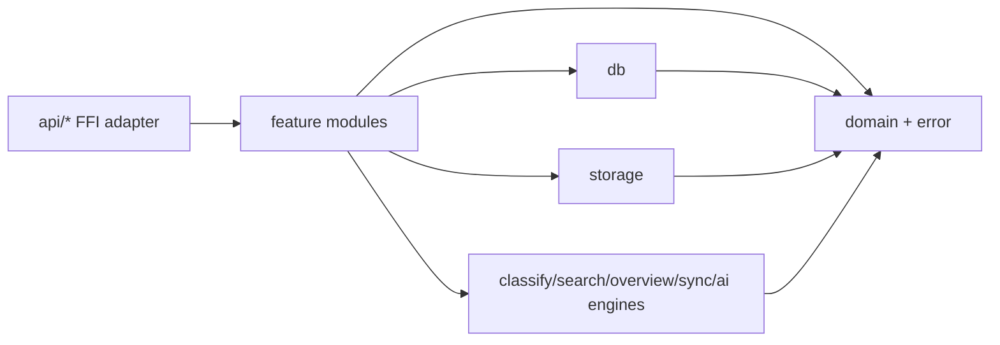

# Core 内部架构

> AreaMatrix Core 在四层架构中的 L1 层采用单 crate 优先、按能力拆模块、按稳定边界再拆 crate 的 Rust 后端结构。本文规定 Core 内部目录、依赖方向和后续功能插入方式。
>
> 阅读时长：约 10 分钟。

---

## 目标

Core 已经承担导入、分类、搜索、同步、AI、批量操作、恢复和 SQLite 元数据等能力。为了支持后续持续增加功能，Core 内部需要固定增长规则：

1. 新功能有明确落点，不继续向大文件和平级模块自然堆叠。
2. FFI 对外合同稳定，内部实现可以小步拆分。
3. 文件安全、DB 事务、平台无关性和测试边界可追踪。
4. 先在单 crate 内完成结构化，只有边界稳定后才拆 workspace crate。

这不是 Java 式 controller/service/dao 模板。Rust Core 的主要边界按“对外合同、业务用例、领域类型、持久化、文件系统能力、可复用引擎”划分。

## 目标结构

```text
core/src/
├── lib.rs                  # 轻量 module declaration 和必要 re-export
├── api/                    # UniFFI 对外门面；函数名与 UDL 合同保持一致
├── domain/                 # 领域类型、不变量、跨模块共享语义
├── error/                  # CoreError / CoreResult / error mapping
├── db/                     # SQLite schema、查询、事务、migration 边界
├── storage/                # 文件系统、staging、hash、安全移动、导入/删除/重命名
├── classify/               # 分类规则引擎
├── search/                 # 搜索、facet、saved search、ranking
├── overview/               # 自动概览生成
├── sync/                   # 外部变化回流与同步协调
├── batch_*/                # 批量操作用例，后续可收敛到 features/batch/*
├── ai_*/                   # AI 设置、隐私、执行、日志和建议用例
├── repo_*                  # repository 初始化、路径验证、扫描、修复用例
└── support/                # 未来纯工具模块：path/hash/time/validation 等
```

当前代码可以保留既有模块名逐步迁移。新增能力应优先按本结构落位；旧模块只有在无行为变化重构时才移动。

`db/` 目录继续按 SQLite 边界拆分，`db/mod.rs` 只作为 facade（门面）保留模块声明和
内部 re-export。共享 DB 基础设施按以下文件落位：

- `db/schema.rs`：初始 schema、schema version 和 migration helper。
- `db/connection.rs`：DB 路径、初始化检查、连接打开和 SQLite pragma。
- `db/repo_config.rs`：`repo_config` 读写、配置更新事务和配置写权限检查。
- `db/read_models.rs`：跨功能 read model，例如文件列表和 availability status。
- `db/codec.rs`：领域枚举与 DB 标量值之间的转换。

具体功能表和查询继续按能力放在 `db/import.rs`、`db/scan.rs`、`db/saved_search.rs`
等文件中；新增 DB 能力不要直接塞回 `db/mod.rs`。

当某个 DB 能力文件继续增长时，先在该能力名下拆子目录并保留同名 facade。例如
`db/scan.rs` 只声明 `db/scan/` 子模块并 re-export scan 查询能力；`db/scan/session.rs`
放 scan session 生命周期，`db/scan/files.rs` 放 scan/reindex 文件行读写，
`db/scan/codec.rs` 放 scan enum 与 DB 字符串转换，`db/scan/types.rs` 放该子域共享类型。
同样，`db/import_conflicts.rs` 保留 import conflict DB facade，schema 初始化、查询、
状态刷新、resolve、rollback、undo 和 JSON 编码分别放入
`db/import_conflicts/` 子模块，避免 import/staging 冲突处理的事务细节继续集中在
单个 DB 文件中。

非 DB 的大型用例模块同样遵循“同名 facade + 子目录”规则。例如 `repo_scan.rs`
只保留模块声明和对外 re-export，`repo_scan/session.rs` 放 adopt/reindex/resume
入口与扫描会话锁，`repo_scan/runner.rs` 放一次扫描执行流程，`repo_scan/files.rs`
放文件枚举、hash 和路径派生，`repo_scan/ignore.rs` 放 ignore 规则与 iCloud
占位符过滤，`repo_scan/preview.rs` 放 manual rescan 预览、缺失元数据和重复 hash
复核判断，`repo_scan/report.rs` 放报告转换，`repo_scan/types.rs` 放该用例共享的内部类型。
同一规则也适用于二级能力文件：例如 `import_conflict_batch/apply.rs` 只作为 apply
子域门面，具体拆到 `apply/execution.rs`、`apply/item.rs`、`apply/result.rs`、
`apply/rollback.rs`、`apply/detail.rs` 和特定策略模块，避免文件安全流程、DB 决策和
报告组装继续堆在同一个文件里。
AI 用例模块也遵循该规则：例如 `ai_summary/implementation.rs` 只 re-export
generate/save/clear 入口，生成流程、保存/清除元数据、provider route、privacy gate、
draft 组装和编码 helper 分别放到 `ai_summary/implementation/` 子模块，避免 AI 设置、
隐私、call log 和持久化流程在单个实现文件中继续耦合。
文件系统安全能力也按同样方式增长：例如 `storage/move_to_category.rs` 只保留
preview/move/correction 入口，repo-owned 实际移动、同分类校验、target 解析、sidecar
与 rollback guard、路径校验和 change detail 分别放入 `storage/move_to_category/`
子模块，避免分类移动的文件系统与 DB 一致性流程失去局部边界。

## 依赖方向



依赖规则：

- `api/*` 可以调用业务模块，但不承载业务流程、SQL、文件移动或平台探测。
- `domain` 和 `error` 不依赖 `api`、`db`、`storage` 或平台层。
- `db` 只处理 SQLite、schema、事务和行转换，不做用户文件移动。
- `storage` 只处理平台无关文件系统能力，不调用 macOS、SwiftUI、FSEvents、AppKit 或 UI。
- 功能模块编排用例，可以同时调用 `db`、`storage`、`classify`、`overview`、`sync` 等能力。
- 引擎模块应保持可测试和可复用，避免反向依赖 FFI 门面。
- 新的共享工具只有在两个以上模块真实复用时才进入 `support/`。

## 后端分层规则

AreaMatrix Core 不使用统一的 `controllers/`、`services/`、`repositories/` 目录作为主结构。
后续功能按能力落位，但每个能力内部必须满足清楚的分层职责：

| 层级 | 目录 / 文件 | 责任 | 不应承担 |
|---|---|---|---|
| API adapter | `src/api/**` | UniFFI 对外函数、rustdoc、轻量参数传递和错误返回 | SQL、文件移动、复杂业务决策 |
| Use case | `src/<feature>.rs`、`src/<feature>/**`、`src/batch_*`、`src/repo_*`、`src/ai_*` | 编排一条业务能力，决定调用顺序、确认 token、DB 与文件系统一致性 | 跨功能垃圾桶模块、隐藏高风险副作用 |
| Domain | `src/domain.rs`、`src/domain/**`、能力内 `types.rs` | 领域类型、不变量、跨模块共享语义 | SQLite row 细节、UI/FFI 适配 |
| Persistence | `src/db/**` | schema、query、transaction、row mapping、DB codec | 移动、删除、覆盖用户文件 |
| Filesystem | `src/storage/**`、能力内明确的 filesystem 子模块 | hash、staging、Trash、安全移动、路径校验、repo-owned 文件操作 | Core API 合同、UI 决策、平台专属 API |
| Engine | `src/classify/**`、`src/search/**`、`src/overview/**`、`src/sync/**`、AI provider route | 可复用算法、解析、排序、生成、同步规则 | 反向依赖 `api/` 或调用 Swift/macOS 能力 |
| Test support | `core/tests/support/**` | fixture、临时 repo、DB 断言、源码聚合、重复 helper | 被测业务实现、生产代码依赖 |

类比传统三层架构时，`api/` 近似 controller，能力模块近似 application service，
`db/` 近似 repository/DAO，`storage/` 是文件系统基础设施层。但这是职责类比，
不是目录命名要求。除非出现真实复用、替换或审计边界，不新增通用 `services/`
或 `repositories/` 聚合目录。

## API 门面规则

`api/` 是 UniFFI 对外门面（adapter，适配层），不是业务层。它负责：

- 保持 UDL 函数名、参数和返回类型稳定。
- 承载 public rustdoc，说明 FFI 合同、安全边界和错误语义。
- 做轻量参数传递、错误返回和模块分发。
- 将真实执行交给 `repo_*`、`storage`、`batch_*`、`ai_*`、`search`、`sync` 等模块。

`api/` 不应：

- 直接写 SQL。
- 直接执行复杂文件移动、删除、覆盖、Trash 或 staging 流程。
- 隐藏跨功能副作用。
- 为了 UI 便利合并多个需要确认的高风险操作。
- 引入平台特定 API 或假设调用线程。

当 `docs/api/core-api.md` 或 `core/area_matrix.udl` 需要新增函数时，先更新 API 源事实，再在 `api/` 增加对应门面函数，最后补实现和测试。

## 功能模块规则

功能模块（use case，用例模块）负责一条业务能力的编排，例如导入、批量重命名、AI 摘要、缺失文件恢复、同步冲突解决。它们可以包含：

- 输入验证和确认 token 校验。
- 对 `db` 与 `storage` 的事务顺序编排。
- 对 `overview`、`change_log`、`undo/redo`、AI call log 等相邻能力的显式调用。
- 面向测试的小函数和内部类型。

功能模块不应把所有能力抽象成一套统一接口。当前只有一个实现时，不引入工厂、策略或 trait；只有出现真实替换需求、测试隔离需求或跨平台实现差异时再抽象。

## 新增功能落位模板

新增 Core 能力前，先按以下顺序判定落点。这个模板用于普通 feature、批量能力、
AI 能力、同步能力和修复能力；高风险功能仍按根 `AGENTS.md` 先说明影响、风险、
验证和回滚。

1. **判断是否对外暴露**
   - 新增、删除、重命名公开函数：先更新 `docs/api/core-api.md`，再更新
     `core/area_matrix.udl`，最后实现 `src/api/**`、Rust 模块和 Swift bridge。
   - 只改内部能力：不碰 `docs/api/core-api.md` 和 `core/area_matrix.udl`，在现有
     feature 模块内落位。

2. **选择 use case 入口**
   - 已有能力扩展：优先进入现有 `src/<feature>.rs` 或 `src/<feature>/**`。
   - 新的一条业务能力：新增 `src/<feature>.rs` 作为 facade；如果预计超过约 300 行
     或包含 DB、文件系统、AI、undo/redo、failure recovery 中任意两个以上边界，
     直接采用 `src/<feature>/` 子目录。
   - 批量能力：优先沿用 `batch_*` 现有命名；只有后续批量域稳定后再考虑整体收敛。
   - repo 生命周期能力：优先放入 `repo_*` 或 `repo_<verb>/`。
   - AI 能力：按 `ai_<capability>/` 或既有 AI 模块落位，并显式拆出 privacy、route、
     metadata、generation/call-log 边界。

3. **决定 DB 与 storage 边界**
   - 需要新表、schema、migration 或复杂查询：放入 `src/db/<feature>.rs`；增长后拆为
     `src/db/<feature>/{schema,queries,types,codec,...}.rs`。
   - 需要移动、删除、重命名、Trash、staging、hash 或 rollback guard：放入
     `src/storage/<capability>.rs` 或 use case 内明确的 filesystem 子模块。
   - 需要 DB 与文件系统一致性：由 use case 编排顺序，不让 DB 层偷偷改文件，也不让
     storage 层偷偷改业务状态。

4. **决定共享与抽象**
   - 只有一个调用点时，先放在当前模块私有函数。
   - 两个以上生产模块真实复用时，再进入 `src/support/`、`src/domain/` 或更稳定的
     engine 模块。
   - 不为“未来可能需要”新增 trait、factory、strategy、service registry。
   - 测试 helper 只能进入 `core/tests/support/**`，生产代码不能依赖它。

5. **决定测试文件**
   - 对外 API 合同：`core/tests/<feature>_contract_api.rs`。
   - 真实行为实现：`core/tests/<feature>_implementation.rs`。
   - 失败、回滚、权限、DB 错误、文件安全：`core/tests/<feature>_failure_recovery.rs`。
   - 文档 / API / UDL / control map / 覆盖证据：`core/tests/<feature>_validation.rs`。
   - 跨 API 或 UI 消费链路：`core/tests/<feature>_integration_verify.rs`。
   - 重复 fixture 和断言：`core/tests/support/<feature>.rs`，但不得搬入被测业务逻辑。

6. **选择验证**
   - Rust Core 行为或测试改动：运行 `cargo fmt --all -- --check`、
     `cargo clippy --all-targets --all-features -- -D warnings`、`cargo test --workspace`。
   - Core 文档或低风险元数据：至少运行 `cd core && cargo metadata --no-deps`，
     并运行 `git diff --check`。
   - API/UDL 改动：额外检查 `docs/api/core-api.md`、`core/area_matrix.udl`、Rust
     API 门面和 Swift bridge 是否一致。

## DB 与 Storage 边界

`db/` 是元数据真相的持久化边界：

- 允许打开 SQLite、初始化 schema、执行 migration、读写表、管理事务。
- 不允许移动、删除、重命名或覆盖用户文件。
- 不允许调用 `api/`。

`storage/` 是文件系统物化视图的安全边界：

- 允许读写 AreaMatrix-owned metadata、staging、hash、导入目标、Trash 或安全移动。
- 必须遵守“不移动、不重命名、不删除、不覆盖未确认用户原文件”的不变量。
- 需要 DB 一致性时，由功能模块或明确的事务函数编排，不把隐藏副作用散落到调用方看不见的位置。

Undo / redo history 也遵循同一边界：`db/undo*` 和 `db/redo*` 只负责 action row、
summary / inverse JSON、状态更新和 redo stack 清理；`undo/**`、`redo/**` 负责执行
编排和失败恢复流程；实际文件移动、Trash 调用、rollback guard 和 recovery staging
只能放在 `storage/**` 或由其导出的安全 helper 中。

## 测试落点

测试继续按合同、实现、失败恢复、验证、集成回归的粒度组织。后续可以增加：

```text
core/tests/support/
```

测试支撑层只放 fixture、临时资料库构造、断言工具和重复数据准备，不承载业务实现。生产代码不得依赖 `tests/support`。

测试拆分门槛与生产代码一致：单个测试文件接近 500 行时，优先把重复 fixture、
DB 查询、源码聚合或断言 helper 移入 `core/tests/support/**`。但测试主体仍应保留
场景叙事和关键断言，不能把测试意图藏进 helper。

## 拆分门槛

新增或修改模块时按以下门槛处理：

- 文件超过约 300 行且仍在增长：先识别子职责，准备同名 facade + 子目录。
- 文件接近 500 行：必须拆分或说明为什么无法安全拆分。
- 单个函数超过约 50 行：优先抽出命名清楚的小函数，或把输入组合成内部类型。
- 嵌套超过 3 层：优先使用 early return、局部 helper 或状态对象降低分支复杂度。
- 同一段 fixture、DB 查询、路径构造或 JSON 断言在两个测试文件出现：放入
  `core/tests/support/**`。
- 只有一个实现、一个调用点、一个测试场景时，不为了“架构完整”提前抽象。

拆分必须保持行为不变，并优先保留原 public 路径、crate 内 re-export 或测试源码聚合
所需的可读入口。拆分后至少运行与影响面匹配的验证。

## 何时拆多 crate

当前阶段保持单 crate。只有满足以下条件之一，才考虑 workspace 多 crate：

- 某个边界已经稳定，并且需要被其他二进制、工具或平台独立复用。
- 编译时间、feature flag 或依赖体积已经明显影响日常开发。
- 某个组件需要独立发布、独立测试或独立安全审计。
- FFI/bindings、DB、storage、test support 的边界已经稳定到可以独立版本化。

潜在候选包括：

- `area_matrix_db`
- `area_matrix_storage`
- `area_matrix_test_support`
- `area_matrix_ffi`

在这些条件出现前，只做单 crate 内部模块化，避免过早把内部调用成本变成跨 crate API 成本。

## 迁移策略

既有代码按低风险顺序迁移：

1. 先补齐本文档和导航，确立新增功能落点。
2. 拆分 `api.rs` 为 `api/mod.rs` 与按 surface 分组的子模块，不改变 UDL 和公开函数名。
3. 拆分 `domain.rs`、`error.rs`、`db/mod.rs` 等聚合文件，优先保持 re-export 和类型路径兼容；已拆出的聚合边界继续以 `domain/`、`error/` 目录维护。
4. 把重复 fixture 收敛到测试支撑层。
5. 后续每个新功能必须按本文结构落位；旧代码只在相关功能修改时顺手做小步无行为变化整理。

每一步都必须运行与影响面匹配的验证。涉及 Core API、UDL、Swift bridge 的破坏性变化仍属于高风险边界，必须先确认。

## Related

- [overview.md](overview.md)
- [layered-design.md](layered-design.md)
- [ffi-design.md](ffi-design.md)
- [data-model.md](data-model.md)
- [transactional-import.md](transactional-import.md)
- [../api/core-api.md](../api/core-api.md)
- [../development/coding-standards.md](../development/coding-standards.md)
