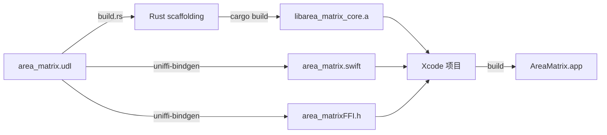

# FFI 桥接设计（Rust ↔ Swift via UniFFI）

> AreaMatrix 通过 UniFFI 桥接 Rust core 与 Swift app。本文给出 UDL 编写规范、类型映射、错误处理、构建流程、调试技巧。
>
> 阅读时长：约 7 分钟。

---

## 为什么选 UniFFI

详见 [../adr/0002-uniffi-vs-others.md](../adr/0002-uniffi-vs-others.md)。

简短理由：工业级、跨语言扩展性、类型支持完备、Mozilla 长期维护。

---

## 工作流程



构建脚本：`scripts/build-core.sh`，详见 [../development/build.md](../development/build.md)。

---

## UDL 接口定义

文件：`core/area_matrix.udl`

```idl
namespace area_matrix {
  // 简单工具
  string get_version();

  // 仓库初始化
  [Throws=CoreError]
  void init_repo(string repo_path);

  [Throws=CoreError]
  RepoConfig load_config(string repo_path);

  [Throws=CoreError]
  void update_config(string repo_path, RepoConfig new_config);

  // 分类预测（导入前用）
  [Throws=CoreError]
  ClassifyResult predict_category(string repo_path, string filename);

  // 导入文件
  [Throws=CoreError]
  FileEntry import_file(string repo_path, string source_path, ImportOptions options);

  // 列出
  [Throws=CoreError]
  sequence<FileEntry> list_files(string repo_path, FileFilter filter);

  // 改动日志
  [Throws=CoreError]
  sequence<ChangeLogEntry> list_changes(string repo_path, ChangeFilter filter);

  // 树状图
  [Throws=CoreError]
  string list_tree_json(string repo_path, string locale);

  // 笔记
  [Throws=CoreError]
  string? read_note(string repo_path, i64 file_id);

  [Throws=CoreError]
  void write_note(string repo_path, i64 file_id, string content_md);

  // 同步外部变化
  [Throws=CoreError]
  SyncResult sync_external_changes(string repo_path, sequence<ExternalEvent> events);

  // 启动维护
  [Throws=CoreError]
  RecoveryReport recover_on_startup(string repo_path);

  // 重新索引
  [Throws=CoreError]
  ReindexReport reindex_from_filesystem(string repo_path);
};

// ============== 类型 ==============

dictionary FileEntry {
  i64 id;
  string path;
  string original_name;
  string current_name;
  string category;
  i64 size_bytes;
  string hash_sha256;
  StorageMode storage_mode;
  string? source_path;
  i64 imported_at;
  i64 updated_at;
};

enum StorageMode { "Moved", "Copied", "Indexed" };

dictionary ImportOptions {
  StorageMode mode;
  string? override_category;       // 用户在 ImportSheet 修改的分类
  string? override_filename;       // 用户修改的目标文件名
  DuplicateStrategy duplicate_strategy;
};

enum DuplicateStrategy {
  "Skip",
  "Overwrite",
  "KeepBoth",
  "Ask"  // Ask = Core 返回 DuplicateFile error，由 UI 决策
};

dictionary ClassifyResult {
  string category;
  string suggested_name;
  ClassifyReason reason;
  f32 confidence;  // 0.0 ~ 1.0
};

enum ClassifyReason { "Keyword", "Extension", "AiPredicted", "Default" };

dictionary FileFilter {
  string? category;
  boolean? include_deleted;
  i64? imported_after;
  i64? imported_before;
  i64 limit;
  i64 offset;
};

dictionary ChangeFilter {
  i64? file_id;
  string? action;
  i64? since;
  i64 limit;
};

enum ChangeAction {
  "Imported",
  "Renamed",
  "Moved",
  "EditedNote",
  "Deleted",
  "Restored",
  "ExternalModified"
};

dictionary ChangeLogEntry {
  i64 id;
  i64? file_id;
  ChangeAction action;
  string detail_json;
  i64 occurred_at;
};

dictionary RepoConfig {
  string repo_path;
  StorageMode default_mode;
  boolean ai_enabled;
  string locale;  // "zh-CN" | "en"
  boolean icloud_warn;
};

dictionary ExternalEvent {
  string path;
  ExternalEventKind kind;
  i64 fs_event_id;
};

enum ExternalEventKind { "Created", "Removed", "Modified", "Renamed" };

dictionary SyncResult {
  i64 detected_creates;
  i64 detected_renames;
  i64 detected_deletes;
  i64 detected_modifies;
  sequence<string> errors;
};

dictionary RecoveryReport {
  i64 cleaned_staging_files;
  i64 reverted_staging_db_rows;
  sequence<string> warnings;
};

dictionary ReindexReport {
  i64 inserted;
  i64 updated;
  i64 skipped;
  sequence<string> errors;
};

// ============== 错误 ==============

[Error]
enum CoreError {
  "Io",                  // 底层 IO 失败
  "Db",                  // SQLite 失败
  "Config",              // 配置错误
  "Classify",            // 分类失败
  "Conflict",            // 路径冲突
  "DuplicateFile",       // 同 hash 已存在
  "FileNotFound",        // 文件不存在
  "RepoNotInitialized",  // 资料库未初始化
  "InvalidPath",         // 路径不合法
  "ICloudPlaceholder",   // 占位符未下载
  "PermissionDenied",    // 权限不足
  "Internal"             // 兜底
};
```

---

## 类型映射

| Rust | UDL | Swift |
|---|---|---|
| `String` | `string` | `String` |
| `bool` | `boolean` | `Bool` |
| `i64` | `i64` | `Int64` |
| `i32` | `i32` | `Int32` |
| `f32` | `f32` | `Float` |
| `Option<T>` | `T?` | `T?` |
| `Vec<T>` | `sequence<T>` | `[T]` |
| `HashMap<K,V>` | `record<K,V>` | `[K: V]` |
| `struct` | `dictionary` | `struct` |
| `enum`（无关联值） | `enum` | `enum`（lowerCamelCase 命名） |
| `Result<T, E>` | `[Throws=E] T` | `throws -> T` |

注意：UDL 的 enum 在 Swift 里是 **lowerCamelCase**，例如 Rust 的 `StorageMode::Moved` → Swift 的 `.moved`。

---

## Rust 侧实现

### 入口结构

```rust
// core/src/lib.rs
uniffi::include_scaffolding!("area_matrix");

mod api;
mod domain;
mod error;
mod config;
mod classify;
mod storage;
mod overview;
mod tree;
mod sync;
mod db;

pub use api::*;
pub use domain::*;
pub use error::CoreError;
```

### api.rs 模式

```rust
// core/src/api.rs
use crate::{domain::*, error::*, storage, classify, sync, db};

pub fn get_version() -> String {
    env!("CARGO_PKG_VERSION").to_string()
}

pub fn import_file(
    repo_path: String,
    source_path: String,
    options: ImportOptions,
) -> CoreResult<FileEntry> {
    let repo_path = std::path::PathBuf::from(repo_path);
    let source_path = std::path::PathBuf::from(source_path);
    storage::import_file(&repo_path, &source_path, options)
}
```

### 错误传播

```rust
// core/src/error.rs
use thiserror::Error;

#[derive(Error, Debug)]
pub enum CoreError {
    #[error("io error: {0}")]
    Io(String),

    #[error("db error: {0}")]
    Db(String),

    #[error("classification failed: {0}")]
    Classify(String),

    // ... 其他变体对应 UDL Error enum
}

impl From<std::io::Error> for CoreError {
    fn from(e: std::io::Error) -> Self {
        CoreError::Io(e.to_string())
    }
}

impl From<rusqlite::Error> for CoreError {
    fn from(e: rusqlite::Error) -> Self {
        CoreError::Db(e.to_string())
    }
}

pub type CoreResult<T> = Result<T, CoreError>;
```

UniFFI 会把 Rust 的 enum 变体名映射到 Swift 的 case，UDL 的 `[Error]` 标记自动让 Swift 抛 throws。

---

## Swift 侧使用

### 自动生成的类型

```swift
// area_matrix.swift（自动生成，不要手改）
public enum StorageMode: Equatable, Hashable {
    case moved
    case copied
    case indexed
}

public struct FileEntry {
    public let id: Int64
    public let path: String
    public let originalName: String
    public let currentName: String
    public let category: String
    public let sizeBytes: Int64
    public let hashSha256: String
    public let storageMode: StorageMode
    public let sourcePath: String?
    public let importedAt: Int64
    public let updatedAt: Int64
}

public enum CoreError: Error {
    case io(message: String)
    case db(message: String)
    // ...
}

public func importFile(
    repoPath: String,
    sourcePath: String,
    options: ImportOptions
) throws -> FileEntry { /* ... */ }
```

### CoreBridge 包装

直接调 UniFFI 生成函数有几个不便：
1. 函数全是 free function，不便于组织
2. 路径都是 `String`，UI 用 `URL` 不直观
3. 同步函数会阻塞主线程

`CoreBridge` 解决这些问题：

```swift
// apps/macos/AreaMatrix/Bridge/CoreBridge.swift
@MainActor
public final class CoreBridge {
    private let repoURL: URL

    public init(repoURL: URL) {
        self.repoURL = repoURL
    }

    public func importFile(
        from sourceURL: URL,
        options: ImportOptions
    ) async throws -> FileEntry {
        let repoPath = self.repoURL.path
        let sourcePath = sourceURL.path
        return try await Task.detached(priority: .userInitiated) {
            try area_matrix.importFile(
                repoPath: repoPath,
                sourcePath: sourcePath,
                options: options
            )
        }.value
    }

    public func listFiles(filter: FileFilter) async throws -> [FileEntry] {
        let repoPath = self.repoURL.path
        return try await Task.detached(priority: .userInitiated) {
            try area_matrix.listFiles(repoPath: repoPath, filter: filter)
        }.value
    }

    // ... 其他方法
}
```

UI 层只用 CoreBridge，不直接 `import area_matrix`。

---

## 异步与线程安全

### Core 函数的线程要求

- Core 函数**默认同步**且**线程安全**（没有全局可变状态）
- SQLite Connection 不是 Send，因此每次调用内部新建（轻量）或用 thread-local
- 长耗时操作（hash 大文件、tree 扫描）应在 Swift 侧用 `Task.detached` 调用，避免阻塞主线程

### 异步设计（Stage 2 起）

UniFFI 0.28+ 支持 `[Async]` 标记将 Rust async fn 暴露为 Swift async：

```idl
[Async, Throws=CoreError]
ReindexReport reindex_from_filesystem(string repo_path);
```

```rust
pub async fn reindex_from_filesystem(repo_path: String) -> CoreResult<ReindexReport> {
    // ... tokio::task::spawn_blocking ...
}
```

```swift
let report = try await reindexFromFilesystem(repoPath: ...)
```

MVP 阶段全部用同步函数 + Swift 侧 `Task.detached`，简单足够。

---

## 性能注意事项

### 边界开销

每次 FFI 调用有固定开销（~1-10μs，含序列化）。注意：

- **不要在 hot loop 里跨边界**：例如不要每个文件单独调一次 import，而是在 Rust 侧批量处理
- **大列表用 sequence + 分页**：list_files 用 `limit/offset` 而不是一次返回所有
- **避免大字符串重复传递**：tree JSON 一次拿完整结构在 Swift 缓存，过滤在 Swift 做

### 字符串拷贝

UDL 的 `string` 在边界处复制。如果某 API 频繁调用且字符串很大（比如 README 内容），考虑改成传 file_id + Rust 侧读文件。

---

## 调试技巧

### Rust 侧日志可见

Swift 侧初始化 tracing：

```swift
@main
struct AreaMatrixApp: App {
    init() {
        try? area_matrix.initLogging(level: "info")
    }
    // ...
}
```

UDL 加：

```idl
[Throws=CoreError]
void init_logging(string level);
```

Rust 实现把 tracing 输出到 OSLog 或 stdout（开发期）。

### 崩溃排查

- Rust panic 会被 UniFFI 捕获并转为 `CoreError::Internal`
- 但要避免 panic 进入业务路径，所有 fallible 操作走 `Result`

### binding 查看

每次 `build-core.sh` 后，看 `apps/macos/AreaMatrix/Bridge/Generated/area_matrix.swift` 确认生成的 API 符合预期。

---

## UDL 编写规范

| 规则 | 说明 |
|---|---|
| `dictionary` 字段名用 snake_case | 自动转 Swift camelCase |
| `enum` 变体名用 PascalCase | 自动转 Swift lowerCamelCase |
| 函数名用 snake_case | 自动转 Swift camelCase |
| Optional 用 `T?` | 不用 sequence<T> 表 0/1 |
| 返回 `Result<T,E>` 用 `[Throws=E] T` | 不要用 enum 包裹 |
| 函数参数 ≤ 5 个 | 多了用 dictionary 封装 |
| dictionary 字段 ≤ 15 个 | 多了拆分 |

## Related

- [overview.md](overview.md)
- [layered-design.md](layered-design.md)
- [concurrency.md](concurrency.md)
- [../api/core-api.md](../api/core-api.md)
- [../api/uniffi-recipes.md](../api/uniffi-recipes.md)
- [../adr/0002-uniffi-vs-others.md](../adr/0002-uniffi-vs-others.md)
- [../development/build.md](../development/build.md)
