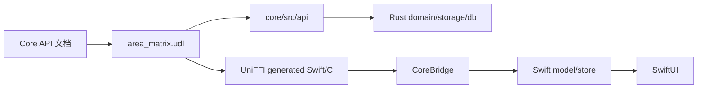

# FFI 设计

> 记录 Rust Core、UniFFI UDL、生成绑定和 Swift `CoreBridge` 之间的现行边界。
>
> 阅读时长：约 5 分钟。

---

## 权威顺序

公开 Core 合同按以下顺序维护：

1. [Core API](../api/core-api.md)：行为、输入输出、副作用和错误。
2. `core/area_matrix.udl`：跨语言类型与函数签名。
3. `core/src/api/**`：Rust FFI 门面。
4. `core/src/**`：平台无关实现。
5. `apps/macos/AreaMatrix/Bridge/CoreBridge*.swift`：平台调用适配。
6. `apps/macos/AreaMatrix/Bridge/{Generated,UniFFI}/`：生成物。

本文件不内嵌第二份 UDL。完整签名只以 `core/area_matrix.udl` 为准，避免文档副本漂移。

## 分层


```mermaid
flowchart LR
    docs["Core API 文档"] --> udl["area_matrix.udl"]
    udl --> rustApi["core/src/api"]
    rustApi --> core["Rust domain/storage/db"]
    udl --> generated["UniFFI generated Swift/C"]
    generated --> bridge["CoreBridge"]
    bridge --> model["Swift model/store"]
    model --> ui["SwiftUI"]
```

- Core 不依赖 AppKit、SwiftUI、FSEvents、NSWorkspace 或 security-scoped bookmark。
- UDL 只表达稳定 DTO、enum、error 和函数，不承载业务流程说明。
- `core/src/api/**` 保持薄门面，不放 SQL 或复杂文件操作。
- Swift 业务代码必须经过 `CoreBridge`，不直接调用生成 UniFFI 函数。
- 平台文件监听、iCloud 下载、Finder reveal、权限处理，以及 Trash availability probe / 危险确认 / UI
  留在 Swift 平台层。确认后的实际 Trash mutation、DB/change log/Undo 写入和失败回滚属于 Core；Core
  通过平台中立实现完成该操作，不依赖 AppKit 或 SwiftUI。

## 生成流程

`core/build.rs` 从仓库根下的 `core/area_matrix.udl` 生成 Rust scaffolding。macOS 开发工具默认把本地验证
产物写入被忽略的 `Bridge/Generated/`；显式 bindings update 才更新 Xcode 消费并纳入版本控制的
`Bridge/UniFFI/`。

```bash
./dev build core
./dev bindings verify
```

`./dev bindings verify` 是只读漂移检查。需要更新绑定时使用仓库提供的明确 update 命令，再审查生成 diff；
不要手工修补生成 Swift 或 C header。

## 调用与线程

UDL 函数是同步 FFI 合同，当前不使用 UniFFI `[Async]`。Swift `CoreBridge` 是 actor；涉及文件 IO、DB、
hash、reindex 等重工作的方法通常从 actor 内通过 `Task.detached` 调用同步绑定，页面模型在更新 UI 状态时
回到 main actor。Core 不持有 SwiftUI 状态，也不回调平台 UI。

结构化可观测性是受控的反向 callback 例外：`initialize_observability` 注册非 UI 的
`CoreObservabilitySink`，`update_observability_config`、`get_observability_health` 和
`flush_observability` 管理进程级 runtime。Core 在 source redaction 后把事件放入有界优先级队列，由独立
delivery worker 交给具备 1 秒 deadline 的 callback worker；callback 不得同步等待 MainActor、SwiftUI 或文件
writer。Swift `CoreObservabilitySinkAdapter` 再通过自己的有界 ingress 将事件异步交给 `ObservabilityHub`，
因此 Core callback 生命周期、平台落盘和 UI 投影彼此隔离。

需要端到端因果关联的 observed API 显式接收 `CoreTraceContext`。当前
`import_file_observed` 和 `import_file_with_result_observed` 使用独立、必填的 context 参数；兼容 import API
不携带 context，也不依赖 thread-local 穿过 `Task.detached`。

跨 FFI 的长流程使用可恢复的小调用、report DTO 和持久化 session/cursor，不跨调用持有 SQLite
transaction。

## 类型与错误

稳定类型映射：

| UDL | Swift |
|---|---|
| `string` | `String` |
| `boolean` | `Bool` |
| `i64` | `Int64` |
| `f32` | `Float` |
| `T?` | `Optional<T>` |
| `sequence<T>` | `[T]` |
| `dictionary` | Swift struct |

UDL enum case 映射为 Swift lowerCamelCase；snake_case 字段和函数映射为 Swift camelCase；
`[Throws=CoreError]` 映射为 Swift `throws`。

- DTO 字段必须使用 UniFFI 支持的稳定类型。
- optional、sequence 和 enum 的业务语义先在 Core API 中说明。
- Rust 可恢复失败通过 `CoreError` 返回，不使用 panic 穿过 FFI。
- Swift 在 `CoreBridge` 中映射 Core error，再由页面模型生成用户文案和恢复动作。
- 新增或删除公开函数必须同步 Core API、UDL、Rust re-export、Swift bridge 和 bindings。

## 兼容性

破坏性 UDL 变化属于高风险变更，至少需要：

- 调用方清单和迁移方式。
- 旧生成绑定不兼容的明确说明。
- Core contract test、bindings verify、Rust 全量和 macOS build/test。
- 回滚到旧 UDL/绑定/实现的单一 commit 边界。

平台能力差异通过 `get_platform_capabilities` 等显式合同表达，不能让 Core 猜测当前宿主平台。

## Related

- [../api/core-api.md](../api/core-api.md)
- [layered-design.md](layered-design.md)
- [core-internal-architecture.md](core-internal-architecture.md)
- [macos-frontend-architecture.md](macos-frontend-architecture.md)
- [../api/uniffi-recipes.md](../api/uniffi-recipes.md)
