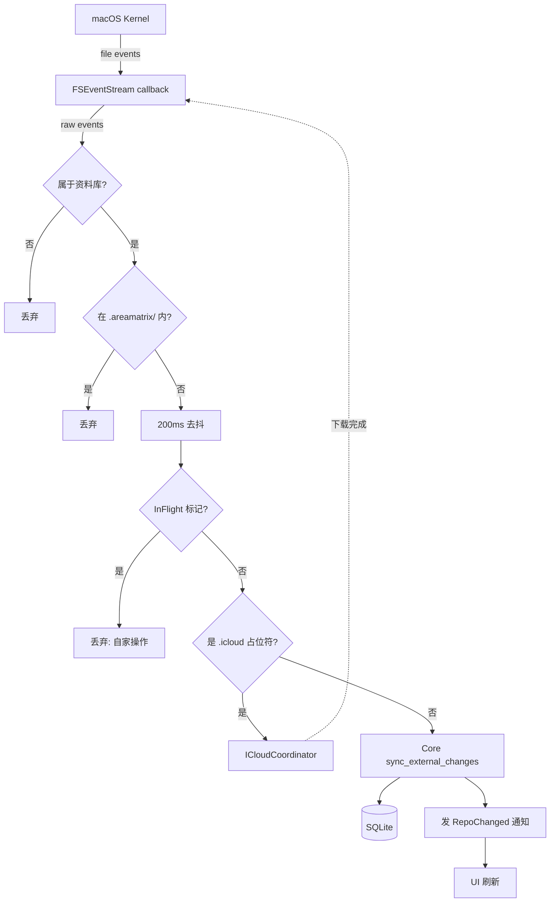
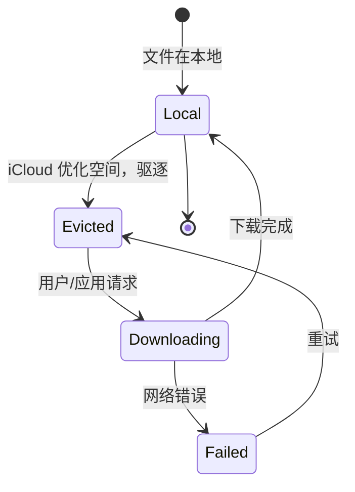
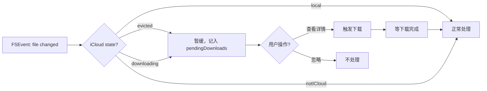
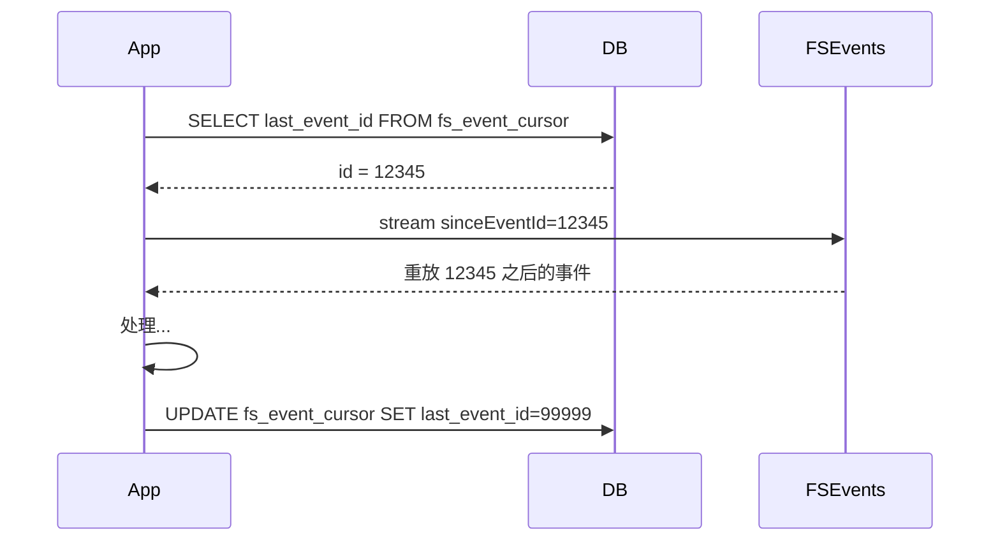
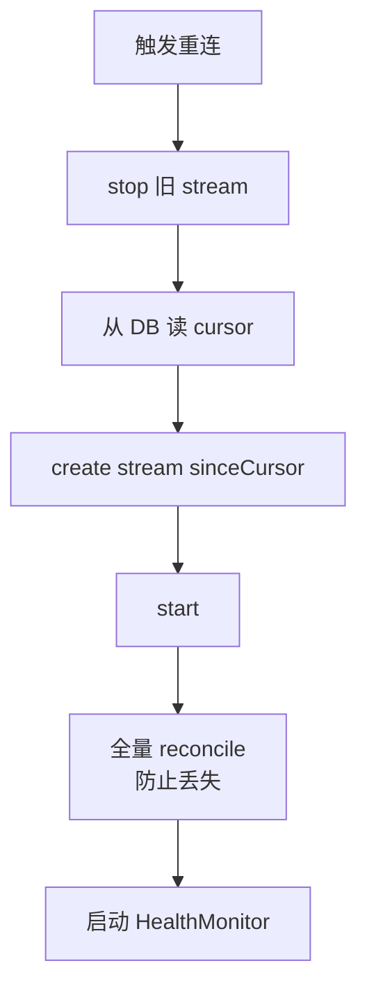

# 文件系统监听设计（FSEventStream + iCloud）

> 用户在 Finder / 终端 / 同步工具中对资料库的修改必须能被应用感知并同步到 DB 和 UI。本文给出 FSEvents 监听、去抖、自家事件过滤、iCloud 占位符状态机、断线重连流程的完整设计。
>
> 阅读时长：约 14 分钟。

---

## 设计目标

1. 在 Finder / 终端中改资料库文件，UI 1 秒内更新
2. 应用自身的写操作不引起处理循环
3. iCloud 占位符可用且不阻塞 UI
4. 关闭应用期间发生的变化在重启后能补回
5. 高频事件（拖拽几百个文件）不会触发雪崩
6. FSEventStream 异常断开时能恢复

---

## 完整流程图



---

## FSEventStream 配置

```swift
// apps/macos/AreaMatrix/Watcher/FSWatcher.swift
import Foundation
import CoreServices

public final class FSWatcher {
    private var stream: FSEventStreamRef?
    private let repoPath: String
    private var sinceEventId: FSEventStreamEventId
    private let onEvents: ([FSRawEvent]) -> Void
    private let onMustRescan: () -> Void
    private let onRootChanged: () -> Void
    private let healthMonitor = HealthMonitor()

    public init(
        repoPath: String,
        sinceEventId: FSEventStreamEventId,
        onEvents: @escaping ([FSRawEvent]) -> Void,
        onMustRescan: @escaping () -> Void,
        onRootChanged: @escaping () -> Void
    ) {
        self.repoPath = repoPath
        self.sinceEventId = sinceEventId
        self.onEvents = onEvents
        self.onMustRescan = onMustRescan
        self.onRootChanged = onRootChanged
    }

    public func start() {
        var context = FSEventStreamContext(
            version: 0,
            info: Unmanaged.passUnretained(self).toOpaque(),
            retain: nil, release: nil, copyDescription: nil
        )
        let flags: FSEventStreamCreateFlags =
            UInt32(kFSEventStreamCreateFlagFileEvents) |
            UInt32(kFSEventStreamCreateFlagUseCFTypes) |
            UInt32(kFSEventStreamCreateFlagUseExtendedData) |
            UInt32(kFSEventStreamCreateFlagWatchRoot) |
            UInt32(kFSEventStreamCreateFlagNoDefer)

        stream = FSEventStreamCreate(
            kCFAllocatorDefault,
            { (_, info, count, paths, flags, ids) in
                let watcher = Unmanaged<FSWatcher>.fromOpaque(info!).takeUnretainedValue()
                watcher.handleRawEvents(count: count, paths: paths, flags: flags, ids: ids)
            },
            &context,
            [repoPath] as CFArray,
            sinceEventId,
            0.2,
            flags
        )
        guard let stream = stream else { return }
        FSEventStreamSetDispatchQueue(stream, .global(qos: .utility))
        FSEventStreamStart(stream)
        healthMonitor.start { [weak self] in self?.recover() }
    }

    public func stop() {
        guard let stream = stream else { return }
        FSEventStreamStop(stream)
        FSEventStreamInvalidate(stream)
        FSEventStreamRelease(stream)
        self.stream = nil
        healthMonitor.stop()
    }

    private func handleRawEvents(
        count: Int,
        paths: UnsafeMutableRawPointer,
        flags: UnsafePointer<FSEventStreamEventFlags>,
        ids: UnsafePointer<FSEventStreamEventId>
    ) {
        let pathsArr = unsafeBitCast(paths, to: NSArray.self) as! [String]
        var batched: [FSRawEvent] = []
        for i in 0..<count {
            let f = flags[i]
            sinceEventId = max(sinceEventId, ids[i])

            if f & UInt32(kFSEventStreamEventFlagRootChanged) != 0 {
                onRootChanged()
                return
            }
            if f & UInt32(kFSEventStreamEventFlagMustScanSubDirs) != 0 {
                onMustRescan()
                return
            }
            if f & UInt32(kFSEventStreamEventFlagHistoryDone) != 0 {
                continue
            }
            batched.append(FSRawEvent(path: pathsArr[i], flags: f, eventId: ids[i]))
        }
        if !batched.isEmpty {
            onEvents(batched)
            healthMonitor.heartbeat()
        }
    }

    private func recover() {
        tracing("watcher silent for too long, restarting")
        stop()
        start()
    }
}

public struct FSRawEvent {
    public let path: String
    public let flags: FSEventStreamEventFlags
    public let eventId: FSEventStreamEventId
}
```

### 关键 flag 解释

| Flag | 作用 |
|---|---|
| `FileEvents` | 给细粒度的文件级事件而非目录级 |
| `UseCFTypes` | path 用 CFString 而非 char* |
| `UseExtendedData` | 提供 inode 用于检测 rename |
| `WatchRoot` | 资料库根本身被移动 / 重命名也通知 |
| `NoDefer` | 立即送事件，不等待 latency |

---

## InFlightTracker 完整实现

### 设计要求

1. 引用计数：同 path 多次 mark / unmark 不打架
2. TTL：异常路径 60s 自动失效，避免死锁外部同步
3. 线程安全：从任意 actor 调用都安全
4. 高频性能：mark/contains 必须 O(1)

### 实现

```swift
// apps/macos/AreaMatrix/Watcher/InFlightTracker.swift
import Foundation

public actor InFlightTracker {
    private struct Entry {
        var refCount: Int
        var expireAt: Date
    }

    private var paths: [String: Entry] = [:]
    private let ttl: TimeInterval
    private var sweepTask: Task<Void, Never>?

    public init(ttl: TimeInterval = 60) {
        self.ttl = ttl
        startSweeper()
    }

    deinit { sweepTask?.cancel() }

    public func mark(_ path: String) {
        if var e = paths[path] {
            e.refCount += 1
            e.expireAt = Date().addingTimeInterval(ttl)
            paths[path] = e
        } else {
            paths[path] = Entry(refCount: 1, expireAt: Date().addingTimeInterval(ttl))
        }
    }

    public func mark(_ paths: [String]) {
        for p in paths { mark(p) }
    }

    public func unmark(_ path: String) {
        guard var e = paths[path] else { return }
        e.refCount -= 1
        if e.refCount <= 0 {
            paths.removeValue(forKey: path)
        } else {
            e.expireAt = Date().addingTimeInterval(ttl)
            paths[path] = e
        }
    }

    public func contains(_ path: String) -> Bool {
        guard let e = paths[path] else { return false }
        if e.expireAt < Date() {
            paths.removeValue(forKey: path)
            return false
        }
        return true
    }

    public func filter(_ events: [FSRawEvent]) -> [FSRawEvent] {
        let now = Date()
        var kept: [FSRawEvent] = []
        kept.reserveCapacity(events.count)
        for event in events {
            if let e = paths[event.path], e.expireAt >= now {
                continue
            }
            kept.append(event)
        }
        return kept
    }

    private func startSweeper() {
        sweepTask = Task { [weak self] in
            while !Task.isCancelled {
                try? await Task.sleep(nanoseconds: 30 * NSEC_PER_SEC)
                await self?.sweep()
            }
        }
    }

    private func sweep() {
        let now = Date()
        paths = paths.filter { $0.value.expireAt >= now }
    }
}
```

### 使用模式

```swift
public actor CoreBridge {
    let tracker: InFlightTracker

    public func importFile(from src: URL, options: ImportOptions) async throws -> FileEntry {
        let staging = stagingPathFor(src)
        let final = expectedFinalPath(src, options)

        await tracker.mark([staging, final])
        defer {
            Task { await tracker.unmark(staging); await tracker.unmark(final) }
        }

        return try await Task.detached(priority: .userInitiated) {
            try AreaMatrix.importFile(repoPath: self.repoPath, sourcePath: src.path, options: options)
        }.value
    }

    public func writeNote(fileId: Int64, content: String) async throws {
        let entry = try await getFile(id: fileId)
        let notePath = "\(entry.path).md"

        await tracker.mark(notePath)
        defer { Task { await tracker.unmark(notePath) } }

        try await Task.detached {
            try AreaMatrix.writeNote(repoPath: self.repoPath, fileId: fileId, contentMd: content)
        }.value
    }
}
```

### 测试

```swift
final class InFlightTrackerTests: XCTestCase {
    func test_ref_counting() async {
        let tracker = InFlightTracker()
        await tracker.mark("/a")
        await tracker.mark("/a")
        XCTAssertTrue(await tracker.contains("/a"))
        await tracker.unmark("/a")
        XCTAssertTrue(await tracker.contains("/a"))
        await tracker.unmark("/a")
        XCTAssertFalse(await tracker.contains("/a"))
    }

    func test_ttl_expiration() async {
        let tracker = InFlightTracker(ttl: 0.1)
        await tracker.mark("/x")
        XCTAssertTrue(await tracker.contains("/x"))
        try? await Task.sleep(nanoseconds: 200_000_000)
        XCTAssertFalse(await tracker.contains("/x"))
    }

    func test_filter_drops_marked() async {
        let tracker = InFlightTracker()
        await tracker.mark("/a")
        let events = [
            FSRawEvent(path: "/a", flags: 0, eventId: 1),
            FSRawEvent(path: "/b", flags: 0, eventId: 2),
        ]
        let filtered = await tracker.filter(events)
        XCTAssertEqual(filtered.count, 1)
        XCTAssertEqual(filtered.first?.path, "/b")
    }
}
```

---

## Debouncer

### 实现（与上一版相同，简化）

```swift
public final class Debouncer {
    private let interval: TimeInterval
    private var pending: [String: FSRawEvent] = [:]
    private var workItem: DispatchWorkItem?
    private let queue: DispatchQueue
    private let onFlush: ([FSRawEvent]) -> Void
    private let lock = NSLock()

    public init(
        interval: TimeInterval = 0.2,
        queue: DispatchQueue = .global(qos: .utility),
        onFlush: @escaping ([FSRawEvent]) -> Void
    ) {
        self.interval = interval
        self.queue = queue
        self.onFlush = onFlush
    }

    public func enqueue(_ events: [FSRawEvent]) {
        lock.lock()
        for event in events {
            if let existing = pending[event.path] {
                pending[event.path] = FSRawEvent(
                    path: event.path,
                    flags: existing.flags | event.flags,
                    eventId: max(existing.eventId, event.eventId)
                )
            } else {
                pending[event.path] = event
            }
        }
        workItem?.cancel()
        let work = DispatchWorkItem { [weak self] in self?.flush() }
        workItem = work
        lock.unlock()
        queue.asyncAfter(deadline: .now() + interval, execute: work)
    }

    private func flush() {
        lock.lock()
        let snapshot = Array(pending.values)
        pending.removeAll()
        lock.unlock()
        if !snapshot.isEmpty { onFlush(snapshot) }
    }
}
```

200ms 是经验值；过短无效，过长用户感觉迟钝。

---

## iCloud 占位符状态机

### 占位符类型



### 状态查询

```swift
public enum ICloudState {
    case local
    case evicted
    case downloading(progress: Double)
    case uploading(progress: Double)
    case failed(error: Error)
    case notICloud
}

public extension URL {
    func iCloudState() throws -> ICloudState {
        let keys: Set<URLResourceKey> = [
            .isUbiquitousItemKey,
            .ubiquitousItemDownloadingStatusKey,
            .ubiquitousItemDownloadingErrorKey,
            .ubiquitousItemIsDownloadingKey,
            .ubiquitousItemIsUploadingKey,
            .ubiquitousItemUploadingErrorKey,
        ]
        let values = try resourceValues(forKeys: keys)
        guard values.isUbiquitousItem ?? false else { return .notICloud }

        if let err = values.ubiquitousItemDownloadingError as? Error {
            return .failed(error: err)
        }

        switch values.ubiquitousItemDownloadingStatus {
        case .current: return .local
        case .downloaded:
            if values.ubiquitousItemIsDownloading ?? false {
                return .downloading(progress: 0)
            }
            return .local
        case .notDownloaded: return .evicted
        default: return .evicted
        }
    }
}
```

### 触发下载 + 等待

```swift
// apps/macos/AreaMatrix/Watcher/ICloudCoordinator.swift
public final class ICloudCoordinator {
    public enum DownloadError: Error {
        case timeout
        case networkUnavailable
        case underlying(Error)
    }

    public func ensureDownloaded(
        at url: URL,
        timeout: TimeInterval = 30
    ) async throws {
        let state = try url.iCloudState()
        switch state {
        case .local, .notICloud: return
        case .failed(let e): throw DownloadError.underlying(e)
        default: break
        }

        try FileManager.default.startDownloadingUbiquitousItem(at: url)

        let deadline = Date().addingTimeInterval(timeout)
        while Date() < deadline {
            let s = try url.iCloudState()
            switch s {
            case .local: return
            case .failed(let e): throw DownloadError.underlying(e)
            default: try await Task.sleep(nanoseconds: 250_000_000)
            }
        }
        throw DownloadError.timeout
    }

    public func coordinatedRead<T>(
        at url: URL,
        _ body: (URL) throws -> T
    ) async throws -> T {
        try await ensureDownloaded(at: url)
        let coordinator = NSFileCoordinator(filePresenter: nil)
        var coordError: NSError?
        var result: Result<T, Error>?
        coordinator.coordinate(readingItemAt: url, options: [], error: &coordError) { coordinatedURL in
            do { result = .success(try body(coordinatedURL)) }
            catch { result = .failure(error) }
        }
        if let coordError = coordError { throw coordError }
        return try result!.get()
    }
}
```

### Sync 流程中的位置



### 限流

不要对每个占位符都立即触发下载（用户可能只是浏览，无需都下到本地）：

- Sync 处理时遇到 evicted 文件：跳过 hash 计算，仅按 path 入库（hash 留空，标记 `needs_hash`）
- 用户主动选中文件查看详情时再触发下载
- 设置中提供「全量下载」开关（默认关）

---

## Cursor 持久化（断点续传）



### 边界

- 首次启动：`fs_event_cursor` 表无数据 → 用 `kFSEventStreamEventIdSinceNow` + 全量 reconcile
- FSEvents 历史已被 OS 清理：得到 `MustScanSubDirs` flag → 触发 `reindex_from_filesystem`
- cursor 落后超过 24h：保守起见也触发 reconcile

### 保存频率

- 每批事件处理完保存一次
- 每 10s 强制 flush 一次（保险）

---

## 重连流程

### 触发场景

1. macOS 系统休眠唤醒后 FSEventStream 静默
2. 资料库被卸载（外接硬盘 / iCloud 临时下线）后重新挂载
3. 应用从后台切回前台
4. HealthMonitor 检测到长时间无事件

### HealthMonitor

```swift
public final class HealthMonitor {
    private var lastHeartbeat: Date = .now
    private var task: Task<Void, Never>?
    private let threshold: TimeInterval

    public init(threshold: TimeInterval = 30) {
        self.threshold = threshold
    }

    public func start(onSilent: @escaping () -> Void) {
        lastHeartbeat = .now
        task = Task { [weak self] in
            while !Task.isCancelled {
                try? await Task.sleep(nanoseconds: 5 * NSEC_PER_SEC)
                guard let self = self else { return }
                if Date().timeIntervalSince(self.lastHeartbeat) > self.threshold {
                    onSilent()
                    self.lastHeartbeat = .now
                }
            }
        }
    }

    public func heartbeat() { lastHeartbeat = .now }

    public func stop() { task?.cancel() }
}
```

### 重连流程



### 实现

```swift
public final class WatcherSupervisor {
    private var watcher: FSWatcher?
    private let coreBridge: CoreBridge
    private let repoPath: String

    public func startInitial() async throws {
        let cursor = try await coreBridge.getFsEventCursor() ?? .now
        startWatcher(sinceEventId: cursor)

        if try await coreBridge.getFsEventCursor() == nil {
            try await coreBridge.reconcileFull()
        }
    }

    public func reconnect() async throws {
        watcher?.stop()
        let cursor = try await coreBridge.getFsEventCursor() ?? .now
        let now = FSEventStreamEventId(kFSEventStreamEventIdSinceNow)
        let staleness = now > cursor ? now - cursor : 0
        startWatcher(sinceEventId: cursor)
        if staleness > 60 * 60 * 24 * 1_000_000 {
            try await coreBridge.reconcileFull()
        }
    }

    private func startWatcher(sinceEventId: FSEventStreamEventId) {
        watcher = FSWatcher(
            repoPath: repoPath,
            sinceEventId: sinceEventId,
            onEvents: { [weak self] events in
                Task { try? await self?.handleEvents(events) }
            },
            onMustRescan: { [weak self] in
                Task { try? await self?.coreBridge.reconcileFull() }
            },
            onRootChanged: { [weak self] in
                Task { await self?.notifyRootChanged() }
            }
        )
        watcher?.start()
    }
}
```

### 应用生命周期 hook

```swift
@MainActor
final class AppDelegate: NSObject, NSApplicationDelegate {
    let supervisor = WatcherSupervisor(...)

    func applicationDidFinishLaunching(_ note: Notification) {
        Task { try await supervisor.startInitial() }
        NSWorkspace.shared.notificationCenter.addObserver(
            self, selector: #selector(didWake),
            name: NSWorkspace.didWakeNotification, object: nil
        )
    }

    @objc func didWake() {
        Task { try await supervisor.reconnect() }
    }
}
```

---

## Sync 模块（Core 侧）

```rust
// core/src/sync/mod.rs
pub fn sync_external_changes(
    repo_path: &Path,
    events: Vec<ExternalEvent>,
) -> CoreResult<SyncResult> {
    let mut result = SyncResult::default();
    let paired = pair_events(&events);

    for unit in paired {
        match unit {
            EventUnit::Renamed(from, to) => handle_rename(repo_path, &from, &to, &mut result)?,
            EventUnit::Single(e) => match e.kind {
                ExternalEventKind::Created => handle_created(repo_path, &e, &mut result)?,
                ExternalEventKind::Removed => handle_removed(repo_path, &e, &mut result)?,
                ExternalEventKind::Modified => handle_modified(repo_path, &e, &mut result)?,
                ExternalEventKind::Renamed => unreachable!("paired"),
            }
        }
    }

    Ok(result)
}

fn pair_events(events: &[ExternalEvent]) -> Vec<EventUnit> {
    let mut by_hash: HashMap<String, ExternalEvent> = HashMap::new();
    let mut units = Vec::new();
    for e in events {
        match e.kind {
            ExternalEventKind::Created => {
                if let Ok(hash) = sha256_quick(&e.path) {
                    if let Some(removed) = by_hash.remove(&hash) {
                        units.push(EventUnit::Renamed(removed, e.clone()));
                        continue;
                    }
                    by_hash.insert(hash, e.clone());
                }
                units.push(EventUnit::Single(e.clone()));
            }
            _ => units.push(EventUnit::Single(e.clone())),
        }
    }
    units
}
```

详见 [source-of-truth.md](source-of-truth.md) 的 9 种场景。

---

## 边界情况清单

| 场景 | 行为 |
|---|---|
| 资料库根被移动 | 收到 RootChanged flag → 暂停 watcher，提示用户重新选择路径 |
| FSEvents 历史已清理 | 收到 MustScanSubDirs flag → 触发 reindex_from_filesystem |
| 拖动 1000 个文件 | 200ms 去抖 + 批量 sync_external_changes |
| 应用刚启动还在初始化时收到事件 | 缓冲到 watcher 启动 → 一次性 flush |
| FSEvents 回调线程阻塞 | 回调内只 enqueue，重活全在 dispatch queue |
| iCloud 大文件下载中用户操作 | 显示进度，不阻塞 UI |
| 用户在 .areamatrix/ 内手动改 | 只警告（属于内部数据） |
| 系统休眠后唤醒 | HealthMonitor 检测到静默 → 自动 reconnect |
| 资料库在外接硬盘，硬盘弹出 | RootChanged → 提示用户重连 |
| 同一文件 5 秒内被改 100 次 | 200ms 去抖合并；hash 仅最后一次 |

---

## 测试策略

### 单元测试

- Debouncer：模拟连续事件，验证合并和 flush
- InFlightTracker：mark/unmark 计数、TTL、filter 正确性
- Sync：mock 文件系统，验证 created/removed/modified/renamed 各场景
- HealthMonitor：模拟静默窗口

### 集成测试（手工）

详见 [../development/testing.md](../development/testing.md) 的 FSEvents 集成测试章节。

### 自动化集成测试

```rust
#[test]
fn external_create_synced() {
    let (tmp, repo) = setup_with_watcher();
    std::fs::write(repo.join("docs/external.pdf"), b"x").unwrap();
    wait_for_sync(Duration::from_secs(2));

    let entries = list_files(&repo, FileFilter::default()).unwrap();
    assert!(entries.iter().any(|e| e.path == "docs/external.pdf"));
}
```

---

## 性能目标

| 操作 | 目标 |
|---|---|
| 单个事件从 FS 到 UI 更新 | < 1 s |
| 1000 个事件的 debounce 合并 | < 250 ms |
| InFlightTracker.contains | < 1 µs |
| Sync 单个事件（含 hash） | < 50 ms（小文件） |
| 全量 reconcile（10k 文件） | < 10 s |

---

## Related

- [overview.md](overview.md)
- [source-of-truth.md](source-of-truth.md)
- [transactional-import.md](transactional-import.md)
- [concurrency.md](concurrency.md)
- [../adr/0005-fsevents-listener.md](../adr/0005-fsevents-listener.md)
- [../adr/0006-icloud-support.md](../adr/0006-icloud-support.md)
- [../development/troubleshooting.md](../development/troubleshooting.md)
