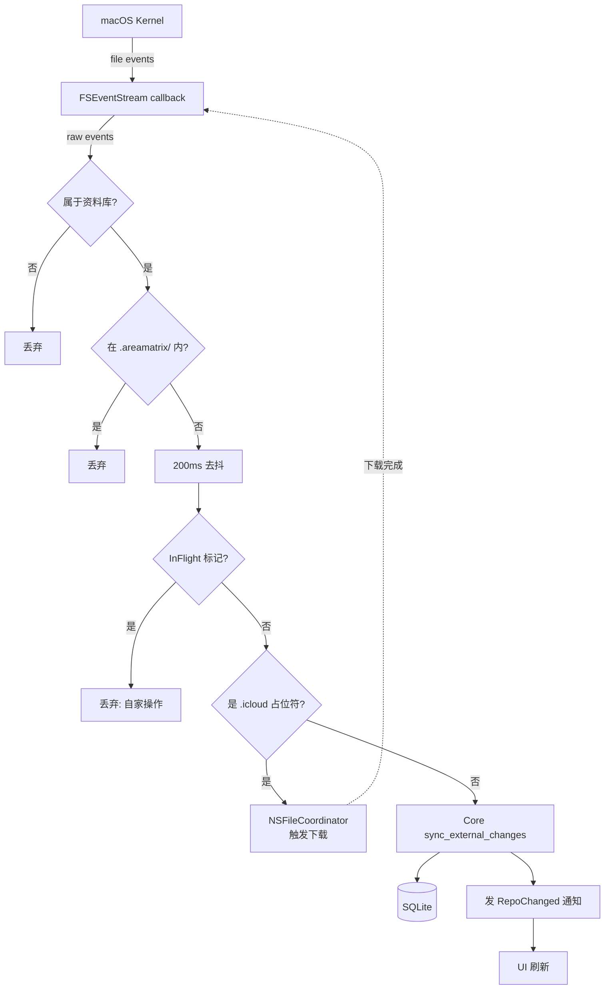
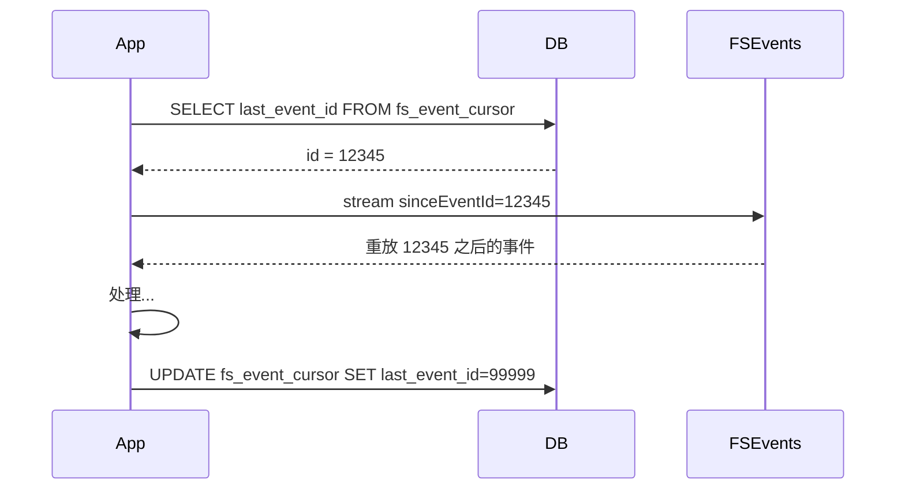
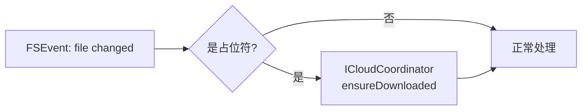

# 文件系统监听设计（FSEventStream + iCloud）

> 用户在 Finder / 终端 / 同步工具中对资料库的修改必须能被应用感知并同步到 DB 和 UI。本文给出 FSEvents 监听、去抖、自家事件过滤、iCloud 占位符协调的完整设计。
>
> 阅读时长：约 9 分钟。

---

## 设计目标

1. 在 Finder / 终端中改资料库文件，UI 1 秒内更新
2. 应用自身的写操作不引起处理循环
3. iCloud 占位符可用且不阻塞 UI
4. 关闭应用期间发生的变化在重启后能补回
5. 高频事件（拖拽几百个文件）不会触发雪崩

---

## 完整流程图



---

## FSEventStream 配置

文件：`apps/macos/AreaMatrix/Watcher/FSWatcher.swift`

```swift
import Foundation
import CoreServices

public final class FSWatcher {
    private var stream: FSEventStreamRef?
    private let repoPath: String
    private let onEvents: ([FSRawEvent]) -> Void

    public init(
        repoPath: String,
        sinceEventId: FSEventStreamEventId,
        onEvents: @escaping ([FSRawEvent]) -> Void
    ) {
        self.repoPath = repoPath
        self.onEvents = onEvents
    }

    public func start() {
        var context = FSEventStreamContext(
            version: 0,
            info: Unmanaged.passUnretained(self).toOpaque(),
            retain: nil,
            release: nil,
            copyDescription: nil
        )
        let flags: FSEventStreamCreateFlags =
            UInt32(kFSEventStreamCreateFlagFileEvents) |
            UInt32(kFSEventStreamCreateFlagUseCFTypes) |
            UInt32(kFSEventStreamCreateFlagUseExtendedData) |
            UInt32(kFSEventStreamCreateFlagWatchRoot) |
            UInt32(kFSEventStreamCreateFlagNoDefer)

        stream = FSEventStreamCreate(
            kCFAllocatorDefault,
            { (_, info, count, paths, flags, ids) in
                let watcher = Unmanaged<FSWatcher>.fromOpaque(info!).takeUnretainedValue()
                let pathsArr = unsafeBitCast(paths, to: NSArray.self) as! [String]
                let events = (0..<count).map { i in
                    FSRawEvent(
                        path: pathsArr[i],
                        flags: flags[i],
                        eventId: ids[i]
                    )
                }
                watcher.onEvents(events)
            },
            &context,
            [repoPath] as CFArray,
            FSEventStreamEventId(kFSEventStreamEventIdSinceNow), // 实际从持久化的 cursor 起
            0.2,                                                  // latency 200ms
            flags
        )
        guard let stream = stream else { return }
        FSEventStreamSetDispatchQueue(stream, .global(qos: .utility))
        FSEventStreamStart(stream)
    }

    public func stop() {
        guard let stream = stream else { return }
        FSEventStreamStop(stream)
        FSEventStreamInvalidate(stream)
        FSEventStreamRelease(stream)
        self.stream = nil
    }
}

public struct FSRawEvent {
    public let path: String
    public let flags: FSEventStreamEventFlags
    public let eventId: FSEventStreamEventId
}
```

### 关键 flag 解释

| Flag | 作用 |
|---|---|
| `FileEvents` | 给细粒度的文件级事件而非目录级 |
| `UseCFTypes` | path 用 CFString 而非 char* |
| `UseExtendedData` | 提供 inode 用于检测 rename |
| `WatchRoot` | 资料库根本身被移动 / 重命名也通知 |
| `NoDefer` | 立即送事件，不等待 latency |

注：使用 `NoDefer` 时仍然有 latency 参数控制最小事件批次间隔。我们用 200ms 是为了让 macOS 内核帮我们做第一层合并。

---

## Cursor 持久化（断点续传）

应用关闭期间发生的事件不会丢，因为 FSEvents 服务持久记录历史事件。

### 流程



### 边界情况

- 首次启动：`fs_event_cursor` 表无数据 → 用 `kFSEventStreamEventIdSinceNow`
- FSEvents 历史已被 OS 清理：会得到 `MustScanSubDirs` flag，触发 reindex_from_filesystem

---

## 去抖（Debouncer）

文件：`apps/macos/AreaMatrix/Watcher/Debouncer.swift`

### 目的

200ms 窗口内同 path 的多个事件合并成一个，避免 Finder 拖动一批文件触发上百次同步。

### 实现

```swift
import Foundation

public final class Debouncer {
    private let interval: TimeInterval
    private var pending: [String: FSRawEvent] = [:]
    private var workItem: DispatchWorkItem?
    private let queue: DispatchQueue
    private let onFlush: ([FSRawEvent]) -> Void

    public init(
        interval: TimeInterval = 0.2,
        queue: DispatchQueue = .global(qos: .utility),
        onFlush: @escaping ([FSRawEvent]) -> Void
    ) {
        self.interval = interval
        self.queue = queue
        self.onFlush = onFlush
    }

    public func enqueue(_ events: [FSRawEvent]) {
        queue.async { [weak self] in
            guard let self = self else { return }
            for event in events {
                if let existing = self.pending[event.path] {
                    // 合并 flags（保留所有 flag bits）
                    self.pending[event.path] = FSRawEvent(
                        path: event.path,
                        flags: existing.flags | event.flags,
                        eventId: max(existing.eventId, event.eventId)
                    )
                } else {
                    self.pending[event.path] = event
                }
            }
            self.workItem?.cancel()
            let work = DispatchWorkItem { [weak self] in
                self?.flush()
            }
            self.workItem = work
            self.queue.asyncAfter(deadline: .now() + self.interval, execute: work)
        }
    }

    private func flush() {
        guard !pending.isEmpty else { return }
        let snapshot = Array(pending.values)
        pending.removeAll()
        onFlush(snapshot)
    }
}
```

### 注意

- 200ms 是经验值；过短无效，过长用户感觉迟钝
- 相同 path 多次事件 flag 通过位或合并（同时含 created + modified + renamed 仍能识别）

---

## InFlight 过滤

文件：`apps/macos/AreaMatrix/Watcher/InFlightTracker.swift`

### 目的

应用自己 import 文件时会写文件系统，这些事件不该被当作"外部修改"处理（否则会循环）。

### 实现

```swift
import Foundation

public actor InFlightTracker {
    private var paths: [String: Int] = [:]   // path → 引用计数

    public func mark(_ path: String) {
        paths[path, default: 0] += 1
    }

    public func mark(_ paths: [String]) {
        for p in paths { self.paths[p, default: 0] += 1 }
    }

    public func unmark(_ path: String) {
        guard let count = paths[path] else { return }
        if count <= 1 { paths.removeValue(forKey: path) }
        else { paths[path] = count - 1 }
    }

    public func contains(_ path: String) -> Bool {
        paths[path] != nil
    }

    public func filter(_ events: [FSRawEvent]) -> [FSRawEvent] {
        events.filter { !paths.keys.contains($0.path) }
    }
}
```

### 使用模式

```swift
extension CoreBridge {
    public func importFile(from src: URL, options: ImportOptions) async throws -> FileEntry {
        let stagingPath = computeStagingPath(...)
        let finalPath = computeFinalPath(...)

        await tracker.mark(stagingPath)
        await tracker.mark(finalPath)
        defer {
            Task { await tracker.unmark(stagingPath); await tracker.unmark(finalPath) }
        }

        return try await Task.detached(priority: .userInitiated) {
            try area_matrix.importFile(...)
        }.value
    }
}
```

### 引用计数原因

同一 path 可能在短时间内多次被自家操作：例如 import → readme 重新生成。引用计数避免 unmark 后下一次操作开始时被外部处理。

### 自动过期

为防止异常路径未被 unmark 永久阻塞外部同步，每个标记带时间戳，超过 60s 自动失效（实际实现略，加 TTL 字段）。

---

## iCloud 占位符协调

文件：`apps/macos/AreaMatrix/Watcher/ICloudCoordinator.swift`

### 占位符是什么

iCloud Drive 把不常用的文件"驱逐"为占位符（`<filename>.icloud`），实际内容在云端。直接读会报错。

### 检测

```swift
public extension URL {
    var isICloudPlaceholder: Bool {
        guard let values = try? resourceValues(forKeys: [.isUbiquitousItemKey, .ubiquitousItemDownloadingStatusKey]) else {
            return false
        }
        return (values.isUbiquitousItem ?? false) &&
            values.ubiquitousItemDownloadingStatus != .current
    }
}
```

或更简单：检查路径以 `.icloud` 结尾。

### 触发下载

```swift
public final class ICloudCoordinator {
    public func ensureDownloaded(at url: URL) async throws {
        try FileManager.default.startDownloadingUbiquitousItem(at: url)

        // 等待下载完成
        while true {
            let values = try url.resourceValues(forKeys: [.ubiquitousItemDownloadingStatusKey])
            if values.ubiquitousItemDownloadingStatus == .current { return }
            try await Task.sleep(nanoseconds: 200_000_000)  // 200ms
        }
    }

    public func coordinatedRead<T>(at url: URL, _ body: (URL) throws -> T) async throws -> T {
        try await ensureDownloaded(at: url)
        let coordinator = NSFileCoordinator(filePresenter: nil)
        var coordError: NSError?
        var result: Result<T, Error>?
        coordinator.coordinate(readingItemAt: url, options: [], error: &coordError) { coordinatedURL in
            do {
                result = .success(try body(coordinatedURL))
            } catch {
                result = .failure(error)
            }
        }
        if let coordError = coordError { throw coordError }
        return try result!.get()
    }
}
```

### Sync 流程中的位置



### 限流

不要对每个占位符都立即触发下载（用户可能只是浏览，无需都下到本地）。策略：

- 显示「同步中」状态，不阻塞 UI
- 用户主动选中文件查看详情时再触发下载
- 设置中提供「全量下载」开关（默认关）

---

## Sync 模块（Core 侧）

```rust
// core/src/sync/mod.rs
pub fn sync_external_changes(
    repo_path: &Path,
    events: Vec<ExternalEvent>,
) -> CoreResult<SyncResult> {
    let mut result = SyncResult::default();

    for event in events {
        match event.kind {
            ExternalEventKind::Created => handle_created(&repo_path, &event, &mut result)?,
            ExternalEventKind::Removed => handle_removed(&repo_path, &event, &mut result)?,
            ExternalEventKind::Modified => handle_modified(&repo_path, &event, &mut result)?,
            ExternalEventKind::Renamed => handle_renamed(&repo_path, &event, &mut result)?,
        }
    }

    Ok(result)
}
```

### 重命名识别

FSEvents 不直接给 rename 事件，而是 (delete A, create B)。Core 通过 hash 识别：

```rust
fn handle_created(repo: &Path, event: &ExternalEvent, result: &mut SyncResult) -> CoreResult<()> {
    let hash = hash_file(&event.path)?;
    if let Some(existing) = db::find_active_by_hash(&hash)? {
        if !std::path::Path::new(&existing.path).exists() {
            // 是 rename
            db::update_path(existing.id, &event.path)?;
            db::insert_change(existing.id, ChangeAction::ExternalModified,
                json!({"rename_from": existing.path, "rename_to": event.path}))?;
            result.detected_renames += 1;
            return Ok(());
        }
    }
    // 真新增：当作 indexed 模式（不复制，因为本来就在资料库内）
    let entry = db::insert_indexed(...)?;
    result.detected_creates += 1;
    Ok(())
}
```

---

## 边界情况清单

| 场景 | 行为 |
|---|---|
| 资料库根被移动 | 收到 RootChanged flag → 暂停 watcher，提示用户重新选择路径 |
| FSEvents 历史已清理 | 收到 MustScanSubDirs flag → 触发 reindex_from_filesystem |
| 拖动 1000 个文件 | 200ms 去抖 + 批量 sync_external_changes |
| 应用刚启动还在初始化时收到事件 | 缓冲到 watcher 启动 → 一次性 flush |
| FSEvents 回调线程死锁 | 回调内只 enqueue，重活全在 dispatch queue |
| iCloud 大文件下载中 UI 操作 | 显示进度，不阻塞 UI |
| 用户在 .areamatrix/ 内手动改 | 我们不处理，只警告（属于内部数据） |

---

## 测试策略

### 单元测试

- Debouncer：模拟连续事件，验证合并和 flush
- InFlightTracker：mark/unmark 计数、filter 正确性
- Sync：mock 文件系统，验证 created/removed/modified/renamed 各场景

### 集成测试（手工）

详见 [../development/testing.md#fsevents-集成测试](../development/testing.md)。

---

## Related

- [overview.md](overview.md)
- [source-of-truth.md](source-of-truth.md)
- [transactional-import.md](transactional-import.md)
- [../adr/0005-fsevents-listener.md](../adr/0005-fsevents-listener.md)
- [../adr/0006-icloud-support.md](../adr/0006-icloud-support.md)
