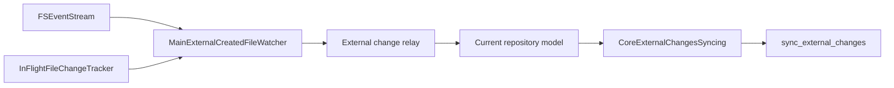

# 文件监听与外部变化同步

> 记录 macOS FSEvents watcher、cursor、事件合并、Core 同步、恢复和 iCloud 文件安全边界。
>
> 阅读时长：约 8 分钟。

---

## 职责分层

```mermaid
flowchart LR
    fsevents["FSEventStream"]
    watcher["MainExternalCreatedFileWatcher"]
    tracker["InFlightFileChangeTracker"]
    relay["External change relay"]
    model["Current repository model"]
    bridge["CoreExternalChangesSyncing"]
    core["sync_external_changes"]

    fsevents --> watcher
    tracker --> watcher
    watcher --> relay
    relay --> model
    model --> bridge
    bridge --> core
```

- Swift 平台层启动和停止 FSEventStream。
- watcher 处理 flags、路径归一化、200ms 合并和 InFlight 过滤。
- 当前资料库 model 保留待处理事件并以单批调用 Core。
- Core 读取 metadata/hash，更新 DB、change log、overview 和 cursor。
- Core 不启动 FSEvents，也不调用 macOS API。

## 启动与 cursor

watcher 启动前调用 `get_fs_event_cursor(repoPath)`：

- 有 cursor：从该 event ID 启动 FSEventStream。
- 无 cursor：不从 `SinceNow` 静默开始，而是请求用户可见的全量重扫。
- cursor 读取或 stream 启动失败：进入 watcher startup error。

重扫请求记录当前 `FSEventsGetCurrentEventId()` 作为 resume seed。用户确认并完成重扫后，应用通过 `set_fs_event_cursor` 写入该 seed，再重新打开资料库和 watcher。

正常业务批次先由 Core 在 DB batch 和 overview 成功后写入实际 signal 的最大 event ID。Swift 同时保留
整个回调窗口的 `cursorWatermark`。每次 flush 都发布一个有序同步窗口：业务窗口在 Core 成功后补写更高
watermark；全部事件被过滤时发布空窗口，并在它到达队首后确认 watermark。

watcher 的启动、停止和资料库切换使用 generation token。异步读取旧资料库 cursor 后若 generation 或当前
资料库已经变化，旧启动结果不得创建 stream、覆盖新 stream、发布事件或推进新资料库 cursor。

## FSEventStream 配置

当前 flags：

- `FileEvents`
- `UseCFTypes`
- `WatchRoot`
- `NoDefer`

stream latency 为 0.2 秒，回调投递到 main dispatch queue。

当前不使用 `UseExtendedData`，不依赖 inode 字段配对 rename，也没有 HealthMonitor 静默定时器。

## 恢复 flags

| Flag | 行为 |
|---|---|
| `RootChanged` | 停止 stream，清空 pending，要求重新连接资料库路径 |
| `MustScanSubDirs` | 停止 stream，要求全量重扫 |
| `UserDropped` | 停止 stream，要求全量重扫 |
| `KernelDropped` | 停止 stream，要求全量重扫 |
| `EventIdsWrapped` | 停止 stream，要求全量重扫 |
| `HistoryDone` | 只作为历史重放边界，不生成文件事件 |

任一无法保证历史完整性的 flag 都不能继续推进 cursor。

## 事件归一化

watcher 忽略：

- 目录事件。
- 无效或超出 `Int64` 的 event ID。
- 资料库外路径。
- `.areamatrix` 及其子路径。
- 只有恢复/边界 flag、没有文件语义的事件。

文件事件映射：

| FSEvents flags | 路径状态 | Core kind |
|---|---|---|
| `ItemRenamed` | 新路径存在 | `Renamed` |
| `ItemRenamed` | 路径不存在 | `Removed` |
| `ItemRemoved` | 路径不存在 | `Removed` |
| `ItemCreated` | 文件存在 | `Created` |
| `ItemModified` | 文件存在 | `Modified` |

同一路径在窗口内的 flags 合并，event ID 取最大值。flush 前按 event ID、路径排序。

Core 收到一批事件后再次按 `fs_event_id` 和原输入顺序归一化同一路径事件：后到的 Created、Removed 或
Renamed 覆盖更早的业务 kind；Modified 只推进该路径 watermark，不覆盖已经观察到的业务 kind。这样
Removed→Created、Created→Removed 和 Renamed→Removed 都以较晚事实为准，同时保留整批最大 cursor。

## Rename 配对

Swift 不使用 inode 配对旧路径和新路径。Core 对新路径计算 hash，并在 active rows 中查找唯一候选：

- 唯一候选：更新同一 file ID 的 path、name 和 category。
- 候选旧路径必须已经不存在；仍存在说明可能是同 hash copy，返回 Conflict。
- 目标路径的 active、staging 或 deleted row 均参与冲突检查；无候选或多个候选也返回 Conflict，不猜测。
- 同批出现旧路径 Removed 和新路径 Renamed 时，Core 在配对成功后抑制同一 file ID 的 soft delete。
- 跨分类移动同时更新 category，并刷新来源与目标分类概览。

Core 不执行物理 rename；它只登记 Finder、终端或同步工具已经完成的外部变化。

## Created 与重新激活

- active 同路径 row：幂等跳过。
- 没有同路径 row：创建 `origin=external`、`storage_mode=indexed` 的 active row。
- deleted 同路径 row：复用原 file ID，更新 hash/size/name/category，清除 `deleted_at` 并恢复 active。
- staging 同路径 row：返回 Conflict，不覆盖未完成导入状态。

外部 create 写入 `external_modified`，detail 中记录 `kind=create`。

## Modified

`Modified` 对已登记文件重新读取 size 和 SHA-256：

- hash/size 未变化：幂等跳过。
- 内容变化：更新 metadata 并写 `external_modified` change log。
- 路径存在但没有 active row：按外部 create 登记。
- 文件在读取期间继续变化时最多重试稳定快照；Unix/macOS 同时校验打开句柄与最终路径的
  device/inode identity，防止同 size/mtime 的原子替换提交旧句柄 hash。仍不稳定则返回 Conflict，等待后续事件重放。

Core 只读取用户明确存在的本地文件；不修改文件正文。

## InFlight 过滤

平台层以 `(repoPath, relativePath)` 为 key 标记应用自身的文件写入；当前实际接入的是受管 note
sidecar 写入路径（`MainDetailNoteState` 在写 sidecar 前后 mark/unmark），import、rename、move、
delete 等其余自身动作暂未标记，回流事件由 Core 幂等与事务规则吸收：

- actor 内使用引用计数，支持嵌套 mark/unmark。
- 每次 mark 或仍有引用的 unmark 后刷新过期时间。
- 最后一次 unmark 把 count 置 0，但 entry 继续保留完整 TTL grace，吸收延迟到达的自身事件。
- 默认 TTL 为 60 秒，防止异常路径永久屏蔽外部变化。
- 只过滤匹配路径，不丢弃同批其他路径。

InFlight 过滤是反馈回路保护，不替代 Core 幂等和事务。

## 200ms 合并

watcher 在收到事件后启动可取消的 200ms flush task。新事件到达时重置等待：

- 同一路径只保留合并结果。
- 不同路径全部保留。
- flush 后一次性发布信号列表。
- 当前资料库 model 再合并同路径的较新 event ID，并以单个 Core batch 提交。

flush 取当前窗口最大 event ID 作为 `cursorWatermark`：

- 有 signal 时，窗口携带排序并按路径去重后的业务事件。
- 全部事件被路径规则或 InFlight 过滤时，窗口的事件列表为空。
- relay notification 只负责唤醒；消费端一次取出该资料库的完整 backlog，不使用 notification object 替代队列。
- 当前资料库只处理队首窗口。业务窗口完成 Core 后按需补写 watermark；空窗口在队首直接确认 watermark。
- 业务窗口的 Core 调用与空窗口的 watermark 确认都包在 `RepositoryWriteCoordinator.withWriteAccess`
  内执行，与 import、repair 等其他 per-repo 写路径串行化。
- Core 或 cursor 失败时保留队首并阻断后续窗口；已经提交后的 UI reload 失败不会重新提交同一 Core batch。

## 受管 note sidecar

`<filename>.md` 只有在基础文件存在 active row 且 `notes` 表已有该 file ID 时才是受管 sidecar。

- 受管 sidecar 的 watcher 重放只参与 cursor/watermark 确认。
- 不把它登记成普通 external Markdown 文件。
- 外部编辑不会自动回写 DB；后续 `read_note` / `write_note` 发现不一致时返回错误。
- 不满足受管合同的普通 Markdown 文件继续按普通文件同步。

## Core 提交顺序

`sync_external_changes`：

1. 校验整批 event ID 和路径，并按 `external_sync_receipts` 过滤掉已应用过的事件（同
   `(event_id, kind, path)` 的重放直接计入结果，不再执行）。
2. 规划 Created、Renamed、Removed、Modified。
3. 在一个 SQLite 事务中写 files、change_log 和本批事件的 receipts。
4. 更新所有受影响分类和 root overview。
5. 单独持久化业务事件最大 cursor，并清理 cursor 之下的旧 receipts；Swift 按需补写回调窗口 watermark。

DB 事务失败时 metadata、change log 和 receipts 全部回滚，cursor 不推进。overview 或 cursor 失败时 cursor
仍不推进；重放安全由 receipts 查重与各动作幂等规则共同保证（例如 rename 目标已被本事件结果占用时按
receipt/change-log 判定为重放而不是 Conflict）。

## iCloud placeholder

- watcher 只观察路径和 FSEvents metadata。
- Core 发现 placeholder marker 时先尝试物化回退：`.icloud` 占位文件已消失且对应真实文件存在时，
  改用真实路径继续处理；无法解析时才返回 `ICloudPlaceholder`。
- watcher 和 Core 都不触发下载。
- `Download & retry` 属于用户触发的 macOS 平台动作。
- placeholder 错误不推进 cursor，也不删除 marker、原文件或 conflicted copy。

## RootChanged 与重扫

`RootChanged` 进入重新连接错误，不自动猜测新路径。

重扫进入已有 DB repair / reindex 确认界面：

- 清空该资料库的 pending watcher events。
- 显示需要全量重扫的原因。
- 用户确认后运行现有 reindex/recovery 合同。
- 完成后写入预先记录的 resume seed。

该流程不得移动、删除、重命名或覆盖用户文件。

## 验证重点

- 从已有 cursor 启动；无 cursor 请求重扫。
- dropped/wrapped flags 全部停止 stream 并请求重扫。
- RootChanged 进入重新连接。
- HistoryDone 不产生业务事件。
- burst 合并保持不同路径并按 event ID 排序，所有 signal 携带同一 watermark。
- filtered-only window 只在前序窗口完成后单调确认 watermark，失败时保留队首并阻断后续 ack。
- 快速切换资料库时，旧 cursor read / flush 不得覆盖新 stream 或向新资料库发布事件。
- InFlight 引用计数、count=0 TTL grace 和逐路径过滤正确。
- 单批进入 Core，DB 失败保持原子，overview 失败不推进 cursor。
- managed sidecar 重放只推进 cursor，不登记普通文件。
- created deleted-row reactivation 保持原 file ID。
- rename、modified、removed 和跨分类概览均可重放。
- iCloud placeholder 不发生隐式下载或用户文件写入。

## Related

- [source-of-truth.md](source-of-truth.md)
- [concurrency.md](concurrency.md)
- [transactional-import.md](transactional-import.md)
- [../api/core-api.md](../api/core-api.md)
- [../development/recovery.md](../development/recovery.md)
