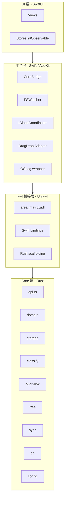
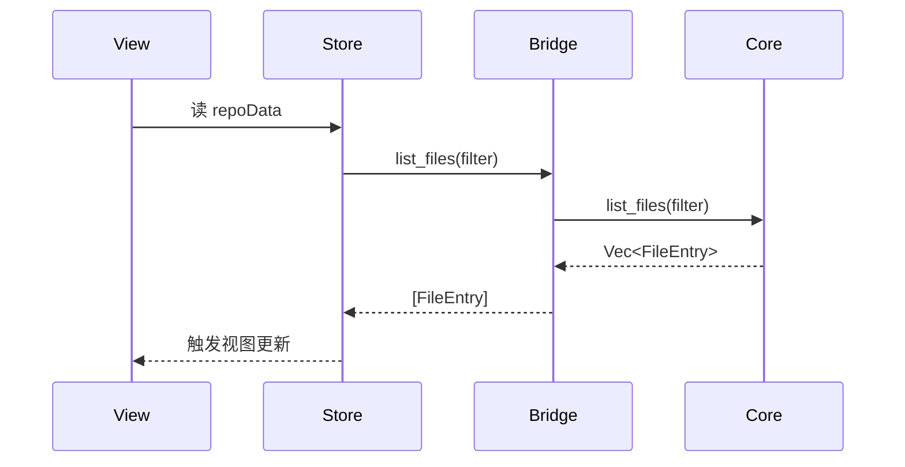
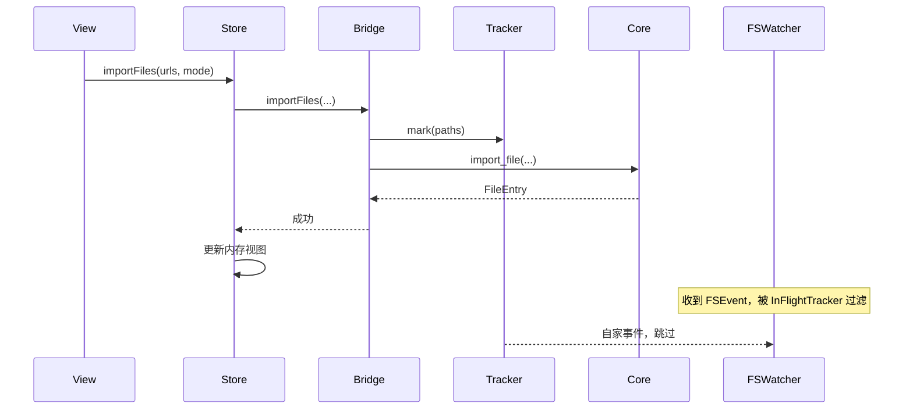
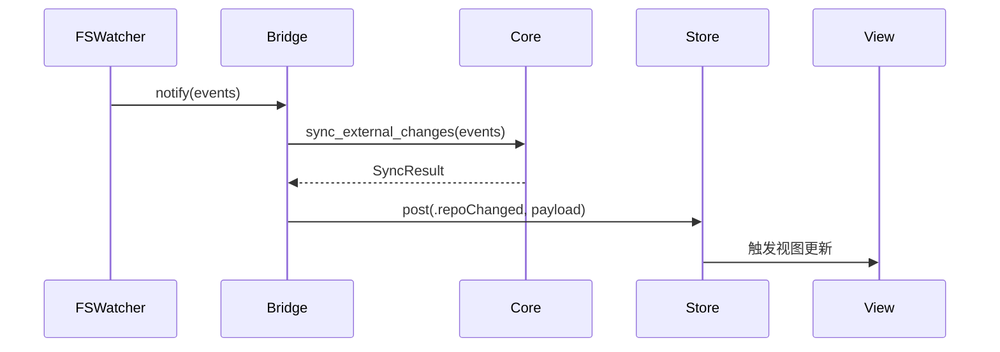
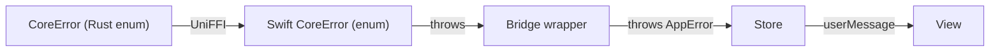

# 分层设计

> AreaMatrix 采用四层架构：UI / 平台 / FFI / Core。每层职责单一、向上提供契约、向下不作假设。本文给出每层的边界、允许做什么、禁止做什么。
>
> 阅读时长：约 6 分钟。

---

## 分层全景



依赖只能从上往下流。L1 不知道 L2 存在，L2 不知道 L3 存在，L3 不知道 L4 存在。

---

## L1 - Core 层

### 角色定位

**纯业务逻辑**，与平台、UI 完全无关。任何平台特定的 API（`NSURL`、`UIView`、`fseventsd`）都不出现在 Core 中。

### 内部子模块

| 模块 | 职责 |
|---|---|
| `api` | FFI 边界。所有暴露给 Swift 的函数集中在这里 |
| `domain` | 跨边界类型（FileEntry / Category / StorageMode / ChangeAction） |
| `error` | 统一错误类型 `CoreError` 和 `CoreResult<T>` |
| `config` | 加载 / 持久化 `~/Library/Application Support/AreaMatrix/config.json` |
| `classify` | 规则引擎，输出 `(category, suggested_name)` |
| `storage` | 事务式导入、move/copy/index、SHA256、冲突重命名 |
| `overview` | 资料库概览生成；默认写入 `.areamatrix/generated/`，可选根目录 `AREAMATRIX.md` |
| `tree` | 资料库目录扫描，生成 tree JSON |
| `sync` | 处理外部变化事件（外部重命名 / 删除 / 新增） |
| `db` | SQLite CRUD + migrations + schema 初始化 |

### 允许

- 文件 IO（std::fs）
- SQLite 访问（rusqlite）
- 哈希计算、序列化、日志（tracing）
- 通过 `chrono` 处理时间

### 禁止

- 引用任何 macOS / iOS / Windows 特定 API
- 引用 UniFFI 之外的 FFI 工具
- 假设调用线程的属性（不要假设在主线程；不要 spawn UI 相关任务）
- 弹窗 / 用户交互（必须返回错误让上层决定）
- 网络 IO（MVP 阶段；Stage 3 引入时只在 ai 子模块内）

### 测试策略

- 单元测试覆盖 ≥ 80%
- 集成测试通过临时目录模拟资料库
- 不依赖 macOS 特定的 mock，可在 Linux CI 上运行

---

## L2 - FFI 桥接层

### 角色定位

**类型转换**和**跨语言调用机制**。完全由 UniFFI 自动生成，无人工代码（除 `area_matrix.udl`）。

### 文件清单

- `core/area_matrix.udl`：手写的接口定义
- `core/build.rs`：scaffolding 生成
- `apps/macos/AreaMatrix/Bridge/Generated/area_matrix.swift`：自动生成
- `apps/macos/AreaMatrix/Bridge/Generated/area_matrixFFI.h`：自动生成
- `apps/macos/AreaMatrix/Bridge/Generated/libarea_matrix_core.a`：lipo 后的 universal staticlib

### 允许

- UDL 中定义跨边界类型（dictionary / enum / interface / sequence / record）
- 用 `[Throws=CoreError]` 标记 fallible 函数
- 用 `[Async]` 标记异步函数（Stage 2 起）

### 禁止

- 在 UDL 中描述与平台耦合的类型
- 修改自动生成文件（每次重新生成会丢失）
- 在 UDL 中暴露大于 16 个参数的函数（应封装成 dict）

### 重新生成

```bash
./scripts/build-core.sh
```

详见 [ffi-design.md](ffi-design.md)。

---

## L3 - 平台层（Swift）

### 角色定位

**适配 Core 与 UI 之间的差异**，处理所有平台特定逻辑。

### 子模块

| 模块 | 职责 |
|---|---|
| `Bridge/CoreBridge.swift` | 包装 UniFFI 调用，提供 Swift 友好 API（async/throws、Combine publisher） |
| `Watcher/FSWatcher.swift` | FSEventStream 封装 |
| `Watcher/Debouncer.swift` | 200ms 事件去抖 |
| `Watcher/InFlightTracker.swift` | 应用自身写操作的过滤 |
| `Watcher/ICloudCoordinator.swift` | NSFileCoordinator 占位符下载 |
| `Adapters/DragDropAdapter.swift` | NSItemProvider → URL[] |
| `Logging/AppLogger.swift` | OSLog 封装 |

### 允许

- 调用任何 Apple 框架（AppKit / CoreServices / Combine / OSLog）
- 调用 Core（通过 CoreBridge）
- 提供 async / throws / Publisher 风格的 Swift API 给 UI 层
- 持有自己的内部状态（如 InFlightTracker 的 path set）

### 禁止

- 直接渲染 SwiftUI 视图（视图属于 UI 层）
- 持有 UI 状态（用户选中、窗口大小这些不属于平台层）
- 绕过 CoreBridge 直接调 UniFFI 生成函数（保持单一封装入口）

### 线程模型

- FSEventStream 回调 → 通过 `DispatchQueue.global` 处理 → 调 Core → 主线程通知 UI
- 所有 Core 调用通过 `Task.detached` 异步执行，不阻塞主线程

详见 [fs-watcher.md](fs-watcher.md)。

---

## L4 - UI 层（SwiftUI）

### 角色定位

**视图与状态**。响应用户交互，展示数据。

### 子模块

| 模块 | 职责 |
|---|---|
| `App/AreaMatrixApp.swift` | App 入口、主菜单、命令 |
| `App/AppDelegate.swift` | NSApplicationDelegate（必要的 AppKit 桥接） |
| `Models/RepoStore.swift` | 资料库 UI 状态（@Observable） |
| `Models/SettingsStore.swift` | 设置 UI 状态 |
| `Views/MainWindow.swift` | 主窗口三栏 |
| `Views/Sidebar/TreeSidebar.swift` | 侧边栏树状图 |
| `Views/List/FileTable.swift` | 文件列表 |
| `Views/Detail/DetailPane.swift` | 详情面板（三 Tab） |
| `Views/Import/ImportSheet.swift` | 导入 Sheet |
| `Views/Settings/SettingsView.swift` | 设置窗口 |
| `Views/Onboarding/FirstLaunchView.swift` | 首次启动向导 |

### 允许

- 调用 L3 平台层（通过 CoreBridge / FSWatcher 封装的 Swift API）
- 用 SwiftUI 视图、状态、动画、过渡
- 用系统提供的对话框（NSSavePanel 等）

### 禁止

- 直接调用 UniFFI 生成代码（必须经过 CoreBridge）
- 直接做文件 IO（必须经过 Core）
- 持有大量业务状态（业务状态属于 Core / DB；UI store 只缓存当前展示需要的部分）
- 阻塞主线程（任何 IO 必须 async）

### 状态管理原则

- `RepoStore` 用 `@Observable`（macOS 14+ 的新机制，比 `ObservableObject` 性能更好）
- UI 通过 store 间接读取 Core 数据；不要在视图中直接 await CoreBridge
- 写操作走 store 暴露的 method（保证有日志、错误处理、UI 状态过渡）

---

## 跨层数据流约定

### 读操作（UI → Core）



### 写操作（UI → Core）



### 推操作（Core 通过 sync 自动通知 UI）



---

## 跨层错误传播



每层都有自己的错误抽象，向上层暴露语义化的错误。Core 层的 `CoreError::Conflict` 在 UI 层会变成 `AppError.duplicateFile(message)` 并触发用户提示。

---

## 何时打破分层

**永远不**。

如果发现某个需求似乎需要打破分层（例如 UI 想直接读 SQLite），先思考是不是 Core 层缺一个 API。绝大多数情况下都是这样。

如果一定要打破，必须：
1. 在 PR 描述中明确说明
2. 在受影响的代码处加注释 `// LAYERING-VIOLATION: <原因>`
3. 创建对应 issue 跟踪如何回归正常分层

## Related

- [overview.md](overview.md)
- [tech-stack.md](tech-stack.md)
- [ffi-design.md](ffi-design.md)
- [fs-watcher.md](fs-watcher.md)
