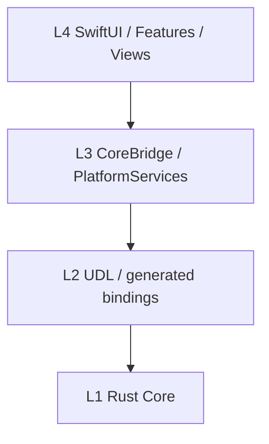

# 分层设计

> 定义 AreaMatrix 的 Rust Core、UniFFI、Swift 平台层和 SwiftUI 层之间允许与禁止的依赖。
>
> 阅读时长：约 7 分钟。

---

## 依赖方向


```mermaid
flowchart TB
    ui["L4 SwiftUI / Features / Views"]
    platform["L3 CoreBridge / PlatformServices"]
    ffi["L2 UDL / generated bindings"]
    core["L1 Rust Core"]

    ui --> platform
    platform --> ffi
    ffi --> core
```

依赖只向下。Core 不知道 Swift/UniFFI 调用方；UI 不直接读 SQLite 或调用生成绑定。

## L1 Rust Core

职责：

- `api/**`：与 UDL 同名的薄门面。
- `domain/**`：DTO、enum 和业务状态。
- `storage/**`：文件动作与补偿。
- `db/**`：SQLite schema、transaction 和查询。
- `repo_scan/**`、`repair.rs`、`recovery.rs`：扫描和恢复。
- `sync/**`：外部事件规划和幂等提交。
- classify/search/tags/AI/overview/tree 等业务模块。

允许标准文件 IO、SQLite、hash、序列化和平台中立业务逻辑。禁止 AppKit、SwiftUI、FSEvents、
NSFileCoordinator、Finder、security-scoped bookmark 和 UI 决策。

配置按领域保存在 `repo_config`、`.areamatrix/*.yaml` 或对应 DB 表，不使用文档中另行假设的全局
`config.json` 合同。

## L2 UniFFI

组成：

- `core/area_matrix.udl`
- `core/build.rs`
- `apps/macos/AreaMatrix/Bridge/UniFFI/area_matrix.swift`
- `apps/macos/AreaMatrix/Bridge/UniFFI/area_matrixFFI.h`
- `apps/macos/AreaMatrix/Bridge/Generated/` 的本地构建产物

UDL 只描述跨语言类型、函数和 `CoreError`。产品语义先写 Core API。生成 Swift/C 文件不得手工修改。

```bash
./dev build core
./dev bindings verify
```

## L3 Swift 平台层

真实落点：

| 路径 | 职责 |
|---|---|
| `Bridge/CoreBridge*.swift` | UniFFI 包装、snapshot 与 error mapping |
| `PlatformServices/MainExternalCreatedFileWatcher.swift` | FSEventStream、200ms flush、watermark |
| `PlatformServices/InFlightFileChangeTracker.swift` | 标准化 key、引用计数、TTL 和 count=0 grace |
| `PlatformServices/**ICloud**` | 用户触发下载、placeholder 与平台协调 |
| `PlatformServices/RepositoryWriteCoordinator.swift` | per-repo 写访问串行化，覆盖 import、外部同步窗口、repair 等写路径 |
| `PlatformServices/**` | Finder、Trash availability probe/危险确认/UI、路径、bookmark、diagnostics 和系统能力 |

FSEventStream 回调投递 main dispatch queue。watcher 在 MainActor 上合并平台事件；耗时 Core 调用由 bridge/
model 放到异步任务，UI 更新回到 main actor。

平台层禁止：

- 绕过 `CoreBridge` 直接调用生成 UniFFI 函数。
- 把文件 IO 放进 SwiftUI `body`。
- 在没有 Core/API 合同的情况下修改 DB。
- 隐式下载 iCloud placeholder 或覆盖用户文件。
- 在 Swift 中执行确认后的 Trash mutation、写 delete metadata/change log 或自行拼装 Undo；这些操作及
  失败回滚由 Core 统一负责。

Swift 的 OSLog/signpost 适配集中在 `PlatformServices/Observability/ObservabilitySignpostSink.swift`；它只服务
Apple 开发工具，便携 diagnostics 的源事实仍遵循 [observability.md](../development/observability.md)。

## L4 SwiftUI 与 Features

`App/**` 负责装配，`Features/**` 负责 feature state/action，`Views/**` 负责组合和渲染。页面通过 model/store
调用 bridge 或 platform protocol，不直接操作 SQLite 和用户文件。

规则：

- 主线程只做 UI 状态和轻量组合。
- IO/DB/hash/reindex 不在 `body` 中执行。
- 所有失败映射为稳定 UI 状态、错误文案和恢复动作。
- View 超过合理复杂度时拆成 feature support/model/subview，而不是把业务逻辑留在视图闭包。

## 数据所有权

| 数据 | Owner |
|---|---|
| 用户文件内容/路径 | 文件系统，Core/平台层按合同读写 |
| SQLite metadata | Rust Core |
| FSEvents cursor | Core DB + Swift watermark 协作 |
| iCloud 下载动作 | Swift 平台层，用户触发 |
| Trash availability probe、危险确认和 UI | Swift 平台层 |
| 实际 Trash mutation、delete metadata/change log、Undo 与失败回滚 | Rust Core |
| UI selection/navigation | Swift feature model |
| generated overview | Rust Core，默认 `.areamatrix/generated/` |

## 跨层变更门禁

公开合同变化按 `Core API -> UDL -> Rust -> Swift bridge -> UI/tests` 顺序。文件系统、DB、staging、reindex、
FSEvents/iCloud 或破坏性 UDL 变化必须记录影响、风险、验证和回滚。

## Related

- [overview.md](overview.md)
- [ffi-design.md](ffi-design.md)
- [core-internal-architecture.md](core-internal-architecture.md)
- [macos-frontend-architecture.md](macos-frontend-architecture.md)
- [fs-watcher.md](fs-watcher.md)
- [../development/coding-standards.md](../development/coding-standards.md)
