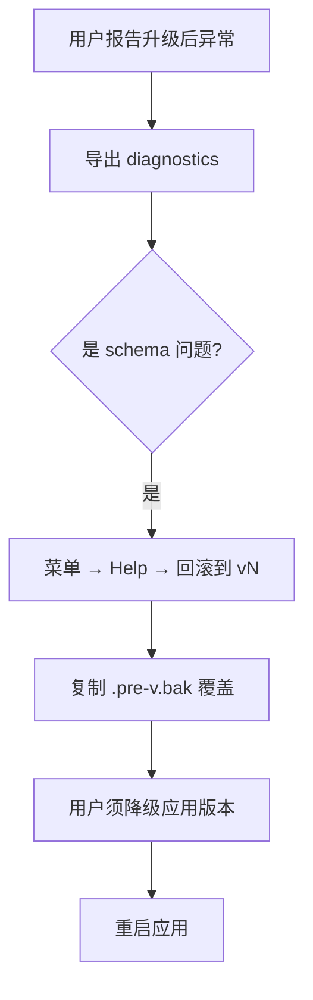
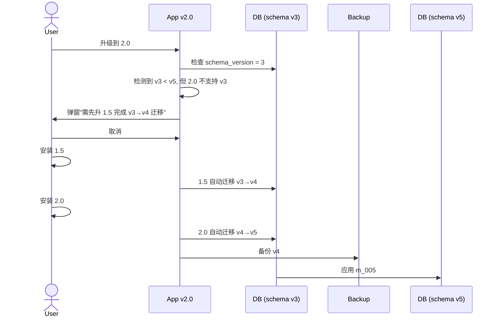
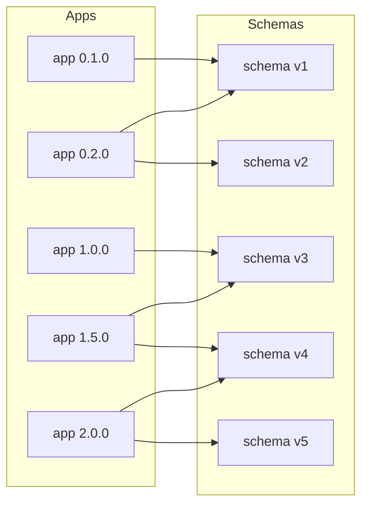

# DB Schema 迁移与版本兼容

> AreaMatrix 长期演进过程中 schema 必然变化。本文给出迁移流程、回滚策略、兼容性矩阵、版本语义，确保用户升级 / 降级 / 多版本共存场景下数据不丢。
>
> 阅读时长：约 13 分钟。

---

## 设计原则

1. **向前兼容优先**：新版能读旧 DB
2. **向后兼容尽力**：旧版尽量能读新 DB（仅加列时）
3. **每次迁移独立可测**：单步迁移有专属测试
4. **失败可回滚**：迁移前必有备份
5. **不丢用户文件**：极端场景下文件本体永远不丢
6. **schema 版本与应用版本解耦**：schema v3 可由 app v1.5 / v1.6 共用

---

## 版本语义

### 应用版本（SemVer）

`MAJOR.MINOR.PATCH`：

- MAJOR：破坏性 API 改动 / DB schema 不向后兼容
- MINOR：新功能、加 schema 列 / 表
- PATCH：bug fix、性能优化

### Schema 版本（单调整数）

`schema_version` 表保存当前数据库的 schema 版本号。每次 schema 变更 = 版本号 +1。

```sql
CREATE TABLE schema_version (
    version INTEGER PRIMARY KEY,
    applied_at INTEGER NOT NULL,
    applied_by TEXT NOT NULL  -- 应用版本号
);
```

### 兼容性矩阵

| 应用版本 | schema 范围 | 行为 |
|---|---|---|
| 0.1.x | 1 | 初始 |
| 0.2.x | 1, 2 | 自动迁移 1→2 |
| 0.3.x | 1, 2, 3 | 自动迁移到 3 |
| 1.0.0 | 3 | schema v3 稳定 |
| 1.1.x | 3, 4 | 自动迁移 3→4 |
| 2.0.0 | 5 | 不兼容 v3 及以下，须先升 1.x 到 v4 |

---

## 文件布局

```text
core/src/db/
├── schema.sql                    # v1 完整 schema（首次安装用）
├── lib.rs
└── migrations/
    ├── mod.rs                    # 加载 + 应用入口
    ├── m_002_add_tags_index.sql
    ├── m_003_add_repo_config.sql
    ├── m_004_add_fts.sql
    └── ...
```

每个 migration 是一个 SQL 文件，文件名 `m_<NNN>_<short_desc>.sql`。`NNN` 是 3 位零填充，便于排序。

---

## 迁移文件格式

```sql
-- core/src/db/migrations/m_002_add_tags_index.sql
-- Migration: add additional index on tags.added_at for time-based queries
-- Applied since: 0.2.0
-- Reversible: yes (DROP INDEX)

BEGIN IMMEDIATE;

CREATE INDEX IF NOT EXISTS idx_tags_added_at ON tags(added_at DESC);

INSERT INTO schema_version (version, applied_at, applied_by)
VALUES (2, strftime('%s', 'now'), '0.2.0');

COMMIT;
```

每个 migration 必须：

- 顶部注释说明做了什么
- `BEGIN IMMEDIATE` 抢写锁
- 末尾 INSERT schema_version
- 整体 `COMMIT`（失败时全回滚）

---

## 迁移加载机制

```rust
// core/src/db/migrations/mod.rs
use rusqlite::Connection;
use crate::error::{CoreError, CoreResult};

pub const LATEST_VERSION: i64 = 4;

const MIGRATIONS: &[(i64, &str)] = &[
    (2, include_str!("m_002_add_tags_index.sql")),
    (3, include_str!("m_003_add_repo_config.sql")),
    (4, include_str!("m_004_add_fts.sql")),
];

pub fn run_migrations(conn: &mut Connection) -> CoreResult<()> {
    let current = current_version(conn)?;
    if current > LATEST_VERSION {
        return Err(CoreError::Db(format!(
            "DB schema v{} is newer than this build's max v{}; please upgrade the app",
            current, LATEST_VERSION
        )));
    }
    if current == LATEST_VERSION {
        return Ok(());
    }

    backup_before_migration(conn, current)?;

    for &(version, sql) in MIGRATIONS {
        if version <= current {
            continue;
        }
        tracing::info!(version, "applying migration");
        let started = std::time::Instant::now();
        match conn.execute_batch(sql) {
            Ok(()) => {
                tracing::info!(version, ms = started.elapsed().as_millis() as u64,
                    "migration applied");
            }
            Err(e) => {
                tracing::error!(version, error = %e, "migration failed; rolling back");
                return Err(CoreError::Db(format!("migration v{} failed: {}", version, e)));
            }
        }
    }
    Ok(())
}

fn current_version(conn: &Connection) -> CoreResult<i64> {
    let v: i64 = conn.query_row(
        "SELECT COALESCE(MAX(version), 0) FROM schema_version",
        [], |r| r.get(0)
    )?;
    Ok(v)
}

fn backup_before_migration(conn: &Connection, from_version: i64) -> CoreResult<()> {
    let path = conn_path(conn)?;
    let backup = path.with_file_name(format!(
        "{}.pre-v{}.bak",
        path.file_name().unwrap().to_string_lossy(),
        from_version + 1
    ));
    std::fs::copy(&path, &backup)?;
    tracing::info!(backup = %backup.display(), "backup created");
    Ok(())
}
```

---

## 迁移类型与策略

### 类型 1：加列（最常见，向后兼容）

```sql
-- m_005_add_files_color.sql
BEGIN IMMEDIATE;
ALTER TABLE files ADD COLUMN color TEXT;
INSERT INTO schema_version (version, applied_at, applied_by) VALUES (5, strftime('%s', 'now'), '1.2.0');
COMMIT;
```

旧版本读时 `color` 列被忽略，写时不会触及。完全兼容。

### 类型 2：加表（向后兼容）

```sql
-- m_006_add_search_history.sql
BEGIN IMMEDIATE;
CREATE TABLE search_history (
    id INTEGER PRIMARY KEY AUTOINCREMENT,
    query TEXT NOT NULL,
    occurred_at INTEGER NOT NULL
);
INSERT INTO schema_version ...;
COMMIT;
```

旧版本不知道这个表，但不影响其它操作。

### 类型 3：加索引（向后兼容）

```sql
-- m_007_add_files_size_index.sql
CREATE INDEX IF NOT EXISTS idx_files_size ON files(size_bytes);
```

完全兼容，仅影响性能。

### 类型 4：改列（不兼容，必须 MAJOR）

SQLite 直到 3.35+ 才有 `ALTER TABLE ... DROP COLUMN`，3.25+ 有 `RENAME COLUMN`。改列定义必须用"建新表 → 复制 → 替换"：

```sql
-- m_008_files_path_to_text_strict.sql
BEGIN IMMEDIATE;

CREATE TABLE files_new (
    id INTEGER PRIMARY KEY AUTOINCREMENT,
    path TEXT NOT NULL UNIQUE,
    -- ... 其他列同 v7 ...
    -- 新约束：path 不能含反斜杠
    CHECK (path NOT LIKE '%\\%')
);

INSERT INTO files_new SELECT * FROM files
  WHERE path NOT LIKE '%\\%';

-- 残留：path 含反斜杠的记录
INSERT INTO migration_rejects (table_name, original_id, reason)
SELECT 'files', id, 'path contains backslash'
  FROM files WHERE path LIKE '%\\%';

DROP TABLE files;
ALTER TABLE files_new RENAME TO files;

-- 重建索引
CREATE INDEX idx_files_category_active ON files(category, imported_at DESC) WHERE status = 'active';
CREATE INDEX idx_files_hash_active ON files(hash_sha256) WHERE status = 'active';
CREATE INDEX idx_files_status ON files(status);
CREATE INDEX idx_files_imported_at ON files(imported_at DESC);

INSERT INTO schema_version ...;
COMMIT;
```

`migration_rejects` 表保存被剔除的行，便于用户事后审查：

```sql
CREATE TABLE migration_rejects (
    id INTEGER PRIMARY KEY AUTOINCREMENT,
    migration_version INTEGER NOT NULL,
    table_name TEXT NOT NULL,
    original_id INTEGER,
    reason TEXT NOT NULL,
    created_at INTEGER NOT NULL DEFAULT (strftime('%s','now'))
);
```

### 类型 5：删列（不兼容）

同类型 4，重建表。

### 类型 6：分表 / 合表（重大重构，谨慎）

仅在重大功能演进时做。需要：

- 保留旧表至下一个 MAJOR
- 应用代码同时读新旧
- 数据双写期 (≥ 1 个 MINOR)
- 清理期

---

## 回滚策略

### 自动备份

每次迁移前自动备份：`<repo>/.areamatrix/index.db.pre-v<N>.bak`

保留策略：

- 最近 3 个 MINOR 版本的备份
- 用户可手动调"保留所有备份"

### 用户触发回滚



回滚 UI：

```swift
struct RollbackView: View {
    @State var backups: [SchemaBackup] = []

    var body: some View {
        List(backups) { backup in
            HStack {
                Text("v\(backup.fromVersion)")
                Text(backup.createdAt.formatted())
                Spacer()
                Button("回滚到此版本") {
                    Task { try await coreBridge.rollbackTo(backup) }
                }
            }
        }
    }
}
```

### 程序化回滚（仅开发调试）

```rust
pub fn rollback_to(repo: &Path, target_version: i64) -> CoreResult<()> {
    let layout = RepoLayout::for_repo(repo);
    let bak_path = layout.areamatrix_dir().join(format!("index.db.pre-v{}.bak", target_version + 1));
    if !bak_path.exists() {
        return Err(CoreError::Internal {
            message: format!("backup for v{} not found", target_version)
        });
    }
    let db_path = layout.db_path();
    std::fs::copy(&bak_path, &db_path)?;
    tracing::warn!(target_version, "rolled back schema");
    Ok(())
}
```

---

## 不向后兼容的 schema 变更：MAJOR 升级

### 升级流程



### 应用启动检查

```rust
fn check_schema_compatibility(conn: &Connection) -> CoreResult<()> {
    let current = current_version(conn)?;
    let min_supported = MIN_SUPPORTED_VERSION;

    if current < min_supported {
        return Err(CoreError::Db(format!(
            "DB schema v{} is too old; please first upgrade through app version 1.x",
            current
        )));
    }
    if current > LATEST_VERSION {
        return Err(CoreError::Db(format!(
            "DB schema v{} is newer than this build supports v{}; upgrade the app",
            current, LATEST_VERSION
        )));
    }
    Ok(())
}
```

`MIN_SUPPORTED_VERSION` 是当前 MAJOR 系列支持的最低 schema 版本：

- 1.x 系列：MIN = 1
- 2.x 系列：MIN = 4（强制用户先升过 1.x）

---

## 测试每个迁移

### 单测：从空 DB 应用所有迁移

```rust
#[test]
fn fresh_db_runs_all_migrations() {
    let dir = tempfile::tempdir().unwrap();
    let db_path = dir.path().join("test.db");
    let mut conn = rusqlite::Connection::open(&db_path).unwrap();
    apply_initial_schema(&mut conn).unwrap();
    run_migrations(&mut conn).unwrap();
    let v = current_version(&conn).unwrap();
    assert_eq!(v, LATEST_VERSION);
}
```

### 单测：从历史版本升级

```rust
#[test]
fn from_v2_to_latest() {
    let dir = tempfile::tempdir().unwrap();
    let db_path = dir.path().join("test.db");
    let mut conn = rusqlite::Connection::open(&db_path).unwrap();
    apply_v1_schema(&mut conn).unwrap();
    apply_v2_migration(&mut conn).unwrap();

    insert_sample_data(&conn);

    run_migrations(&mut conn).unwrap();
    assert_eq!(current_version(&conn).unwrap(), LATEST_VERSION);

    let count: i64 = conn.query_row("SELECT COUNT(*) FROM files", [], |r| r.get(0)).unwrap();
    assert_eq!(count, EXPECTED_COUNT);
}
```

### 单测：失败回滚

```rust
#[test]
fn migration_failure_rolls_back() {
    let dir = tempfile::tempdir().unwrap();
    let db_path = dir.path().join("test.db");
    let mut conn = rusqlite::Connection::open(&db_path).unwrap();
    apply_v1_schema(&mut conn).unwrap();

    let bad_migration = "BEGIN IMMEDIATE; \
                         ALTER TABLE nonexistent ADD COLUMN x; \
                         INSERT INTO schema_version VALUES (2, 0, 'test'); \
                         COMMIT;";
    let result = conn.execute_batch(bad_migration);
    assert!(result.is_err());
    assert_eq!(current_version(&conn).unwrap(), 1);
}
```

### CI 矩阵测试

```yaml
- name: test migrations from each historical version
  run: |
    for v in 1 2 3 4; do
      cargo test --features migration-test-from-v$v
    done
```

每个 feature 用对应版本的 DB fixture 启动，验证升级后数据完整。

---

## 大库迁移性能

### 估算

| schema 版本变更 | 100k 文件耗时 | 1M 文件耗时 |
|---|---|---|
| 加索引 | 5 s | 60 s |
| 加列 | < 1 s | < 1 s |
| 改列（CTAS 重建） | 60 s | 600 s |
| 加表 | < 1 s | < 1 s |

### 长迁移的 UX

```mermaid
flowchart TB
    Start[启动应用]
    Detect[检测到 schema_version < latest]
    Estimate[估算耗时]
    Warn[弹窗"需要数据库升级，预计 5 分钟"]
    Confirm{用户确认?}
    Run[运行迁移 + 进度条]
    Done[完成 + 启动主界面]
    Cancel[取消 → 退出应用]

    Start --> Detect
    Detect --> Estimate
    Estimate -->|"> 30s"| Warn
    Estimate -->|"< 30s"| Run
    Warn --> Confirm
    Confirm -->|是| Run
    Confirm -->|否| Cancel
    Run --> Done
```

进度上报通过 callback：

```rust
pub fn run_migrations_with_progress(
    conn: &mut Connection,
    on_progress: &mut dyn FnMut(MigrationProgress),
) -> CoreResult<()> {
    let pending: Vec<_> = MIGRATIONS.iter()
        .filter(|(v, _)| *v > current_version(conn).unwrap_or(0))
        .collect();

    for (i, (version, sql)) in pending.iter().enumerate() {
        on_progress(MigrationProgress {
            current: i,
            total: pending.len(),
            current_version: *version,
        });
        conn.execute_batch(sql)?;
    }
    Ok(())
}
```

---

## 兼容性测试矩阵



| App | reads | writes (default) | upgrades | refuses |
|---|---|---|---|---|
| 0.1.x | v1 | v1 | — | v2+ |
| 0.2.x | v1, v2 | v2 | v1→v2 | v3+ |
| 1.0.x | v3 | v3 | v1→v2→v3 | v4+, v2- |
| 1.1.x | v3, v4 | v4 | v3→v4 | v5+, v2- |
| 2.0.x | v4, v5 | v5 | v4→v5 | v6+, v3- |

CI 跑全矩阵：每对 (app, schema) 组合启动一次，看是否符合上表。

---

## 迁移 checklist（每次 schema 变更必走）

```text
[ ] 写 m_NNN_xxx.sql 文件
[ ] 顶部注释：变更内容、起始 app 版本、是否可逆
[ ] 在 mod.rs MIGRATIONS 数组追加
[ ] 更新 LATEST_VERSION 常量
[ ] 单测：fresh_db 应用到 latest
[ ] 单测：从最老支持版本升级
[ ] 单测：迁移失败回滚
[ ] 数据保留测试：升级前后行数 / 关键字段值
[ ] 性能测试：100k / 1M 文件下耗时
[ ] 文档：在 migration.md 兼容性矩阵更新
[ ] 文档：CHANGELOG.md 标注 schema 升级
[ ] release 测试：装旧版 → 升新版 → 数据正确
[ ] release 测试：装新版 → 降旧版（如可降）
```

---

## 常见反模式

### 1. 没有事务

```sql
-- ❌
ALTER TABLE files ADD COLUMN x;
INSERT INTO schema_version ...;
```

中途 panic 会留下 schema 半生不熟。必须 `BEGIN IMMEDIATE; ... COMMIT;`。

### 2. 修改老的 migration

```sql
-- ❌ 改 m_002.sql 的内容
```

已发布的 migration 不能改。错了就出新的 m_NNN.sql 修复。

### 3. 跳号

```text
m_002.sql, m_003.sql, m_005.sql   ❌ 缺 m_004
```

必须连续。

### 4. 在 migration 里跑长任务

```sql
-- ❌ 全表扫描计算 hash
UPDATE files SET hash_sha256 = compute_hash(path);
```

migration 里只做 schema 操作。需要数据回填 / 重计算的工作放后台 reconcile。

---

## Related

- [data-model.md](data-model.md)
- [overview.md](overview.md)
- [../development/troubleshooting.md](../development/troubleshooting.md)
- [../development/release.md](../development/release.md)
- [../development/testing.md](../development/testing.md)
