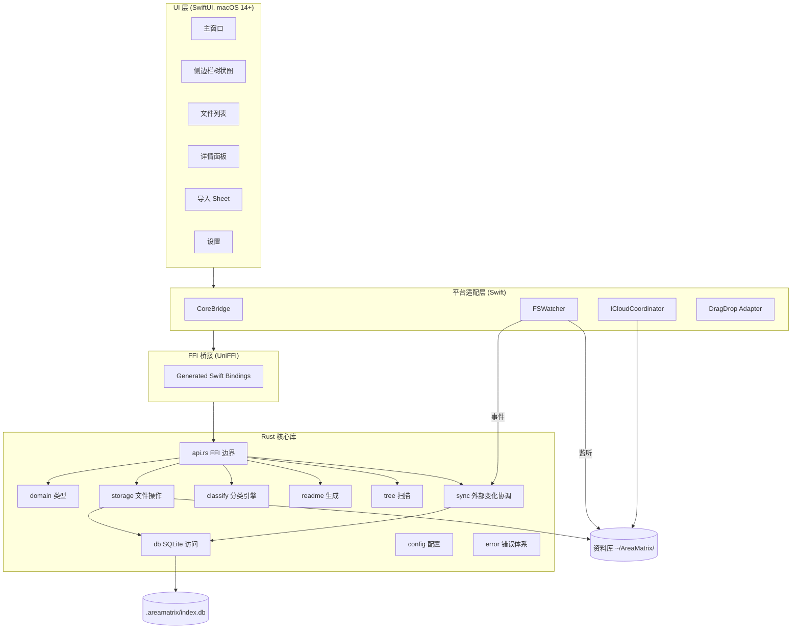
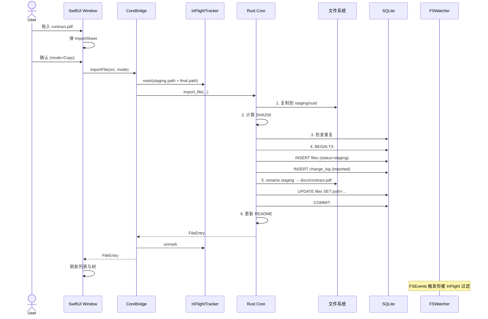
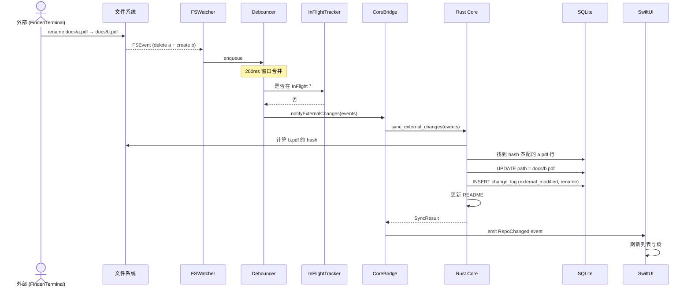

# 架构总览

> AreaMatrix 采用 Core + Shell 架构：平台无关的 Rust 核心库 + 各平台原生 UI。本文给出整体分层、数据流、目录结构和关键运行时序。
>
> 阅读时长：约 8 分钟。

---

## 设计原则（按优先级）

1. **核心与平台分离**：业务逻辑写一次，UI 每个平台各写各的
2. **真相分明**：DB 是元数据真相，文件系统是物化视图，外部变化通过 FSEvents 回流
3. **任何中断不丢数据**：所有写操作走事务式 staging 流程
4. **本地优先**：默认完全离线，AI/网络是可选项
5. **可观测**：所有关键操作有结构化日志和 change_log 双重记录

---

## 整体分层



## 模块职责

| 层 | 模块 | 职责 |
|---|---|---|
| UI | SwiftUI Views | 视图渲染、用户交互 |
| UI | Stores (`@Observable`) | UI 状态 |
| 平台 | CoreBridge | 包装 UniFFI 调用，提供 Swift 友好 API |
| 平台 | FSWatcher | FSEventStream 监听 + 去抖 + InFlight 过滤 |
| 平台 | ICloudCoordinator | NSFileCoordinator 占位符下载协调 |
| 平台 | DragDrop Adapter | NSItemProvider → URL 列表 |
| FFI | UniFFI | 自动生成 Swift bindings |
| Core | api.rs | 暴露给 Swift 的所有函数（FFI 边界） |
| Core | domain | 跨边界类型（FileEntry / Category / ...） |
| Core | storage | 事务式文件操作（move / copy / index / hash / dedup） |
| Core | classify | 规则引擎（扩展名 + 关键词），未来加 AI |
| Core | readme | 分类目录 + 根目录 README 生成 |
| Core | tree | 资料库扫描，输出 tree JSON |
| Core | sync | 处理外部变化事件（重命名 / 新增 / 删除） |
| Core | db | SQLite CRUD + migrations |
| Core | config | 配置加载与持久化 |

详见 [layered-design.md](layered-design.md)。

## 关键数据流：用户拖入文件



## 关键数据流：外部修改回流



## 仓库目录结构

```
AreaMatrix/                            # Git 仓库
├── core/                              # Rust 核心库（独立 cargo crate）
│   ├── Cargo.toml
│   ├── build.rs                       # uniffi scaffolding 生成
│   ├── area_matrix.udl                # UniFFI 接口定义
│   ├── src/
│   │   ├── lib.rs                     # 入口
│   │   ├── api.rs                     # FFI 边界
│   │   ├── domain.rs                  # 类型
│   │   ├── error.rs                   # 错误体系
│   │   ├── config.rs                  # 配置
│   │   ├── classify/{mod,rules,naming}.rs
│   │   ├── storage/{mod,ops,hash,conflict}.rs
│   │   ├── readme/{mod,category,root}.rs
│   │   ├── tree/mod.rs
│   │   ├── sync/mod.rs
│   │   └── db/{mod,schema.sql,migrations,repo}.rs
│   ├── tests/                         # 集成测试
│   └── resources/
│       └── classifier.yaml            # 默认分类规则
│
├── apps/macos/                        # SwiftUI Xcode 项目
│   ├── AreaMatrix.xcodeproj
│   └── AreaMatrix/
│       ├── App/
│       ├── Bridge/
│       │   ├── CoreBridge.swift
│       │   └── Generated/             # uniffi 生成（不入版本控制）
│       ├── Watcher/
│       │   ├── FSWatcher.swift
│       │   ├── Debouncer.swift
│       │   ├── InFlightTracker.swift
│       │   └── ICloudCoordinator.swift
│       ├── Models/                    # @Observable stores
│       ├── Views/                     # SwiftUI views
│       └── Resources/
│
├── scripts/                           # 构建脚本
│   ├── build-core.sh
│   └── update-bindings.sh
│
└── docs/                              # 项目文档（本目录）
```

## 资料库目录结构（用户实际看到的）

```
~/AreaMatrix/                          # 默认资料库根
├── docs/                              # UI 显示「文档」
│   ├── README.md                      # 自动生成
│   ├── contract.pdf
│   └── contract.pdf.md                # 用户手动伴生笔记（可选）
├── code/                              # UI 显示「代码」
├── design/                            # UI 显示「设计」
├── media/                             # UI 显示「媒体」
├── finance/                           # UI 显示「财务」
├── inbox/                             # UI 显示「未分类」（兜底）
├── README.md                          # 整库总览
└── .areamatrix/
    ├── index.db                       # SQLite
    ├── config.json                    # 用户配置
    ├── classifier.yaml                # 分类规则
    └── staging/                       # 事务中转区
```

## 关键不变量

为保证系统正确性，下列不变量在任何代码路径下都必须满足：

| 不变量 | 描述 |
|---|---|
| INV-1 | 任何成功导入的文件都同时在文件系统和 DB 中可见 |
| INV-2 | 任何失败的导入不留下 DB 记录或最终目录中的文件 |
| INV-3 | `.areamatrix/staging/` 内的文件不出现在用户视图 |
| INV-4 | 应用关闭后再打开，资料库视图与上次完全一致 |
| INV-5 | 同一 hash 的文件在 DB 中最多只有一行 active 记录 |
| INV-6 | 应用自身的写操作不触发外部变化处理 |
| INV-7 | 删除 `.areamatrix/` 不会丢失任何用户文件本身 |

不变量违反 = bug。所有重要的代码路径在测试中都要验证至少一个不变量。

## 错误处理总策略

- **Rust core**：所有 fallible 函数返回 `CoreResult<T>`
- **FFI 边界**：错误用 UniFFI Error enum 暴露
- **Swift 侧**：用 `do/try/catch`，UI 层用 toast 显示错误
- **不静默失败**：任何错误必须有日志或 UI 反馈
- **不中止应用**：单个文件操作失败不能让整个 import 流程崩溃

详见 [../api/error-codes.md](../api/error-codes.md)。

## 性能基线

| 场景 | 目标 |
|---|---|
| 冷启动到主窗口可交互 | < 1.5s |
| 拖入单个 100MB 文件到落位 | < 1s（含 hash） |
| 树状图首屏渲染（10 万节点） | < 500ms |
| FSEvents → UI 更新 | < 1s |
| SQLite 单次写 | < 5ms |
| 内存（10 万文件下） | < 400MB |

详见 [../development/testing.md#性能测试](../development/testing.md)。

## 可观测性

- **结构化日志**：tracing crate（Rust）+ os_log（Swift），写入 `~/Library/Logs/AreaMatrix/`
- **Change Log**：所有改动写入 SQLite `change_log` 表（用户可见）
- **Metrics**（Stage 2 起）：本地 Prometheus 风格的统计（导入耗时、失败率），不上传

## 演进路径

| Stage | 关注点 |
|---|---|
| 1 (MVP) | 端到端闭环、稳定性、macOS |
| 2 | 全文搜索、批量、撤销、规则 UI |
| 3 | AI 分类、智能命名、OCR |
| 4 | Windows / Linux / iOS / 多设备同步 |

详见 [../roadmap/milestones.md](../roadmap/milestones.md)。

## Related

- [tech-stack.md](tech-stack.md)
- [layered-design.md](layered-design.md)
- [data-model.md](data-model.md)
- [ffi-design.md](ffi-design.md)
- [fs-watcher.md](fs-watcher.md)
- [transactional-import.md](transactional-import.md)
- [source-of-truth.md](source-of-truth.md)
- [../adr/0001-tech-stack.md](../adr/0001-tech-stack.md)
