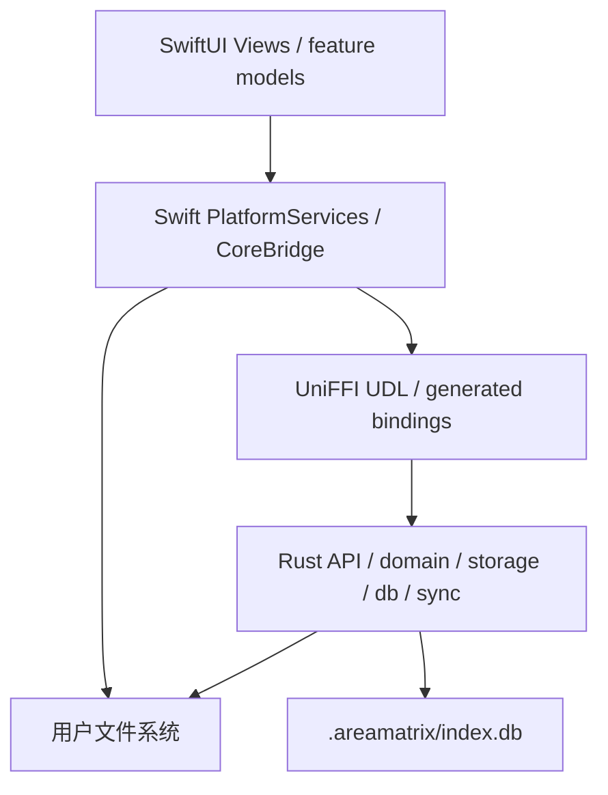
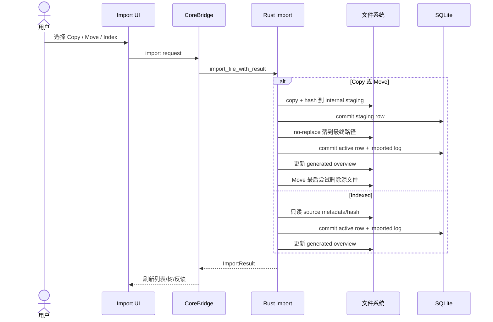
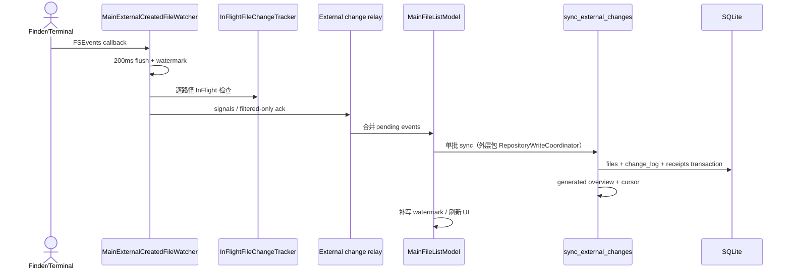

# 架构总览

> AreaMatrix 是 Rust Core、UniFFI、Swift 平台层和 SwiftUI macOS 应用组成的本地优先资料管理工具。
>
> 阅读时长：约 8 分钟。

---

## 设计原则

1. Core 平台无关；AppKit、FSEvents、iCloud 和 Finder 能力留在 Swift。
2. 用户文件、SQLite metadata、note sidecar 和 generated output 使用分域真相源。
3. 文件系统与 DB 通过短 transaction、staging 和补偿 guard 保持一致，不假设跨资源原子 transaction。
4. 默认本地运行；AI/网络能力需要显式配置、隐私规则和 provider 边界。
5. 用户文件安全优先于自动修复、覆盖和静默推测。
6. 可观测性以 change log、错误状态和 diagnostics 为主，不宣称未接入的日志或 metrics 能力。

## 四层结构

```mermaid
flowchart TB
    ui["SwiftUI Views / feature models"]
    platform["Swift PlatformServices / CoreBridge"]
    ffi["UniFFI UDL / generated bindings"]
    core["Rust API / domain / storage / db / sync"]
    files["用户文件系统"]
    metadata[".areamatrix/index.db"]

    ui --> platform
    platform --> ffi
    ffi --> core
    platform --> files
    core --> files
    core --> metadata
```

| 层 | 主要职责 |
|---|---|
| SwiftUI | 页面渲染、交互、状态路由和恢复反馈 |
| Swift 平台层 | `CoreBridge`、FSEvents、iCloud 下载、Finder、Trash availability probe/危险确认/UI、权限和 diagnostics UI |
| UniFFI | UDL 类型/函数合同及生成绑定 |
| Rust Core | 业务规则、文件安全、实际 Trash mutation、SQLite/change log/Undo、分类、搜索、sync、overview 和 repair |

## 关键模块

Rust Core：

- `core/src/api/**`：公开 FFI 门面。
- `core/src/domain/**`：跨边界 DTO 与 enum。
- `core/src/storage/**`：导入、rename、move、delete、hash、dedup 和补偿 guard。
- `core/src/db/**`：SQLite schema、transaction 和 read models。
- `core/src/repo_scan/**`：adopt/reindex scan sessions。
- `core/src/sync/**`：外部 Created/Renamed/Modified/Removed 规划。
- `core/src/tree/mod.rs`：每次调用读取文件系统并构造 tree JSON。
- `core/src/overview/**`：generated overview。
- `core/src/repair.rs`：metadata snapshot、integrity check 和 replacement DB repair。

macOS：

- `App/**`：app 入口和依赖装配。
- `Bridge/**`：CoreBridge、snapshot 和 error mapping。
- `PlatformServices/**`：FSEvents、iCloud、Finder、Trash availability probe/危险确认/UI、security bookmark
  和 diagnostics 平台能力；不执行确认后的 Trash mutation。
- `Features/**`：按功能组织的 model/action/view support。
- `Views/**`：窗口和页面组合。

## 导入调用链

```mermaid
sequenceDiagram
    actor user as 用户
    participant ui as Import UI
    participant bridge as CoreBridge
    participant core as Rust import
    participant fs as 文件系统
    participant db as SQLite

    user->>ui: 选择 Copy / Move / Index
    ui->>bridge: import request
    bridge->>core: import_file_with_result
    alt Copy 或 Move
        core->>fs: copy + hash 到 internal staging
        core->>db: commit staging row
        core->>fs: no-replace 落到最终路径
        core->>db: commit active row + imported log
        core->>fs: 更新 generated overview
        core->>fs: Move 最后尝试删除源文件
    else Indexed
        core->>fs: 只读 source metadata/hash
        core->>db: commit active row + imported log
        core->>fs: 更新 generated overview
    end
    core-->>bridge: ImportResult
    bridge-->>ui: 刷新列表/树/反馈
```

具体补偿边界见 [transactional-import.md](transactional-import.md)。

## 外部变化调用链

```mermaid
sequenceDiagram
    actor external as Finder/Terminal
    participant watcher as MainExternalCreatedFileWatcher
    participant tracker as InFlightFileChangeTracker
    participant relay as External change relay
    participant model as MainFileListModel
    participant core as sync_external_changes
    participant db as SQLite

    external->>watcher: FSEvents callback
    watcher->>watcher: 200ms flush + watermark
    watcher->>tracker: 逐路径 InFlight 检查
    watcher->>relay: signals / filtered-only ack
    relay->>model: 合并 pending events
    model->>core: 单批 sync（外层包 RepositoryWriteCoordinator）
    core->>db: files + change_log + receipts transaction
    core->>core: generated overview + cursor
    model->>model: 补写 watermark / 刷新 UI
```

Core 不执行外部物理 rename/delete，只登记已经发生的文件系统变化。受管 note sidecar replay 只确认 cursor，
不登记普通 external 文件。

用户发起的 repo-owned 删除不属于外部变化同步：Swift 先完成 Trash availability probe 和危险确认，Core
再执行实际 Trash mutation，并原子协调 metadata、change log、Undo 与失败回滚。

## 数据与恢复

- 用户文件内容和路径以文件系统为准。
- tags、history、saved searches、Undo/Redo 等以 SQLite 为准。
- note 使用 DB 与 sidecar 一致合同，分叉时 fail closed。
- generated output 默认只写 `.areamatrix/generated/`。
- startup recovery 只处理可证明属于 staging 的状态。
- repair 可保存 `.areamatrix/diagnostics/` snapshot 并重建 metadata；不能恢复 DB-only 数据。
- 删除 `.areamatrix/` 不删除用户文件，但会丢失 DB-only metadata。

## 可观测性

当前证据面包括：

- SQLite `change_log`，覆盖定义明确的 mutation。
- 页面 error mapping、watcher/platform/local-model status DTO。
- repository DB/WAL/SHM diagnostics snapshot。
- About 页脱敏版本报告。

Core `init_logging` 只校验 level；Swift 未接入 OSLog wrapper；当前没有自动 metrics 或远程 telemetry。详见
[可观测性与诊断](../development/observability.md)。

## 性能

真实基线由 `core_hot_paths.rs` 和 `AreaMatrixPerfTests` 提供。普通 CI 不自动执行全部性能门禁；命令、
阈值和证据限制见 [性能工程](../development/performance.md)。

## Related

- [layered-design.md](layered-design.md)
- [tech-stack.md](tech-stack.md)
- [source-of-truth.md](source-of-truth.md)
- [transactional-import.md](transactional-import.md)
- [fs-watcher.md](fs-watcher.md)
- [core-internal-architecture.md](core-internal-architecture.md)
- [macos-frontend-architecture.md](macos-frontend-architecture.md)
