# 真相源策略

> 当 SQLite 元数据与文件系统状态不一致时，谁说了算？AreaMatrix 选择**混合策略**：DB 是元数据真相、FS 是文件本身的真相，FSEvents 让两者最终一致。
>
> 阅读时长：约 14 分钟。

---

## 问题：两个真相源

资料库的"状态"由两个独立来源构成：

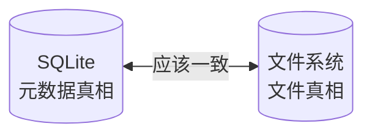

理想状态下两者一致。但有多个场景会让它们短暂不一致：

- 用户在 Finder 改资料库（FS 变了，DB 没变）
- 应用 import 中崩溃（FS 半成品，DB 半成品）
- iCloud 同步在远端动了文件
- 第三方工具（命令行 / 备份软件）改了资料库

---

## 三种可能的策略

| 策略 | 行为 | 优点 | 缺点 |
|---|---|---|---|
| A: DB 优先 | 冲突以 DB 为准，外部修改被回滚 | 内部一致性强 | 用户在 Finder 的修改被吞 |
| B: FS 优先 | 冲突以 FS 为准，DB 同步到 FS | 用户操作被尊重 | 元数据（笔记、标签）易丢 |
| C: 混合 ✅ | 不同维度选不同策略 | 平衡性最优 | 实现复杂 |

详见 [../adr/0003-source-of-truth-strategy.md](../adr/0003-source-of-truth-strategy.md)。

---

## 决策矩阵

| 维度 | 真相源 | 理由 |
|---|---|---|
| 文件内容 | FS | 用户视角文件就是真相 |
| 文件存在性 | FS（FS 删 = DB 软删） | 用户在 Finder 删除是有意的 |
| 文件位置（path） | FS（rename / move 通过 hash 识别） | 通过 hash 识别 rename / move |
| 元数据：分类 | FS-derived（由 path 派生） | 顶层目录就是分类 |
| 元数据：笔记 | DB ↔ FS 双向同步 | 给用户一致体验 |
| 元数据：标签 | DB | FS 不存标签 |
| 改动历史 | DB | FS 不存历史 |
| Hash | 实时计算 | 不存（缓存除外） |
| 用户 `README.md` | FS | 视为普通用户/项目文件，应用不覆盖、不插入标记块 |
| AreaMatrix 概览 | DB-derived | 派生自 DB，默认写入 `.areamatrix/generated/`，可选 `AREAMATRIX.md` |

核心规则：

> **DB 是元数据真相、FS 是文件本身的真相。FSEvents 让 DB 跟随 FS 变化更新元数据，DB 不能否决用户在 FS 的操作。**

---

## 9 种外部变化场景全览

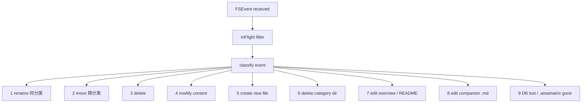

---

## 场景 1：rename 同分类

### 流程

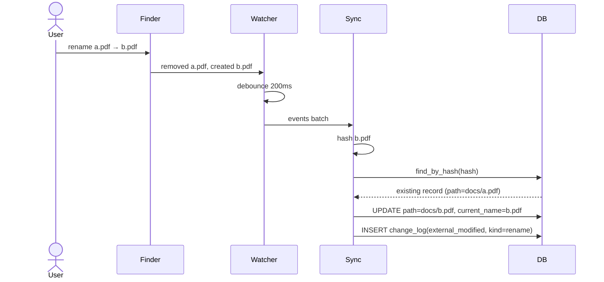

### 伪代码

```rust
fn handle_rename(repo: &Path, removed: &Path, created: &Path) -> CoreResult<()> {
    let new_hash = sha256_file(created)?;
    let new_size = std::fs::metadata(created)?.len() as i64;

    let existing = db::find_active_by_hash(repo, &new_hash)?;
    let removed_rel = removed.strip_prefix(repo)?.to_string_lossy();

    match existing {
        Some(e) if e.path == removed_rel => {
            let new_rel = created.strip_prefix(repo)?.to_string_lossy();
            db::with_repo(repo, |conn| {
                let tx = conn.transaction()?;
                db::update_path(&tx, e.id, &new_rel, file_name(created))?;
                db::insert_change(&tx, e.id, ChangeAction::ExternalModified, json!({
                    "kind": "rename",
                    "from_path": removed_rel,
                    "to_path": new_rel,
                    "by": "external",
                }))?;
                tx.commit()?;
                Ok(())
            })
        }
        _ => handle_unmatched_create(repo, created, &new_hash, new_size)
    }
}
```

---

## 场景 2：move 跨分类

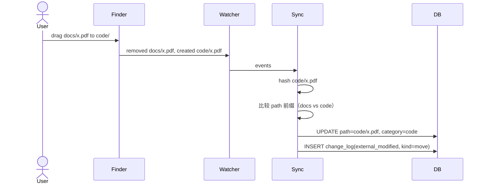

### 伪代码

```rust
fn handle_move_cross_category(
    repo: &Path,
    existing: &FileEntry,
    new_path: &Path,
) -> CoreResult<()> {
    let new_rel = new_path.strip_prefix(repo)?.to_string_lossy().to_string();
    let new_category = top_level_dir(&new_rel)
        .unwrap_or_else(|| "__root__".into());

    db::with_repo(repo, |conn| {
        let tx = conn.transaction()?;
        db::update_path_and_category(&tx, existing.id, &new_rel, &new_category, &existing.current_name)?;
        db::insert_change(&tx, existing.id, ChangeAction::ExternalModified, json!({
            "kind": "move",
            "from_path": existing.path,
            "to_path": new_rel,
            "from_category": existing.category,
            "to_category": new_category,
            "by": "external",
        }))?;
        tx.commit()?;
        Ok(())
    })
}
```

如果 `new_category` 不在 `classifier.yaml` 中：照样写入 path。`category` 字段直接存目录名，UI 显示时若 classifier 没匹配则按 Subdir 渲染。详见 [../modules/tree-scan.md](../modules/tree-scan.md)。

---

## 场景 3：delete

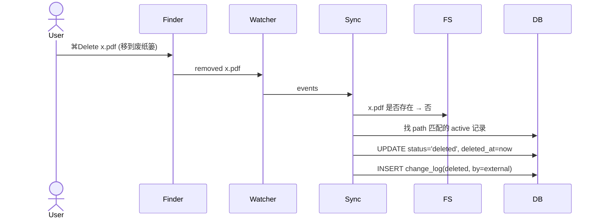

### 决策树

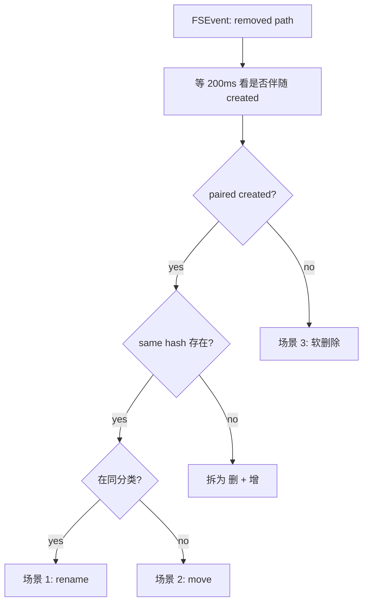

### 伪代码

```rust
fn handle_delete(repo: &Path, removed_path: &Path) -> CoreResult<()> {
    let rel = removed_path.strip_prefix(repo)?.to_string_lossy().to_string();
    let existing = db::find_active_by_path(repo, &rel)?;
    let Some(e) = existing else { return Ok(()); };

    db::with_repo(repo, |conn| {
        let tx = conn.transaction()?;
        db::soft_delete(&tx, e.id)?;
        db::insert_change(&tx, e.id, ChangeAction::Deleted, json!({
            "hard": false, "by": "external",
        }))?;
        tx.commit()?;
        Ok(())
    })
}
```

---

## 场景 4：modify content

文件路径不变，内容变化（mtime / size / hash 变了）。

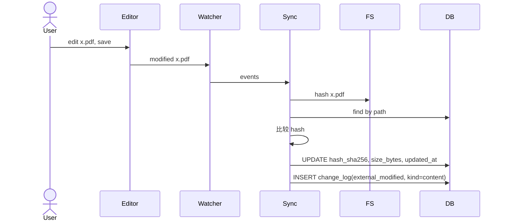

```rust
fn handle_content_modify(
    repo: &Path,
    path: &Path,
    existing: &FileEntry,
) -> CoreResult<()> {
    let new_hash = sha256_file(path)?;
    if new_hash == existing.hash_sha256 {
        return Ok(());
    }
    let size = std::fs::metadata(path)?.len() as i64;
    db::with_repo(repo, |conn| {
        let tx = conn.transaction()?;
        db::update_hash(&tx, existing.id, &new_hash, size)?;
        db::insert_change(&tx, existing.id, ChangeAction::ExternalModified, json!({
            "kind": "content",
            "hash_before": existing.hash_sha256,
            "hash_after": new_hash,
            "by": "external",
        }))?;
        tx.commit()?;
        Ok(())
    })
}
```

---

## 场景 5：create new file（用户在 Finder 直接放入）

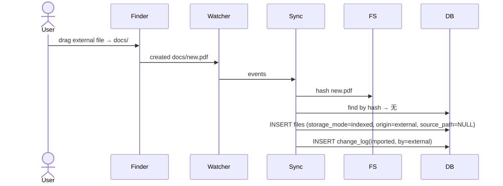

```rust
fn handle_external_create(
    repo: &Path,
    path: &Path,
    hash: &str,
    size: i64,
) -> CoreResult<()> {
    let rel = path.strip_prefix(repo)?.to_string_lossy().to_string();
    let category = top_level_dir(&rel).unwrap_or_else(|| "__root__".into());
    let original_name = path.file_name().and_then(|s| s.to_str()).unwrap_or("unnamed").to_string();

    db::with_repo(repo, |conn| {
        let tx = conn.transaction()?;
        let id = db::insert_active(&tx, NewFileRow {
            path: rel.clone(),
            original_name: original_name.clone(),
            current_name: original_name,
            category,
            size_bytes: size,
            hash_sha256: hash.into(),
            storage_mode: StorageMode::Indexed,
            origin: FileOrigin::External,
            source_path: None,
            imported_at: chrono::Utc::now().timestamp(),
        })?;
        db::insert_change(&tx, id, ChangeAction::Imported, json!({
            "mode": "indexed",
            "source": "external",
            "by": "external",
        }))?;
        tx.commit()?;
        Ok(())
    })
}
```

---

## 场景 6：delete category dir

用户在 Finder 把整个 `docs/` 目录拖到废纸篓。

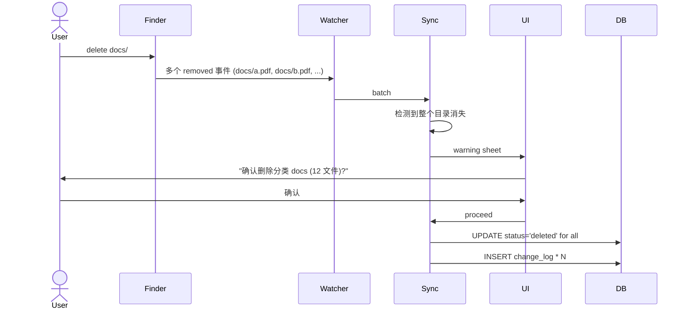

### 启发式判断

```rust
fn detect_category_drop(events: &[FsEvent]) -> Option<String> {
    let removed: Vec<&str> = events.iter()
        .filter(|e| e.kind == FsEventKind::Removed)
        .map(|e| e.path.as_str())
        .collect();

    if removed.len() < 5 { return None; }

    let mut top_dirs: HashMap<&str, usize> = HashMap::new();
    for path in &removed {
        if let Some(top) = path.split('/').next() {
            *top_dirs.entry(top).or_insert(0) += 1;
        }
    }

    top_dirs.iter()
        .max_by_key(|(_, n)| *n)
        .filter(|(_, n)| **n >= 5)
        .map(|(k, _)| k.to_string())
}
```

警告但**不强制**：用户的删除是有意的，warning 仅做防误触。下次 reindex 不会自动恢复。

---

## 场景 7：edit overview / README

详见 [../modules/overview-gen.md](../modules/overview-gen.md)。

简短：

- 用户编辑已有 `README.md`：视为普通文件修改，不触发概览重生成，也不被应用覆盖
- 用户编辑 `.areamatrix/generated/*.md`：视为派生文件，下次重生成会覆盖
- 用户启用并编辑根目录 `AREAMATRIX.md`：应用只维护标记块，标记块外内容保留

派生概览不写 change_log；用户 `README.md` 若在索引范围内，则按普通文件内容变更处理。

---

## 场景 8：edit companion `.md`

伴生笔记 `<filename>.md` 是 DB ↔ FS 双向同步。

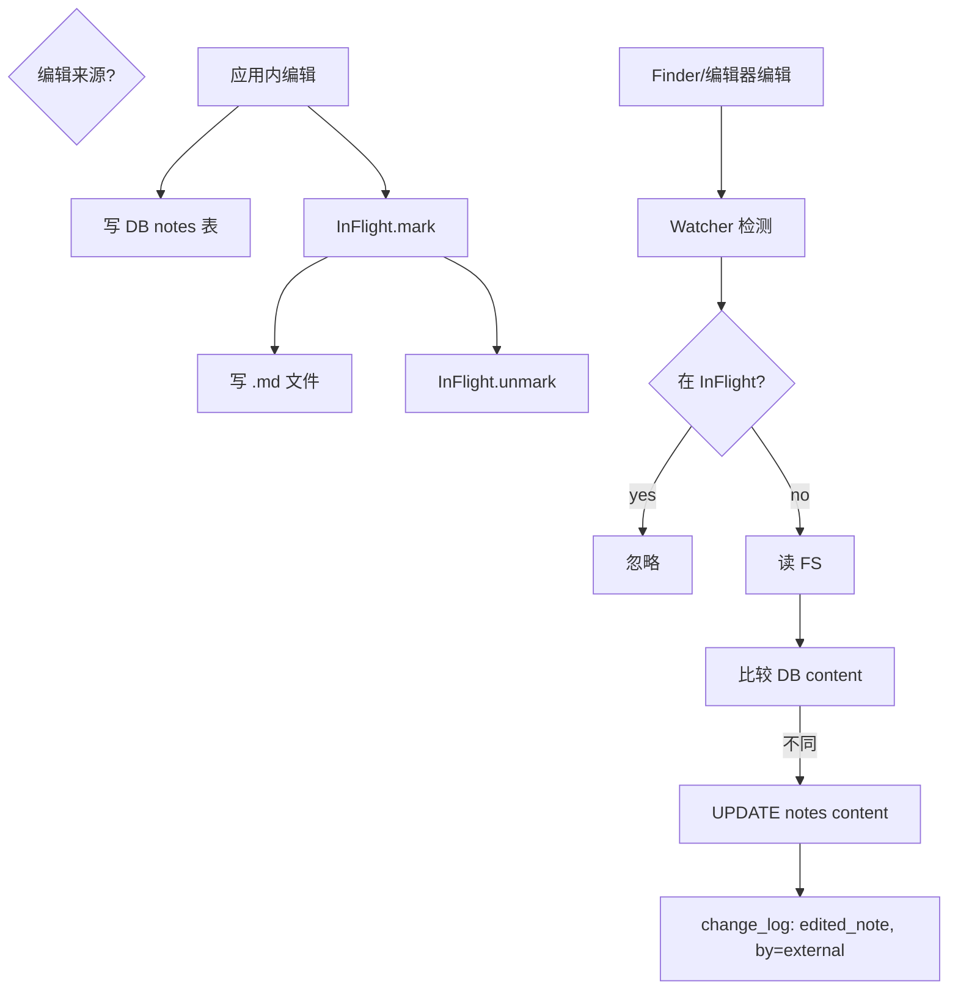

```rust
fn handle_companion_edit(repo: &Path, md_path: &Path) -> CoreResult<()> {
    let rel = md_path.strip_prefix(repo)?.to_string_lossy().to_string();

    let parent_path_str = rel.trim_end_matches(".md");
    let parent_file = db::find_active_by_path(repo, parent_path_str)?;
    let Some(file) = parent_file else { return Ok(()); };

    let fs_content = std::fs::read_to_string(md_path)?;
    let db_content = db::read_note(repo, file.id)?.unwrap_or_default();
    if fs_content == db_content { return Ok(()); }

    db::with_repo(repo, |conn| {
        let tx = conn.transaction()?;
        db::upsert_note(&tx, file.id, &fs_content)?;
        db::insert_change(&tx, file.id, ChangeAction::EditedNote, json!({
            "length_before": db_content.len(),
            "length_after": fs_content.len(),
            "by": "external",
        }))?;
        tx.commit()?;
        Ok(())
    })
}
```

---

## 场景 9：DB lost / `.areamatrix` 被删

启动检测 → 弹用户对话 → reindex。

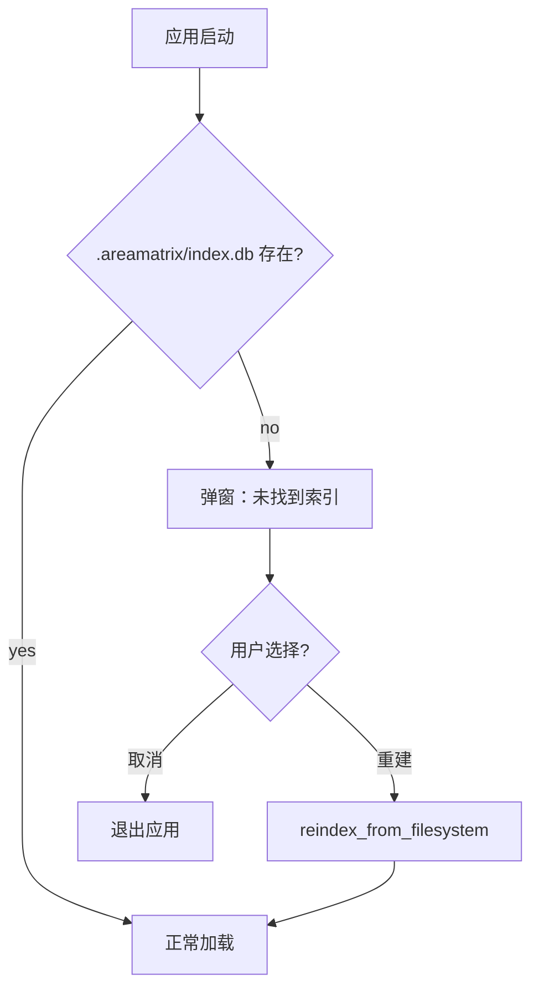

**用户文件完全不丢**。change_log 全部丢失（无可恢复）。

---

## 9 场景速查表

| 场景 | 触发 | DB 动作 | change_log action | by |
|---|---|---|---|---|
| 1 rename | 同分类内改名 | UPDATE path, current_name | external_modified, kind=rename | external |
| 2 move | 跨分类移动 | UPDATE path, category | external_modified, kind=move | external |
| 3 delete | 移废纸篓 / 删除 | UPDATE status='deleted' | deleted, by=external | external |
| 4 modify content | 内容变化 | UPDATE hash, size | external_modified, kind=content | external |
| 5 external create | 新文件出现 | INSERT files(origin=external) | imported, source=external | external |
| 6 category drop | 整个分类被删 | 多条 UPDATE status='deleted' | 多条 deleted | external |
| 7 overview / README edit | 改派生概览或用户 README | 概览不动 DB；用户 README 按普通文件处理 | — / external_modified | — / external |
| 8 note edit | 改 .md 文件 | UPDATE notes | edited_note, by=external | external |
| 9 DB lost | 删 `.areamatrix/` | reindex 重建(origin=external) | imported * N | startup_reconcile |

---

## 冲突决策树（多事件同时到达）

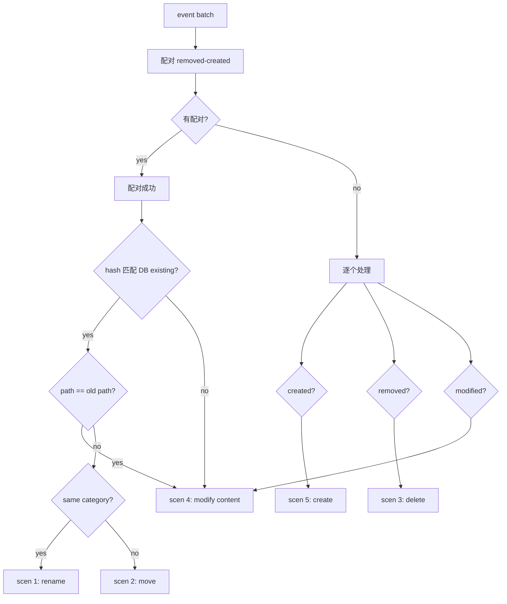

实现见 [fs-watcher.md](fs-watcher.md) 的 `pair_events` 章节。

---

## 一致性检查（启动时）

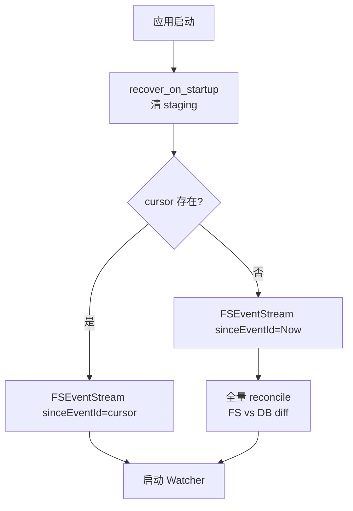

`reconcile` 工作量与文件数成正比（10 万文件下约 5-10s）。仅在 cursor 不存在或损坏时全量做。

### reconcile 算法

```rust
pub fn reconcile_full(repo: &Path) -> CoreResult<ReconcileReport> {
    let mut report = ReconcileReport::default();
    let fs_files = walk_repo(repo)?;
    let db_files = db::list_all_active(repo)?;

    let fs_by_path: HashMap<&str, &FsFile> = fs_files.iter().map(|f| (f.rel.as_str(), f)).collect();
    let db_by_path: HashMap<&str, &FileEntry> = db_files.iter().map(|f| (f.path.as_str(), f)).collect();

    for fs in &fs_files {
        match db_by_path.get(fs.rel.as_str()) {
            None => { handle_external_create(repo, &fs.abs, &fs.hash, fs.size)?; report.created += 1; }
            Some(db) if db.hash_sha256 != fs.hash => {
                handle_content_modify(repo, &fs.abs, db)?;
                report.content_modified += 1;
            }
            Some(_) => {}
        }
    }

    for db in &db_files {
        if !fs_by_path.contains_key(db.path.as_str()) {
            handle_delete(repo, &repo.join(&db.path))?;
            report.deleted += 1;
        }
    }

    Ok(report)
}
```

---

## 不变量校验

CI 集成测试覆盖：

| 检查 | 描述 |
|---|---|
| FS 中每个文件在 DB 有 active 记录 | 启动 reconcile 后应满足 |
| DB 中每个 active 记录对应 FS 文件 | 同上 |
| hash 匹配 | path / size / hash 三个字段一致 |
| 没有孤立的 staging 行 | recover 后 status='staging' 行数为 0 |
| change_log 单调 | occurred_at 单调递增 |

`fsck` 命令（Stage 2）：用户可主动跑一致性检查并打印报告。

---

## 与产品承诺的一致性

[PRD 第 7 节](../product/prd.md) 第 4 条："真相在文件系统"。

这与本文"DB 是元数据真相"看似矛盾，实际是不同视角：

- **产品视角**（用户能感知到）：删除 `.areamatrix/` 不丢文件 = 文件是真相
- **架构视角**（实现层面）：日常运行时元数据靠 DB = DB 是元数据真相

两者协同：DB 是高效的索引层，FS 是兜底的真相层。一旦 DB 出问题可从 FS 重建（丢历史但不丢文件）。

---

## Related

- [overview.md](overview.md)
- [adopt-existing-folders.md](adopt-existing-folders.md)
- [data-model.md](data-model.md)
- [fs-watcher.md](fs-watcher.md)
- [transactional-import.md](transactional-import.md)
- [../adr/0003-source-of-truth-strategy.md](../adr/0003-source-of-truth-strategy.md)
- [../modules/change-log.md](../modules/change-log.md)
