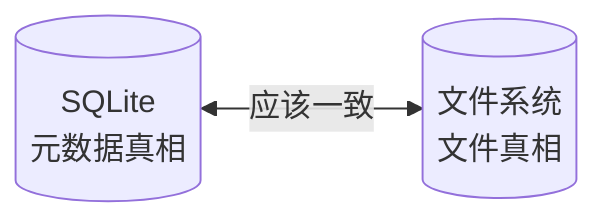
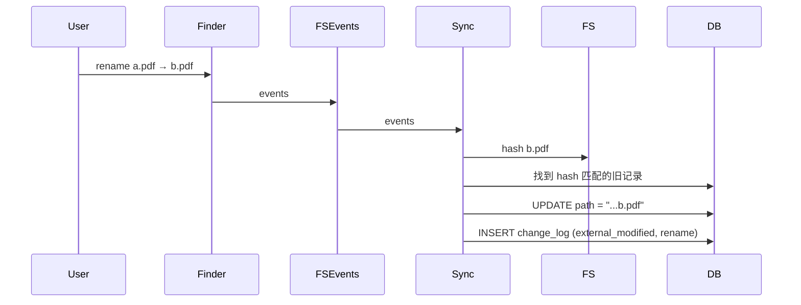
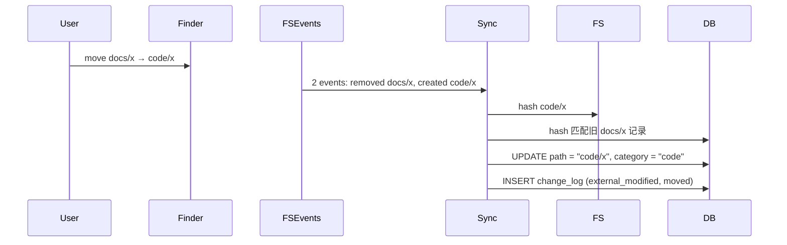
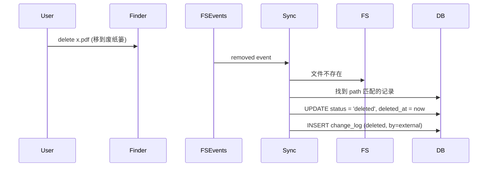
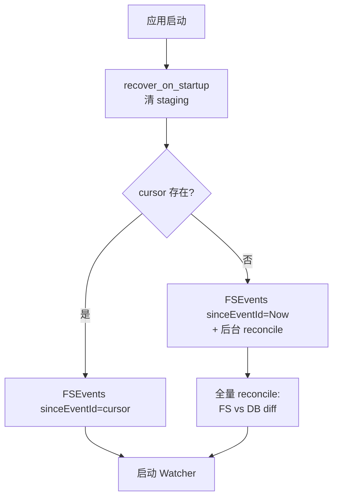

# 真相源策略

> 当 SQLite 元数据与文件系统状态不一致时，谁说了算？AreaMatrix 选择**混合策略**：DB 是元数据真相、FS 是文件本身的真相，FSEvents 让两者最终一致。
>
> 阅读时长：约 6 分钟。

---

## 问题：两个真相源

资料库的"状态"由两个独立来源构成：



理想状态下两者一致。但有多个场景会让它们短暂不一致：
- 用户在 Finder 改资料库（FS 变了，DB 没变）
- 应用 import 中崩溃（FS 半成品，DB 半成品）
- iCloud 同步在远端动了文件
- 第三方工具（命令行 / 备份软件）改了资料库

---

## 三种可能的策略

### 策略 A：DB 优先（DB-first）

每次冲突以 DB 为准，外部修改被覆盖回 DB 中的版本。

| 优点 | 缺点 |
|---|---|
| 内部一致性强 | 用户在 Finder 的修改被回滚 |
| 实现简单 | 用户体验糟糕 |

### 策略 B：FS 优先（FS-first）

每次冲突以 FS 为准，DB 被同步到 FS 状态。

| 优点 | 缺点 |
|---|---|
| 用户在 Finder 的操作被尊重 | 改动历史可能被无意覆盖 |
| 可解释 | 元数据（笔记、标签）易丢 |

### 策略 C：混合（Hybrid）✅

不同维度选不同策略：

| 维度 | 真相源 | 理由 |
|---|---|---|
| 文件内容 | FS | 用户视角文件就是真相 |
| 文件存在性 | FS（FS 删 = DB 软删） | 用户在 Finder 删除是有意的 |
| 文件位置 | FS（FS rename = DB 更新 path） | 通过 hash 识别 rename |
| 元数据：分类 | DB（除非文件被移动到别的分类目录） | 分类记录在 DB |
| 元数据：笔记 | DB ↔ 双向同步 `<filename>.md` | 给用户一致体验 |
| 改动历史 | DB | FS 不存历史 |
| 标签 | DB | FS 不存标签 |
| Hash | 实时计算 | 不存 |

---

## 决策：Hybrid

详见 [../adr/0003-source-of-truth-strategy.md](../adr/0003-source-of-truth-strategy.md)。

核心规则：

> **DB 是元数据真相、FS 是文件本身的真相。FSEvents 让 DB 跟随 FS 变化更新元数据，DB 不能否决用户在 FS 的操作。**

---

## 各场景下的具体行为

### 场景 1：用户在 Finder 重命名文件



**结果**：DB 跟随 FS。`change_log` 记录了 `rename_from / rename_to`。

### 场景 2：用户在 Finder 把文件从 docs/ 拖到 code/



**结果**：DB 反映新分类。原本 DB 中的 `category=docs` 被覆盖为 `code` —— 因为用户用 FS 操作表达了"我要换分类"的意图。

### 场景 3：用户在 Finder 删除文件



**结果**：DB 软删除。改动历史保留。如果用户从废纸篓恢复（FS 重新出现）→ Sync 检测到 hash 匹配的 deleted 记录 → 自动 restore。

### 场景 4：用户在 Finder 删除整个分类目录

警告但执行：DB 中该分类下所有文件软删除，目录消失。change_log 记录每条删除。下次 reindex 不会自动恢复（用户的删除是有意的）。

### 场景 5：用户在 Finder 修改 README.md

我们的 README 是自动生成的。但**保留用户标记区域之外手动添加的内容**：

```markdown
<!-- AREAMATRIX:BEGIN -->
... 自动生成的内容 ...
<!-- AREAMATRIX:END -->

## 用户手动添加（自动重新生成时保留）

这一段不会被覆盖。
```

下次重新生成时只替换 `BEGIN/END` 之间的部分。

### 场景 6：用户在 Finder 修改伴生笔记 `<filename>.md`

伴生笔记是用户写的，DB 也有副本。冲突策略：FS 为真相，DB 同步到 FS。

```rust
fn sync_note(repo: &Path, file_id: i64, file_path: &Path) -> CoreResult<()> {
    let note_path = file_path.with_extension("md");
    if note_path.exists() {
        let content = std::fs::read_to_string(&note_path)?;
        let db_content = db::read_note(file_id)?;
        if Some(&content) != db_content.as_ref() {
            db::upsert_note(file_id, &content, file_mtime(&note_path)?)?;
            db::insert_change(file_id, ChangeAction::EditedNote,
                json!({"by": "external"}))?;
        }
    }
    Ok(())
}
```

应用内修改笔记时反向：写 DB + 写 `<filename>.md`。

### 场景 7：DB 损坏 / 用户手动删除 .areamatrix/

**结果**：用户文件**完全不丢**。
- 启动检测：DB 不存在 → 弹"是否重建索引"
- 用户确认 → reindex_from_filesystem
- 重建 files 表（每个文件计算 hash 入库）
- change_log 全部丢失（无可恢复）

**这是产品级承诺**：删除 `.areamatrix/` 不应丢失文件本身。

### 场景 8：FS 中存在某文件但 DB 没记录

启动 reindex 或周期性扫描发现"FS 多出一个 DB 不知道的文件"：

- **action**：当作 indexed 模式登记
- 计算 hash
- INSERT files (status=active, storage_mode=indexed, source_path=NULL)
- INSERT change_log (action=imported, by=external)

### 场景 9：DB 中存在某记录但 FS 没文件

启动检查或周期性扫描发现"DB 说有但 FS 没了"：

- **action**：软删除
- UPDATE files SET status='deleted', deleted_at=now
- INSERT change_log (deleted, by=startup_reconcile)

---

## 一致性检查（启动时）



`reconcile` 工作量与文件数成正比（10 万文件下约 5-10s）。所以仅在 cursor 不存在或损坏时全量做。

---

## 不变量校验

CI 集成测试覆盖：

| 检查 | 描述 |
|---|---|
| FS 中每个文件在 DB 有 active 记录 | 启动 reconcile 后应满足 |
| DB 中每个 active 记录对应 FS 文件 | 同上 |
| hash 匹配 | path、size 与 hash 三个字段一致 |
| 没有孤立的 staging 行 | recover 后 status='staging' 行数为 0 |
| change_log 单调 | occurred_at 单调递增 |

`fsck` 命令（Stage 2 加）：用户可主动跑一致性检查并打印报告。

---

## 与产品承诺的一致性

[PRD 第 7 节](../product/prd.md#7-设计原则产品层) 第 4 条："真相在文件系统"。

这与本文"DB 是元数据真相"看似矛盾，实际是不同视角：

- **产品视角**（用户能感知到）：删除 `.areamatrix/` 不丢文件 = 文件是真相
- **架构视角**（实现层面）：日常运行时元数据靠 DB = DB 是元数据真相

两者协同：DB 是高效的索引层，FS 是兜底的真相层。一旦 DB 出问题可从 FS 重建（丢历史但不丢文件）。

---

## Related

- [overview.md](overview.md)
- [data-model.md](data-model.md)
- [fs-watcher.md](fs-watcher.md)
- [transactional-import.md](transactional-import.md)
- [../adr/0003-source-of-truth-strategy.md](../adr/0003-source-of-truth-strategy.md)
