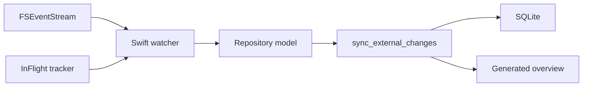

# 真相源策略

> 定义 AreaMatrix 在用户文件、SQLite 元数据、笔记 sidecar、生成内容和外部变化之间的权威边界。
>
> 阅读时长：约 8 分钟。

---

## 核心结论

AreaMatrix 使用分域真相源，不把文件系统或数据库解释为唯一权威：

| 数据 | 权威来源 | 当前行为 |
|---|---|---|
| 用户文件内容、存在性和物理路径 | 文件系统 | Core 读取现状并更新索引，不用 DB 覆盖外部修改 |
| 文件分类 | 文件系统路径派生 | 顶层目录映射为 category |
| 文件 hash 和 size | DB 中的最近一次已确认快照 | create、modify、rename 和 reindex 时从文件重新计算并持久化 |
| 标签、搜索、Undo/Redo、历史 | SQLite | 不从文件系统重建 |
| 笔记 | SQLite 与受管 sidecar 的一致合同 | 仅 Core note API 同步写入；不接受静默分叉 |
| FSEvents cursor | SQLite `fs_event_cursor` | 只在可重放边界成功后单调推进 |
| 自动概览 | DB 派生 | 默认只写 `.areamatrix/generated/` |
| 用户 `README.md` | 文件系统 | 应用不得覆盖 |

删除 `.areamatrix/` 不会删除用户文件，但会丢失无法从文件恢复的标签、历史、配置和其他元数据。
恢复或重建必须由用户确认，不能把自动推测当成完整恢复。

## 文件安全不变量

- 接管已有目录不移动、不重命名、不删除、不覆盖已有用户文件。
- 外部同步只登记已经发生的文件变化，不执行物理 rename、move 或 delete。
- 自动生成内容默认只写入 `.areamatrix/generated/`。
- 应用不得覆盖用户已有 `README.md`。
- iCloud placeholder 不触发隐式下载。
- DB、overview 或 cursor 失败时，事件必须可以安全重放。

## 外部变化调用链

```mermaid
flowchart LR
    fsevents["FSEventStream"]
    watcher["Swift watcher"]
    tracker["InFlight tracker"]
    model["Repository model"]
    core["sync_external_changes"]
    db["SQLite"]
    overview["Generated overview"]

    fsevents --> watcher
    tracker --> watcher
    watcher --> model
    model --> core
    core --> db
    core --> overview
```

Swift 平台层负责 FSEvents、路径过滤、200ms 合并、InFlight 过滤和恢复路由。Core 只接收规范化事件，保持平台无关。

## 事件语义

### Created

- 读取现存普通文件的 metadata、SHA-256 和 size。
- 新路径写入 `origin=external`、`storage_mode=indexed` 的 active row。
- active 同路径事件幂等跳过。
- deleted 同路径重新出现时，复用原 row 并更新 metadata、清除 `deleted_at`、恢复为 active。
- staging 同路径属于冲突，不能覆盖。
- change log action 为 `external_modified`，detail 中记录 `kind=create`。

### Renamed

- Swift 不通过 inode 配对旧路径和新路径。
- Core 对新路径计算 hash，并在 active rows 中寻找唯一候选。
- 唯一候选更新同一 file ID 的 path、name 和 category；零个或多个候选返回 Conflict。
- 同批对应的 removed 计划会被抑制，避免先 rename 后 soft delete 同一 row。
- change log action 为 `renamed`。

### Modified

- 已登记文件在 hash 或 size 变化时更新 metadata，并写 `external_modified`。
- hash 和 size 都未变化时幂等跳过。
- 现存路径没有 active row 时按 Created 处理。

### Removed

- 只有路径已经不存在时才 soft-delete active row。
- 不存在 active row 时幂等跳过。
- change log action 为 `deleted`。

## 受管笔记 sidecar

笔记 sidecar 路径为 `<filename>.md`，与基础文件同目录。它只在以下条件同时成立时被识别为受管 sidecar：

1. 去掉 `.md` 后的基础路径对应 active file row。
2. 该 file ID 在 `notes` 表中存在记录。

受管 sidecar 的 watcher 重放只推进 cursor，不把 sidecar 登记成普通 external 文件。没有上述合同的普通 Markdown 文件仍按普通文件处理。

外部编辑 sidecar 不会自动回写 DB。`read_note` 要求 DB 与 sidecar 内容一致；`write_note` 在写入前也验证旧状态：

- DB 和 sidecar 都不存在：可以创建。
- 两者存在且内容一致：可以替换。
- 只有一侧存在或内容不一致：返回错误，不覆盖用户内容。
- sidecar 先原子写入；DB note 与 `edited_note` change log 在同一事务写入。
- DB 写入失败时恢复旧 sidecar。

## Cursor 与重放

Core 对收到的全部合法 event ID 计算最大值，包括最终被判定为受管 sidecar或幂等跳过的事件。

正常批次顺序：

1. 规划事件。
2. 在一个 SQLite 事务中提交 files 和 change log。
3. 更新受影响 overview。
4. 将批次最大 event ID 单调写入 `fs_event_cursor`。

Swift watcher 还保留批次 `cursorWatermark`，即该次 FSEvents 回调窗口观察到的最大 event ID：

- 有业务信号时，每个信号携带同一个批次 watermark。
- Core 成功后，如果 watermark 大于实际提交事件的最大 ID，Swift 补写 cursor。
- 全部事件在 Swift 层被 InFlight 或路径规则过滤时，Swift 直接单调确认 watermark。
- 补写失败会进入确认重扫，不会静默丢弃历史。

DB 事务失败时 metadata 和 change log 回滚；overview 或 cursor 失败时 cursor 不推进。DB 已提交但后续失败的批次必须依靠幂等规则安全重放。

## 启动与恢复

- 有 cursor：FSEventStream 从该 event ID 启动。
- 无 cursor：请求用户确认全量重扫，不从 `SinceNow` 静默开始。
- dropped、wrapped 或 must-scan flags：停止 stream，并进入确认重扫。
- RootChanged：停止 stream，并要求重新连接资料库路径。
- 重扫完成后写入预先记录的 resume seed，再重新打开资料库和 watcher。

当前没有通用 `reconcile_full` 或用户可调用的 `fsck` API。文件系统重建走受支持的 repair/reindex 流程，并保留用户确认、诊断快照和文件安全边界。

## Related

- [文件监听与外部变化同步](fs-watcher.md)
- [事务式导入](transactional-import.md)
- [数据模型](data-model.md)
- [Core API](../api/core-api.md)
- [真相源 ADR](../adr/0003-source-of-truth-strategy.md)
