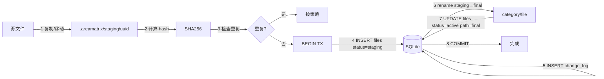
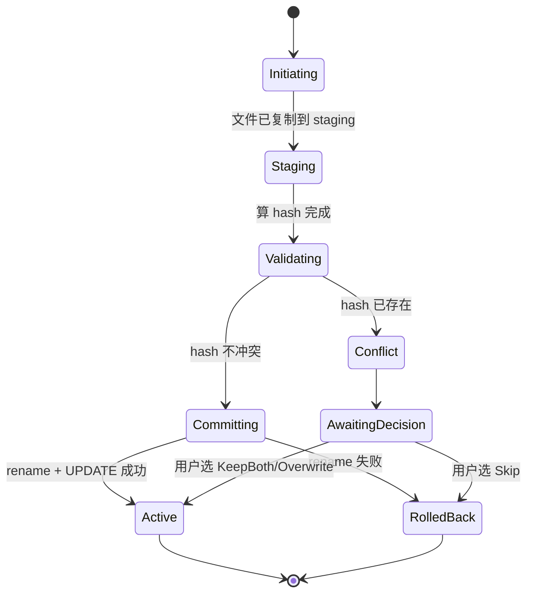
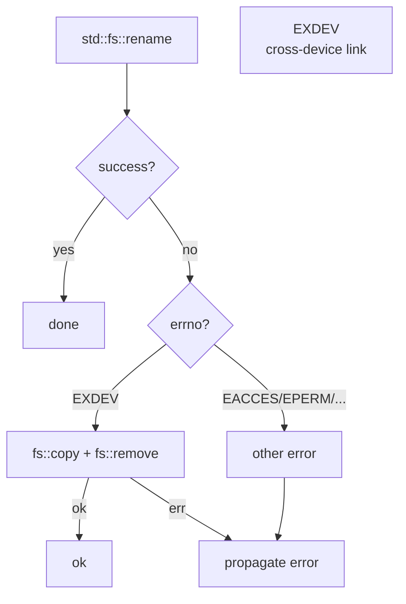
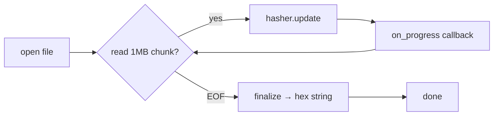

# 事务式导入

> 任何中断（应用崩溃 / 系统断电 / 强 kill）都不能让用户丢文件、不能留下半成品。AreaMatrix 通过 staging 区 + DB 事务 + 显式状态机实现这一目标。
>
> 阅读时长：约 14 分钟。

---

## 目标（不变量）

- **INV-1**：成功 import 的文件同时在 FS 和 DB 中可见
- **INV-2**：失败的 import 不留下 DB 记录或最终目录中的半文件
- **INV-3**：staging 区的中间产物对用户视图不可见
- **INV-4**：staging 区不会因长时间运行无限膨胀（GC）
- **INV-5**：跨卷场景下 rename 失败时 fallback 到 copy+remove
- **INV-6**：分块 hash 过程中可中断，已计算的部分能被回收

---

## 整体流程



任何步骤失败：`ROLLBACK` + `StagingGuard` 自动删除 staging 文件，最终目录无变化。

---

## 状态机



DB 中 `files.status` 字段反映 `Staging` / `Active` / `Deleted`。其他中间状态在内存中维护。

---

## staging 目录结构

```text
<repo>/.areamatrix/staging/
├── 01HF5Y...uuid1     // 当前进行中的 import
├── 01HF5Y...uuid2     // 另一个并发 import
└── tmp_chunked/       // 分块 hash 产生的中间文件（Stage 2）
    └── 01HF5Y.../
        ├── chunk-0
        ├── chunk-1
        └── ...
```

每个 staging 文件名是 UUIDv7（带时间戳前缀），便于 GC 时按时间筛选。

---

## staging GC

### 触发时机

| 时机 | 动作 |
|---|---|
| 应用启动 | `recover_on_startup` 全清 staging（保守） |
| 每次成功 import 之后 | 检查并清理超过 24h 的孤儿 staging |
| 用户手动「清理临时文件」 | 立即扫 + 删 |
| 后台定时任务 | 每 6h 一次扫 |

### 实现

```rust
// core/src/storage/gc.rs
use std::path::Path;
use std::time::{Duration, SystemTime};
use crate::error::CoreResult;
use crate::repo::RepoLayout;

const STAGING_TTL: Duration = Duration::from_secs(24 * 3600);

pub struct GcReport {
    pub scanned: usize,
    pub deleted: usize,
    pub freed_bytes: u64,
    pub errors: Vec<String>,
}

pub fn run_staging_gc(repo: &Path) -> CoreResult<GcReport> {
    let layout = RepoLayout::for_repo(repo);
    let staging_dir = layout.staging_dir();

    let mut report = GcReport {
        scanned: 0, deleted: 0, freed_bytes: 0, errors: Vec::new(),
    };

    if !staging_dir.exists() {
        return Ok(report);
    }

    let now = SystemTime::now();
    let live_ids: std::collections::HashSet<String> = crate::db::with_repo(repo, |conn| {
        let mut stmt = conn.prepare(
            "SELECT path FROM files WHERE status = 'staging'"
        )?;
        let rows = stmt.query_map([], |r| r.get::<_, String>(0))?;
        rows.filter_map(|r| r.ok())
            .filter_map(|p| std::path::Path::new(&p).file_name().map(|s| s.to_string_lossy().to_string()))
            .collect::<std::collections::HashSet<_>>()
            .pipe(Ok)
    })?;

    for entry in std::fs::read_dir(&staging_dir)? {
        let entry = match entry {
            Ok(e) => e,
            Err(e) => { report.errors.push(e.to_string()); continue; }
        };
        if !entry.file_type()?.is_file() { continue; }
        report.scanned += 1;

        let name = entry.file_name().to_string_lossy().to_string();
        if live_ids.contains(&name) {
            continue;
        }

        let metadata = entry.metadata()?;
        let mtime = metadata.modified()?;
        let age = now.duration_since(mtime).unwrap_or(Duration::ZERO);
        if age < STAGING_TTL {
            continue;
        }

        let size = metadata.len();
        match std::fs::remove_file(entry.path()) {
            Ok(()) => {
                report.deleted += 1;
                report.freed_bytes += size;
            }
            Err(e) => report.errors.push(format!("delete {}: {}", name, e)),
        }
    }

    Ok(report)
}

trait Pipe: Sized {
    fn pipe<R>(self, f: impl FnOnce(Self) -> R) -> R { f(self) }
}
impl<T> Pipe for T {}
```

### 决策表

| staging 文件 | DB staging 行 | 文件年龄 | 动作 |
|---|---|---|---|
| 存在 | 存在 | < 24h | 保留（可能正在 import） |
| 存在 | 存在 | ≥ 24h | 删文件 + 删 DB 行（recovery） |
| 存在 | 不存在 | 任何 | 删文件（孤儿） |
| 不存在 | 存在 | 任何 | 删 DB 行（孤儿 row） |

---

## 跨卷 rename fallback



```rust
fn rename_with_fallback(from: &Path, to: &Path) -> CoreResult<()> {
    if let Some(parent) = to.parent() {
        std::fs::create_dir_all(parent)?;
    }

    match std::fs::rename(from, to) {
        Ok(()) => Ok(()),
        Err(e) if is_cross_device(&e) => {
            tracing::info!(from = %from.display(), to = %to.display(),
                "cross-device rename, falling back to copy+remove");
            copy_then_remove(from, to)
        }
        Err(e) => Err(e.into()),
    }
}

#[cfg(unix)]
fn is_cross_device(e: &std::io::Error) -> bool {
    e.raw_os_error() == Some(libc::EXDEV)
}

#[cfg(windows)]
fn is_cross_device(e: &std::io::Error) -> bool {
    e.raw_os_error() == Some(17)
}

fn copy_then_remove(from: &Path, to: &Path) -> CoreResult<()> {
    let copied_size = std::fs::copy(from, to)?;
    let original_size = std::fs::metadata(from)?.len();
    if copied_size != original_size {
        let _ = std::fs::remove_file(to);
        return Err(CoreError::Io(format!(
            "size mismatch after copy: {} vs {}", copied_size, original_size
        )));
    }
    if let Err(e) = std::fs::remove_file(from) {
        tracing::warn!(path = %from.display(), error = %e,
            "failed to remove source after cross-device copy");
    }
    Ok(())
}
```

跨卷场景：

- 用户拖入位于外接硬盘的文件 → 资料库在内置 SSD
- 资料库放在 NAS 挂载点
- 不同 APFS Volume Group

---

## 大文件分块 hash + 进度回调

### 算法



### 实现

```rust
// core/src/storage/hash.rs
use std::fs::File;
use std::io::{BufReader, Read};
use std::path::Path;
use std::sync::atomic::{AtomicBool, Ordering};
use std::sync::Arc;

use sha2::{Digest, Sha256};

use crate::error::{CoreError, CoreResult};

const CHUNK: usize = 1024 * 1024;

pub struct HashProgress {
    pub bytes_done: u64,
    pub bytes_total: u64,
    pub elapsed_ms: u64,
}

pub fn sha256_with_progress(
    path: &Path,
    on_progress: &mut dyn FnMut(HashProgress),
    cancel: Option<Arc<AtomicBool>>,
) -> CoreResult<String> {
    let total = std::fs::metadata(path)?.len();
    let mut reader = BufReader::with_capacity(CHUNK, File::open(path)?);
    let mut hasher = Sha256::new();
    let mut buf = [0u8; CHUNK];
    let mut done: u64 = 0;
    let started = std::time::Instant::now();

    loop {
        if let Some(flag) = &cancel {
            if flag.load(Ordering::Relaxed) {
                return Err(CoreError::Internal { message: "hash cancelled".into() });
            }
        }
        let n = reader.read(&mut buf)?;
        if n == 0 { break; }
        hasher.update(&buf[..n]);
        done += n as u64;
        on_progress(HashProgress {
            bytes_done: done,
            bytes_total: total,
            elapsed_ms: started.elapsed().as_millis() as u64,
        });
    }
    Ok(format!("{:x}", hasher.finalize()))
}
```

### 在 import_file 中集成

```rust
let cancel_flag = Arc::new(AtomicBool::new(false));
let mut last_emit = std::time::Instant::now();

let hash = hash::sha256_with_progress(
    &staging_path,
    &mut |progress| {
        if last_emit.elapsed() >= std::time::Duration::from_millis(100) {
            last_emit = std::time::Instant::now();
            if let Some(cb) = &options.progress_callback {
                cb.on_hash_progress(progress.bytes_done, progress.bytes_total);
            }
        }
    },
    Some(cancel_flag.clone()),
)?;
```

进度上报频率限制为 10 Hz（每 100ms 最多一次），避免 FFI 边界压力。

### Swift 端接收进度

```swift
public protocol ImportProgressListener: AnyObject {
    func onStaging(bytesDone: Int64, bytesTotal: Int64)
    func onHashProgress(bytesDone: Int64, bytesTotal: Int64)
    func onFinalizing()
    func onCompleted(entry: FileEntry)
    func onFailed(error: Error)
}

class ProgressBridge: ImportProgressCallback {
    weak var listener: ImportProgressListener?

    func onHashProgress(bytesDone: Int64, bytesTotal: Int64) {
        Task { @MainActor in
            listener?.onHashProgress(bytesDone: bytesDone, bytesTotal: bytesTotal)
        }
    }
}
```

详见 [../api/uniffi-recipes.md](../api/uniffi-recipes.md) 的 callback 章节。

### 大文件并行（Stage 3）

3GB+ 视频/数据集的 hash 单线程 ≈ 6-8 秒。改用 rayon 并行：

```rust
use rayon::prelude::*;

pub fn sha256_parallel(path: &Path, chunk_size: u64) -> CoreResult<String> {
    let total = std::fs::metadata(path)?.len();
    let n_chunks = ((total + chunk_size - 1) / chunk_size) as usize;

    let chunk_hashes: Vec<[u8; 32]> = (0..n_chunks).into_par_iter().map(|i| {
        use std::os::unix::fs::FileExt;
        let f = File::open(path)?;
        let offset = i as u64 * chunk_size;
        let len = std::cmp::min(chunk_size, total - offset);
        let mut buf = vec![0u8; len as usize];
        f.read_exact_at(&mut buf, offset)?;
        let mut h = Sha256::new();
        h.update(&buf);
        Ok::<_, std::io::Error>(h.finalize().into())
    }).collect::<Result<Vec<_>, _>>()?;

    let mut final_hasher = Sha256::new();
    for h in &chunk_hashes {
        final_hasher.update(h);
    }
    Ok(format!("{:x}", final_hasher.finalize()))
}
```

注意：并行 hash 的"hash of hashes"与单线程 hash 结果**不同**。需要在 schema 加 `hash_algorithm` 字段区分（`sha256` vs `sha256-of-chunks`），或仅用于内部去重不持久化。MVP 不启用。

---

## 完整 Rust 实现（含 fallback + 进度）

```rust
pub fn import_file(
    repo: &Path,
    src: &Path,
    options: ImportOptions,
) -> CoreResult<FileEntry> {
    crate::storage::validate::source_exists(src)?;
    crate::storage::validate::source_size(src, MAX_IMPORT_SIZE)?;

    let layout = RepoLayout::for_repo(repo);
    layout.ensure_dirs()?;

    let _guard = StagingGuard::new(&layout);
    let staging_path = _guard.staging_path();

    materialize_to_staging(src, &staging_path, options.mode)?;

    let mut last_progress_emit = std::time::Instant::now();
    let progress_cb = options.progress_callback.clone();
    let hash = hash::sha256_with_progress(
        &staging_path,
        &mut |p| {
            if last_progress_emit.elapsed() >= std::time::Duration::from_millis(100) {
                last_progress_emit = std::time::Instant::now();
                if let Some(cb) = &progress_cb {
                    cb.on_hash_progress(p.bytes_done, p.bytes_total);
                }
            }
        },
        None,
    )?;
    let size = std::fs::metadata(&staging_path)?.len() as i64;

    if let Some(existing) = db::find_by_hash(repo, &hash)? {
        match options.duplicate_strategy {
            DuplicateStrategy::Skip | DuplicateStrategy::Ask => {
                return Err(CoreError::DuplicateFile {
                    existing_path: existing.path.clone(),
                });
            }
            DuplicateStrategy::Overwrite => {
                db::soft_delete_by_id(repo, existing.id)?;
            }
            DuplicateStrategy::KeepBoth => {}
        }
    }

    let original_name = src.file_name().and_then(|s| s.to_str())
        .ok_or(CoreError::InvalidPath { path: src.display().to_string() })?
        .to_string();
    let category = options.override_category.clone()
        .unwrap_or_else(|| classify::classify(repo, &original_name).category);
    let target_filename = options.override_filename.clone().unwrap_or_else(|| original_name.clone());
    crate::storage::validate::filename(&target_filename)?;

    let category_dir = repo.join(&category);
    std::fs::create_dir_all(&category_dir)?;
    let final_abs = conflict::resolve_target(&category_dir, &target_filename)?;
    let final_rel = final_abs.strip_prefix(repo)
        .map_err(|_| CoreError::InvalidPath { path: final_abs.display().to_string() })?
        .to_string_lossy().to_string();
    let final_name = final_abs.file_name().and_then(|s| s.to_str())
        .unwrap_or(&target_filename).to_string();

    let new_id = db::with_repo(repo, |conn| -> CoreResult<i64> {
        let tx = conn.transaction()?;
        let id = db::insert_staging(&tx, db::NewFileRow {
            path: _guard.staging_relative_path(),
            original_name: original_name.clone(),
            current_name: final_name.clone(),
            category: category.clone(),
            size_bytes: size,
            hash_sha256: hash.clone(),
            storage_mode: options.mode,
            source_path: src.to_string_lossy().to_string(),
            imported_at: chrono::Utc::now().timestamp(),
        })?;
        tx.commit()?;
        Ok(id)
    })?;

    rename_with_fallback(&staging_path, &final_abs)?;
    _guard.disarm();

    db::with_repo(repo, |conn| -> CoreResult<()> {
        let tx = conn.transaction()?;
        db::promote_active(&tx, new_id, &final_rel, &final_name)?;
        db::insert_change(&tx, new_id, ChangeAction::Imported, json!({
            "mode": options.mode,
            "source": src.display().to_string(),
            "category": category,
            "renamed_from_original": original_name != final_name,
        }))?;
        tx.commit()?;
        Ok(())
    })?;

    crate::overview::regenerate_for_category(repo, &category)?;
    db::get_file_by_id(repo, new_id)
}
```

---

## 启动恢复

```rust
pub fn recover_on_startup(repo: &Path) -> CoreResult<RecoveryReport> {
    let mut report = RecoveryReport::default();
    let layout = RepoLayout::for_repo(repo);
    layout.ensure_dirs()?;

    let staging_rows = db::with_repo(repo, |c| db::list_staging_rows(c))?;
    for row in staging_rows {
        let abs = repo.join(&row.path);
        if abs.exists() {
            let _ = std::fs::remove_file(&abs);
            report.cleaned_staging_files += 1;
        }
        db::with_repo(repo, |conn| -> CoreResult<()> {
            let tx = conn.transaction()?;
            db::hard_delete(&tx, row.id)?;
            tx.commit()?;
            Ok(())
        })?;
        report.reverted_staging_db_rows += 1;
    }

    let staging_dir = layout.staging_dir();
    if staging_dir.exists() {
        for entry in std::fs::read_dir(&staging_dir)? {
            let entry = entry?;
            if entry.file_type()?.is_file() {
                let _ = std::fs::remove_file(entry.path());
                report.cleaned_staging_files += 1;
            }
        }
    }

    if report.cleaned_staging_files > 0 || report.reverted_staging_db_rows > 0 {
        tracing::warn!(
            cleaned = report.cleaned_staging_files,
            reverted = report.reverted_staging_db_rows,
            "recovered from interrupted import"
        );
    }
    Ok(report)
}
```

---

## 各失败场景处理

| 场景 | DB 状态 | FS 状态 | 恢复动作 |
|---|---|---|---|
| A: staging 阶段断电 | 无 staging 行 | staging 文件可能存在 | 启动删 staging 文件 |
| B: hash 阶段进程被 kill | 无 staging 行 | staging 文件存在 | 启动删 staging 文件 |
| C: INSERT 后 rename 前 panic | 有 staging 行 | staging 文件存在 | 启动删行 + 删文件 |
| D: rename 中跨卷失败 | 有 staging 行 | staging 文件存在 | 启动删行 + 删文件（用户重导） |
| E: rename 成功后 commit 失败 | 无 active 行 | 文件在 final 位置 | reindex 把孤儿文件登记 |
| F: commit 后概览重生成失败 | 数据已 active | 文件已落位 | 不影响数据；用户下次操作触发概览重写 |
| G: 24h 未完成的 staging | 有/无 staging 行 | staging 文件存在 | GC 清理 |
| H: SIGKILL 在任何阶段 | 由 SQLite WAL 自动 ROLLBACK | 启动恢复保底 | 同上 |

---

## DB 事务边界

事务**不**能跨 FFI。每次 `import_file` 调用 = 一个事务。

不在事务内的：

- 计算 hash（耗时 100ms - 数秒）
- 文件物理 IO（rename、remove_file）
- AreaMatrix 概览重生成

事务只包住：

- INSERT / UPDATE files
- INSERT change_log

事务持续时间 < 5ms（单文件场景）。

---

## 并发与死锁

### MVP 阶段

- 不支持多文件并发 import（顺序处理）
- SQLite 在 WAL 模式下读不阻塞写、写不阻塞读
- 启动恢复期间禁止用户操作（UI 显示 loading）

### Stage 2 起

- 批量导入用 worker pool（CPU 核数 × 2，封顶 8）
- 每个 worker 独立事务
- staging 文件名带 UUID 不冲突
- DB 用 `BEGIN IMMEDIATE` 抢写锁，避免 SQLITE_BUSY

详见 [concurrency.md](concurrency.md)。

---

## 性能考量

### Hash 计算

| 文件大小 | M1 SSD 单线程 SHA256 | 含 IO 总耗时 |
|---|---|---|
| 1 MB | < 5 ms | < 30 ms |
| 100 MB | 200-400 ms | 500-800 ms |
| 1 GB | 2-4 s | 4-7 s |
| 10 GB | 20-40 s | 40-70 s |

### 批量导入

50 个 5MB 文件批量导入：

- 50 × hash 串行 ≈ 1-2 s
- 50 × DB tx 总开销 ≈ 250 ms
- 50 × 概览重生成（如果不去抖）≈ 1.5 s
- 总耗时 ≈ 3-5 s

UI 体验：先所有文件 staging（快），后台慢慢算 hash 落位，UI 显示进度条；概览重生成去抖到批量结束后一次性。

---

## 进度回调 API

```rust
// area_matrix.udl
[Trait]
interface ImportProgressCallback {
    void on_staging(u64 bytes_done, u64 bytes_total);
    void on_hash_progress(u64 bytes_done, u64 bytes_total);
    void on_finalizing();
};

dictionary ImportOptions {
    StorageMode mode;
    string? override_category;
    string? override_filename;
    DuplicateStrategy duplicate_strategy;
    ImportProgressCallback? progress_callback;
};
```

回调线程：在 Rust 后台线程触发，Swift 实现需 hop 到 main actor 才能更新 UI。详见 [../api/uniffi-recipes.md](../api/uniffi-recipes.md)。

---

## 测试矩阵

| 场景 | 测试方式 | 文件 |
|---|---|---|
| 正常导入 Move/Copy/Index | 单元测试 + tempdir | `import_modes_test.rs` |
| Staging 中崩溃 | 集成测试，hash 阶段强制 panic | `crash_during_staging_test.rs` |
| Hash 重复 | 不同策略路径覆盖 | `dedup_test.rs` |
| 冲突重命名 | 相同 target_filename 多次 | `conflict_test.rs` |
| 启动恢复 | 手动放 staging 文件 + INSERT staging 行 | `recovery_test.rs` |
| 跨卷 rename | 模拟 EXDEV | `cross_device_test.rs` |
| 大文件分块 hash | 100MB+ 文件，验证进度回调 | `large_file_test.rs` |
| GC 清理 | 老化 staging 文件 mtime + 调 gc | `gc_test.rs` |
| iCloud 占位符源 | 手动测试 | 详见 [../development/testing.md](../development/testing.md) |

---

## Related

- [overview.md](overview.md)
- [data-model.md](data-model.md)
- [source-of-truth.md](source-of-truth.md)
- [concurrency.md](concurrency.md)
- [../modules/storage.md](../modules/storage.md)
- [../api/uniffi-recipes.md](../api/uniffi-recipes.md)
- [../adr/0004-transactional-storage.md](../adr/0004-transactional-storage.md)
