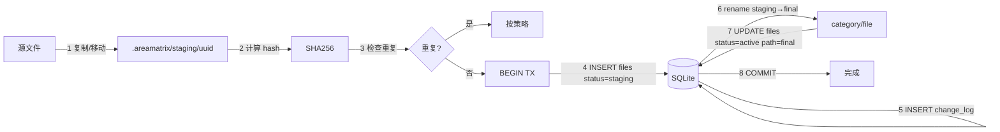
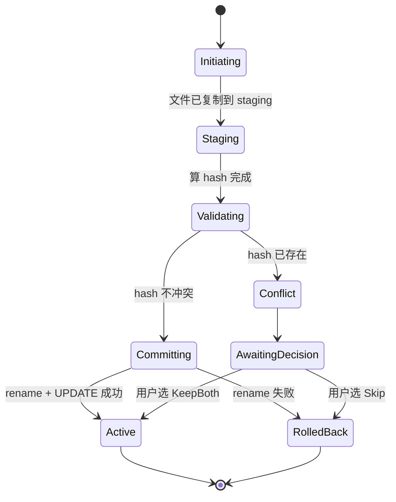

# 事务式导入

> 任何中断（应用崩溃 / 系统断电 / 强 kill）都不能让用户丢文件、不能留下半成品。AreaMatrix 通过 staging 区 + DB 事务 + 显式状态机实现这一目标。
>
> 阅读时长：约 7 分钟。

---

## 目标

- INV-1：成功 import 的文件同时在 FS 和 DB 中可见
- INV-2：失败的 import 不留下 DB 记录或最终目录中的半文件
- INV-3：staging 区的中间产物对用户视图不可见
- 启动时能自动恢复任何中断的事务

---

## 核心思路



任何步骤失败：`ROLLBACK` + 删除 staging 文件，最终目录无变化。

---

## 状态机



DB 中 `files.status` 字段反映的是 `Staging` / `Active` / `Deleted`。其他中间状态在内存中维护。

---

## 完整 Rust 实现

文件：`core/src/storage/ops.rs`

```rust
use crate::{db, domain::*, error::*};
use std::path::{Path, PathBuf};
use uuid::Uuid;

pub fn import_file(
    repo: &Path,
    src: &Path,
    options: ImportOptions,
) -> CoreResult<FileEntry> {
    // ============ 阶段 1：staging ============
    let staging_dir = repo.join(".areamatrix/staging");
    std::fs::create_dir_all(&staging_dir)?;
    let staging_filename = format!("{}-{}",
        Uuid::new_v4(),
        src.file_name().and_then(|s| s.to_str()).unwrap_or("file")
    );
    let staging_path = staging_dir.join(&staging_filename);

    match options.mode {
        StorageMode::Moved => std::fs::rename(src, &staging_path)?,
        StorageMode::Copied => { std::fs::copy(src, &staging_path)?; },
        StorageMode::Indexed => {
            // index 模式：不进 staging，直接走元数据流程
            return import_indexed(repo, src, options);
        }
    }

    // 自动清理 staging 的 guard
    let _staging_guard = StagingGuard::new(&staging_path);

    // ============ 阶段 2：validate ============
    let hash = crate::storage::hash::sha256_file(&staging_path)?;
    let size = std::fs::metadata(&staging_path)?.len() as i64;

    if let Some(existing) = db::with_repo(repo, |conn| {
        db::find_active_by_hash(conn, &hash)
    })? {
        match options.duplicate_strategy {
            DuplicateStrategy::Skip => {
                return Err(CoreError::DuplicateFile {
                    existing_path: existing.path.clone(),
                });
            },
            DuplicateStrategy::Ask => {
                return Err(CoreError::DuplicateFile {
                    existing_path: existing.path.clone(),
                });
            },
            DuplicateStrategy::Overwrite => {
                // 软删除现有
                db::with_repo(repo, |conn| db::soft_delete(conn, existing.id))?;
            },
            DuplicateStrategy::KeepBoth => {
                // 继续，会触发冲突重命名
            },
        }
    }

    // ============ 阶段 3：classify ============
    let original_name = src.file_name()
        .and_then(|s| s.to_str())
        .ok_or(CoreError::InvalidPath { path: src.display().to_string() })?
        .to_string();

    let classification = options.override_category.as_ref()
        .map(|cat| ClassifyResult::from_override(cat, &original_name))
        .unwrap_or_else(|| crate::classify::classify(repo, &original_name));

    let target_filename = options.override_filename.unwrap_or_else(|| {
        classification.suggested_name.clone()
    });

    // ============ 阶段 4：解决最终路径冲突 ============
    let category_dir = repo.join(&classification.category);
    std::fs::create_dir_all(&category_dir)?;
    let final_path = crate::storage::conflict::resolve_target(&category_dir, &target_filename)?;

    let final_relative = final_path.strip_prefix(repo)
        .map_err(|_| CoreError::InvalidPath { path: final_path.display().to_string() })?
        .to_path_buf();

    // ============ 阶段 5：DB 事务 + 落位 ============
    let now = chrono::Utc::now().timestamp();
    let entry = db::with_repo(repo, |conn| -> CoreResult<FileEntry> {
        let tx = conn.transaction()?;

        // 5a. INSERT staging
        let id = db::insert_staging_row(&tx, NewFile {
            path: final_relative.to_string_lossy().to_string(),
            original_name: original_name.clone(),
            current_name: target_filename.clone(),
            category: classification.category.clone(),
            size_bytes: size,
            hash_sha256: hash.clone(),
            storage_mode: options.mode,
            source_path: None,
            imported_at: now,
        })?;

        // 5b. 落位
        std::fs::rename(&staging_path, &final_path)
            .map_err(|e| CoreError::Io(format!("rename staging→final: {}", e)))?;

        // 5c. UPDATE active
        db::activate_file(&tx, id, &final_relative.to_string_lossy())?;

        // 5d. change_log
        db::insert_change(&tx, id, ChangeAction::Imported,
            serde_json::json!({"source": src.to_string_lossy(), "mode": options.mode}))?;

        // 5e. COMMIT
        tx.commit()?;

        Ok(db::get_file(&conn.unchecked_transaction()?, id)?)
    })?;

    // 落位成功，guard 不需要清理
    std::mem::forget(_staging_guard);

    // ============ 阶段 6：README 重新生成 ============
    crate::readme::regenerate_for_category(repo, &classification.category)?;
    crate::readme::regenerate_root(repo)?;

    Ok(entry)
}

// ============ Staging guard：异常自动清理 ============
struct StagingGuard {
    path: Option<PathBuf>,
}

impl StagingGuard {
    fn new(path: &Path) -> Self {
        Self { path: Some(path.to_path_buf()) }
    }
}

impl Drop for StagingGuard {
    fn drop(&mut self) {
        if let Some(path) = self.path.take() {
            let _ = std::fs::remove_file(&path);
        }
    }
}
```

---

## 启动时恢复

文件：`core/src/storage/recovery.rs`

```rust
pub fn recover_on_startup(repo: &Path) -> CoreResult<RecoveryReport> {
    let mut report = RecoveryReport::default();
    let staging_dir = repo.join(".areamatrix/staging");

    // 1. 扫描所有 staging 文件
    let staging_files: Vec<_> = if staging_dir.exists() {
        std::fs::read_dir(&staging_dir)?
            .filter_map(|e| e.ok())
            .map(|e| e.path())
            .collect()
    } else {
        vec![]
    };

    // 2. 删除所有 staging 物理文件
    for path in &staging_files {
        if let Err(e) = std::fs::remove_file(path) {
            report.warnings.push(format!("删除 staging 文件失败 {}: {}", path.display(), e));
        }
    }
    report.cleaned_staging_files = staging_files.len() as i64;

    // 3. DB 中清理 status='staging' 的行
    let reverted = db::with_repo(repo, |conn| -> CoreResult<i64> {
        let tx = conn.transaction()?;
        let count: i64 = tx.query_row(
            "SELECT COUNT(*) FROM files WHERE status = 'staging'",
            [],
            |row| row.get(0)
        )?;
        tx.execute("DELETE FROM files WHERE status = 'staging'", [])?;
        tx.commit()?;
        Ok(count)
    })?;
    report.reverted_staging_db_rows = reverted;

    if report.cleaned_staging_files > 0 || report.reverted_staging_db_rows > 0 {
        tracing::warn!(
            cleaned = report.cleaned_staging_files,
            reverted = report.reverted_staging_db_rows,
            "recovered from interrupted import"
        );
    }

    Ok(report)
}
```

应用启动时第一件事就是 `recover_on_startup`，在 watcher 启动之前。

---

## 各失败场景处理

### 场景 A：staging 阶段断电

- `.areamatrix/staging/` 内有半复制的文件
- DB 无 staging 行（因为还没到 step 5）
- **恢复**：删除 staging 文件 → 干净状态

### 场景 B：DB 事务中断电（COMMIT 前）

- staging 文件存在
- DB 事务被 SQLite WAL 自动回滚（无 active 行，无 change_log）
- **恢复**：删除 staging 文件 → 干净状态

### 场景 C：DB 事务中断电（COMMIT 后但 rename 前）

实际不会发生，因为 rename 在 tx.commit 之前。状态机要求 rename 必须先成功才能 commit。

### 场景 D：rename 失败但 DB 已 INSERT staging

- `_staging_guard` Drop 时删除 staging 文件
- 事务通过 `?` 早返回，事务自动 ROLLBACK
- **结果**：干净状态

### 场景 E：rename 成功但 commit 失败

极小概率（commit 失败通常是磁盘满 / 内核 panic）。处理：

```rust
// rename 成功后，commit 失败时反向回滚
if let Err(e) = tx.commit() {
    let _ = std::fs::rename(&final_path, &staging_path); // 撤回
    return Err(e.into());
}
```

启动恢复保底：staging 行被清理，但物理文件仍在 final 位置 —— 此时 reindex_from_filesystem 会把它重新登记。

### 场景 F：进程被强 kill（SIGKILL）

- staging 文件可能存在
- DB tx 在 WAL 中未 commit → SQLite 自动回滚
- 启动恢复清理 staging 文件 + DB staging 行

---

## DB 事务的边界

事务不能跨 FFI。每次 `import_file` 调用 = 一个事务。

不在事务内的：
- 计算 hash（耗时）
- 文件物理 IO（rename、remove_file）

事务只包住：
- INSERT / UPDATE files
- INSERT change_log

事务持续时间 < 5ms（单文件场景）。

---

## 并发与死锁

### MVP 阶段

- 不支持多文件并发 import（顺序处理）
- SQLite 在 WAL 模式下读不阻塞写、写不阻塞读
- 启动恢复期间禁止用户操作（UI 显示 loading）

### Stage 2 起

- 批量导入用 worker pool（4 个 worker），每个独立事务
- staging 文件名带 UUID 不冲突
- DB 事务用 SQLite IMMEDIATE / EXCLUSIVE 模式避免死锁

---

## 性能考量

### Hash 计算

100MB 文件 SHA256 ≈ 200-400ms（M1 SSD）。比 IO 慢，是导入瓶颈。

优化（Stage 2）：
- 流式 hash + 流式复制：复制和 hash 同步进行，省一次完整 IO
- 大文件分块 hash 并行（rayon）

### 批量导入

50 个文件批量导入：
- 50 × hash 串行 ≈ 5-15s
- 50 × DB tx 总开销 ≈ 250ms
- 总耗时主要在 hash

UI 体验：先所有文件 staging（快），后台慢慢算 hash 落位，UI 显示进度。

---

## 测试

| 场景 | 测试方式 |
|---|---|
| 正常导入 Move/Copy/Index | 单元测试 + tempdir |
| Staging 中崩溃 | 集成测试，在 hash 阶段强制 panic 验证清理 |
| Hash 重复 | 单元测试，不同策略路径覆盖 |
| 冲突重命名 | 单元测试，相同 target_filename 多次 |
| 启动恢复 | 单元测试：手动放 staging 文件 + INSERT staging 行，调 recover 验证清理 |
| iCloud 占位符源 | 手动测试，详见 testing.md |

---

## Related

- [overview.md](overview.md)
- [data-model.md](data-model.md)
- [source-of-truth.md](source-of-truth.md)
- [../modules/storage.md](../modules/storage.md)
- [../adr/0004-transactional-storage.md](../adr/0004-transactional-storage.md)
