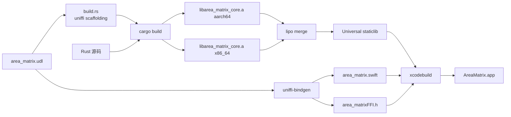

# 构建与运行

> 详解 AreaMatrix 的构建流水线：Rust core → universal staticlib → Swift bindings → Xcode app。
>
> 阅读时长：约 5 分钟。

---

## 总览



---

## 完整构建脚本

文件：`./dev build core`

```bash
#!/usr/bin/env bash
set -euo pipefail

PROJECT_ROOT="$(cd "$(dirname "${BASH_SOURCE[0]}")/.." && pwd)"
CORE_DIR="${PROJECT_ROOT}/core"
OUT_DIR="${PROJECT_ROOT}/apps/macos/AreaMatrix/Bridge/Generated"
PROFILE="${BUILD_PROFILE:-release}"

echo "==> Building core ($PROFILE)"

cd "${CORE_DIR}"

# 1. 构建两个 target 的 staticlib
cargo build --${PROFILE} --target aarch64-apple-darwin
cargo build --${PROFILE} --target x86_64-apple-darwin

# 2. 创建输出目录
mkdir -p "${OUT_DIR}"

# 3. lipo 合并
lipo -create \
    "target/aarch64-apple-darwin/${PROFILE}/libarea_matrix_core.a" \
    "target/x86_64-apple-darwin/${PROFILE}/libarea_matrix_core.a" \
    -output "${OUT_DIR}/libarea_matrix_core.a"

# 4. 生成 Swift bindings
echo "==> Generating Swift bindings"
uniffi-bindgen generate \
    --library "target/aarch64-apple-darwin/${PROFILE}/libarea_matrix_core.dylib" \
    --language swift \
    --out-dir "${OUT_DIR}"

# 5. 报告
echo "==> Done"
echo "    staticlib: ${OUT_DIR}/libarea_matrix_core.a"
echo "    swift:     ${OUT_DIR}/area_matrix.swift"
echo "    header:    ${OUT_DIR}/area_matrixFFI.h"
```

赋可执行权限：

```bash
chmod +x ./dev build core
```

---

## Cargo.toml 模板

`core/Cargo.toml`：

```toml
[package]
name = "area_matrix_core"
version = "0.1.0"
edition = "2021"
license = "PolyForm-Noncommercial-1.0.0"
publish = false

[lib]
name = "area_matrix_core"
crate-type = ["staticlib", "cdylib"]

[dependencies]
uniffi = { version = "0.28", features = ["build"] }
rusqlite = { version = "0.31", features = ["bundled", "chrono", "serde_json"] }
serde = { version = "1", features = ["derive"] }
serde_json = "1"
serde_yaml = "0.9"
thiserror = "1"
sha2 = "0.10"
walkdir = "2"
chrono = { version = "0.4", features = ["serde"] }
tracing = "0.1"
tracing-subscriber = { version = "0.3", features = ["env-filter"] }
unicode-normalization = "0.1"
regex = "1"
trash = "5"
uuid = { version = "1", features = ["v4"] }

[build-dependencies]
uniffi = { version = "0.28", features = ["build"] }

[dev-dependencies]
tempfile = "3"
pretty_assertions = "1"
```

---

## build.rs

`core/build.rs`：

```rust
fn main() {
    uniffi::generate_scaffolding("./area_matrix.udl").unwrap();
}
```

---

## Xcode 集成

### 添加 staticlib

1. Xcode 项目导航 → 右键项目 → Add Files To "AreaMatrix"
2. 选 `apps/macos/AreaMatrix/Bridge/Generated/libarea_matrix_core.a`
3. Target Membership 勾上 AreaMatrix

### 添加生成的 Swift 文件

1. 同样方式添加 `area_matrix.swift`

### Bridging Header 配置

虽然 Swift 与 Rust 通过自动生成的 `area_matrix.swift` 通信，但 UniFFI 仍需要 C 头：

`apps/macos/AreaMatrix/AreaMatrix-Bridging-Header.h`：

```c
#import "Bridge/Generated/area_matrixFFI.h"
```

在 Build Settings 中：

- `Objective-C Bridging Header` → `AreaMatrix/AreaMatrix-Bridging-Header.h`
- `Header Search Paths` → `$(SRCROOT)/AreaMatrix/Bridge/Generated`
- `Library Search Paths` → `$(SRCROOT)/AreaMatrix/Bridge/Generated`
- `Other Linker Flags` → `-larea_matrix_core`

---

## 调试构建

### Debug 配置

```bash
./dev build core --profile debug
```

调试时 `cargo build` 默认 debug，体积大但启动快、含 panic 信息。

### Release 配置（默认）

```bash
./dev build core
```

启用所有优化，体积小。

### 尺寸优化（CI 发布版）

`Cargo.toml` 加：

```toml
[profile.release]
opt-level = "z"
lto = true
codegen-units = 1
strip = true
panic = "abort"
```

---

## 增量构建

### 改 Rust 代码（不动 UDL）

```bash
./dev build core   # ~30s 增量
# 然后 Xcode 自动检测 staticlib 改动并重新链接
```

### 改 UDL

```bash
./dev build core   # ~45s 增量（含 bindings 重生成）
# Xcode 重新编译 area_matrix.swift
```

### 只改 Swift

直接 Xcode ⌘R。

---

## 持续集成

详见 `.github/workflows/core-ci.yml` 和 `.github/workflows/macos-ci.yml`。

CI 在 macos-14 runner 上执行：

1. `cargo fmt --check`
2. `cargo clippy -- -D warnings`
3. `cargo test --workspace`
4. `cargo llvm-cov --fail-under-lines 70`
5. `./dev build core`
6. `xcodebuild test`
7. `cd apps/macos && swiftformat --lint . --config ../../scripts/dev_tools/swiftformat.conf --exclude AreaMatrix/Bridge/Generated,AreaMatrix/Bridge/UniFFI --cache ignore`
8. `cd apps/macos && swiftlint lint --strict --config ../../scripts/dev_tools/swiftlint.yml --force-exclude . --no-cache`

PR 要全绿才能合并。

---

## 发布构建（Stage 1 alpha 起激活）

Stage 1 不做公开发布，但 alpha tester 内部分发仍必须走 Developer ID 签名、公证、DMG
和干净 Mac 首启验证。发布放行状态以
[stage-1-release-checklist.md](stage-1-release-checklist.md) 为准；该清单存在 P0/P1、
手工冒烟 pending、性能基线缺口或签名/公证未知时，不得把构建产物标记为可分发。

当前若未加入付费 Apple Developer Program，只能制作 local QA build。local QA build 可以用于本机
或受控测试机验证启动、恢复和包结构，但它不是 Developer ID notarized app，不能替代 Stage 1
alpha 分发门禁。

发布凭据预检：

```bash
./dev release preflight
```

该命令只读取本机 keychain / signing identity 状态。若输出 `release distribution
preflight: BLOCKED`，说明当前机器不能完成 Developer ID 签名或 notarytool 公证；可以把
输出写入 release checklist 作为阻断证据，但不能把产物标记为可分发。

### 不付费 local QA 构建

```bash
./dev build core --profile release
xcodebuild -project apps/macos/AreaMatrix.xcodeproj \
  -scheme AreaMatrix \
  -configuration Release \
  -derivedDataPath build/ \
  CODE_SIGNING_ALLOWED=YES \
  CODE_SIGN_STYLE=Manual \
  CODE_SIGN_IDENTITY=- \
  DEVELOPMENT_TEAM= \
  OTHER_LDFLAGS="$(pwd)/core/target/aarch64-apple-darwin/release/libarea_matrix_core.a"

APP_PATH="build/Build/Products/Release/AreaMatrix.app"
codesign --verify --deep --strict --verbose=2 "$APP_PATH"
codesign -dv --verbose=4 "$APP_PATH"
otool -L "$APP_PATH/Contents/MacOS/AreaMatrix"
```

local QA DMG：

```bash
hdiutil create \
  -volname "AreaMatrix 0.1.0 Local QA" \
  -srcfolder "$APP_PATH" \
  -ov \
  -format UDZO \
  AreaMatrix-0.1.0-local-qa.dmg
shasum -a 256 AreaMatrix-0.1.0-local-qa.dmg
hdiutil attach AreaMatrix-0.1.0-local-qa.dmg -nobrowse
codesign --verify --deep --strict --verbose=2 \
  "/Volumes/AreaMatrix 0.1.0 Local QA/AreaMatrix.app"
hdiutil detach "/Volumes/AreaMatrix 0.1.0 Local QA"
```

`CODE_SIGN_IDENTITY=-` 只生成 ad-hoc signed app，用于本机包结构和启动行为验证；它不是
Developer ID 签名。`AreaMatrix-0.1.0-local-qa.dmg` 只能标记为 internal QA artifact，
不得写成 Developer ID 签名、公证或正式 alpha 分发证据。

同机 local QA 首启交互 smoke：

```bash
open -n "/Volumes/AreaMatrix 0.1.0 Local QA/AreaMatrix.app"

osascript <<'APPLESCRIPT'
tell application "System Events"
  tell process "AreaMatrix"
    set frontmost to true
    set position of window 1 to {60, 50}
    set size of window 1 to {1500, 980}
    get {exists window 1, position of window 1, size of window 1, name of window 1}
  end tell
end tell
APPLESCRIPT

cat > /tmp/areamatrix_scroll_down.swift <<'SWIFT'
import CoreGraphics
import Foundation

let source = CGEventSource(stateID: .hidSystemState)
let point = CGPoint(x: 900, y: 610)
CGEvent(mouseEventSource: source, mouseType: .mouseMoved, mouseCursorPosition: point, mouseButton: .left)?
    .post(tap: .cghidEventTap)
Thread.sleep(forTimeInterval: 0.1)
for _ in 0..<7 {
    CGEvent(scrollWheelEvent2Source: source, units: .line, wheelCount: 1, wheel1: -6, wheel2: 0, wheel3: 0)?
        .post(tap: .cghidEventTap)
    Thread.sleep(forTimeInterval: 0.08)
}
print("scroll_probe=posted events=7 point=900,610")
SWIFT
xcrun swift /tmp/areamatrix_scroll_down.swift
```

若该 smoke 通过，只能写成 local QA 首启交互证据。它不能证明干净 Mac 首启、Gatekeeper、
Developer ID 签名、公证或正式 alpha 分发可用。

### 版本号

更新：

- `core/Cargo.toml` 的 `version`
- `apps/macos/AreaMatrix/Info.plist` 的 `CFBundleShortVersionString` / `CFBundleVersion`
- `CHANGELOG.md` 的 `[Unreleased]` 段落改为 `[x.y.z] - YYYY-MM-DD`

### 签名 + 公证（用户分发版）

```bash
# 1. 构建 release
./dev build core
xcodebuild -project apps/macos/AreaMatrix.xcodeproj \
  -scheme AreaMatrix \
  -configuration Release \
  -derivedDataPath build/

# 2. Code sign
codesign --deep --force \
  --options runtime \
  --sign "Developer ID Application: <your name>" \
  --entitlements apps/macos/AreaMatrix/AreaMatrix.entitlements \
  build/Build/Products/Release/AreaMatrix.app

# 3. 打包 + 公证
ditto -c -k --keepParent build/Build/Products/Release/AreaMatrix.app AreaMatrix.zip
xcrun notarytool submit AreaMatrix.zip \
  --keychain-profile "AC_PASSWORD" \
  --wait

# 4. Stapler
xcrun stapler staple build/Build/Products/Release/AreaMatrix.app

# 5. 制作 DMG（可选）
hdiutil create -volname "AreaMatrix" -srcfolder build/Build/Products/Release/AreaMatrix.app \
  -ov -format UDZO AreaMatrix-x.y.z.dmg
```

详见 [release.md](release.md)。

---

## 故障排查

### 缺少 macOS universal build Rust target

错误：`missing Rust target 'x86_64-apple-darwin'`。

`./dev build core` 和 `./dev check all` 会构建 `aarch64-apple-darwin` 与
`x86_64-apple-darwin` 两个 staticlib 后用 `lipo` 合并 universal library；缺少任一
target 都不能把 macOS checks 视为通过。

```bash
rustup target add x86_64-apple-darwin
./dev check all
```

若 `rustup target add` 失败，先修复本机 Rust toolchain / registry cache 后重试；不得把缺失
target 的 macOS universal build 视为通过。补齐 target 后还需确保 `swiftformat` 与
`swiftlint` 在 PATH 中，否则 `./dev check all` 会继续在 Swift lint gate 失败。

当前 Codex sandbox 的已知阻断形态：

- 默认 `rustup target add x86_64-apple-darwin` 可能在 component 下载或缓存清理阶段失败。
- 使用临时 `RUSTUP_HOME` 复核时，若无法解析 `static.rust-lang.org`，说明当前环境不能补齐
  Rust target。
- `brew install swiftformat swiftlint` 需要 Homebrew prefix 与 cache 可写；若 `/opt/homebrew`
  或 `~/Library/Caches/Homebrew` 不可写，不能在本环境补齐 SwiftFormat / SwiftLint。

这些都属于发布工具链阻断。记录阻断可以作为 release checklist 证据，但不能替代
`./dev check all` 通过。

### `lipo` 失败：`fat file already exists`

```bash
rm -f apps/macos/AreaMatrix/Bridge/Generated/libarea_matrix_core.a
./dev build core
```

### `uniffi-bindgen` 版本不匹配

错误：`scaffolding generated by uniffi 0.28.x but bindgen is 0.27.x`。

```bash
cargo install uniffi-bindgen --force --version <匹配 Cargo.toml 的版本>
```

### Xcode 报 `module 'area_matrix' not found`

`area_matrix.swift` 没被加进 target。检查 Xcode 项目导航中文件是否在 AreaMatrix target 下。

### Spotlight 频繁锁 SQLite

```bash
sudo mdutil -d ~/AreaMatrix-dev/.areamatrix/index.db
```

或在用户配置中将 `.areamatrix/` 加到 Spotlight 隐私列表。

---

## Related

- [setup.md](setup.md)
- [release.md](release.md)
- [troubleshooting.md](troubleshooting.md)
- [../architecture/ffi-design.md](../architecture/ffi-design.md)
- [../api/uniffi-recipes.md](../api/uniffi-recipes.md)
