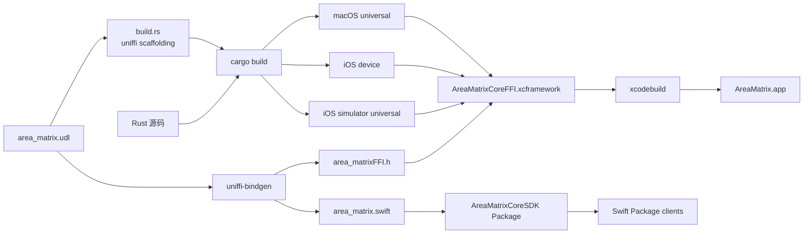

# 构建与运行

> 详解 AreaMatrix 的构建流水线：Rust core → fingerprinted CoreSDK XCFramework → Swift clients。
>
> 阅读时长：约 5 分钟。

---

## 总览


```mermaid
flowchart LR
    UDL[area_matrix.udl]
    RS[Rust 源码]
    UDL --> Scaffold[build.rs<br/>uniffi scaffolding]
    Scaffold --> Cargo
    RS --> Cargo[cargo build]
    Cargo --> Mac[macOS universal]
    Cargo --> IOS[iOS device]
    Cargo --> Sim[iOS simulator universal]
    UDL --> BindGen[uniffi-bindgen]
    BindGen --> SwiftFile[area_matrix.swift]
    BindGen --> Header[area_matrixFFI.h]
    Mac --> XCFramework[AreaMatrixCoreFFI.xcframework]
    IOS --> XCFramework
    Sim --> XCFramework
    SwiftFile --> CoreSDK[AreaMatrixCoreSDK Package]
    Header --> XCFramework
    XCFramework --> XcodeBuild
    CoreSDK --> SwiftPM[Swift Package clients]
    XcodeBuild[xcodebuild] --> App[AreaMatrix.app]
```

---

## Core 构建入口

`./dev build core` 是仓库根目录 `./dev` 的 CLI 子命令，不是独立脚本文件。
根入口 `dev` 先进入 `scripts.task_loop.console`；非交互子命令再由 console 转交
`scripts.dev_tools.cli`。构建实现位于 `scripts/dev_tools/build.py`。

```bash
./dev build core --help
```

当前子命令执行以下步骤：

1. 检查 `cargo`、`rustc`、`lipo`、`core/Cargo.toml`、`core/area_matrix.udl` 和 `core/build.rs`。
2. 确认当前 host 是 macOS Rust host。
3. 构建 `aarch64-apple-darwin` 与 `x86_64-apple-darwin` 两个 target。
4. 用 `lipo` 合并 `apps/macos/AreaMatrix/Bridge/Generated/libarea_matrix_core.a`。
5. 使用 host dylib 与 `core/area_matrix.udl` 生成 Swift bindings。

默认输出目录 `apps/macos/AreaMatrix/Bridge/Generated/` 是 `.gitignore` 忽略的本地生成产物目录，
用于检查 universal staticlib 与最新 bindings。当前 Xcode 工程消费的 tracked bindings 位于
`apps/macos/AreaMatrix/Bridge/UniFFI/`。Cargo 产物按用途隔离，避免 Xcode 与验证命令竞争同一个
artifact lock：

```text
.build/cargo/
├── xcode/       # ./dev build xcode-core 的定向诊断产物
├── validation/  # check / clippy / test / coverage
├── sdk/         # CoreSDK、bindings 与 Xcode Prepare CoreSDK cache miss
└── release/     # release readiness / distribution build
```

仓库级 `.cargo/config.toml` 把未显式覆盖的本地 `cargo check`、`cargo clippy`、`cargo test`
和其他临时 Cargo 命令默认路由到 `validation` lane。`./dev build core` 默认使用 `sdk` lane；
CoreSDK、Xcode 和 release 工具通过显式 `CARGO_TARGET_DIR` 选择各自 lane，优先级高于仓库默认值。
不要把本地验证命令指向 `xcode`、`sdk` 或 `release` lane。

每个 lane 还有仓库级 single-flight lock。不同 lane 可以并行，互不争抢 Cargo artifact directory；同一
lane 的生产者会输出 `WAIT` / `ACQUIRED` 和等待时间。CoreSDK 等待获取 `sdk` lock 后会再次检查内容缓存，
若前一个进程已经生成相同 fingerprint，后一个进程返回 `HIT-AFTER-WAIT`，不重复构建。

Apple 客户端使用 `./dev build core-sdk`。该命令以 Rust/UDL、锁文件、toolchain、Xcode 版本、
target 和 deployment target 计算内容指纹；命中 `.build/core-sdk/<fingerprint>/` 时不运行 Cargo。
产物包含 macOS universal、iOS device 和 iOS simulator XCFramework slices，以及可独立编译的
`AreaMatrixCoreSDK` Swift Package。稳定入口为 `.build/core-sdk/current`；iOS Package 通过
`apps/ios/.core-sdk` 指针消费同一份二进制产物。

常用参数：

```bash
./dev build core
./dev build core --profile debug
./dev build core --out-dir /tmp/areamatrix-generated
./dev build core --deployment-target 14.0
./dev build core-sdk
./dev build core-sdk --verify-only   # 只校验恢复后的 symlink、manifest 与 XCFramework slices
./dev build core-sdk --force         # 原子替换同一 fingerprint 的生成缓存，用于诊断
./dev cache core-sdk prune --max-bytes 10737418240  # 预览 10 GiB LRU 清理计划
./dev cache core-sdk prune --max-bytes 10737418240 --apply
```

自定义 `--macos-deployment-target` / `--ios-deployment-target` 会同时进入 Cargo 环境、fingerprint 和
生成的 `Package.swift` platform 声明，不能出现二进制与 Swift Package 最低系统版本不一致。
CoreSDK 清理永不自动执行；默认只输出 LRU 计划，只有显式 `--apply` 才删除非活动 fingerprint，且始终保护
`current` 指针和最近缓存。即使容量低于受保护缓存的大小，也只报告超限，不删除受保护 artifact。

---

## Cargo.toml 模板

`core/Cargo.toml`：

```toml
[package]
name = "area_matrix_core"
version = "0.1.0"
edition = "2021"
rust-version = "1.75"
license = "PolyForm-Noncommercial-1.0.0"
publish = false

[workspace]
resolver = "2"

[lib]
name = "area_matrix_core"
crate-type = ["rlib", "staticlib", "cdylib"]

[dependencies]
uniffi = { version = "0.28", features = ["build"] }
rusqlite = { version = "0.31", features = ["bundled", "chrono", "serde_json"] }
serde = { version = "1", features = ["derive"] }
serde_json = "1"
serde_yaml = "0.9"
thiserror = "1"
sha2 = "0.10"
walkdir = "2"
chrono = { version = "0.4", features = ["serde"] }
tracing = "0.1"
tracing-appender = "0.2.5"
tracing-subscriber = { version = "0.3", features = ["env-filter"] }
unicode-normalization = "0.1"
regex = "1"
uuid = { version = "1", features = ["v4"] }

[target.'cfg(any(target_os = "macos", target_os = "windows", target_os = "linux", target_os = "freebsd"))'.dependencies]
trash = "5"

[build-dependencies]
uniffi = { version = "0.28", features = ["build"] }

[dev-dependencies]
tempfile = "3"
pretty_assertions = "1"
```

---

## build.rs

`core/build.rs`：

```rust
fn main() {
    println!("cargo:rustc-check-cfg=cfg(areamatrix_system_trash)");

    let target_os = std::env::var("CARGO_CFG_TARGET_OS")
        .expect("Cargo must provide CARGO_CFG_TARGET_OS to build scripts");
    if matches!(
        target_os.as_str(),
        "macos" | "windows" | "linux" | "freebsd"
    ) {
        println!("cargo:rustc-cfg=areamatrix_system_trash");
    }

    println!("cargo:rerun-if-changed=area_matrix.udl");
    println!("cargo:rerun-if-changed=uniffi.toml");
    uniffi::generate_scaffolding("./area_matrix.udl").expect("generate UniFFI scaffolding");
}
```

平台支持列表只在 Cargo 构建配置中解析并投影为 `areamatrix_system_trash`；storage 源码只消费该
能力 cfg，不直接识别 macOS 或其他桌面操作系统。未启用该能力的平台返回明确的 unsupported 配置错误。

---

## Xcode 集成

当前 `apps/macos/AreaMatrix.xcodeproj` 已配置好 CoreSDK XCFramework、Bridge 合同模块和 tracked UniFFI bindings：

- `Frameworks` Build Phase 链接 `.build/core-sdk/current/AreaMatrixCoreFFI.xcframework`，不再链接裸
  `core/target` 或手写 `-L`/`-larea_matrix_core`。
- `Prepare CoreSDK` Build Phase 调用 `./dev build core-sdk`；Rust/UDL 和打包器未变化时由 Xcode
  依赖分析跳过，即使执行命令也只发生 fingerprint cache hit。
- 本地 Swift Package `AreaMatrixCoreBridgeContract` 真实链接到 App target，独立测试稳定的
  `CoreBridgeBoundary` 合同；它不包含生成绑定或用户文件写入逻辑。
- 该 Build Phase 启用 dependency analysis，以 Cargo/UDL/构建脚本为输入、CoreSDK manifest 为输出，并由
  dependency file 补齐递归 Rust 源文件；不再使用 Always Out Of Date。
- `AREAMATRIX_CORE_SDK_VERIFY_ONLY=1` 只校验已恢复的 fingerprinted artifact，但仍会写出同一份 dependency
  file；Build Phase 会先创建 `DERIVED_FILE_DIR`，因此 clean DerivedData 的首次 Build/Test 不会因依赖文件父目录
  尚未存在而失败。
- Swift source 引用 `AreaMatrix/Bridge/UniFFI/area_matrix.swift`。
- Bridging header 引用 `Bridge/UniFFI/area_matrixFFI.h`。
- `apps/ios/Package.swift` 只依赖 `.core-sdk` 生成的 `AreaMatrixCoreSDK` Swift Package；XCFramework 的
  `Carea_matrixFFI` binary target 由 CoreSDK 包唯一持有，iOS 不再重复声明或硬编码本机 Cargo debug 路径。

### 更新 tracked bindings

如果 `core/area_matrix.udl` 的公开接口变更，并且需要提交 Xcode 工程实际消费的 Swift bindings，
先构建包含当前 UniFFI metadata 的 host dylib，再将 bindings 显式生成到 `Bridge/UniFFI/`：

```bash
./dev build core
./dev bindings update --udl core/area_matrix.udl --out-dir apps/macos/AreaMatrix/Bridge/UniFFI
./dev bindings verify
```

`./dev bindings verify` 只在临时目录生成并比较 `area_matrix.swift`、`area_matrixFFI.h` 与
`module.modulemap`，不会改写 tracked bindings。当仓库存在
`apps/ios/Carea_matrixFFI/` 时，同一命令还会跑 **iOS subset** 校验：再生成 header 后，要求
tracked iOS header 中的每个 `fn_func_*` ⊆ 生成物，且 `*CoreFFI.swift` 使用的 `fn_func_*` ⊆
iOS header，同时 `module.modulemap` 指向有效 header。iOS **不做** macOS 式全量字节 diff
（iOS 只跟踪 curated subset，不跟踪完整 `area_matrix.swift`）。

CI 在 Core build 后运行该命令，阻止 UDL、生成器输出与 Xcode 实际消费的 bindings 漂移。默认生成器固定为 `core/Cargo.lock` 中的 UniFFI 版本；
只有显式设置 `UNIFFI_BINDGEN` 或 `AREAMATRIX_UNIFFI_BINDGEN` 时才覆盖该版本。

### Bridging Header 配置

`apps/macos/AreaMatrix/AreaMatrix-Bridging-Header.h`：

```c
#import "Bridge/UniFFI/area_matrixFFI.h"
#import <sqlite3.h>
```

除 UniFFI 生成头文件外，bridging header 还引入系统 `sqlite3.h`：Swift 平台层的只读
metadata probe 直接以只读方式打开 SQLite，不经过 Core 写路径。

在 Build Settings 中：

- `Objective-C Bridging Header` → `AreaMatrix/AreaMatrix-Bridging-Header.h`
- `Header Search Paths` → `$(SRCROOT)/AreaMatrix/Bridge/UniFFI`
- Frameworks → `.build/core-sdk/current/AreaMatrixCoreFFI.xcframework`

---

## 调试构建

### Debug 配置

```bash
./dev build core --profile debug
```

调试时 `cargo build` 默认 debug，体积大但启动快、含 panic 信息。

### Release 配置（默认）

```bash
./dev build core
```

启用所有优化，体积小。

### Xcode 配置文件

`apps/macos/Config/` 集中维护 `Base`、`Debug`、`Preview`、`Test` 和 `Release` 配置。Debug、Test
和 Release 已绑定到现有 Xcode 配置；Preview 作为覆盖层使用，不需要复制一套 Scheme：

```bash
xcodebuild -project apps/macos/AreaMatrix.xcodeproj \
  -scheme AreaMatrix \
  -configuration Debug \
  -xcconfig apps/macos/Config/Preview.xcconfig \
  -destination 'platform=macOS,arch=arm64' build CODE_SIGNING_ALLOWED=NO
```

配置文件统一声明 CoreSDK、Cargo lane 和本地 DerivedData 路径。`AREAMATRIX_CARGO_TARGET_DIR` 默认指向
`sdk` lane；Xcode 的 CoreSDK Build Phase 与验证 lane 仍由各自脚本显式选择目标目录，不能通过临时环境变量
把它们重新指向同一个 Cargo artifact 目录。Canvas 使用 Preview 覆盖层，普通 Swift-only 修改继续直接
使用 Debug 增量构建。

### 尺寸优化（CI 发布版）

`Cargo.toml` 加：

```toml
[profile.release]
opt-level = "z"
lto = true
codegen-units = 1
strip = true
panic = "abort"
```

---

## 增量构建

### 改 Rust 代码（不动 UDL）

```bash
./dev test changed --list   # 先查看受影响验证层
./dev check affected --list # 治理入口：查看受影响验证层
./dev build core-sdk        # 可选预热；Xcode 也会在 fingerprint miss 时构建一次
```

CoreSDK fingerprint 改变时只生成一次新的 XCFramework；随后 Xcode 重新链接。相同输入再次 Build、Run 或
Test 时，Xcode 依赖分析直接跳过 `Prepare CoreSDK`，或者命中同一个内容缓存。

### 改 UDL

```bash
./dev build core-sdk
./dev bindings update --udl core/area_matrix.udl --out-dir apps/macos/AreaMatrix/Bridge/UniFFI
./dev bindings verify
```

UDL 是公开合同变化：除 CoreSDK 失效外，还必须更新 Xcode 实际消费的 tracked Swift bindings，并让 Apple
客户端重新编译。不要只更新 `.build/core-sdk` 中的生成文件。

### 只改 Swift

直接 Xcode ⌘R。Rust/UDL 与 CoreSDK 打包输入未变化时，Xcode 会跳过 `Prepare CoreSDK`，不会启动 Cargo。

### SwiftUI 可视化开发

单个组件优先使用 Xcode Canvas 中的 `#Preview`。`AreaMatrixPreviewSupport.swift` 提供 light/dark
UI Catalog 和 Scenario Launcher 三个 Canvas 入口。Launcher 可以在一个 Canvas 内切换场景、主题、
`en` / `zh-Hans` 和 compact / standard / wide 窗口，不启动资料库或 Core service，也不读取或写入用户文件。

Launcher 的场景清单覆盖 Loading、Empty、Success、Failed、Disabled、Blocked、Stale 和 Unavailable，
并包含欢迎页、空资料库、权限失败、DB 损坏、iCloud placeholder、导入冲突、同步冲突、AI unavailable、
AI 设置与建议页面、长文案和 120 行数据集。先在 Canvas 调整布局，再用同一场景 ID 启动真实 Debug
窗口验证滚动、焦点和交互。

需要验证真实窗口、滚动和控件交互时，使用统一开发入口。它复用
`.build/derived-data/macos-run/`，避免每个场景重新创建 DerivedData：

```bash
./dev run macos --scenario launcher
./dev run macos --scenario ui-catalog
./dev run macos --scenario command-palette
./dev run macos --scenario detail-log
./dev run macos --scenario detail-note
./dev run macos --scenario detail-pane
./dev run macos --scenario detail-multi-selection
./dev run macos --scenario diagnostics-console
./dev run macos --scenario diagnostics-package-preview
./dev run macos --scenario diagnostics-settings
./dev run macos --scenario onboarding
./dev run macos --scenario onboarding-confirm
./dev run macos --scenario onboarding-database-repair
./dev run macos --scenario onboarding-done
./dev run macos --scenario onboarding-failed
./dev run macos --scenario onboarding-initializing
./dev run macos --scenario onboarding-recovery
./dev run macos --scenario onboarding-validate-path
./dev run macos --scenario loading
./dev run macos --scenario repository-empty
./dev run macos --scenario repository-ready
./dev run macos --scenario permission-failure
./dev run macos --scenario database-corrupt
./dev run macos --scenario icloud-placeholder
./dev run macos --scenario import-conflict
./dev run macos --scenario import-entry
./dev run macos --scenario import-folder-preview
./dev run macos --scenario import-progress
./dev run macos --scenario import-result
./dev run macos --scenario main-repository-content
./dev run macos --scenario sync-conflict
./dev run macos --scenario sync-conflicts-icloud-list
./dev run macos --scenario sync-conflicts-icloud-minimal
./dev run macos --scenario sync-conflicts-entry
./dev run macos --scenario sync-conflicts-replace-confirmation
./dev run macos --scenario sync-conflicts-review
./dev run macos --scenario ai-unavailable
./dev run macos --scenario ai-call-log
./dev run macos --scenario ai-classification-suggestion
./dev run macos --scenario ai-privacy-rules
./dev run macos --scenario ai-settings
./dev run macos --scenario ai-summary-editor
./dev run macos --scenario ai-tag-suggestions
./dev run macos --scenario ai-local-model-status
./dev run macos --scenario ai-remote-model-config
./dev run macos --scenario disabled
./dev run macos --scenario stale-data
./dev run macos --scenario long-content
./dev run macos --scenario large-data
./dev run macos --scenario search-query-error
./dev run macos --scenario search-saved-search
./dev run macos --scenario search-empty
./dev run macos --scenario search-index-status
./dev run macos --scenario search-semantic-results
./dev run macos --scenario search-smart-list
./dev run macos --scenario file-actions-batch-add-tags
./dev run macos --scenario file-actions-batch-change-category
./dev run macos --scenario file-actions-batch-delete
./dev run macos --scenario file-actions-batch-rename
./dev run macos --scenario file-actions-change-category
./dev run macos --scenario file-actions-classifier-impact
./dev run macos --scenario file-actions-delete
./dev run macos --scenario file-actions-rename
./dev run macos --scenario file-actions-replace
./dev run macos --scenario file-actions-tag-suggestions
./dev run macos --scenario file-actions-undo-history
./dev run macos --scenario settings-about
./dev run macos --scenario settings-advanced
./dev run macos --scenario settings-classifier
./dev run macos --scenario settings-general
./dev run macos --scenario settings-integrations
./dev run macos --scenario settings-language
./dev run macos --scenario settings-platform-differences
./dev run macos --scenario settings-repository
```

`AreaMatrixDeveloperSurfaceInventory` 是稳定产品页面的机器源事实：登记的 61 个页面不能通过删除条目来抬高
覆盖率。当前 `61/61` 个稳定页面均有全页 Scenario，覆盖 AI、CommandPalette、Detail、Diagnostics、
FileActions、Import、MainList、Onboarding、Search、Settings 和 SyncConflicts。
其余组件、状态和压力场景仍保留，但不会冒充全页覆盖。每次增加全页 Scenario 时必须同时更新 inventory、
Swift/CLI 场景清单、本节命令和专项测试。会自动加载数据的页面显式注入进程内 fixture；AI 场景还隔离网络、
Keychain 和平台副作用，Diagnostics、MainList 与 SyncConflicts 也隔离日志、Finder、Trash、iCloud 和 CoreBridge。
它们不访问真实 Core、DB 或用户文件，
因此不能替代真实 Search/Core、AI 隐私、远程 Provider、Import 或文件安全集成测试。

主题、语言和窗口尺寸是独立轴，不再为每个组合复制场景：

```bash
./dev run macos --scenario sync-conflict --theme dark --locale zh-Hans --viewport compact
./dev run macos --scenario large-data --theme light --locale en --viewport wide --no-build
```

`ui-catalog-dark`、`onboarding-dark` 和 `settings-language-dark` 仍作为兼容别名解析为对应场景的 dark 轴。
未知场景名在 CLI 中直接失败；直接设置未知 `AREAMATRIX_SCENARIO` 时 fail closed 到正常应用根视图。
这些入口只在 `DEBUG` 编译中存在，不进入 Release 产品路径，也不能替代真实 feature 测试。已有 Debug 产品
可使用 `--no-build`；只验证构建产物而不启动窗口可使用 `--build-only`。

### 高频诊断与按变更验证

```bash
./dev doctor build        # Cargo lanes、lock metadata、Xcode 增量输入输出和 CoreSDK 完整性
./dev test changed --list # 只显示当前工作树将触发的验证层
./dev check affected --list # 治理入口：只显示当前工作树将触发的验证层
./dev test changed        # 执行对应 developer tools / Rust / macOS / iOS / docs-governance 门禁
```

### 本地 Rust 验证

为避免与 Xcode 竞争 artifact lock，使用 validation lane：

```bash
export CARGO_TARGET_DIR="$PWD/.build/cargo/validation"
cargo check --manifest-path core/Cargo.toml --all-targets --all-features
cargo clippy --manifest-path core/Cargo.toml --all-targets --all-features -- -D warnings
cargo test --manifest-path core/Cargo.toml --workspace --all-features
```

---

## 持续集成

详见 `.github/workflows/core-ci.yml` 和 `.github/workflows/macos-ci.yml`。

CI 在 macos-14 runner 上执行：

1. `cargo fmt --all -- --check`
2. `cargo clippy --all-targets --all-features -- -D warnings`
3. `cargo test --all-features --workspace`
4. `cargo llvm-cov --fail-under-lines 70`
5. `./dev build core-sdk`，上传并在 Xcode job 复用同一 CoreSDK artifact
6. `./dev bindings verify`
7. `./dev test macos`
8. `cd apps/macos && swiftformat --lint . --config ../../scripts/dev_tools/swiftformat.conf --exclude AreaMatrix/Bridge/Generated,AreaMatrix/Bridge/UniFFI,DerivedData --cache ignore`
9. `cd apps/macos && swiftlint lint --strict --config ../../scripts/dev_tools/swiftlint.yml --force-exclude . --no-cache`

PR 要全绿才能合并。

---

## 发布构建

面向用户分发的构建必须来自固定且已验证的 commit，并完成 Developer ID 签名、公证、DMG、checksum 和干净 Mac 首启验证。本机构建、ad-hoc 签名或同机 smoke 只能证明工程可运行，不能标记为可分发。

发布工具中的状态、审计和产物探针只用于汇总或读取证据，不能替代真实外部验证。具体发布步骤、凭据边界和回滚要求见 [发布流程](release.md)；历史记录通过 [workflow versions](../../workflow/versions/README.md) 查阅。

### 版本号

更新：

- `core/Cargo.toml` 的 `version`
- `apps/macos/AreaMatrix.xcodeproj/project.pbxproj` 的 `MARKETING_VERSION` /
  `CURRENT_PROJECT_VERSION`；app `Info.plist` 由 Xcode 生成
- `CHANGELOG.md` 的 `[Unreleased]` 段落改为 `[x.y.z] - YYYY-MM-DD`

### 签名 + 公证（用户分发版）

```bash
# 1. 构建 release
./dev build core
xcodebuild -project apps/macos/AreaMatrix.xcodeproj \
  -scheme AreaMatrix \
  -configuration Release \
  -derivedDataPath build/

# 2. Code sign
codesign --deep --force \
  --options runtime \
  --sign "Developer ID Application: <your name>" \
  --entitlements apps/macos/AreaMatrix/AreaMatrix.entitlements \
  build/Build/Products/Release/AreaMatrix.app

# 3. 打包 + 公证
ditto -c -k --keepParent build/Build/Products/Release/AreaMatrix.app AreaMatrix.zip
xcrun notarytool submit AreaMatrix.zip \
  --keychain-profile "AC_PASSWORD" \
  --wait

# 4. Stapler
xcrun stapler staple build/Build/Products/Release/AreaMatrix.app

# 5. 制作 DMG（可选）
hdiutil create -volname "AreaMatrix" -srcfolder build/Build/Products/Release/AreaMatrix.app \
  -ov -format UDZO AreaMatrix-x.y.z.dmg
```

详见 [release.md](release.md)。

---

## 故障排查

### Cargo artifact directory lock 长时间等待

先运行 `./dev doctor build`，确认四个 lane 解析到不同目录、Xcode 没有 Always Out Of Date Build Phase，并检查
`.build/locks/cargo/` 中的 operation 与 wait time。普通 `cargo check` / `clippy` / `test` 应留在默认
`validation` lane，Xcode 应只消费 `sdk` lane 的 CoreSDK。相同 SDK 请求短暂等待后出现
`HIT-AFTER-WAIT` 属于正常去重；跨 lane 持续等待则说明调用方覆盖了 `CARGO_TARGET_DIR`，应修正入口而不是
删除 Cargo lock 或强制终止所有构建进程。

### 缺少 macOS universal build Rust target

错误：`missing Rust target 'x86_64-apple-darwin'`。

`./dev build core` 和 `./dev check all` 会构建 `aarch64-apple-darwin` 与
`x86_64-apple-darwin` 两个 staticlib 后用 `lipo` 合并 universal library；缺少任一
target 都不能把 macOS checks 视为通过。

```bash
rustup target add x86_64-apple-darwin
./dev check all
```

若 `rustup target add` 失败，先修复本机 Rust toolchain / registry cache 后重试；不得把缺失
target 的 macOS universal build 视为通过。补齐 target 后还需确保 `swiftformat` 与
`swiftlint` 在 PATH 中，否则 `./dev check all` 会继续在 Swift lint gate 失败。

当前 Codex sandbox 的已知阻断形态：

- 默认 `rustup target add x86_64-apple-darwin` 可能在 component 下载或缓存清理时失败。
- 使用临时 `RUSTUP_HOME` 复核时，若无法解析 `static.rust-lang.org`，说明当前环境不能补齐
  Rust target。
- `brew install swiftformat swiftlint` 需要 Homebrew prefix 与 cache 可写；若 `/opt/homebrew`
  或 `~/Library/Caches/Homebrew` 不可写，不能在本环境补齐 SwiftFormat / SwiftLint。

这些都属于发布工具链阻断。记录阻断可以作为 release checklist 证据，但不能替代
`./dev check all` 通过。

### `lipo` 失败：`fat file already exists`

```bash
rm -f apps/macos/AreaMatrix/Bridge/Generated/libarea_matrix_core.a
./dev build core
```

### `uniffi-bindgen` 版本不匹配

错误：`scaffolding generated by uniffi 0.28.x but bindgen is 0.27.x`。

默认机制下生成器版本锁定为 `core/Cargo.lock` 中的 UniFFI 版本，不会漂移。出现该错误说明
`UNIFFI_BINDGEN` / `AREAMATRIX_UNIFFI_BINDGEN` 指向了版本不匹配的 bindgen：取消该环境变量
回到默认机制，或改为指向匹配版本，然后重跑 `./dev build core`。

### Xcode 报 `module 'area_matrix' not found`

`area_matrix.swift` 没被加进 target。检查 Xcode 项目导航中文件是否在 AreaMatrix target 下。

### SQLite busy / locked

Core 可写连接已设置 WAL 和 5 秒 `busy_timeout`。持续锁冲突时先确认没有同时运行的 AreaMatrix、测试进程
或手工 `sqlite3` 会话。不要对正在运行的资料库执行会写入的 SQLite 命令；需要人工检查时先退出应用并
保留 `index.db`、WAL 和 SHM。

---

## Related

- [setup.md](setup.md)
- [release.md](release.md)
- [troubleshooting.md](troubleshooting.md)
- [../architecture/ffi-design.md](../architecture/ffi-design.md)
- [../api/uniffi-recipes.md](../api/uniffi-recipes.md)
