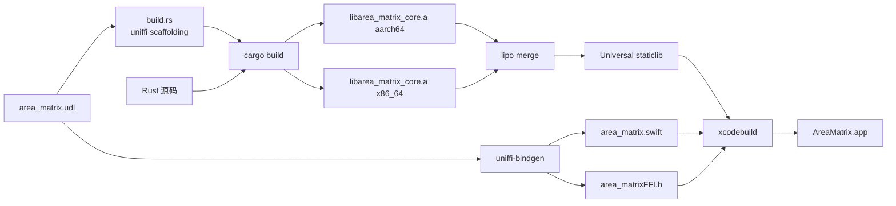

# 构建与运行

> 详解 AreaMatrix 的构建流水线：Rust core → universal staticlib → Swift bindings → Xcode app。
>
> 阅读时长：约 5 分钟。

---

## 总览


```mermaid
flowchart LR
    UDL[area_matrix.udl]
    RS[Rust 源码]
    UDL --> Scaffold[build.rs<br/>uniffi scaffolding]
    Scaffold --> Cargo
    RS --> Cargo[cargo build]
    Cargo --> ARM[libarea_matrix_core.a aarch64]
    Cargo --> X86[libarea_matrix_core.a x86_64]
    ARM --> Lipo[lipo merge]
    X86 --> Lipo
    Lipo --> Universal[Universal staticlib]
    UDL --> BindGen[uniffi-bindgen]
    BindGen --> SwiftFile[area_matrix.swift]
    BindGen --> Header[area_matrixFFI.h]
    Universal --> XcodeBuild
    SwiftFile --> XcodeBuild
    Header --> XcodeBuild
    XcodeBuild[xcodebuild] --> App[AreaMatrix.app]
```

---

## Core 构建入口

`./dev build core` 是仓库根目录 `./dev` 的 CLI 子命令，不是独立脚本文件。
命令定义在 `scripts/dev_tools/cli.py`，构建实现位于 `scripts/dev_tools/build.py`。

```bash
./dev build core --help
```

当前子命令执行以下步骤：

1. 检查 `cargo`、`rustc`、`lipo`、`core/Cargo.toml`、`core/area_matrix.udl` 和 `core/build.rs`。
2. 确认当前 host 是 macOS Rust host。
3. 构建 `aarch64-apple-darwin` 与 `x86_64-apple-darwin` 两个 target。
4. 用 `lipo` 合并 `apps/macos/AreaMatrix/Bridge/Generated/libarea_matrix_core.a`。
5. 使用 host dylib 与 `core/area_matrix.udl` 生成 Swift bindings。

默认输出目录 `apps/macos/AreaMatrix/Bridge/Generated/` 是 `.gitignore` 忽略的本地生成产物目录，
用于检查 universal staticlib 与最新 bindings。当前 Xcode 工程消费的 tracked bindings 位于
`apps/macos/AreaMatrix/Bridge/UniFFI/`，并直接链接 `core/target/aarch64-apple-darwin/<profile>/libarea_matrix_core.a`。

常用参数：

```bash
./dev build core
./dev build core --profile debug
./dev build core --out-dir /tmp/areamatrix-generated
./dev build core --deployment-target 14.0
```

---

## Cargo.toml 模板

`core/Cargo.toml`：

```toml
[package]
name = "area_matrix_core"
version = "0.1.0"
edition = "2021"
license = "PolyForm-Noncommercial-1.0.0"
publish = false

[lib]
name = "area_matrix_core"
crate-type = ["rlib", "staticlib", "cdylib"]

[dependencies]
uniffi = { version = "0.28", features = ["build"] }
rusqlite = { version = "0.31", features = ["bundled", "chrono", "serde_json"] }
serde = { version = "1", features = ["derive"] }
serde_json = "1"
serde_yaml = "0.9"
thiserror = "1"
sha2 = "0.10"
walkdir = "2"
chrono = { version = "0.4", features = ["serde"] }
tracing = "0.1"
tracing-subscriber = { version = "0.3", features = ["env-filter"] }
unicode-normalization = "0.1"
regex = "1"
trash = "5"
uuid = { version = "1", features = ["v4"] }

[build-dependencies]
uniffi = { version = "0.28", features = ["build"] }

[dev-dependencies]
tempfile = "3"
pretty_assertions = "1"
```

---

## build.rs

`core/build.rs`：

```rust
fn main() {
    uniffi::generate_scaffolding("./area_matrix.udl").unwrap();
}
```

---

## Xcode 集成

当前 `apps/macos/AreaMatrix.xcodeproj` 已配置好 Core 静态库和 tracked UniFFI bindings：

- Build Phase `Build Core Static Library` 构建 `core/target/aarch64-apple-darwin/$(AREAMATRIX_CORE_PROFILE)/libarea_matrix_core.a`。
- `LIBRARY_SEARCH_PATHS` 指向 `$(SRCROOT)/../../core/target/aarch64-apple-darwin/$(AREAMATRIX_CORE_PROFILE)`。
- `OTHER_LDFLAGS` 使用 `-larea_matrix_core`。
- Swift source 引用 `AreaMatrix/Bridge/UniFFI/area_matrix.swift`。
- Bridging header 引用 `Bridge/UniFFI/area_matrixFFI.h`。

### 更新 tracked bindings

如果 `core/area_matrix.udl` 的公开接口变更，并且需要提交 Xcode 工程实际消费的 Swift bindings，
先构建包含当前 UniFFI metadata 的 host dylib，再将 bindings 显式生成到 `Bridge/UniFFI/`：

```bash
./dev build core
./dev bindings update --udl core/area_matrix.udl --out-dir apps/macos/AreaMatrix/Bridge/UniFFI
./dev bindings verify
```

`./dev bindings verify` 只在临时目录生成并比较 `area_matrix.swift`、`area_matrixFFI.h` 与
`module.modulemap`，不会改写 tracked bindings。CI 在 Core build 后运行该命令，阻止 UDL、生成器
输出与 Xcode 实际消费的 bindings 漂移。默认生成器固定为 `core/Cargo.lock` 中的 UniFFI 版本；
只有显式设置 `UNIFFI_BINDGEN` 或 `AREAMATRIX_UNIFFI_BINDGEN` 时才覆盖该版本。

### Bridging Header 配置

`apps/macos/AreaMatrix/AreaMatrix-Bridging-Header.h`：

```c
#import "Bridge/UniFFI/area_matrixFFI.h"
```

在 Build Settings 中：

- `Objective-C Bridging Header` → `AreaMatrix/AreaMatrix-Bridging-Header.h`
- `Header Search Paths` → `$(SRCROOT)/AreaMatrix/Bridge/UniFFI`
- `Library Search Paths` → `$(SRCROOT)/../../core/target/aarch64-apple-darwin/$(AREAMATRIX_CORE_PROFILE)`
- `Other Linker Flags` → `-larea_matrix_core`

---

## 调试构建

### Debug 配置

```bash
./dev build core --profile debug
```

调试时 `cargo build` 默认 debug，体积大但启动快、含 panic 信息。

### Release 配置（默认）

```bash
./dev build core
```

启用所有优化，体积小。

### 尺寸优化（CI 发布版）

`Cargo.toml` 加：

```toml
[profile.release]
opt-level = "z"
lto = true
codegen-units = 1
strip = true
panic = "abort"
```

---

## 增量构建

### 改 Rust 代码（不动 UDL）

```bash
./dev build core   # ~30s 增量
# 然后 Xcode 自动检测 staticlib 改动并重新链接
```

### 改 UDL

```bash
./dev build core   # ~45s 增量（含 bindings 重生成）
# Xcode 重新编译 area_matrix.swift
```

### 只改 Swift

直接 Xcode ⌘R。

---

## 持续集成

详见 `.github/workflows/core-ci.yml` 和 `.github/workflows/macos-ci.yml`。

CI 在 macos-14 runner 上执行：

1. `cargo fmt --check`
2. `cargo clippy -- -D warnings`
3. `cargo test --workspace`
4. `cargo llvm-cov --fail-under-lines 70`
5. `./dev build core`
6. `./dev test macos`
7. `cd apps/macos && swiftformat --lint . --config ../../scripts/dev_tools/swiftformat.conf --exclude AreaMatrix/Bridge/Generated,AreaMatrix/Bridge/UniFFI,DerivedData --cache ignore`
8. `cd apps/macos && swiftlint lint --strict --config ../../scripts/dev_tools/swiftlint.yml --force-exclude . --no-cache`

PR 要全绿才能合并。

---

## 发布构建

面向用户分发的构建必须走 Developer ID 签名、公证、DMG 和干净 Mac 首启验证。历史发布放行状态只通过
[workflow versions](../../workflow/versions/README.md) 追溯；归档清单不作为后续版本的发布命名模板。

发布状态与凭据预检：

```bash
./dev release status
./dev release status --json --remote
./dev release evidence-audit
./dev release evidence-audit --json
./dev release icloud-placeholder-smoke-audit --json
./dev release task05-release-review-audit --json
./dev release final-tag-readiness-audit --json --remote
./dev release alpha-feedback-decision-audit --json
./dev release distribution-artifact-probe --app-path <APP_PATH> --dmg-path <DMG_PATH> --json
./dev release preflight
./dev release preflight --json
```

`./dev release status` 是只读发布状态聚合，会核对 residual 发布阻断、正式 tag 和 release workflow
状态；它不创建 tag、不发布 GitHub Release、不写 evidence。若
`residual_evidence_gate.status` 为 `BLOCKED`，只能继续补齐真实发布证据，不能把工程产物
标记为可分发。若 residual 证据门禁已 `PASS` 但 `formal_tag_gate` 因正式 tag 缺失而
`BLOCKED`，只能进入正式 tag 补证；tag 推送后仍需整体 `status: PASS` 才能用户分发。
`closes_residual: false` 只说明该命令本身不关闭 residual，不是 release evidence。

`./dev release evidence-audit` 是只读记录一致性检查，确认结构化 release evidence record 与
residual 索引没有冲突；当 residual 已标 `closed` 时，它还会检查关键关闭字段是否仍停在
`pending` / `blocked` / `null` / `false`。它不会创建、关闭或修改任何 evidence，也不能替代真实签名、
公证、iCloud UI retry、DB row、干净 Mac 或反馈路线证据。

`./dev release icloud-placeholder-smoke-audit --json` 是 M-02 iCloud placeholder smoke record
的只读记录审计。它只读取 `icloud-placeholder-smoke-evidence.md` 和 residual 索引；不接收路径、
不运行 `mdls`、不触发 iCloud 下载、不读取文件内容、不写用户文件、不写 DB、不写项目文件、
不写 `.areamatrix/` metadata，也不访问网络。当前真实 metadata probe、UI retry、DB row 或用户文件
不变量证据缺失时，`smoke_evidence_gate: BLOCKED` 是发布阻断，不是普通 PR / CI failure。
即使该审计返回 `PASS`，也只表示 record 字段齐备，不能替代真实 UI `Download & retry` 或关闭
`v1-rl-002`。

`./dev release task05-release-review-audit --json` 是 `3-1/task-05` release evidence review 的只读记录审计。
它只读取对应的 v1 evidence record 和 residual 索引；不读取 `.codex/task-loop-logs/**`、
不回填 `progress.json`、task-loop logs、run summaries、checkpoint metadata、commit 或 tag，
也不访问网络。当前 fresh formal release evidence review 未完成时，
`release_evidence_review_gate: BLOCKED` 是发布阻断，不是普通 PR / CI failure。即使该审计返回
`PASS`，也只表示 review 字段齐备，不能替代 task-loop `VERIFY_RESULT: PASS` 或关闭
`v1-ref-003-1-task-05`。

`./dev release final-tag-readiness-audit --json --remote` 是正式 tag 前的只读门禁审计。它会把
`v1-rl-004` 这个 tag 动作本身与其他发布证据阻断分开：只有其他 release evidence 全部通过、
`final-tag-release-evidence.md` 中 tag 前置字段为真实通过值，且本地 / 远端 tag 查询可读时，
才会给出 `ready_to_create_formal_tag: true`。该命令不会创建 tag、不会推送 tag、不会创建
GitHub Release，也不会关闭 `v1-rl-004`。

`./dev release alpha-feedback-decision-audit --json` 是反馈路线的只读决策审计。它只读取
issue template、Discussion links 和 `alpha-feedback-route.md` 中的 release decision record，
核对可信测试者名单来源、正整数数量、tester invitation side effect、GitHub HTTPS announcement /
Discussion URL、主备反馈路线、triage owner 和响应 SLO 是否
已由 release owner 真实记录。当前决策缺失时返回 `BLOCKED` 是预期状态；该命令不会创建
Discussion、邀请 tester、发布公告、分配 owner、写 evidence 或关闭 `v1-rl-006`。即使
`decision_gate.status: PASS`，也只表示本地记录字段具备最低结构质量，不证明外部 side effects
真实发生。

`./dev release icloud-placeholder-evidence --path <path> --json` 只读取 `lstat` 和 `mdls`
metadata，默认会脱敏本机路径、文件名和输出中的 `mdls` 路径片段。只有本机私下排障需要完整路径时，
才使用 `--include-sensitive-paths`；该选项输出不应直接放进可共享 evidence。

`./dev release distribution-artifact-probe --app-path <APP_PATH> --dmg-path <DMG_PATH> --json`
只读取 app / DMG 的 `lstat`、`codesign -dv` 和 `codesign --verify` 输出，默认会脱敏路径和文件名。
它不会 mount DMG、不会 staple、不会提交 notarytool、不会安装 app，也不会写 DB 或 `.areamatrix/`
metadata。默认跳过 DMG SHA-256，因为该操作会读取整个 DMG；需要时显式加 `--hash-dmg`。
`--spctl` 和 `--stapler-validate` 也必须显式开启。JSON 中 `probe.status: captured` 只表示采集成功；
`distribution_requirements.status` 在正式证据不足时仍为 `blocked`，不能替代 Developer ID、公证、
stapled DMG、正式 checksum 或干净 Mac 首启。

`./dev release preflight` 只读取本机 keychain / signing identity 状态。若输出 `release distribution
preflight: BLOCKED`，说明当前机器不能完成 Developer ID 签名或 notarytool 公证；可以把
输出写入 release checklist 作为阻断证据，但不能把产物标记为可分发。`--json` 输出会包含
`checks`、`blocked_by`、`required_distribution_evidence` 和 `evidence_record_template`，用于后续
补证归档；它同样不能替代 codesign、notarytool accepted log、stapler、正式 DMG checksum 或干净
Mac 首启。

本机工程验证可以使用 Xcode Release 构建、`codesign --verify` 和 `otool -L` 检查包结构与静态链接。
若没有 Developer ID signing identity 或 notarytool profile，只能记录为工程验证，不能写成可分发证据。
`./dev release readiness-build --install` 会替换目标 `AreaMatrix.app`，因此必须同时传入
`--install-confirm /Applications/AreaMatrix.app` 或与 `--applications-dir` 对应的完整目标路径；
该命令仍是 ad-hoc 本机验证，不构成 Developer ID、公证、DMG 或干净 Mac 证据。
v1 的受控环境构建、未公证下载和交互 smoke 细节保留在 v1 evidence 归档中；当前构建指南不复用这些历史命名。

### 版本号

更新：

- `core/Cargo.toml` 的 `version`
- `apps/macos/AreaMatrix/Info.plist` 的 `CFBundleShortVersionString` / `CFBundleVersion`
- `CHANGELOG.md` 的 `[Unreleased]` 段落改为 `[x.y.z] - YYYY-MM-DD`

### 签名 + 公证（用户分发版）

```bash
# 1. 构建 release
./dev build core
xcodebuild -project apps/macos/AreaMatrix.xcodeproj \
  -scheme AreaMatrix \
  -configuration Release \
  -derivedDataPath build/

# 2. Code sign
codesign --deep --force \
  --options runtime \
  --sign "Developer ID Application: <your name>" \
  --entitlements apps/macos/AreaMatrix/AreaMatrix.entitlements \
  build/Build/Products/Release/AreaMatrix.app

# 3. 打包 + 公证
ditto -c -k --keepParent build/Build/Products/Release/AreaMatrix.app AreaMatrix.zip
xcrun notarytool submit AreaMatrix.zip \
  --keychain-profile "AC_PASSWORD" \
  --wait

# 4. Stapler
xcrun stapler staple build/Build/Products/Release/AreaMatrix.app

# 5. 制作 DMG（可选）
hdiutil create -volname "AreaMatrix" -srcfolder build/Build/Products/Release/AreaMatrix.app \
  -ov -format UDZO AreaMatrix-x.y.z.dmg
```

详见 [release.md](release.md)。

---

## 故障排查

### 缺少 macOS universal build Rust target

错误：`missing Rust target 'x86_64-apple-darwin'`。

`./dev build core` 和 `./dev check all` 会构建 `aarch64-apple-darwin` 与
`x86_64-apple-darwin` 两个 staticlib 后用 `lipo` 合并 universal library；缺少任一
target 都不能把 macOS checks 视为通过。

```bash
rustup target add x86_64-apple-darwin
./dev check all
```

若 `rustup target add` 失败，先修复本机 Rust toolchain / registry cache 后重试；不得把缺失
target 的 macOS universal build 视为通过。补齐 target 后还需确保 `swiftformat` 与
`swiftlint` 在 PATH 中，否则 `./dev check all` 会继续在 Swift lint gate 失败。

当前 Codex sandbox 的已知阻断形态：

- 默认 `rustup target add x86_64-apple-darwin` 可能在 component 下载或缓存清理时失败。
- 使用临时 `RUSTUP_HOME` 复核时，若无法解析 `static.rust-lang.org`，说明当前环境不能补齐
  Rust target。
- `brew install swiftformat swiftlint` 需要 Homebrew prefix 与 cache 可写；若 `/opt/homebrew`
  或 `~/Library/Caches/Homebrew` 不可写，不能在本环境补齐 SwiftFormat / SwiftLint。

这些都属于发布工具链阻断。记录阻断可以作为 release checklist 证据，但不能替代
`./dev check all` 通过。

### `lipo` 失败：`fat file already exists`

```bash
rm -f apps/macos/AreaMatrix/Bridge/Generated/libarea_matrix_core.a
./dev build core
```

### `uniffi-bindgen` 版本不匹配

错误：`scaffolding generated by uniffi 0.28.x but bindgen is 0.27.x`。

```bash
cargo install uniffi-bindgen --force --version <匹配 Cargo.toml 的版本>
```

### Xcode 报 `module 'area_matrix' not found`

`area_matrix.swift` 没被加进 target。检查 Xcode 项目导航中文件是否在 AreaMatrix target 下。

### Spotlight 频繁锁 SQLite

```bash
sudo mdutil -d ~/AreaMatrix-dev/.areamatrix/index.db
```

或在用户配置中将 `.areamatrix/` 加到 Spotlight 隐私列表。

---

## Related

- [setup.md](setup.md)
- [release.md](release.md)
- [troubleshooting.md](troubleshooting.md)
- [../architecture/ffi-design.md](../architecture/ffi-design.md)
- [../api/uniffi-recipes.md](../api/uniffi-recipes.md)
