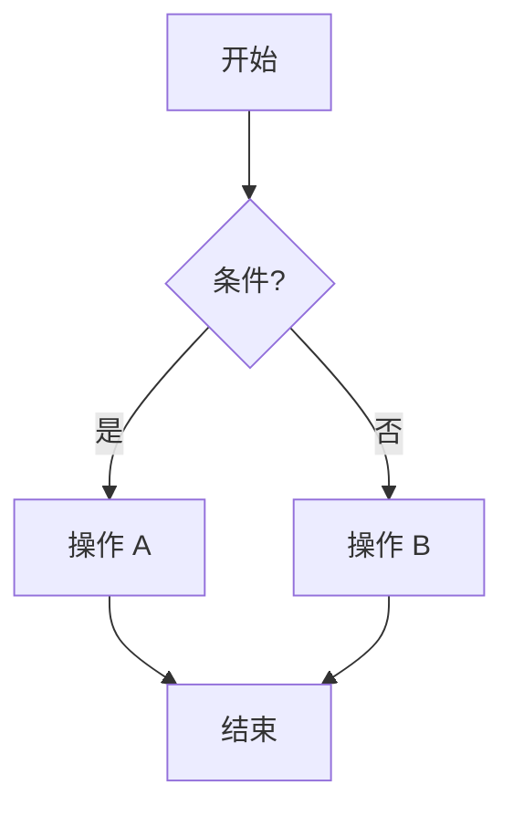

# 编码规范

> AreaMatrix 的 Rust / Swift / Markdown / Mermaid 一致性约定。CI 会强制部分规则；其余靠评审把关。
>
> 阅读时长：约 6 分钟。

---

## 总则

1. **可读性 > 简洁**：宁可多写一行清晰的代码也不要炫技
2. **明确 > 隐式**：类型、错误、所有权都明确表达
3. **小而专注**：单文件 ≤ 500 行、单函数 ≤ 50 行、嵌套 ≤ 3 层
4. **注释解释 why**：what 看代码就行，注释只写为什么
5. **测试是文档**：好的测试比注释更能说明行为

---

## Rust 规范

### 工具链强制

CI 会运行：

```bash
cargo fmt --all -- --check
cargo clippy --all-targets --all-features -- -D warnings
```

PR 不通过则不允许合并。

### `rustfmt.toml`

```toml
edition = "2021"
max_width = 100
hard_tabs = false
tab_spaces = 4
newline_style = "Unix"
imports_granularity = "Crate"
group_imports = "StdExternalCrate"
```

### 命名

| 类型 | 命名 | 示例 |
|---|---|---|
| 模块 / 文件 | snake_case | `change_log.rs` |
| 结构体 / 枚举 / Trait | PascalCase | `FileEntry` |
| 函数 / 方法 / 变量 | snake_case | `import_file()` |
| 常量 | SCREAMING_SNAKE | `MAX_STAGING_SIZE` |
| 类型参数 | 单大写字母 | `T`, `E` |
| 生命周期 | 短小写 | `'a`, `'repo` |

### 错误处理

- **绝不 `unwrap()`**：库代码用 `?`，测试代码可用 `expect("clear msg")`
- **不静默 `let _ = ...`**：除非确认是有意丢弃且加注释
- **错误类型用 thiserror**：

```rust
#[derive(Error, Debug)]
pub enum CoreError {
    #[error("io: {0}")]
    Io(String),
    #[error("config: {reason}")]
    Config { reason: String },
}
```

- **From 实现转换**：

```rust
impl From<std::io::Error> for CoreError {
    fn from(e: std::io::Error) -> Self {
        CoreError::Io(e.to_string())
    }
}
```

- **不允许 panic 在业务路径**：所有可恢复错误走 `Result`

### 文档

- 所有 `pub` 项必须有 rustdoc 注释
- 复杂函数附 `# Examples` 章节

```rust
/// Imports a file into the repository following the configured storage mode.
///
/// # Errors
///
/// Returns `CoreError::DuplicateFile` if a file with the same hash already exists
/// and `options.duplicate_strategy` is `Skip` or `Ask`.
///
/// # Examples
///
/// ```no_run
/// let entry = import_file(&repo, &src, ImportOptions::default())?;
/// assert!(entry.id > 0);
/// ```
pub fn import_file(...) -> CoreResult<FileEntry> { ... }
```

### 测试

- 单元测试与代码同文件 `#[cfg(test)] mod tests`
- 集成测试放 `core/tests/`
- 测试函数命名描述性：`fn keyword_priority_over_extension()` 而不是 `fn test_classify_1()`
- 用 `tempfile::TempDir` 隔离文件 IO

### 不允许

- `extern crate ...`（用 `use` 即可，2018 起 prelude 已支持）
- `unwrap_or_else(|_| panic!(...))`（直接 unwrap 都比这清晰）
- 使用 `mod xxx { include!("xxx.rs"); }`（直接用模块系统）
- 在 lib.rs 写业务逻辑（lib.rs 只能有 module declaration 和 re-export）

---

## Swift 规范

### 工具

- SwiftFormat: `swiftformat --lint .`
- SwiftLint: `swiftlint --strict`

### `.swiftformat`

```
--swiftversion 5.9
--indent 4
--maxwidth 120
--commas inline
--trimwhitespace always
--ifdef no-indent
--self remove
--header strip
```

### `.swiftlint.yml`

```yaml
disabled_rules:
  - trailing_comma
opt_in_rules:
  - empty_count
  - missing_docs
  - explicit_init
  - implicit_return
line_length: 120
file_length: 500
function_body_length: 50
type_body_length: 300
```

### 命名

遵循 [Swift API Design Guidelines](https://www.swift.org/documentation/api-design-guidelines/)：

| 类型 | 命名 |
|---|---|
| 类型 / 协议 | PascalCase |
| 函数 / 变量 / 参数 | lowerCamelCase |
| 枚举 case | lowerCamelCase |
| 全局常量 | lowerCamelCase（不要 SCREAMING） |

### 模块组织

```
AreaMatrix/
├── App/        # AreaMatrixApp.swift, AppDelegate.swift
├── Models/     # @Observable stores
├── Bridge/     # CoreBridge, AppError, generated bindings
├── Watcher/    # FSWatcher, Debouncer, InFlightTracker, ICloudCoordinator
├── Adapters/   # DragDropAdapter, NSItemProvider helpers
├── Views/
│   ├── Main/   # 主窗口
│   ├── Sidebar/
│   ├── List/
│   ├── Detail/
│   ├── Import/
│   ├── Settings/
│   └── Onboarding/
├── Logging/    # AppLogger
└── Resources/
```

### SwiftUI 规范

- 用 `@Observable` 而不是 `ObservableObject`（macOS 14+）
- 视图小而专注：超过 200 行 split 子视图
- 避免在 body 内做 IO（提到 store 的 method）
- 用 `Task { ... }` 触发异步、`@MainActor` 标记 store

```swift
@Observable
final class RepoStore {
    private(set) var files: [FileEntry] = []
    private let bridge: CoreBridge

    init(bridge: CoreBridge) {
        self.bridge = bridge
    }

    @MainActor
    func reload(filter: FileFilter) async {
        do {
            self.files = try await bridge.listFiles(filter: filter)
        } catch {
            AppLogger.shared.error("reload failed: \(error)")
        }
    }
}
```

### 错误处理

- 优先 `do/try/catch`
- 顶层路径用 `Task { do { try await ... } catch { ... } }`
- 不允许 `try!` 在生产代码

### 不允许

- 直接调 UniFFI 生成函数（必须经过 CoreBridge）
- `print()` 调试（用 OSLog / AppLogger）
- 强制解包 `!`（除非是 `IBOutlet` 或类型已经是 force unwrap 的字面量类型）
- 在 View body 闭包内 `await`（Swift 编译能过但要避免）
- 单文件超 500 行

---

## Markdown 规范

适用于 docs/ 下所有文件。

| 规则 | 说明 |
|---|---|
| 行长 | 中文按视觉宽度，建议 80-120 视觉字符；英文 120 字符硬上限 |
| 标题层级 | 不跳级（# → ## → ###） |
| 一级标题 | 每个文件唯一一个 |
| 一级标题后 | 一句话摘要 + 阅读时长估算 |
| 列表标记 | `-` 不用 `*` |
| 代码块 | 加语言标签（rust/swift/sql/yaml/bash） |
| 链接 | 优先相对路径 `./xxx.md` |
| 图片 | ``，必填 alt |
| 表格 | 列对齐符号风格不强求 |

### 文档头部

```markdown
# 文档标题

> 一句话摘要，说清楚这篇文档解决什么问题。
>
> 阅读时长：约 X 分钟。

---

## 1. 背景

...
```

### 文档尾部（强制）

```markdown
## Related

- [other-doc.md](other-doc.md)
- [parent/another.md](parent/another.md)
```

---

## Mermaid 规范

| 规则 | 说明 |
|---|---|
| 图类型 | 优先 `flowchart`、`sequenceDiagram`、`classDiagram`、`erDiagram`、`stateDiagram-v2` |
| 节点 ID | camelCase（不要空格、点） |
| 节点标签 | 可以中文，注意特殊字符转义 |
| 方向 | flowchart 默认 `LR`（横向）或 `TB`（纵向），按场景选 |
| 子图 | 用 `subgraph`，给标识命名 |

### 示例



---

## Git Commit 规范

详见 [git-workflow.md](git-workflow.md)。

简短：[Conventional Commits](https://www.conventionalcommits.org/)：

```
feat(classify): 关键词匹配支持大小写折叠
fix(storage): 修复 staging 残留清理时的 race
docs(adr): 增补 0010 关于全文搜索的决策
refactor(db): 把 schema 拆到独立 sql 文件
test(import): 加强冲突重命名 1000 次上限测试
chore(ci): 升级 macos-14 runner
```

---

## CI 强制清单

PR 必须通过：

- [ ] `cargo fmt --all -- --check`
- [ ] `cargo clippy -- -D warnings`
- [ ] `cargo test --workspace`
- [ ] `cargo llvm-cov --fail-under-lines 70`（核心模块）
- [ ] `swiftformat --lint .`
- [ ] `swiftlint --strict`
- [ ] `xcodebuild test`
- [ ] commit message 符合 Conventional Commits

---

## 评审清单

评审者关注：

- [ ] 函数 ≤ 50 行
- [ ] 文件 ≤ 500 行
- [ ] 嵌套 ≤ 3 层
- [ ] public API 有文档
- [ ] 新功能有测试
- [ ] 没有 `// TODO:` 不带 owner / due
- [ ] 没有引入未审过的依赖
- [ ] 没有打破分层（不要 UI 直接读 SQLite）

---

## Related

- [git-workflow.md](git-workflow.md)
- [testing.md](testing.md)
- [build.md](build.md)
