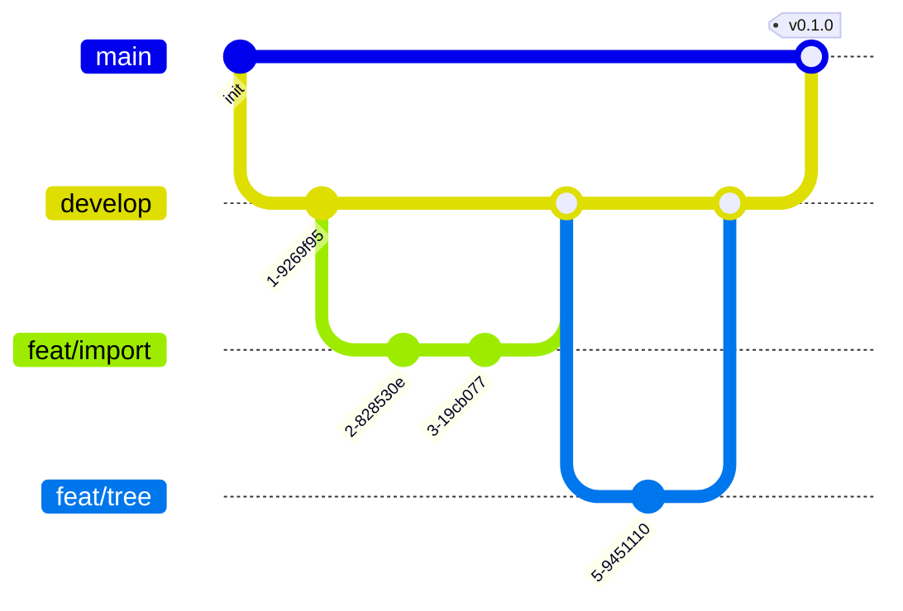

# Git 分支与 Commit 规范

> AreaMatrix 的 Git 协作流程：分支命名、commit 信息、PR 流程、Tag 与发布。
>
> 阅读时长：约 4 分钟。

---

## 分支模型



| 分支 | 用途 | 写权限 |
|---|---|---|
| `main` | 生产分支，始终可发布 | 维护者 / merge 自 develop |
| `develop` | 集成分支（Stage 2 起启用，MVP 可省） | 维护者 / merge 自 feat |
| `feat/<topic>` | 功能开发 | 任何人 |
| `fix/<topic>` | bug 修复 | 任何人 |
| `docs/<topic>` | 仅文档改动 | 任何人 |
| `refactor/<topic>` | 重构 | 任何人 |
| `chore/<topic>` | 工程化 / 构建 | 任何人 |
| `release/<version>` | 发布准备（Stage 2 起） | 维护者 |

### MVP 阶段简化版

只用 `main` + 功能分支，跳过 `develop`：

```
main
 ├── feat/classify-engine
 ├── feat/storage-ops
 ├── feat/sidebar-tree
 └── fix/staging-cleanup
```

---

## 分支命名

格式：`<类型>/<简短描述>`

| 类型 | 用途 | 示例 |
|---|---|---|
| `feat/` | 新功能 | `feat/drag-drop-import` |
| `fix/` | bug 修复 | `fix/staging-leak` |
| `docs/` | 文档 | `docs/adr-0010-search` |
| `refactor/` | 重构 | `refactor/extract-hash-module` |
| `test/` | 加测试 | `test/sync-edge-cases` |
| `chore/` | 工程化 | `chore/upgrade-uniffi` |
| `perf/` | 性能 | `perf/tree-scan-incremental` |

### 描述部分

- 全小写、`-` 分隔
- 简短（≤ 5 个单词）
- 不带 issue 编号（commit 中带）

---

## Commit 信息

遵循 [Conventional Commits 1.0](https://www.conventionalcommits.org/)：

```
<type>(<scope>): <subject>

<body>

<footer>
```

### type 全集

| type | 含义 |
|---|---|
| `feat` | 新功能 |
| `fix` | bug 修复 |
| `docs` | 仅文档 |
| `style` | 格式（不影响代码运行） |
| `refactor` | 重构 |
| `perf` | 性能优化 |
| `test` | 测试相关 |
| `chore` | 构建 / CI / 依赖等 |
| `revert` | 回滚 |

### scope 推荐值

`classify` / `storage` / `overview` / `tree` / `sync` / `db` / `ffi` / `ui` / `bridge` / `watcher` / `ci` / `deps` / `release`。

scope 可以省略：`docs: 修正 README 拼写`。

### subject

- ≤ 72 字符
- 中文 / 英文均可
- 不以句号结尾
- 用现在时（"add" 不是 "added"）

### body（可选）

- 与 subject 间隔一空行
- 解释**为什么**和**做了什么**
- 行宽 ≤ 100 字符

### footer（可选）

- `Closes #123`、`Fixes #456`
- `BREAKING CHANGE: ...`（如有破坏性变化）
- `Co-authored-by: Name <email>`（结对编程）

### 完整示例

```
feat(classify): 关键词匹配支持大小写折叠

之前 "Invoice.pdf" 能命中 invoice 关键词，但 "INVOICE.pdf" 不能，
用户在 #42 反馈不一致。

- 在 normalize() 中加 .to_lowercase()
- 关键词匹配前对模式也做相同处理
- 加 4 个测试覆盖大小写组合

Closes #42
```

```
fix(storage): 修复 staging 残留清理时的 race

启动 recover_on_startup 时若 watcher 已启动，可能在我们删除 staging 文件
的瞬间收到 FSEvent，导致后续处理把这个事件当作"外部删除"处理。

修复：把 recover_on_startup 提前到 watcher.start() 之前，并加单元测试。

Fixes #58
```

---

## PR 流程

### 1. 准备分支

```bash
git checkout main
git pull origin main
git checkout -b feat/classify-keyword-fold
# 编码 + 提交
git push -u origin feat/classify-keyword-fold
```

### 2. 提 PR

通过 `gh pr create` 或 GitHub 网页：

```bash
gh pr create --title "feat(classify): 关键词匹配支持大小写折叠" \
  --body "$(cat <<'EOF'
## 改动摘要
解决 #42。统一所有路径的大小写处理。

## 改动内容
- `normalize()` 中加 to_lowercase
- 关键词匹配前同样处理
- 4 个新测试

## 测试方式
\`\`\`bash
cd core && cargo test classify
\`\`\`

## 检查清单
- [x] cargo fmt
- [x] cargo clippy 零警告
- [x] 测试通过
- [x] CHANGELOG 已更新
EOF
)"
```

### 3. CI 通过 + 评审

- 至少 1 位维护者 approve
- 所有 CI 检查通过
- 评审 comment 已回复或解决

### 4. 合并

- **MVP 阶段**：用 squash merge（保持 main 历史线性）
- **Stage 2+**：根据情况：feature → squash；refactor 大改 → rebase preserve

合并后维护者：

```bash
git push origin main
git push origin --delete feat/classify-keyword-fold
```

---

## 发布 Tag

### Tag 命名

`v<MAJOR>.<MINOR>.<PATCH>`，例如 `v0.1.0`。

### 流程

```bash
# 1. 确认 main 已含所有要发的内容
git checkout main && git pull

# 2. 更新版本号
# - core/Cargo.toml
# - apps/macos/AreaMatrix/Info.plist
# - CHANGELOG.md（[Unreleased] → [0.1.0] - 2026-04-28）

# 3. 提交版本 bump
git add -A
git commit -m "chore(release): 0.1.0"

# 4. 打 tag
git tag -a v0.1.0 -m "Release 0.1.0"
git push origin main v0.1.0
```

CI 在 tag push 时触发发布工作流（详见 [release.md](release.md)）。

---

## Rebase vs Merge

### 在自己分支上同步 main

```bash
git checkout feat/xxx
git fetch origin
git rebase origin/main
# 解决冲突
git push --force-with-lease  # 已推过的分支用 force-with-lease
```

不要用 `git pull`（会产生 merge commit）。

### main 进 PR

只允许 squash merge（MVP 阶段）。

---

## 不允许

- ❌ `git push --force` 到 main / develop
- ❌ commit 巨大改动一次（≥ 1000 行视情况拒绝评审）
- ❌ 把 secrets / tokens 提交进库
- ❌ 提交 `.DS_Store` / `node_modules/` / `target/`（已有 `.gitignore`）
- ❌ 跳过 CI 强制合并
- ❌ Commit message 写"WIP"、"fix"、"asdf"

---

## .gitignore 关键内容

```
# Rust
target/
Cargo.lock              # 应用 binary 仓库可保留；库 crate 通常不提
**/*.rs.bk

# Xcode
build/
DerivedData/
*.xcuserstate
xcuserdata/
*.xccheckout

# Generated bindings (重新生成即可)
apps/macos/AreaMatrix/Bridge/Generated/

# macOS
.DS_Store

# IDE
.idea/
.vscode/                # 个人配置；项目级用 .vscode-shared/

# 测试产物
TestResults.xcresult
lcov.info
*.profraw

# 资料库测试目录
AreaMatrix-dev/
```

注：本项目 Cargo.lock 应该提交（应用，需可重现构建）。

---

## Related

- [coding-standards.md](coding-standards.md)
- [testing.md](testing.md)
- [release.md](release.md)
- [../../CONTRIBUTING.md](../../CONTRIBUTING.md)
