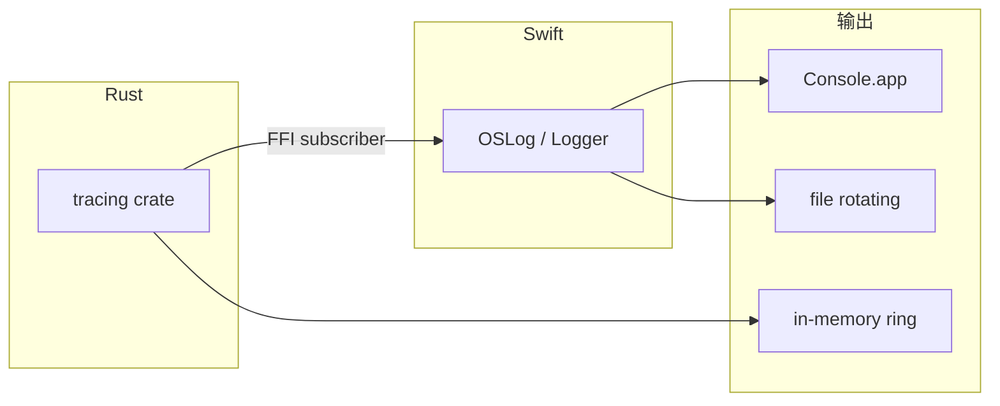

# Observability 可观测性

> 日志分级、结构化日志（tracing crate / OSLog）、debug 信号注入、诊断信息收集脚本。本文给出工程团队定位线上问题的完整工具链。
>
> 阅读时长：约 12 分钟。

---

## 目标

1. 任何崩溃 / 错误能在 30 分钟内定位代码行
2. 性能问题能从日志看出热路径
3. 用户报问题时能一键导出诊断包
4. 不泄露用户隐私数据
5. 不影响发布版本性能（log < 1% CPU）

---

## 三层日志体系



- **Rust：tracing crate**（结构化、span、字段）
- **Swift：OSLog**（系统集成、Console.app 可见）
- **跨层桥接**：Rust 通过 FFI 传日志事件到 Swift OSLog

---

## 日志级别约定

| Level | Rust | Swift | 用途 | 发布版输出 |
|---|---|---|---|---|
| TRACE | `trace!()` | (debug only) | 细粒度调用追踪 | ❌ |
| DEBUG | `debug!()` | `Logger.debug` | 开发调试 | ❌ |
| INFO | `info!()` | `Logger.info` | 重要状态变化 | ✅ |
| WARN | `warn!()` | `Logger.warning` | 可恢复异常 | ✅ |
| ERROR | `error!()` | `Logger.error` | 错误（CoreError 全部上 ERROR） | ✅ |
| FAULT | `error!()` | `Logger.fault` | 不可恢复错误 / panic | ✅ |

发布版默认 INFO+，用户可在设置里切到 DEBUG 排查问题。

---

## Rust：tracing crate 配置

```toml
# core/Cargo.toml
[dependencies]
tracing = "0.1"
tracing-subscriber = { version = "0.3", features = ["env-filter", "json", "fmt"] }
tracing-appender = "0.2"
```

### 初始化

```rust
// core/src/logging.rs
use std::path::Path;
use tracing_appender::rolling::{RollingFileAppender, Rotation};
use tracing_subscriber::{fmt, prelude::*, EnvFilter};

pub fn init(repo: &Path, level: &str) -> CoreResult<()> {
    let log_dir = repo.join(".areamatrix/logs");
    std::fs::create_dir_all(&log_dir)?;

    let file_appender = RollingFileAppender::builder()
        .rotation(Rotation::DAILY)
        .filename_prefix("areamatrix")
        .filename_suffix("log")
        .max_log_files(7)
        .build(&log_dir)
        .map_err(|e| CoreError::Internal { message: e.to_string() })?;

    let filter = EnvFilter::try_new(level)
        .or_else(|_| EnvFilter::try_new("info"))
        .map_err(|e| CoreError::Internal { message: e.to_string() })?;

    let stdout_layer = fmt::layer()
        .with_target(true)
        .with_thread_ids(false)
        .with_file(true)
        .with_line_number(true);

    let file_layer = fmt::layer()
        .with_writer(file_appender)
        .json()
        .with_target(true);

    let ffi_layer = ffi_bridge_layer();

    tracing_subscriber::registry()
        .with(filter)
        .with(stdout_layer)
        .with(file_layer)
        .with(ffi_layer)
        .init();

    tracing::info!(repo = %repo.display(), level, "tracing initialized");
    Ok(())
}
```

### 结构化字段约定

```rust
tracing::info!(
    file_id,
    category = %category,
    size_bytes = size,
    duration_ms = elapsed.as_millis() as u64,
    "import completed"
);
```

字段命名规则：

| 字段 | 含义 | 类型 |
|---|---|---|
| `file_id` | files.id | i64 |
| `category` | 分类 slug | string |
| `size_bytes` | 文件大小 | i64 |
| `duration_ms` | 操作耗时毫秒 | u64 |
| `path` | 资料库相对路径（**不含家目录绝对路径**） | string |
| `hash` | hash 前 8 字符 | string |
| `error` | 错误显示 | %e |

### Span 用法

```rust
use tracing::{info_span, instrument};

#[instrument(skip(repo, src), fields(size_mb = field::Empty))]
pub fn import_file(repo: &Path, src: &Path, options: ImportOptions) -> CoreResult<FileEntry> {
    let span = tracing::Span::current();
    let size = std::fs::metadata(src)?.len();
    span.record("size_mb", (size / 1024 / 1024) as i64);

    let _stage = info_span!("staging").entered();
    materialize_to_staging(src, &staging, options.mode)?;
    drop(_stage);

    let _h = info_span!("hash").entered();
    let hash = sha256_file(&staging)?;
    drop(_h);

    Ok(...)
}
```

输出示例（日志格式 JSON）：

```json
{"timestamp":"2026-04-28T10:30:42Z","level":"INFO","fields":{"message":"import completed","file_id":42,"category":"docs","duration_ms":85},"target":"area_matrix::storage","span":{"name":"import_file","size_mb":2}}
```

---

## Swift：OSLog 配置

```swift
import OSLog

public enum LogCategory: String {
    case general
    case watcher
    case bridge
    case ui
    case import_  // import 是关键字
    case sync
    case migration
}

public final class AppLogger {
    public static let shared = AppLogger()
    private let subsystem = Bundle.main.bundleIdentifier ?? "com.areamatrix.app"
    private var loggers: [LogCategory: Logger] = [:]

    public func logger(_ category: LogCategory) -> Logger {
        if let l = loggers[category] { return l }
        let l = Logger(subsystem: subsystem, category: category.rawValue)
        loggers[category] = l
        return l
    }
}

let log = AppLogger.shared.logger(.bridge)

log.info("import dispatched: \(file_id, privacy: .public)")
log.error("import failed: \(error.localizedDescription, privacy: .public)")
log.warning("staging cleanup: \(orphan_count, privacy: .public) files")
```

### 隐私标记

OSLog 的 `privacy:` 参数：

- `.public`：明文记录（默认 `.private` 不会显示在 Console.app）
- `.private`：脱敏（生产环境显示 `<private>`）
- `.sensitive`：永远脱敏（设备本地也不存）

文件路径含家目录 → 用 `.private` 防止泄露。

```swift
log.info("opening repo at \(path, privacy: .private)")
```

### Console.app 查看

```bash
log stream --predicate 'subsystem == "com.areamatrix.app"' --info
log show --predicate 'subsystem == "com.areamatrix.app"' --last 1h --info > log.txt
```

或图形化：Console.app → 左侧选 macOS 设备 → Search "AreaMatrix"。

---

## 跨 FFI 日志桥接

让 Rust 的 tracing 输出到 Swift 的 OSLog：

### Rust 端：自定义 Layer

```rust
// core/src/logging/ffi_bridge.rs
use tracing_subscriber::Layer;
use tracing_subscriber::layer::Context;
use tracing::span::{Attributes, Id};
use tracing::{Event, Subscriber};
use std::sync::Arc;

#[uniffi::export(callback_interface)]
pub trait LogSink: Send + Sync {
    fn log(&self, level: String, target: String, message: String, fields_json: String);
}

static LOG_SINK: once_cell::sync::OnceCell<Arc<dyn LogSink>> = once_cell::sync::OnceCell::new();

pub fn set_log_sink(sink: Arc<dyn LogSink>) {
    let _ = LOG_SINK.set(sink);
}

pub struct FfiBridgeLayer;

impl<S: Subscriber> Layer<S> for FfiBridgeLayer {
    fn on_event(&self, event: &Event, _ctx: Context<'_, S>) {
        let Some(sink) = LOG_SINK.get() else { return };
        let metadata = event.metadata();

        let level = metadata.level().to_string();
        let target = metadata.target().to_string();

        let mut visitor = JsonVisitor::default();
        event.record(&mut visitor);
        let message = visitor.message.unwrap_or_default();
        let fields = serde_json::to_string(&visitor.fields).unwrap_or_default();

        sink.log(level, target, message, fields);
    }
}

#[derive(Default)]
struct JsonVisitor {
    fields: serde_json::Map<String, serde_json::Value>,
    message: Option<String>,
}

impl tracing::field::Visit for JsonVisitor {
    fn record_str(&mut self, field: &tracing::field::Field, value: &str) {
        if field.name() == "message" {
            self.message = Some(value.into());
        } else {
            self.fields.insert(field.name().into(), value.into());
        }
    }
    fn record_i64(&mut self, field: &tracing::field::Field, value: i64) {
        self.fields.insert(field.name().into(), value.into());
    }
    fn record_debug(&mut self, field: &tracing::field::Field, value: &dyn std::fmt::Debug) {
        let s = format!("{:?}", value);
        if field.name() == "message" {
            self.message = Some(s);
        } else {
            self.fields.insert(field.name().into(), s.into());
        }
    }
}
```

### Swift 端：实现 LogSink

```swift
final class CoreLogSink: LogSink {
    func log(level: String, target: String, message: String, fieldsJson: String) {
        let logger = AppLogger.shared.logger(.bridge)
        switch level.lowercased() {
        case "trace", "debug":
            logger.debug("[\(target, privacy: .public)] \(message, privacy: .public) \(fieldsJson, privacy: .public)")
        case "info":
            logger.info("[\(target, privacy: .public)] \(message, privacy: .public)")
        case "warn":
            logger.warning("[\(target, privacy: .public)] \(message, privacy: .public)")
        case "error":
            logger.error("[\(target, privacy: .public)] \(message, privacy: .public) \(fieldsJson, privacy: .public)")
        default:
            logger.notice("[\(target, privacy: .public)] \(message, privacy: .public)")
        }
    }
}

func setupLogging() {
    try? AreaMatrix.initLogging(level: "info")
    try? AreaMatrix.setLogSink(sink: CoreLogSink())
}
```

---

## In-memory ring buffer

便于"导出最近 N 条日志"功能：

```rust
use std::sync::Mutex;

const RING_CAP: usize = 1000;

pub struct LogRing {
    buf: Mutex<std::collections::VecDeque<String>>,
}

impl LogRing {
    pub fn push(&self, line: String) {
        let mut buf = self.buf.lock().unwrap();
        if buf.len() >= RING_CAP { buf.pop_front(); }
        buf.push_back(line);
    }

    pub fn snapshot(&self) -> Vec<String> {
        self.buf.lock().unwrap().iter().cloned().collect()
    }
}

#[uniffi::export]
pub fn dump_recent_logs() -> Vec<String> {
    LOG_RING.snapshot()
}
```

UI 设置面板加按钮"导出最近日志" → 调 `dump_recent_logs` → 写到桌面。

---

## Debug 信号注入

开发模式下让用户/QA 可触发特定行为以测试错误路径：

```rust
#[cfg(debug_assertions)]
pub mod debug_signals {
    use std::sync::atomic::{AtomicBool, Ordering};

    pub static FORCE_PANIC_AFTER_HASH: AtomicBool = AtomicBool::new(false);
    pub static FORCE_DB_LOCKED: AtomicBool = AtomicBool::new(false);
    pub static SLOW_HASH_MS: std::sync::atomic::AtomicU64 = std::sync::atomic::AtomicU64::new(0);

    pub fn check_force_panic_after_hash() {
        if FORCE_PANIC_AFTER_HASH.load(Ordering::Relaxed) {
            FORCE_PANIC_AFTER_HASH.store(false, Ordering::Relaxed);
            panic!("debug_signal: forced panic after hash");
        }
    }

    pub fn maybe_slow_hash() {
        let ms = SLOW_HASH_MS.load(Ordering::Relaxed);
        if ms > 0 {
            std::thread::sleep(std::time::Duration::from_millis(ms));
        }
    }
}

#[cfg(debug_assertions)]
#[uniffi::export]
pub fn debug_set_signal(name: String, value: String) {
    use std::sync::atomic::Ordering;
    match name.as_str() {
        "force_panic_after_hash" => debug_signals::FORCE_PANIC_AFTER_HASH.store(value == "true", Ordering::Relaxed),
        "force_db_locked" => debug_signals::FORCE_DB_LOCKED.store(value == "true", Ordering::Relaxed),
        "slow_hash_ms" => debug_signals::SLOW_HASH_MS.store(value.parse().unwrap_or(0), Ordering::Relaxed),
        _ => {}
    }
}
```

Swift 调试菜单：

```swift
#if DEBUG
struct DebugMenu: View {
    var body: some View {
        Menu("Debug") {
            Button("Panic after next hash") {
                try? AreaMatrix.debugSetSignal(name: "force_panic_after_hash", value: "true")
            }
            Button("Slow hash 5s") {
                try? AreaMatrix.debugSetSignal(name: "slow_hash_ms", value: "5000")
            }
        }
    }
}
#endif
```

发布版（`#[cfg(not(debug_assertions))]`）这些函数不存在，二进制不含相关代码。

---

## 诊断包导出脚本

```bash
#!/bin/bash
# scripts/collect-diagnostics.sh
set -euo pipefail

OUT="${1:-/tmp/am-diag-$(date +%Y%m%d-%H%M%S).zip}"
TMP=$(mktemp -d)

REPO="${AREAMATRIX_REPO:-$HOME/AreaMatrix}"

cp -a "$REPO/.areamatrix/logs" "$TMP/logs" 2>/dev/null || mkdir "$TMP/logs"

if [ -f "$REPO/.areamatrix/index.db" ]; then
    sqlite3 "$REPO/.areamatrix/index.db" "PRAGMA integrity_check;" > "$TMP/integrity.txt" || true
    sqlite3 "$REPO/.areamatrix/index.db" "SELECT version FROM schema_version;" > "$TMP/schema_version.txt" || true
    sqlite3 "$REPO/.areamatrix/index.db" "SELECT 'files', COUNT(*) FROM files UNION ALL SELECT 'change_log', COUNT(*) FROM change_log;" > "$TMP/counts.txt" || true
fi

ls -la "$REPO/.areamatrix/staging/" > "$TMP/staging.txt" 2>/dev/null || true
du -sh "$REPO/.areamatrix/" > "$TMP/disk.txt" 2>/dev/null || true

log show --predicate 'subsystem == "com.areamatrix.app"' --last 24h --info > "$TMP/oslog.txt" 2>/dev/null || true

sw_vers > "$TMP/macos.txt"
uname -m >> "$TMP/macos.txt"
sysctl -n hw.memsize >> "$TMP/macos.txt"

defaults read com.areamatrix.app > "$TMP/prefs.plist" 2>/dev/null || true

cd "$(dirname "$TMP")"
zip -r "$OUT" "$(basename "$TMP")" > /dev/null
rm -rf "$TMP"

echo "Diagnostic bundle: $OUT"
```

应用菜单 → Help → "Collect Diagnostics" 调用该脚本。

---

## 隐私安全规则

### 永远不记录

- 文件**内容**（任何字节）
- 用户姓名、邮箱、密码
- 网络请求 token / API key
- 文件**绝对路径**（含 `/Users/<name>` 部分）

### 可记录但需脱敏

- 文件**相对路径**：`docs/contract.pdf` 可以；`/Users/Alice/AreaMatrix/docs/contract.pdf` 不行
- 文件 hash 的前 8 字符（用于去重诊断，不可还原）
- 文件大小

### 脱敏函数

```rust
pub fn redact_path(path: &Path, repo: &Path) -> String {
    path.strip_prefix(repo)
        .map(|p| p.to_string_lossy().to_string())
        .unwrap_or_else(|_| "<external>".into())
}
```

```swift
extension String {
    var redactedPath: String {
        guard let home = ProcessInfo.processInfo.environment["HOME"] else { return self }
        return self.replacingOccurrences(of: home, with: "~")
    }
}
```

---

## 常见诊断脚本片段

### 找最近的错误

```bash
log show --predicate 'subsystem == "com.areamatrix.app" and messageType == error' --last 1h
```

### 找慢操作

```bash
grep '"duration_ms"' ~/AreaMatrix/.areamatrix/logs/areamatrix.*.log | \
  jq 'select(.fields.duration_ms > 1000)'
```

### staging 状态

```bash
sqlite3 ~/AreaMatrix/.areamatrix/index.db \
  "SELECT id, path, imported_at, datetime(imported_at, 'unixepoch') AS dt FROM files WHERE status = 'staging';"
```

### change_log 频率统计

```bash
sqlite3 ~/AreaMatrix/.areamatrix/index.db \
  "SELECT action, COUNT(*) FROM change_log GROUP BY action ORDER BY 2 DESC;"
```

### 最大的 10 个文件

```bash
sqlite3 ~/AreaMatrix/.areamatrix/index.db \
  "SELECT path, size_bytes / 1024 / 1024 AS mb FROM files WHERE status = 'active' ORDER BY size_bytes DESC LIMIT 10;"
```

---

## CI 中的日志验证

每次发版前跑 smoke test：

```yaml
- name: smoke test logs
  run: |
    ./build/AreaMatrix.app/Contents/MacOS/AreaMatrix --self-test
    log show --predicate 'subsystem == "com.areamatrix.app"' --last 5m --info > test.log

    if grep -E "(panic|FAULT|Bus error|Segmentation)" test.log; then
      echo "Critical errors in logs"
      cat test.log
      exit 1
    fi
```

---

## Related

- [troubleshooting.md](troubleshooting.md)
- [performance.md](performance.md)
- [testing.md](testing.md)
- [../api/error-codes.md](../api/error-codes.md)
- [../architecture/concurrency.md](../architecture/concurrency.md)
