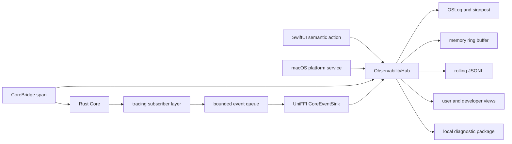

# 可观测性与诊断

> 定义 AreaMatrix 的结构化事件、运行模式、跨 Swift/Rust 因果链、本地存储、隐私、诊断包和开发者工具合同。
>
> 阅读时长：约 15 分钟。

---

## 核心结论

AreaMatrix 使用一个结构化事件底座承接 SwiftUI、平台服务、CoreBridge 和 Rust Core 的运行证据，并按受众投影为
用户活动、问题捕获、开发者 Trace Console、OSLog、滚动 JSONL 和本地诊断包。

运行日志、交互 trace、SQLite `change_log`、AI call log、repository metadata snapshot 与
`.amdiagnostic` 是不同数据产品。它们可以共享身份，但不得互相替代：运行日志失败不能阻断业务操作，事务性
`change_log` 继续按其业务一致性合同决定事务是否成功。

系统默认本地运行，不依赖账号或网络，不自动上传。所有安装版本都允许用户开启标准、诊断和开发者模式；构建
类型只影响默认值，不永久隐藏能力。

## 运行模式

| 模式 | 持久化 | 默认预算 | 默认保留 | 主要内容 |
|---|---:|---:|---:|---|
| 关闭持久化 | 否 | 进程内环形缓存 | 当前进程 | 必要错误、健康和最近上下文 |
| 标准 | 是 | 50 MB | 7 天 | 关键语义动作、结果、错误和耗时摘要 |
| 诊断 | 是 | 250 MB | 48 小时 | 分支、组件调用、状态变化和安全参数摘要 |
| 开发者 | 是 | 用户选择 100 MB–2 GB | 用户选择 1–30 天 | 完整注册事件、span、线程、组件、性能和技术详情 |

用户可以为诊断或开发者模式选择限时、直到下次启动或手动关闭。设置页始终显示当前模式、已运行时间、磁盘占用、
预计增长、最旧事件、丢弃事件数和立即删除入口。开发者模式不会解除 prohibited 数据边界。

## 数据产品边界

| 数据产品 | 用途 | 保存位置 | 失败语义 |
|---|---|---|---|
| Runtime log | 技术状态、警告和错误 | 内存、OSLog、Application Support | 降级，不阻断业务 |
| Interaction trace | 用户动作与跨层因果链 | 内存、Application Support | 降级，不阻断业务 |
| `change_log` | 文件与 metadata 业务审计 | repository SQLite | 按现有事务合同 |
| AI call log | AI 隐私与调用审计 | repository SQLite | 按 AI 合同 |
| Metadata snapshot | DB/WAL/SHM 诊断副本 | `.areamatrix/diagnostics/` | 用户显式触发 |
| `.amdiagnostic` | 可预览、可携带支持材料 | 用户选择的位置 | 本地生成，不自动发送 |

运行事件不是文件系统、DB 或恢复的真相源。事件丢失、writer 失败或磁盘满不能改变导入、恢复、同步或概览的提交结果。

## 统一事件信封

每个事件使用版本化 `ObservabilityEvent`：

```text
schema_version
event_id
wall_timestamp_ms
monotonic_timestamp_ns
sequence_number
session_id
incident_id?
trace_id
span_id
parent_span_id?
operation_id?
retry_of_operation_id?
action_id
component_id
layer
phase
severity
outcome
duration_ms?
resource_refs[]
error?
attributes[]
privacy_level
build_context
```

当前生产事件使用 schema version 2。`build_context` 标识产生该事件的二进制，而不是猜测整条 trace 中其他
组件的版本：

```text
producer
version
build?
configuration
platform
architecture
```

- Rust Core 事件使用 `producer=area_matrix_core` 与 Cargo 版本；macOS 事件使用
  `producer=areamatrix_macos` 与 App bundle version/build。
- `configuration` 只允许 `debug` 或 `release`，`platform` 与 `architecture` 使用受控小写标识。
- 旧 schema version 1 的本地 JSONL 和诊断包仍可只读打开；它们没有可信 build context，界面必须显示为
  legacy/unknown，导出为新包时显式规范化，不能用当前进程版本补猜历史事件。

- `session_id` 标识一次 App 运行。
- `trace_id` 标识一条因果链。
- `span_id` / `parent_span_id` 表达嵌套和异步父子关系。
- `incident_id` 标识用户或测试人员冻结的问题窗口。
- `operation_id` 标识可恢复业务操作；retry 创建新 operation 并链接 `retry_of_operation_id`。
- `action_id` 与 `component_id` 来自受治理目录，不由展示文本推断。
- wall clock 用于展示，monotonic clock 和 sequence 用于稳定排序与耗时。

业务 operation identity 和诊断 trace identity 生命周期不同。resume、replay、rollback 可以复用 operation，新的用户重试产生
新 operation；每次可观察执行仍有明确 trace 和 span。

## Action 与 Component Catalog

语义事件使用已注册的稳定 action，并用独立 `phase` 表达生命周期，例如：

```text
action_id=repository.import.confirmed, phase=started
action_id=repository.import.validation, phase=started
action_id=repository.import.validation, phase=completed
action_id=repository.import.staging, phase=started
action_id=repository.import.staging, phase=completed
action_id=repository.import.confirmed, phase=completed, outcome=succeeded|degraded|failed
```

Action Catalog 记录入口、触发条件、预期状态变化、处理组件、相关 API、失败分支、隐私和风险。Component Catalog
记录层级、owner、源码符号和权威文档。开发者控制台可以将实际 trace 与目录中的预期链路对比，但目录不执行代码，
也不允许自动重放操作。

机器可读 Catalog 的唯一源是 `core/resources/observability_catalog.json`。Core 对新事件和跨 FFI
`CoreTraceContext` 执行 action/component 精确成员校验；字符形状合法但未注册的 ID 同样 fail closed。macOS
将同一文件打包为只读资源，控制台只叠加本地化展示，不维护第二份 ID 清单。Catalog 文件损坏或版本不支持时，
Core 拒绝初始化/事件输入，控制台显示 Catalog 不可用，不能退回任意前缀匹配。

自由文本仅用于补充技术说明。查询、过滤、关联、恢复动作和用户文案不得依赖解析自由文本。

## 跨 Swift 与 Rust 传输


```mermaid
flowchart LR
    swiftUI["SwiftUI semantic action"] --> hub["ObservabilityHub"]
    platform["macOS platform service"] --> hub
    bridge["CoreBridge span"] --> hub
    bridge --> core["Rust Core"]
    core --> subscriber["tracing subscriber layer"]
    subscriber --> queue["bounded event queue"]
    queue --> sink["UniFFI CoreEventSink"]
    sink --> hub
    hub --> oslog["OSLog and signpost"]
    hub --> memory["memory ring buffer"]
    hub --> jsonl["rolling JSONL"]
    hub --> ui["user and developer views"]
    hub --> package["local diagnostic package"]
```

Rust 安装一次进程级 subscriber。Core event sink 的生命周期由明确的运行时 guard 持有；重复初始化返回稳定状态，
不能 panic。Core 工作线程只向有界队列提交事件，不同步等待 Swift UI 或文件 writer。

队列拥塞按 `trace/debug`、`info`、`warn/error` 的顺序优先丢弃低优先级事件。系统持续累计每级丢弃数量，并在容量
恢复后发出聚合 `observability.events_dropped`。错误事件也不能无限阻塞；超过严格 deadline 后记录健康降级。

Swift 平台层统一路由 OSLog、signpost、内存和文件 sink。业务 Feature 不直接写 JSONL，SwiftUI View 不做 IO，
业务代码不直接调用生成绑定。

## Trace Context 传播

Swift 为有语义的用户动作创建 trace context。CoreBridge 在调用开始、返回和错误时生成 span；需要端到端关联的
observed Core API 显式接收必填 `CoreTraceContext` 参数，兼容 API 不携带 context。不能依赖线程局部状态跨越
`Task.detached` 或同步 FFI。

后台根事件由 owning subsystem 创建：watcher window、startup recovery、scheduled cleanup 和 crash recovery 均有独立
root action。UI 状态变化引用同一 trace，但只记录稳定状态 code，不持久化翻译后的句子。

## 本地 sink 与存储

应用持有的运行日志位于：

```text
~/Library/Application Support/AreaMatrix/Logs/
├── manifest.json
├── events-<sequence>.jsonl
└── incidents/
```

日志默认不写入用户 repository，避免被同步、备份或误认为业务数据。JSONL 使用 create-new、受限权限、原子 manifest
替换、单 writer、总容量限制和最旧文件 rotation。损坏的尾行可以隔离，不能导致其余有效事件不可读。

`manifest.json` 当前使用 schema version 2，并分别记录事件文件、incident 文件及其所有权状态。目录扫描只形成
物理占名与容量清单，不能自动授予读取或删除权：`managed` 文件可读且可由 retention 或用户删除，`read_only`
文件仅可读，`pending_creation` / `pending_deletion` 用于崩溃恢复且不进入普通读取。精确命名但未登记的文件仍计入
物理占用和序号冲突判断，但不可读、不可删；因此外部放入同名文件最多导致预算降级，不能被应用接管。

有效 schema version 1 manifest 迁移时，只继承其中明确登记的 event 文件；旧格式未登记 incident 可以作为
`read_only` 历史记录打开，但不能更新或删除。manifest 损坏或 schema 未知时，writer fail closed：不覆盖 manifest、
不扫描接管、不执行 retention 或删除，并降级到内存。全新目录或缺少 manifest 且只有未登记候选文件时可以建立空的
version 2 manifest，但候选文件继续只有占名资格。

创建采用 `pending_creation -> managed` 两段持久化；删除采用
`managed -> pending_deletion -> unlink -> remove entry`。删除授权必须先通过原子 manifest 替换持久化，首次持久化
失败时不得 unlink。崩溃后只恢复 manifest 已明确授权的 pending 状态。平台层分别报告物理占用与 manifest-owned
占用，预算使用物理占用，retention 只能回收 manifest 明确可删的文件；所有字节、序号和时间换算使用 checked 或
saturating arithmetic。

内存 sink 是固定容量环形缓存。用户标记问题时冻结问题前约 5 分钟和之后约 30 秒的有界窗口；时间范围受实际容量和
模式预算限制。发生未预期 internal error 或异常退出时，系统也可以冻结最近窗口，并在下次启动提示用户是否查看。

Incident 在内存账本中使用 `memory_only`、`manifest_owned` 或 `read_only` disposition。capture、freeze、status 和
delete 对 `manifest_owned` incident 必须先完成对应持久化，再更新内存；持久化失败时不得伪装为已提交。
`read_only` 历史 incident 禁止更新和删除，`memory_only` incident 只影响当前进程。retention 一旦持久化撤销读取权，
即使后续 unlink 或 fsync 失败，内存账本也必须同步降为只读，不能继续向已撤权文件追加。

磁盘满、权限失败、编码失败或 writer 损坏时降级到内存，更新 `ObservabilityHealth`，不递归记录同一 writer 错误。

## 隐私分类与脱敏

字段按四级分类：

| 分类 | 示例 | 默认处理 |
|---|---|---|
| `public` | action/component ID、稳定错误码、耗时 | 可进入所有启用 sink |
| `pseudonymous` | 稳定 file alias、扩展名、大小区间 | 使用不可反查别名 |
| `sensitive` | 原文件名、完整路径、repository 名称 | 仅明确选择后进入本地受控材料 |
| `prohibited` | 文件/Note 正文、secret、token、完整 AI payload | 永不记录 |

source redaction 在事件进入 hub 前执行，export redaction 在生成诊断包时再次执行。错误字符串、恶意文件名、非 home
路径、URL、header 和第三方响应同样受扫描；只替换 home directory 不构成完整脱敏。

文件别名使用诊断包或本地安装范围的随机密钥生成 keyed pseudonym，不能直接 hash 文件名。默认 resource ref 只包含
alias、扩展名、大小区间、storage mode 和受控 identity。开发者模式仍不允许 prohibited 数据。

Rust `tracing` 自定义字段必须使用 `obs_public_`、`obs_pseudonymous_`、`obs_sensitive_` 或
`obs_prohibited_` 显式前缀；未知 `obs_*` 前缀按 Prohibited fail closed。FFI attribute 单值最多 4,096 UTF-8
bytes，单个 context/event 的结构化 payload 最多 65,536 bytes；filename/path/URL/locator key 的 Sensitive floor
不能由调用方降级。resource alias 固定为 `file.<24 lowercase hex>`，bucket 与 storage mode 使用受控 allowlist。

## 用户活动与问题捕获

用户视图将稳定事件映射为当前界面语言的活动、结果、错误和恢复动作，不展示函数名或持久化翻译句子。用户可以：

- 查看关键操作的自然语言时间线。
- 展开受控技术详情和稳定错误码。
- 标记刚才的问题并补充说明。
- 选择诊断范围、文件名策略和可选的 repository metadata snapshot 附件。
- 预览将被保存的内容和隐私报告。
- 删除本地运行日志或 incident。

模式切换、诊断导出、包含敏感字段和包含 metadata snapshot 分别确认；一次确认不能隐式授权其他数据类别。

## Developer Trace Console

开发者控制台在所有安装版本可打开；当前模式决定数据详细程度。控制台提供：

- 时间线、调用树、因果图、terminal 和 raw structured data。
- session、incident、trace、operation、action、component、severity、outcome 和 duration 过滤。
- span 输入摘要、状态变化、错误链、线程、丢弃计数和 sink 健康。
- Action/Component Catalog、预期与实际链路、两条 trace diff 和问题 fingerprint。
- 通过同一 trace identity 关联的 OSLog signpost 与 Instruments 性能区间。

控制台只读解释事件，不执行用户操作或从日志自动恢复文件。

## `.amdiagnostic` 合同

便携包是一个有版本 manifest 的目录包，而不是可执行 archive：

```text
<incident>.amdiagnostic/
├── manifest.json
├── events.jsonl
├── environment.json
├── privacy-report.json
├── summary.txt
├── checksums.json
└── attachments/repository-metadata/
```

包先写入 Application Support 下的受控临时目录，完成 flush、checksum 与内容复核后，再由用户选择目标执行不覆盖落位。
默认只包含脱敏事件和非敏感环境摘要。真实文件名、完整路径和 repository metadata snapshot 均为独立 opt-in。
当前附件 allowlist 只接受 `attachments/repository-metadata/` 下的 `index.db` 及存在时的 WAL/SHM，不支持任意
用户文件附件。

离线 viewer 将包视为不可信输入：拒绝 symlink、目录穿越、未知 required schema、超出总大小/文件数/单行/嵌套深度
限制、checksum 不一致和不规则文件。viewer 不执行脚本、URL、恢复动作或包内命令。

导出不表示上传。没有获得单独批准的 endpoint、authentication、transport encryption、retention、deletion、withdrawal、
service owner 和 security evidence 前，应用不提供网络发送实现。

## Repository diagnostics 与 About diagnostics

`create_diagnostics_snapshot(repoPath)` 仍只在 `.areamatrix/diagnostics/` 创建 metadata DB 及可选 WAL/SHM 副本。
它不包含用户文件正文，但可能包含路径、文件名、tags 和 notes，必须作为 sensitive 附件单独确认。

About diagnostics 继续输出 App/Core/schema 和版本兼容摘要。`.amdiagnostic` 的 `environment.json` 使用同类
非敏感环境摘要语义，但不依赖或复制 About 文本产物；两者都不能冒充完整运行 trace。

## 自身健康与失败语义

平台聚合的 `AppObservabilityHealth` 至少报告：初始化状态、当前模式、queue 深度与容量、各级 drop count、
source-redaction 拒绝计数、memory event count、file usage/budget、oldest event、writer 状态、callback 状态、
最近 rotation、redaction failure 和 degraded reason。Core FFI 的 `ObservabilityHealth` 只报告 Core runtime、queue、
drop、source redaction、callback 和 degraded 状态；macOS hub 无副作用地合并平台 writer、memory 与 rotation 状态。

健康检查必须无副作用。日志系统故障不会触发用户文件补偿、DB rollback、隐式 iCloud 下载或业务重试。若 redaction
无法证明安全，敏感事件 fail closed：不进入持久化或导出 sink，并增加受控计数。

## 性能与资源约束

- disabled/standard 热路径避免 JSON 编码和主线程 IO。
- sink 使用有界结构，不能随事件量无限增长。
- attribute、message、event、file、package 和 attachment 都有大小上限。
- signpost 只覆盖注册的性能 span，不为每个低价值 UI 事件生成区间。
- benchmark 和 XCTest 覆盖提交开销、持续吞吐、rotation、拥塞和 Trace Console 大数据集呈现。

## 验证要求

- Rust subscriber 初始化、过滤、event field、callback lifetime、并发、拥塞、drop、health 和 deadline。
- Swift hub、OSLog privacy、ring buffer、JSONL、rotation、retention、disk-full、corrupt tail 和 deletion。
- semantic action 到 Bridge、Core、storage outcome 和 UI state 的完整 trace continuity。
- hostile filename/path/error/URL/header/token 与 Unicode redaction。
- incident pre/post freeze、unknown error 和 abnormal termination recovery。
- `.amdiagnostic` preview/export parity、checksums、limits、symlink/path traversal 和 offline viewer。
- standard、diagnostic、developer 和 disabled persistence mode 的可用性与切换。
- en / zh-Hans 用户视图和 developer controls，不改变 user content、route、focus 或 draft identity。
- logging failure 不改变 import FS/DB 结果和用户文件不变量。

## Related

- [../product/privacy.md](../product/privacy.md)
- [../architecture/ffi-design.md](../architecture/ffi-design.md)
- [../architecture/concurrency.md](../architecture/concurrency.md)
- [../api/core-api.md](../api/core-api.md)
- [../ux/error-messages.md](../ux/error-messages.md)
- [testing.md](testing.md)
- [performance.md](performance.md)
