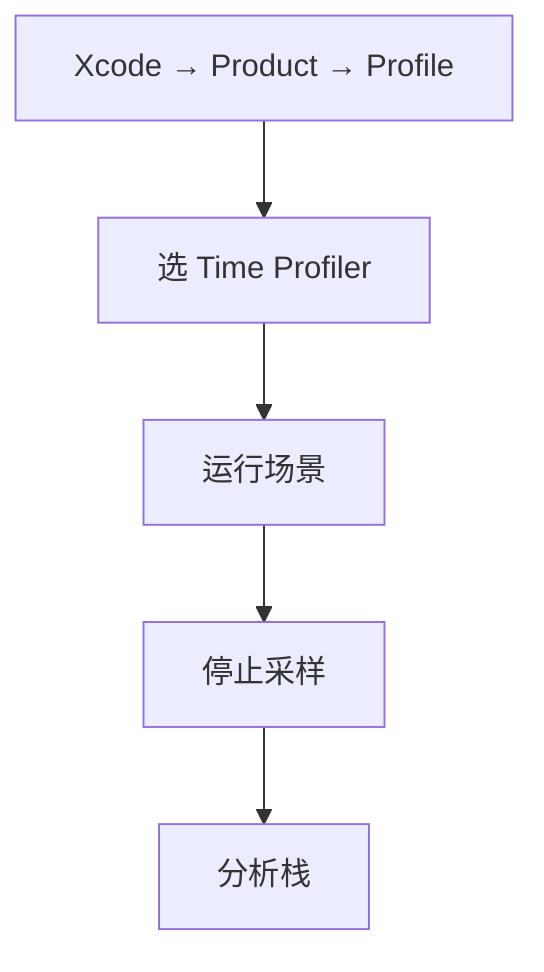
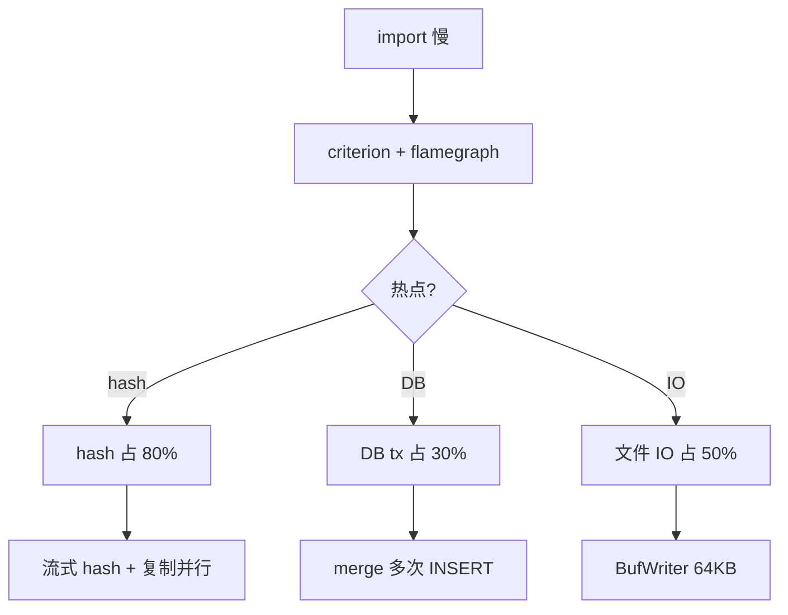

# 性能工程指南

> 性能基线、测量方法、优化路径。包含 Instruments 实操、cargo flamegraph、SQLite EXPLAIN、关键 hot path benchmark 方法。本文给出方法论与目标值；实测数据由具体环境决定。
>
> 阅读时长：约 18 分钟。

---

## 性能哲学

1. **测量优先于优化**：没有 profile 不动手优化
2. **目标驱动**：每个性能指标有明确数字目标，达标即停
3. **优化局部不退步整体**：每次优化跑回归 bench
4. **优先用户感知**：UI 卡顿 > 后台耗时 > CPU 占用

---

## 关键性能目标

### Rust Core

| 操作 | 目标（M1, SSD） | 验证方法 |
|---|---|---|
| `import_file` 1MB | < 30 ms | criterion bench |
| `import_file` 100MB | < 1 s | criterion bench |
| `predict_category` 单次 | < 50 µs | criterion bench |
| `list_files` 200 行 | < 5 ms | criterion bench |
| `list_changes` 100 行 | < 5 ms | criterion bench |
| `list_tree_json` 1k 文件 | < 30 ms | criterion bench |
| `list_tree_json` 10k 文件 | < 300 ms | criterion bench |
| `recover_on_startup` 100 stale | < 200 ms | 集成测试 |
| `reindex_from_filesystem` 10k 文件 | < 30 s | 集成测试 |
| sha256 1MB | < 5 ms | criterion bench |
| sha256 100MB | < 400 ms | criterion bench |

### Swift UI

| 操作 | 目标 | 验证方法 |
|---|---|---|
| 应用启动到首屏 | < 1.5 s | XCTest performance |
| 拖入文件到列表更新 | < 500 ms | XCUITest |
| 切换分类 | < 100 ms | XCUITest |
| 列表滚动 60 fps | 16.6 ms/frame | Instruments → Time Profiler |
| 详情面板打开 | < 200 ms | XCUITest |

### 资源占用

| 指标 | 目标 |
|---|---|
| 空闲内存 | < 200 MB |
| 1k 文件库内存 | < 300 MB |
| 10k 文件库内存 | < 500 MB |
| 100k 文件库内存 | < 1 GB |
| 空闲 CPU | < 1% |
| 拖入处理 CPU | < 200%（多核） |

---

## Rust Core 性能工具链

### 1. cargo bench (criterion)

```toml
# core/Cargo.toml
[dev-dependencies]
criterion = { version = "0.5", features = ["html_reports"] }
tempfile = "3"

[[bench]]
name = "storage_bench"
harness = false
```

```rust
// core/benches/storage_bench.rs
use criterion::{black_box, criterion_group, criterion_main, Criterion, BenchmarkId};
use tempfile::TempDir;

fn bench_import_sizes(c: &mut Criterion) {
    let mut group = c.benchmark_group("import_file");
    group.sample_size(20);

    for &size in &[1024, 1024 * 1024, 10 * 1024 * 1024, 100 * 1024 * 1024] {
        group.bench_with_input(
            BenchmarkId::from_parameter(size),
            &size,
            |b, &size| {
                b.iter_with_setup(
                    || {
                        let dir = tempfile::tempdir().unwrap();
                        let p = dir.path().to_path_buf();
                        area_matrix::api::init_repo(p.to_string_lossy().into()).unwrap();
                        let src = p.join("__src.bin");
                        std::fs::write(&src, vec![0u8; size]).unwrap();
                        (dir, p, src)
                    },
                    |(_dir, repo, src)| {
                        let entry = area_matrix::storage::import_file(
                            &repo,
                            &src,
                            area_matrix::api::types::ImportOptions::default(),
                        ).unwrap();
                        black_box(entry);
                    },
                );
            },
        );
    }
    group.finish();
}

fn bench_classify(c: &mut Criterion) {
    let dir = tempfile::tempdir().unwrap();
    let repo = dir.path().to_path_buf();
    area_matrix::api::init_repo(repo.to_string_lossy().into()).unwrap();

    c.bench_function("classify_short_name", |b| {
        b.iter(|| {
            let r = area_matrix::classify::classify(&repo, black_box("Invoice_Q1.pdf"));
            black_box(r);
        });
    });
}

fn bench_list_files(c: &mut Criterion) {
    let dir = tempfile::tempdir().unwrap();
    let repo = dir.path().to_path_buf();
    area_matrix::api::init_repo(repo.to_string_lossy().into()).unwrap();
    for i in 0..1000 {
        let src = repo.join(format!("__s{}.txt", i));
        std::fs::write(&src, format!("content-{}", i)).unwrap();
        let mut opts = area_matrix::api::types::ImportOptions::default();
        opts.duplicate_strategy = area_matrix::api::types::DuplicateStrategy::KeepBoth;
        let _ = area_matrix::storage::import_file(&repo, &src, opts);
    }

    c.bench_function("list_files_200", |b| {
        b.iter(|| {
            let r = area_matrix::api::list_files(
                repo.to_string_lossy().into(),
                area_matrix::api::types::FileFilter { limit: 200, ..Default::default() },
            ).unwrap();
            black_box(r);
        });
    });
}

criterion_group!(benches, bench_import_sizes, bench_classify, bench_list_files);
criterion_main!(benches);
```

跑：

```bash
cargo bench --bench storage_bench -- --save-baseline main
# 改了代码后...
cargo bench --bench storage_bench -- --baseline main
```

输出在 `target/criterion/<test>/report/index.html`。

---

### 2. cargo flamegraph

```bash
cargo install flamegraph
cargo flamegraph --bench storage_bench -- --bench
open flamegraph.svg
```

火焰图阅读：

- x 轴：栈帧占总采样的比例
- y 轴：调用深度
- 宽柱子 = 热点（值得优化）
- 颜色无意义（仅区分）

---

### 3. perf-stat 关键 metric

```bash
brew install hyperfine
hyperfine --warmup 3 'cargo run --release -- import /tmp/big.pdf'
```

Linux 还可：

```bash
perf stat -e cycles,instructions,cache-misses cargo bench --bench storage_bench
```

---

### 4. SQLite EXPLAIN QUERY PLAN

```bash
sqlite3 ~/AreaMatrix/.areamatrix/index.db
> .timer on
> .eqp on
> SELECT id, current_name FROM files WHERE category = 'docs' ORDER BY imported_at DESC LIMIT 200;
```

输出示例：

```text
QUERY PLAN
`--SEARCH files USING INDEX idx_files_category_active (category=?)
Run Time: real 0.003 user 0.002000 sys 0.000000
```

阅读关键词：

| 关键词 | 含义 |
|---|---|
| SEARCH ... USING INDEX | 走索引查找（好） |
| SCAN ... USING INDEX | 全索引扫（次优） |
| SCAN ... | 全表扫（差） |
| USE TEMP B-TREE FOR ORDER BY | 排序未走索引（可优化） |
| USE TEMP B-TREE FOR GROUP BY | 分组未走索引（可优化） |

详见 [../architecture/data-model.md](../architecture/data-model.md) 的 EXPLAIN 章节。

---

### 5. tracing 性能日志

在关键路径埋点：

```rust
use tracing::{info_span, instrument};

#[instrument(skip(repo, src), fields(size = field::Empty))]
pub fn import_file(repo: &Path, src: &Path, options: ImportOptions) -> CoreResult<FileEntry> {
    let span = tracing::Span::current();
    let size = std::fs::metadata(src)?.len();
    span.record("size", size);

    let _stage = info_span!("staging").entered();
    materialize_to_staging(src, &staging, options.mode)?;
    drop(_stage);

    let _h = info_span!("hash").entered();
    let hash = sha256_file(&staging)?;
    drop(_h);

    Ok(...)
}
```

启用：

```rust
tracing_subscriber::fmt()
    .with_env_filter("area_matrix=debug,area_matrix::storage=trace")
    .with_span_events(tracing_subscriber::fmt::format::FmtSpan::CLOSE)
    .init();
```

输出含每个 span 的耗时。

---

## Swift / macOS 性能工具链

### 1. Instruments → Time Profiler



**关注**：

- "Heaviest Stack Trace"
- 主线程是否有 > 16ms 的栈（卡顿）
- Hide System Libraries 看自家代码

---

### 2. Instruments → Allocations

排查内存泄漏与峰值：

- "Persistent Bytes" 一直涨 = 泄漏
- "Sticky" 高 = 大对象未释放
- 标记拖入前 / 拖入后 → 看 delta

---

### 3. Instruments → File Activity

排查 IO：

- 多少次 `open` / `read` / `write`？
- 单次 IO 大小是否合理（4KB 太小、64MB 太大）？

---

### 4. Instruments → SwiftUI

iOS 16/macOS 13+ 提供：

- "View Body Time"：哪些 View 重绘慢
- "View Properties"：state diff 频率

---

### 5. XCTest performance

```swift
final class StoragePerfTests: XCTestCase {
    func test_list_files_under_5ms() {
        let opts = XCTMeasureOptions()
        opts.iterationCount = 10
        measure(metrics: [XCTClockMetric()], options: opts) {
            _ = try? coreBridge.listFiles(filter: .init(limit: 200))
        }
    }

    func test_app_launch_under_1500ms() {
        let opts = XCTMeasureOptions.default
        measure(metrics: [XCTApplicationLaunchMetric()], options: opts) {
            XCUIApplication().launch()
        }
    }
}
```

跑：

```bash
xcodebuild test -scheme AreaMatrix -only-testing:AreaMatrixPerfTests
```

CI 中维护 baseline，超过阈值（默认 +10%）失败。

---

### 6. fps 监控（开发用）

```swift
final class FPSMonitor {
    private var displayLink: CVDisplayLink?
    private var frames = 0
    private var lastReport = Date()

    public func start() {
        CVDisplayLinkCreateWithActiveCGDisplays(&displayLink)
        CVDisplayLinkSetOutputCallback(displayLink!, { [unowned self] _, _, _, _, _, _ in
            self.tick()
            return kCVReturnSuccess
        }, Unmanaged.passUnretained(self).toOpaque())
        CVDisplayLinkStart(displayLink!)
    }

    private func tick() {
        frames += 1
        if Date().timeIntervalSince(lastReport) >= 1 {
            print("FPS: \(frames)")
            frames = 0
            lastReport = Date()
        }
    }
}
```

仅 DEBUG 编译时启用，不进发布版。

---

## 关键 hot path 优化清单

### 1. import_file 优化路径



### 2. SQLite 写入优化

```sql
-- 批量 INSERT 用单事务
BEGIN;
INSERT INTO files ... ;
INSERT INTO files ... ;
... (N 次)
COMMIT;
```

100 次单独 INSERT vs 1 个事务 100 次 INSERT：后者快 50-100×。

### 3. 列表查询优化

```sql
-- 慢：全表 LIKE
SELECT * FROM files WHERE current_name LIKE '%2026%';

-- 快：FTS5（Stage 2）
SELECT files.* FROM files
  JOIN files_fts ON files_fts.rowid = files.id
  WHERE files_fts MATCH '2026';
```

### 4. JSON 解析优化

`list_tree_json` 返回字符串，Swift 端解析。10k 节点 JSON ≈ 5MB：

- Rust 序列化用 `serde_json::to_vec` 而非 `to_string`（少一次 UTF-8 校验）
- Swift 解码用 `JSONDecoder` 配 `keyDecodingStrategy = .useDefaultKeys`，避免 snake_case 转换开销
- 大库下分页或仅返回展开节点

---

## 内存优化

### Rust 端

```rust
// ❌ 把整个文件读入内存
let content = std::fs::read(path)?;
let hash = sha256(&content);

// ✅ 流式读
let hash = sha256_file(path)?;
```

```rust
// ❌ Vec<FileEntry> 持有字符串
struct FileEntry {
    path: String,         // 60 bytes
    original_name: String,
    current_name: String,
}

// ✅ 用 Box<str> 节省 16 字节/字段
struct FileEntry {
    path: Box<str>,
}
```

10 万行节省 ≈ 5 MB。

### Swift 端

- 列表用 `LazyVStack`，不要一次性渲染所有 row
- 缩略图用 `NSImage(byReferencing:)` 懒加载
- `@Published var files: [FileEntry]` 改动会触发整个列表重渲染 → 用 diffable data source

---

## 启动时间优化

### 启动序列

```mermaid
gantt
    title 启动时间预算（目标 < 1.5s）
    dateFormat  X
    axisFormat %s

    section 系统
    macOS 加载二进制       :a1, 0, 200
    section Rust 初始化
    init_logging          :a2, after a1, 50
    recover_on_startup    :a3, after a2, 200
    schema migration check :a4, after a3, 50
    section Swift 初始化
    AppDelegate           :b1, after a4, 100
    SwiftUI 主窗口          :b2, after b1, 200
    list_files 首屏        :b3, after b2, 50
    用户可见首屏           :milestone, after b3, 0
    section 后台
    启动 watcher           :c1, after b3, 100
    list_tree_json (后台)   :c2, after b3, 200
    reconcile (大库)       :c3, after c2, 5000
```



### 优化点

1. **延后非关键工作**：watcher、reconcile、tree 都在首屏后启动
2. **预热缓存**：classify 规则在 Rust init 时加载
3. **首屏数据精简**：list_files 限 50 行，滚动后续加载
4. **避免阻塞**：所有 IO 用 `Task.detached`

---

## CI 性能回归

`.github/workflows/perf-ci.yml`：

```yaml
name: perf-ci
on:
  pull_request:
    paths: ['core/**', 'apps/macos/**']

jobs:
  bench:
    runs-on: macos-14
    steps:
      - uses: actions/checkout@v4
        with:
          fetch-depth: 0

      - name: install rust
        uses: dtolnay/rust-toolchain@stable

      - name: bench main baseline
        run: |
          git checkout main
          cd core && cargo bench --bench storage_bench -- --save-baseline main

      - name: bench PR
        run: |
          git checkout ${{ github.head_ref }}
          cd core && cargo bench --bench storage_bench -- --baseline main | tee bench-out.txt

      - name: regression check
        run: |
          if grep -E "Regressed|Performance has regressed" core/bench-out.txt; then
            echo "Performance regression detected"
            cat core/bench-out.txt
            exit 1
          fi

      - name: comment results
        uses: actions/github-script@v7
        with:
          script: |
            const fs = require('fs');
            const out = fs.readFileSync('core/bench-out.txt', 'utf8');
            github.rest.issues.createComment({
              issue_number: context.issue.number,
              owner: context.repo.owner,
              repo: context.repo.repo,
              body: '```\n' + out.slice(0, 60000) + '\n```'
            });
```

---

## 常见性能反模式

### 1. 主线程做 hash

```swift
// ❌ 卡 UI
let hash = SHA256.hash(of: fileData)

// ✅
let hash = try await Task.detached { ... }.value
```

### 2. 一次拉所有 change_log

```swift
// ❌
let allChanges = try AreaMatrix.listChanges(filter: ChangeFilter(limit: 999999))

// ✅ 分页
let firstPage = try AreaMatrix.listChanges(filter: ChangeFilter(limit: 100, offset: 0))
```

### 3. 在循环里 N+1 查询

```rust
// ❌
for entry in entries {
    let changes = db::list_changes_for(repo, entry.id)?;
    println!("{}: {} changes", entry.path, changes.len());
}

// ✅ JOIN 查询
let map = db::changes_count_by_file(repo, &ids)?;
```

### 4. 频繁 readme 重生成

```rust
// ❌
for file in batch {
    import_file(...)?;
    readme::regenerate_for_category(...)?;  // 50 次
}

// ✅ 批量后一次
for file in batch {
    import_file_skip_readme(...)?;
}
readme::regenerate_for_category(...)?;
```

详见 [../modules/readme-gen.md](../modules/readme-gen.md) 的 debounce 章节。

### 5. mmap_size 配过大

```sql
PRAGMA mmap_size = 1099511627776;  -- 1TB?!
```

mmap 占用进程虚拟地址空间。设到合理值（256MB）即可。

### 6. 索引滥用

每个索引都有 INSERT/UPDATE 写开销。仅在能加速查询的列上建索引。

```sql
-- ❌ 不必要的索引
CREATE INDEX idx_files_imported_at_asc ON files(imported_at ASC);  -- 已有 DESC 索引

-- ✅ 删除冗余
DROP INDEX idx_files_imported_at_asc;
```

---

## 性能监控埋点

### Rust 端

```rust
pub struct Metrics {
    pub import_count: AtomicU64,
    pub import_total_ms: AtomicU64,
    pub hash_total_bytes: AtomicU64,
    pub hash_total_ms: AtomicU64,
}

impl Metrics {
    pub fn record_import(&self, ms: u64) {
        self.import_count.fetch_add(1, Ordering::Relaxed);
        self.import_total_ms.fetch_add(ms, Ordering::Relaxed);
    }
}
```

`get_metrics()` FFI 暴露给 Swift，用户可在调试面板看。

### Swift 端

```swift
struct PerfDashboard: View {
    @State var metrics: Metrics?

    var body: some View {
        VStack {
            if let m = metrics {
                Text("imports: \(m.importCount)")
                Text("avg ms: \(m.importAvgMs, specifier: \"%.1f\")")
                Text("hash MB/s: \(m.hashThroughputMBs, specifier: \"%.0f\")")
            }
        }
        .task {
            while !Task.isCancelled {
                metrics = try? await coreBridge.getMetrics()
                try? await Task.sleep(for: .seconds(1))
            }
        }
    }
}
```

---

## 性能基线记录表（CI 维护）

CI 每次跑 bench 后写入：

```text
date         commit  bench                  ms
2026-04-28   a1b2c3  import_1MB             18.3
2026-04-28   a1b2c3  import_100MB           742.5
2026-04-28   a1b2c3  classify               0.04
2026-04-28   a1b2c3  list_files_200         3.1
```

可视化：`gh-pages` 部署 d3.js 图表，看趋势。

---

## 记录优化的方法

每次性能 PR 必须包含：

1. **优化前 baseline**（criterion 输出）
2. **优化后**（criterion 输出）
3. **变化百分比**
4. **回归测试是否绿**

PR 模板：

```markdown
## Performance Impact

Bench: `import_file` 100MB

| | before | after | delta |
|---|---|---|---|
| time | 850 ms | 720 ms | -15% |
| allocs | 1.2 MB | 0.8 MB | -33% |

flamegraph diff: [before.svg](...) | [after.svg](...)
```

---

## Related

- [troubleshooting.md](troubleshooting.md)
- [observability.md](observability.md)
- [testing.md](testing.md)
- [../architecture/data-model.md](../architecture/data-model.md)
- [../architecture/concurrency.md](../architecture/concurrency.md)
- [../modules/storage.md](../modules/storage.md)
