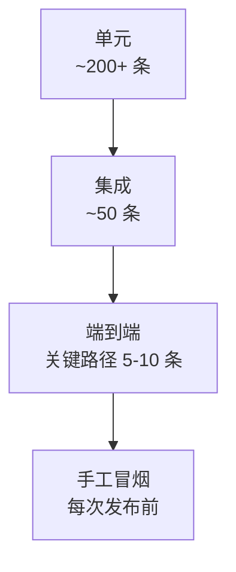

# 测试策略

> 单元测试 / 集成测试 / 手工冒烟 / 性能基线 / 崩溃测试，覆盖 AreaMatrix 的所有质量保证手段。
>
> 阅读时长：约 6 分钟。

---

## 测试金字塔



数量逐层减少，但每层都不可省。

---

## 覆盖目标

| 模块 | 覆盖率门槛 | 工具 |
|---|---|---|
| `core/storage` | ≥ 85% | cargo-llvm-cov |
| `core/classify` | ≥ 90% | cargo-llvm-cov |
| `core/db` | ≥ 80% | cargo-llvm-cov |
| `core/sync` | ≥ 80% | cargo-llvm-cov |
| `core/overview` | ≥ 75% | cargo-llvm-cov |
| 全 core 加权 | ≥ 70% | CI 强制 |
| Swift Watcher | ≥ 60% | Xcode coverage |
| Swift Bridge | ≥ 50%（其余靠集成测试） | - |
| SwiftUI 视图 | 不强制 | 靠 E2E 和 UI snapshot（Stage 2+） |

---

## Rust 单元测试

### 同文件 module 模式

```rust
// core/src/classify/mod.rs
pub fn classify(...) -> ClassifyResult { /* ... */ }

#[cfg(test)]
mod tests {
    use super::*;

    fn setup_repo() -> tempfile::TempDir {
        let tmp = tempfile::tempdir().unwrap();
        crate::api::init_repo(
            tmp.path().to_string_lossy().to_string(),
            RepoInitOptions::create_empty_generated_only(),
        ).unwrap();
        tmp
    }

    #[test]
    fn extension_match() {
        let tmp = setup_repo();
        let r = classify(tmp.path(), "report.pdf");
        assert_eq!(r.category, "docs");
    }
}
```

### 集成测试目录

`core/tests/`，每个文件独立编译：

```rust
// core/tests/import_test.rs
use area_matrix_core::*;
mod common;

#[test]
fn import_copy_mode_keeps_source() {
    let (repo, src) = common::setup_with_source("hello.pdf");
    let opts = ImportOptions {
        mode: StorageMode::Copied,
        override_category: None,
        override_filename: None,
        duplicate_strategy: DuplicateStrategy::Skip,
    };
    let entry = import_file(
        repo.path().to_string_lossy().to_string(),
        src.path().to_string_lossy().to_string(),
        opts,
    ).unwrap();
    assert!(src.path().exists());  // 源还在
    assert!(repo.path().join(&entry.path).exists());  // 库里也有
}
```

### 共享 fixtures

```rust
// core/tests/common/mod.rs
use std::path::PathBuf;
use tempfile::{NamedTempFile, TempDir};

pub fn setup_repo() -> TempDir { /* ... */ }

pub fn setup_with_source(name: &str) -> (TempDir, NamedTempFile) {
    let repo = setup_repo();
    let src = NamedTempFile::with_prefix(name).unwrap();
    std::fs::write(src.path(), b"test content").unwrap();
    (repo, src)
}
```

---

## 关键测试场景

### Storage 模块

- import Move / Copy / Index
- 重复 hash 处理：Skip / Overwrite / KeepBoth
- 冲突重命名（同名 1000 次上限）
- 删除（软 / 硬）+ 废纸篓
- 重命名（合法名 / 非法名）
- 跨分类移动
- 启动 recovery（手动放 staging 文件 + DB staging 行）

### Classify 模块

- keyword 优先于 extension
- 中文关键词匹配
- 大小写不敏感
- Unicode NFKC 归一
- 兜底 inbox
- 无效 yaml 时保留旧规则

### Sync 模块

- 外部 created → INSERT
- 外部 removed → soft delete
- 外部 modified → 更新 hash + change_log
- 外部 rename（hash 匹配）→ UPDATE path
- 外部 同名内容不同 → 当作新建
- batch events 顺序处理

### DB / Migration

- v1 schema 创建
- migration v1 → v2 模拟
- WAL 模式启用
- 外键约束生效
- 备份创建

### 概览生成

- `.areamatrix/generated/` 输出正确
- 可选 `AREAMATRIX.md` 用户区域保留
- 标记缺失时追加
- 已有 `README.md` 不被改写
- 中英 locale 切换

---

## Swift 单元测试

### XCTest

```swift
// apps/macos/AreaMatrixTests/InFlightTrackerTests.swift
import XCTest
@testable import AreaMatrix

final class InFlightTrackerTests: XCTestCase {
    func testMarkAndContains() async {
        let tracker = InFlightTracker()
        await tracker.mark("/tmp/a")
        let has = await tracker.contains("/tmp/a")
        XCTAssertTrue(has)
    }

    func testRefcount() async {
        let tracker = InFlightTracker()
        await tracker.mark("/tmp/a")
        await tracker.mark("/tmp/a")
        await tracker.unmark("/tmp/a")
        XCTAssertTrue(await tracker.contains("/tmp/a"))
        await tracker.unmark("/tmp/a")
        XCTAssertFalse(await tracker.contains("/tmp/a"))
    }
}
```

### Debouncer 时间敏感测试

```swift
func testDebouncesWithin200ms() async throws {
    let exp = expectation(description: "flush")
    let debouncer = Debouncer(interval: 0.2) { events in
        XCTAssertEqual(events.count, 1)  // 多次 enqueue 合并为 1
        exp.fulfill()
    }
    debouncer.enqueue([.fixture(path: "/tmp/a", flags: 1)])
    try await Task.sleep(nanoseconds: 50_000_000)
    debouncer.enqueue([.fixture(path: "/tmp/a", flags: 2)])
    await fulfillment(of: [exp], timeout: 1.0)
}
```

### 本地沙箱 XCTest 执行

macOS 单元测试的标准入口仍然是 `xcodebuild test`：

```bash
xcodebuild test \
  -project apps/macos/AreaMatrix.xcodeproj \
  -scheme AreaMatrix \
  -destination 'platform=macOS,arch=arm64' \
  CODE_SIGNING_ALLOWED=NO
```

部分受限本地执行器无法访问 `com.apple.testmanagerd.control`，会在测试 runner
通信阶段失败。此时使用：

```bash
./dev test macos
```

该脚本先运行标准 `xcodebuild test`。只有失败日志明确指向
`testmanagerd` sandbox restriction 时，才复用同一 DerivedData 中的
`AreaMatrixTests.xctest`，通过 `xcrun xctest` 直接执行 hostless XCTest
bundle。普通编译失败、断言失败、链接失败或非沙箱错误仍然按失败处理。
如果 `xcodebuild test` 已经输出目标 XCTest suite 全部通过，但仅在测试结束后的
`testmanagerd` 日志收集或分布式通知阶段被本地 sandbox 拦截，`./dev test macos`
会把该结果视为标准 XCTest 证据通过；这种判定不得掩盖真实构建失败或断言失败。

当仅运行 `AreaMatrixTests/AreaMatrixPerfTests` 时，`./dev test macos` 还会在
显式开启 Stage 1 performance XCTest，并在 performance 通过后构建 signed Release `.app`，执行 codesign、自包含链接检查和
`scripts/dev_tools/macos_launch_probe.swift` 启动探针。若当前本地 sandbox 阻断
LaunchServices 启动，或 direct executable probe 无法创建可见窗口，命令可以作为本地
validation 通过，但 release checklist 必须继续记录“真实 `.app` 启动到首屏证据
BLOCKED”；hostless XCTest fallback 不得替代 release 放行证据。若 release app launch
probe 正常记录 `applicationLaunchToFirstScreen.realApp` 且低于阈值，则 release checklist
必须记录真实 `.app` 首屏证据通过，但该证据仍不替代 Developer ID 签名、公证、DMG 或
干净 Mac 首启。

`AreaMatrixPerfTests` 默认不参加普通全量 `./dev test macos`，避免 wall-clock 和
resident memory 指标在共享 CI runner 上造成随机失败；需要验证性能基线时使用：

```bash
./dev test macos --only-testing AreaMatrixTests/AreaMatrixPerfTests
```

---

## 集成测试

### Rust 端

`core/tests/` 下，全场景从 init_repo → import → 改名 → 删除。

### macOS 端（XCUITest，Stage 2 起）

```swift
// 自动化端到端：启动 app → 拖文件 → 验证树/列表
final class FullFlowTests: XCTestCase {
    func testDragImportShowsInList() throws {
        let app = XCUIApplication()
        app.launch()
        // ... drag & drop simulation ...
    }
}
```

MVP 不强制 UI 测试（手工冒烟覆盖）。

---

## 手工冒烟清单

发布前必跑（[stage-1-mvp.md 验收清单](../roadmap/stage-1-mvp.md) 完整版）：

- [ ] 从干净状态启动 → 首次启动向导 → 选目录 → 完成
- [ ] 拖单个 PDF → ImportSheet 默认 Copy → 确认 → 列表出现
- [ ] 拖单个 PNG → 自动归 media → 确认
- [ ] 拖含「invoice」的 PDF → 自动归 finance（关键词优先）
- [ ] 切换 Move 模式 → 源文件消失
- [ ] 切换 Index 模式 → 源文件保留 + 库内无该文件，DB 有记录
- [ ] 拖入重复文件 → 弹"已存在"提示
- [ ] 在 Finder 重命名某文件 → UI 1 秒内更新
- [ ] 在 Finder 删除某文件 → UI 自动移除
- [ ] 在 Finder 把文件从 docs/ 拖到 code/ → UI 反映新分类
- [ ] 拖入 100 个文件中途 ⌘Q → 重启 → 无半成品 + 提示恢复信息
- [ ] 编辑文件笔记 → 详情面板更新 + Finder 中 `<filename>.md` 出现
- [ ] 关闭 app → 在 Finder 添加文件到分类目录 → 启动 app → 出现在列表
- [ ] 把资料库放在 iCloud Drive → 查看占位符文件 → 触发下载
- [ ] 改 classifier.yaml 加新分类 → 保存 → UI 自动加载
- [ ] 改坏 yaml → 保存 → 提示错误 + 旧规则保留

---

## 性能测试

### 基准（M1 SSD）

| 场景 | 目标 |
|---|---|
| 冷启动 → 主窗口 | < 1.5s |
| 拖入 10MB PDF（Copy） | < 200ms |
| 拖入 100MB PDF（Copy） | < 1s |
| 树状图渲染 10 万节点 | < 500ms |
| FSEvents → UI 更新 | < 1s |
| reindex 1 万文件 | < 30s |

### 工具

- Rust：`criterion` crate（核心 hot path 单测）
- Swift：Xcode Instruments → Time Profiler / Allocations

### 性能测试代码示例

```rust
// core/benches/hash_bench.rs
use criterion::{criterion_group, criterion_main, Criterion};

fn hash_100mb(c: &mut Criterion) {
    let path = generate_test_file(100 * 1024 * 1024);
    c.bench_function("sha256_100mb", |b| {
        b.iter(|| area_matrix_core::storage::hash::sha256_file(&path).unwrap())
    });
}

criterion_group!(benches, hash_100mb);
criterion_main!(benches);
```

---

## 崩溃测试

模拟"中途断电"等极端场景：

### 在测试中触发 panic

```rust
// 用 `cfg(test)` + 环境变量注入故障点
#[cfg(test)]
fn maybe_panic_for_test(point: &str) {
    if std::env::var(format!("PANIC_AT_{}", point)).is_ok() {
        panic!("test injection: {}", point);
    }
}

pub fn import_file(...) -> CoreResult<FileEntry> {
    // ...
    copy_to_staging(...)?;
    maybe_panic_for_test("AFTER_STAGING");
    let hash = hash_file(...)?;
    maybe_panic_for_test("AFTER_HASH");
    // ...
}
```

```rust
#[test]
fn recovers_from_panic_after_staging() {
    let repo = setup();
    std::env::set_var("PANIC_AT_AFTER_STAGING", "1");
    let _ = std::panic::catch_unwind(|| {
        import_file(repo.path(), &src, opts);
    });
    std::env::remove_var("PANIC_AT_AFTER_STAGING");

    let report = recover_on_startup(repo.path()).unwrap();
    assert_eq!(report.cleaned_staging_files, 1);

    let entries = list_files(repo.path(), FileFilter::default()).unwrap();
    assert!(entries.is_empty());  // 没留下半成品
}
```

### 子进程方式（更真实）

启动子进程跑 import → 主进程 SIGKILL → 重启子进程做 recovery：

```rust
#[test]
fn sigkill_during_import_safe() {
    let repo = setup();
    let mut child = std::process::Command::new(env!("CARGO_BIN_EXE_kill_test_helper"))
        .arg(repo.path())
        .arg(&src)
        .spawn().unwrap();
    std::thread::sleep(std::time::Duration::from_millis(100));
    let _ = child.kill();
    let _ = child.wait();

    let report = recover_on_startup(repo.path()).unwrap();
    let entries = list_files(repo.path(), FileFilter::default()).unwrap();

    // 要么导入成功，要么完全没记录；不允许中间态
    if !entries.is_empty() {
        assert_eq!(entries.len(), 1);
        assert!(repo.path().join(&entries[0].path).exists());
    } else {
        assert_eq!(report.cleaned_staging_files + report.reverted_staging_db_rows, 0);
    }
}
```

---

## 持续集成

详见 `.github/workflows/`。

每次 PR：

1. cargo fmt --check
2. cargo clippy -- -D warnings
3. cargo test --workspace
4. cargo llvm-cov --fail-under-lines 70
5. ./dev build core
6. xcodebuild test（本地沙箱可用 `./dev test macos` 补执行证据）
7. cd apps/macos && swiftformat --lint . --config ../../scripts/dev_tools/swiftformat.conf --exclude AreaMatrix/Bridge/Generated,AreaMatrix/Bridge/UniFFI --cache ignore
8. cd apps/macos && swiftlint lint --strict --config ../../scripts/dev_tools/swiftlint.yml --force-exclude . --no-cache

任一失败 = 不允许合并。

---

## 测试反模式（不要这样写）

- ❌ 测试名 `test_xxx_1`、`test_xxx_2`
- ❌ 用 sleep 控制并发（用 expectation / barrier）
- ❌ 测试间共享全局状态（用 tempdir 隔离）
- ❌ 测试断言 `assert!(true)` 类废话
- ❌ 测试做太多事（一个 test 验证多个互不相关的行为）
- ❌ 测试需要"重启"应用才能复现（说明 cleanup 不到位）

---

## Related

- [coding-standards.md](coding-standards.md)
- [build.md](build.md)
- [release.md](release.md)
- [performance.md](performance.md)
- [observability.md](observability.md)
- [troubleshooting.md](troubleshooting.md)
- [../api/uniffi-recipes.md](../api/uniffi-recipes.md)
- [../roadmap/stage-1-mvp.md](../roadmap/stage-1-mvp.md)
