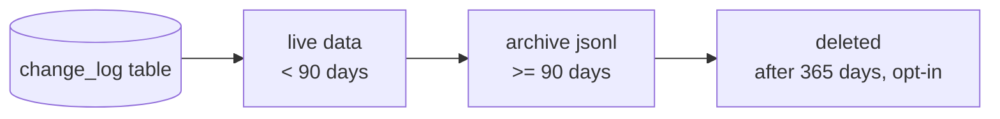

# 模块：改动日志（change_log）

> 所有文件级动作都被记录到 SQLite `change_log` 表。详情面板的「改动」Tab、根 README 的「近期改动」段都从这里来。
>
> 阅读时长：约 10 分钟。

---

## 设计原则

1. **append-only**：永不更新已存在的记录，只 INSERT
2. **结构化但灵活**：固定字段 + `detail_json` 任意 schema
3. **不阻塞主操作**：写日志失败不能让 import / rename 失败（但要 tracing 警告）
4. **DB 损坏不丢用户文件**：日志只是元信息，FS 才是真相
5. **支持 GC**：Stage 2 起加保留策略与归档

---

## 动作类型（7 种）

```rust
// core/src/change_log/mod.rs
#[derive(Debug, Clone, Copy, PartialEq, Eq, serde::Serialize, serde::Deserialize)]
#[serde(rename_all = "snake_case")]
pub enum ChangeAction {
    Imported,
    Renamed,
    Moved,
    EditedNote,
    Deleted,
    Restored,
    ExternalModified,
}

impl ChangeAction {
    pub fn as_str(&self) -> &'static str {
        match self {
            ChangeAction::Imported => "imported",
            ChangeAction::Renamed => "renamed",
            ChangeAction::Moved => "moved",
            ChangeAction::EditedNote => "edited_note",
            ChangeAction::Deleted => "deleted",
            ChangeAction::Restored => "restored",
            ChangeAction::ExternalModified => "external_modified",
        }
    }

    pub fn from_str(s: &str) -> Option<Self> {
        Some(match s {
            "imported" => Self::Imported,
            "renamed" => Self::Renamed,
            "moved" => Self::Moved,
            "edited_note" => Self::EditedNote,
            "deleted" => Self::Deleted,
            "restored" => Self::Restored,
            "external_modified" => Self::ExternalModified,
            _ => return None,
        })
    }
}
```

---

## detail_json schema（每个 action 一份）

### Imported

```json
{
  "source": "/Users/foo/Downloads/contract.pdf",
  "mode": "copied",
  "category": "finance",
  "renamed_from_original": false,
  "by": "user"
}
```

字段：

| 字段 | 类型 | 必填 | 说明 |
|---|---|---|---|
| source | string | yes | 源文件绝对路径 |
| mode | enum | yes | "moved" / "copied" / "indexed" |
| category | string | yes | 落入的分类 slug |
| renamed_from_original | bool | yes | 是否因冲突或用户改名而与 source 不同名 |
| by | string | yes | 固定 "user" |

### Renamed

```json
{
  "from": "old.pdf",
  "to": "new.pdf",
  "by": "user"
}
```

### Moved

```json
{
  "from_category": "docs",
  "to_category": "finance",
  "renamed_to": "tax.pdf",
  "by": "user"
}
```

`renamed_to` 仅当跨分类时因冲突自动追加 `_1` 才出现，正常情况下不写。

### EditedNote

```json
{
  "length_before": 0,
  "length_after": 423,
  "by": "user"
}
```

仅记录长度变化，不记录内容（隐私 + 数据量）。

### Deleted

```json
{
  "hard": false,
  "by": "user"
}
```

`by` 取值：

- `"user"`：UI 触发
- `"external"`：FSEvents 检测到外部删除
- `"startup_reconcile"`：启动重建发现孤儿 DB 行

### Restored

```json
{
  "reason": "user_undelete",
  "by": "user"
}
```

`reason` 取值：

- `"user_undelete"`：用户从软删除列表恢复
- `"external_recreated"`：外部又把文件放回了同路径同 hash

### ExternalModified

```json
{
  "kind": "rename",
  "from_path": "docs/old.pdf",
  "to_path": "docs/new.pdf",
  "hash_before": "abc...",
  "hash_after": "abc...",
  "by": "external"
}
```

`kind` 取值：

| kind | 含义 | 必填字段 |
|---|---|---|
| rename | 同分类内改名 | from_path, to_path |
| move | 跨分类移动 | from_path, to_path |
| content | 内容修改（hash 变化） | hash_before, hash_after |
| metadata | 仅 mtime/size 变化 | （仅 by） |

---

## 文件布局

```text
core/src/change_log/
├── mod.rs       // ChangeAction + insert/list 入口
├── filter.rs    // ChangeFilter
├── gc.rs        // 保留策略与归档（Stage 2）
└── tests.rs
```

---

## 写入 API（内部）

```rust
// core/src/change_log/mod.rs
use rusqlite::Transaction;
use serde_json::Value;
use crate::error::CoreResult;

pub fn insert(
    tx: &Transaction,
    file_id: i64,
    action: ChangeAction,
    detail: Value,
) -> CoreResult<i64> {
    let action_str = action.as_str();
    let detail_str = serde_json::to_string(&detail)
        .map_err(|e| crate::error::CoreError::Internal { message: e.to_string() })?;
    let now = chrono::Utc::now().timestamp();

    tx.execute(
        "INSERT INTO change_log (file_id, action, detail_json, occurred_at) \
         VALUES (?1, ?2, ?3, ?4)",
        rusqlite::params![file_id, action_str, detail_str, now],
    )?;

    Ok(tx.last_insert_rowid())
}

pub fn insert_safe(
    conn: &rusqlite::Connection,
    file_id: i64,
    action: ChangeAction,
    detail: Value,
) {
    let result = (|| -> CoreResult<()> {
        let tx = conn.unchecked_transaction()?;
        insert(&tx, file_id, action, detail)?;
        tx.commit()?;
        Ok(())
    })();

    if let Err(e) = result {
        tracing::warn!(
            file_id = file_id,
            action = action.as_str(),
            error = %e,
            "failed to write change_log; main operation succeeded"
        );
    }
}
```

`insert` 返回错误供事务内调用方决定回滚。`insert_safe` 用于"日志写失败不应阻断"的场景（如笔记编辑后台异步记录）。

---

## 查询 API（外部）

```rust
#[derive(Debug, Clone, Default)]
pub struct ChangeFilter {
    pub file_id: Option<i64>,
    pub category: Option<String>,
    pub action: Option<ChangeAction>,
    pub since: Option<i64>,
    pub until: Option<i64>,
    pub limit: i64,
    pub offset: i64,
}

#[derive(Debug, Clone, serde::Serialize)]
pub struct ChangeLogEntry {
    pub id: i64,
    pub file_id: Option<i64>,
    pub filename: String,
    pub category: String,
    pub action: String,
    pub detail_json: String,
    pub occurred_at: i64,
}

pub fn list_changes(repo: &Path, filter: ChangeFilter) -> CoreResult<Vec<ChangeLogEntry>> {
    db::with_repo(repo, |conn| {
        let mut sql = String::from(
            "SELECT cl.id, cl.file_id, COALESCE(f.current_name, ''), \
                    COALESCE(f.category, ''), cl.action, cl.detail_json, cl.occurred_at \
             FROM change_log cl \
             LEFT JOIN files f ON f.id = cl.file_id \
             WHERE 1=1",
        );
        let mut params: Vec<Box<dyn rusqlite::ToSql>> = Vec::new();

        if let Some(fid) = filter.file_id {
            sql.push_str(" AND cl.file_id = ?");
            params.push(Box::new(fid));
        }
        if let Some(cat) = &filter.category {
            sql.push_str(" AND f.category = ?");
            params.push(Box::new(cat.clone()));
        }
        if let Some(action) = filter.action {
            sql.push_str(" AND cl.action = ?");
            params.push(Box::new(action.as_str().to_string()));
        }
        if let Some(since) = filter.since {
            sql.push_str(" AND cl.occurred_at >= ?");
            params.push(Box::new(since));
        }
        if let Some(until) = filter.until {
            sql.push_str(" AND cl.occurred_at < ?");
            params.push(Box::new(until));
        }

        sql.push_str(" ORDER BY cl.occurred_at DESC LIMIT ? OFFSET ?");
        let limit = if filter.limit <= 0 { 100 } else { filter.limit.min(1000) };
        params.push(Box::new(limit));
        params.push(Box::new(filter.offset.max(0)));

        let mut stmt = conn.prepare(&sql)?;
        let refs: Vec<&dyn rusqlite::ToSql> = params.iter().map(|b| b.as_ref()).collect();
        let rows = stmt.query_map(refs.as_slice(), |row| {
            Ok(ChangeLogEntry {
                id: row.get(0)?,
                file_id: row.get(1)?,
                filename: row.get(2)?,
                category: row.get(3)?,
                action: row.get(4)?,
                detail_json: row.get(5)?,
                occurred_at: row.get(6)?,
            })
        })?;
        rows.collect::<Result<_, _>>().map_err(Into::into)
    })
}

pub fn recent_changes_for_category(
    repo: &Path,
    category: &str,
    days: i64,
) -> CoreResult<Vec<ChangeLogEntry>> {
    let since = chrono::Utc::now().timestamp() - days * 86400;
    list_changes(repo, ChangeFilter {
        category: Some(category.into()),
        since: Some(since),
        limit: 200,
        ..Default::default()
    })
}

pub fn recent_changes(repo: &Path, days: i64) -> CoreResult<Vec<ChangeLogEntry>> {
    let since = chrono::Utc::now().timestamp() - days * 86400;
    list_changes(repo, ChangeFilter {
        since: Some(since),
        limit: 200,
        ..Default::default()
    })
}
```

---

## UI 展示

详情面板「改动」Tab：

```text
2026-04-26 14:32  imported (source: ~/Downloads/contract.pdf, mode: Copied)
2026-04-25 09:11  renamed (合同.pdf → 契约.pdf)
2026-04-25 09:12  external_modified (rename: 契约.pdf → 契约_2026Q1.pdf)
```

Swift 端把 `detail_json` 解构展示：

```swift
struct ChangeRowView: View {
    let entry: ChangeLogEntry

    var body: some View {
        HStack {
            Text(formatDate(entry.occurredAt))
            Text(entry.action).bold()
            Text(humanDescribe(entry))
        }
    }

    private func humanDescribe(_ e: ChangeLogEntry) -> String {
        guard let data = e.detailJson.data(using: .utf8),
              let dict = try? JSONSerialization.jsonObject(with: data) as? [String: Any]
        else { return e.detailJson }

        switch e.action {
        case "imported":
            let mode = dict["mode"] as? String ?? ""
            return "from \(dict["source"] ?? "") (\(mode))"
        case "renamed":
            return "\(dict["from"] ?? "") → \(dict["to"] ?? "")"
        case "moved":
            return "\(dict["from_category"] ?? "") → \(dict["to_category"] ?? "")"
        case "external_modified":
            let kind = dict["kind"] as? String ?? ""
            return "(\(kind)) \(dict["from_path"] ?? "") → \(dict["to_path"] ?? "")"
        default:
            return e.detailJson
        }
    }
}
```

---

## 不变量

| 不变量 | 说明 |
|---|---|
| INV-CL1 | `change_log.occurred_at` 在同事务内单调递增 |
| INV-CL2 | 文件软删除后日志保留，`file_id` 仍指向 `files.id` |
| INV-CL3 | 文件物理删除时 `file_id` 置 NULL（FK `ON DELETE SET NULL`） |
| INV-CL4 | 同一事务内的多次 INSERT 共享同一 `occurred_at`（性能）— 通过 `clock` 抽象支持测试 |
| INV-CL5 | `detail_json` 必须是合法 JSON 对象（不允许 array / scalar） |
| INV-CL6 | `action` 字段值必须在 7 种枚举内（DB CHECK 约束） |

DB 端 CHECK 约束：

```sql
CONSTRAINT action_valid CHECK (action IN (
    'imported','renamed','moved','edited_note',
    'deleted','restored','external_modified'
))
```

---

## 保留策略与 GC



| 阶段 | 策略 |
|---|---|
| Stage 1 | 永久保留（不删） |
| Stage 2 | 设置中加"保留近 N 天/M 条"开关；超出归档为只读 |
| Stage 3 | 自动归档为 `.areamatrix/archives/changes-YYYYMM.jsonl` 后从 DB 删除 |

### gc 实现（Stage 2 起）

```rust
// core/src/change_log/gc.rs
pub struct GcPolicy {
    pub keep_days: i64,
    pub archive_to_jsonl: bool,
    pub max_rows: i64,
}

pub fn run_gc(repo: &Path, policy: GcPolicy) -> CoreResult<GcReport> {
    let mut report = GcReport::default();
    let cutoff = chrono::Utc::now().timestamp() - policy.keep_days * 86400;

    let to_archive: Vec<ChangeLogEntry> = list_changes(repo, ChangeFilter {
        until: Some(cutoff),
        limit: policy.max_rows,
        ..Default::default()
    })?;

    if policy.archive_to_jsonl && !to_archive.is_empty() {
        write_jsonl_archive(repo, &to_archive)?;
        report.archived_rows = to_archive.len() as i64;
    }

    let ids: Vec<i64> = to_archive.iter().map(|e| e.id).collect();
    if !ids.is_empty() {
        db::with_repo(repo, |conn| {
            let tx = conn.transaction()?;
            for chunk in ids.chunks(500) {
                let placeholders = (0..chunk.len()).map(|_| "?").collect::<Vec<_>>().join(",");
                let sql = format!("DELETE FROM change_log WHERE id IN ({})", placeholders);
                let params: Vec<&dyn rusqlite::ToSql> = chunk.iter()
                    .map(|i| i as &dyn rusqlite::ToSql)
                    .collect();
                tx.execute(&sql, params.as_slice())?;
            }
            tx.commit()?;
            Ok(())
        })?;
        report.deleted_rows = ids.len() as i64;
    }

    Ok(report)
}

fn write_jsonl_archive(repo: &Path, entries: &[ChangeLogEntry]) -> CoreResult<()> {
    let layout = crate::repo::RepoLayout::for_repo(repo);
    let dir = layout.archives_dir();
    std::fs::create_dir_all(&dir)?;
    let now = chrono::Local::now().format("%Y-%m");
    let path = dir.join(format!("changes-{}.jsonl", now));

    let mut file = std::fs::OpenOptions::new()
        .create(true).append(true).open(&path)?;
    use std::io::Write;
    for e in entries {
        let line = serde_json::to_string(e)?;
        writeln!(file, "{}", line)?;
    }
    file.sync_all()?;
    Ok(())
}

#[derive(Debug, Default)]
pub struct GcReport {
    pub archived_rows: i64,
    pub deleted_rows: i64,
}
```

---

## 容量估算

| 操作量 | DB 行数 | 近似大小 |
|---|---|---|
| 1 万次操作 | 10000 | ≈ 5 MB |
| 10 万次操作 | 100000 | ≈ 50 MB |
| 100 万次操作 | 1000000 | ≈ 500 MB |

平均 detail_json 长度 200 字节，加索引开销 ≈ 500 字节/行。

普通用户 1-2 年内不会到 10 万次操作量级。MVP 不做 GC。

---

## 写入失败处理

事务内 INSERT change_log 失败：

- import / rename / move / delete 等主操作回滚
- 用户看到错误：`CoreError::Db { ... }`
- tracing 记录 stack trace 与 SQL 错误码

事务外的"失败可忽略"场景（如笔记编辑的次要日志）：

- 用 `insert_safe` 写入
- 失败时仅 tracing 警告，不抛错

如果 change_log 表本身损坏（极小概率）：

- 启动时 schema 检查会发现（PRAGMA integrity_check）
- 提示用户："改动历史损坏，可继续使用，但历史记录可能不完整。建议从备份恢复或重新索引。"

---

## 单元测试

```rust
#[cfg(test)]
mod tests {
    use super::*;
    use serde_json::json;
    use tempfile::TempDir;

    fn setup() -> (TempDir, std::path::PathBuf) {
        let d = tempfile::tempdir().unwrap();
        let p = d.path().to_path_buf();
        crate::api::init_repo(p.to_string_lossy().into()).unwrap();
        (d, p)
    }

    #[test]
    fn import_creates_imported_entry() {
        let (_d, p) = setup();
        let src = p.join("__src.pdf");
        std::fs::write(&src, b"x").unwrap();
        let entry = crate::storage::import_file(
            &p, &src, crate::api::types::ImportOptions::default()
        ).unwrap();
        let changes = list_changes(&p, ChangeFilter {
            file_id: Some(entry.id), limit: 10, ..Default::default()
        }).unwrap();
        assert_eq!(changes.len(), 1);
        assert_eq!(changes[0].action, "imported");
    }

    #[test]
    fn rename_logs_from_to() {
        let (_d, p) = setup();
        let src = p.join("__r.pdf");
        std::fs::write(&src, b"x").unwrap();
        let entry = crate::storage::import_file(
            &p, &src, crate::api::types::ImportOptions::default()
        ).unwrap();
        crate::storage::rename_file(&p, entry.id, "new.pdf").unwrap();
        let changes = list_changes(&p, ChangeFilter {
            file_id: Some(entry.id),
            action: Some(ChangeAction::Renamed),
            limit: 10, ..Default::default()
        }).unwrap();
        let detail: serde_json::Value =
            serde_json::from_str(&changes[0].detail_json).unwrap();
        assert_eq!(detail["to"], "new.pdf");
    }

    #[test]
    fn category_filter_works() {
        let (_d, p) = setup();
        let src = p.join("__c.pdf");
        std::fs::write(&src, b"x").unwrap();
        let entry = crate::storage::import_file(
            &p, &src, crate::api::types::ImportOptions::default()
        ).unwrap();
        let by_cat = list_changes(&p, ChangeFilter {
            category: Some(entry.category.clone()),
            limit: 10, ..Default::default()
        }).unwrap();
        assert!(by_cat.iter().any(|c| c.file_id == Some(entry.id)));
    }

    #[test]
    fn limit_and_offset_paginate() {
        let (_d, p) = setup();
        for i in 0..25 {
            let src = p.join(format!("__p{}.pdf", i));
            std::fs::write(&src, b"x").unwrap();
            let mut opts = crate::api::types::ImportOptions::default();
            opts.duplicate_strategy = crate::api::types::DuplicateStrategy::KeepBoth;
            let _ = crate::storage::import_file(&p, &src, opts);
        }
        let page1 = list_changes(&p, ChangeFilter { limit: 10, offset: 0, ..Default::default() }).unwrap();
        let page2 = list_changes(&p, ChangeFilter { limit: 10, offset: 10, ..Default::default() }).unwrap();
        assert_eq!(page1.len(), 10);
        assert_eq!(page2.len(), 10);
        assert_ne!(page1[0].id, page2[0].id);
    }

    #[test]
    fn invalid_action_rejected_at_db() {
        let (_d, p) = setup();
        let r = crate::db::with_repo(&p, |conn| {
            conn.execute(
                "INSERT INTO change_log (file_id, action, detail_json, occurred_at) \
                 VALUES (NULL, 'unknown_action', '{}', 0)",
                [],
            )
        });
        assert!(r.is_err(), "DB CHECK constraint should reject");
    }

    #[test]
    fn gc_archives_and_deletes() {
        let (_d, p) = setup();
        let src = p.join("__g.pdf");
        std::fs::write(&src, b"x").unwrap();
        let _ = crate::storage::import_file(
            &p, &src, crate::api::types::ImportOptions::default()
        ).unwrap();

        crate::db::with_repo(&p, |conn| {
            conn.execute(
                "UPDATE change_log SET occurred_at = 0 WHERE 1=1",
                [],
            )
        }).unwrap();

        let report = gc::run_gc(&p, gc::GcPolicy {
            keep_days: 1,
            archive_to_jsonl: true,
            max_rows: 1000,
        }).unwrap();
        assert!(report.archived_rows >= 1);
        assert_eq!(report.archived_rows, report.deleted_rows);
    }

    #[test]
    fn external_modified_kinds() {
        let detail = json!({
            "kind": "rename",
            "from_path": "docs/a.pdf",
            "to_path": "docs/b.pdf",
            "by": "external",
        });
        assert_eq!(detail["kind"], "rename");
    }
}
```

---

## 错误返回示例

| 触发 | 返回 |
|---|---|
| INSERT 时 detail_json 不是合法 JSON | `CoreError::Internal { message: "serialize" }` |
| INSERT 时 action 不在枚举内 | DB CHECK 约束失败 → `CoreError::Db` |
| `list_changes` limit < 0 或 > 1000 | 自动 clamp 到 [1, 1000]，不报错 |
| `list_changes` 时 DB 损坏 | `CoreError::Db { ... }`，UI 提示重建索引 |

---

## Related

- [../architecture/data-model.md](../architecture/data-model.md)
- [../architecture/migration.md](../architecture/migration.md)
- [../api/core-api.md](../api/core-api.md)
- [../development/observability.md](../development/observability.md)
- [storage.md](storage.md)
- [readme-gen.md](readme-gen.md)
