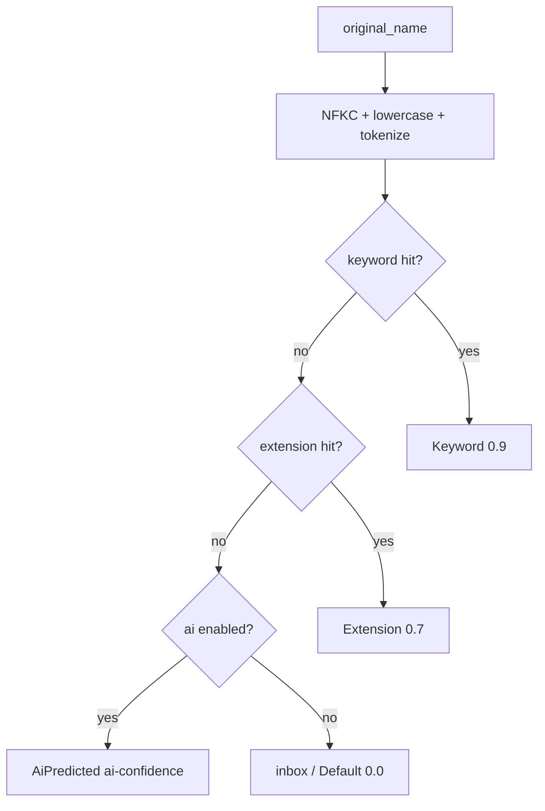

# 模块：分类引擎（classify）

> 输入文件名，输出分类 + 建议命名 + 决策依据。MVP 阶段是纯规则引擎；Stage 3 加 AI 兜底。
>
> 阅读时长：约 12 分钟。

---

## 模块边界

输入：

- `repo_path`（用于读 `classifier.yaml`）
- `original_name`（如 `Invoice_2026_Q1.pdf`）

输出：

```rust
pub struct ClassifyResult {
    pub category: String,
    pub suggested_name: String,
    pub reason: ClassifyReason,
    pub confidence: f32,
}

#[derive(Debug, Clone, PartialEq, Eq)]
pub enum ClassifyReason {
    Keyword,
    Extension,
    AiPredicted,
    Default,
}
```

无副作用、无 IO（除一次 `classifier.yaml` 加载，建议缓存）。线程安全：可并发调用。

---

## 算法概览



关键决策：**关键词优先于扩展名**。`Invoice.pdf` 应归 finance（关键词命中 invoice）而非 docs（扩展名 pdf）。

---

## 文件布局

```text
core/src/classify/
├── mod.rs        // 入口 classify() + ClassifyResult
├── rules.rs      // ClassifierConfig 加载 / 校验 / 索引化
├── normalize.rs  // NFKC + lowercase + tokenize
├── matcher.rs    // 关键词匹配（trie）/ 扩展名匹配（HashMap）
├── naming.rs     // suggested_name 生成
└── ai.rs         // (Stage 3) AI 兜底接口
```

---

## 入口实现

```rust
// core/src/classify/mod.rs
pub mod ai;
pub mod matcher;
pub mod naming;
pub mod normalize;
pub mod rules;

use std::path::Path;

use crate::error::{CoreError, CoreResult};

pub use rules::{ClassifierConfig, CategoryConfig};

#[derive(Debug, Clone, PartialEq)]
pub struct ClassifyResult {
    pub category: String,
    pub suggested_name: String,
    pub reason: ClassifyReason,
    pub confidence: f32,
}

#[derive(Debug, Clone, Copy, PartialEq, Eq)]
pub enum ClassifyReason {
    Keyword,
    Extension,
    AiPredicted,
    Default,
}

pub fn classify(repo: &Path, original_name: &str) -> ClassifyResult {
    let cfg = match rules::load_or_default(repo) {
        Ok(c) => c,
        Err(_) => return inbox_fallback(original_name),
    };

    let norm = normalize::tokenize(original_name);

    if let Some(hit) = matcher::match_keyword(&cfg, &norm) {
        return ClassifyResult {
            category: hit.category.clone(),
            suggested_name: naming::suggest(original_name, &cfg, &hit.category),
            reason: ClassifyReason::Keyword,
            confidence: 0.9,
        };
    }

    if let Some(cat) = matcher::match_extension(&cfg, original_name) {
        return ClassifyResult {
            category: cat.slug.clone(),
            suggested_name: naming::suggest(original_name, &cfg, &cat.slug),
            reason: ClassifyReason::Extension,
            confidence: 0.7,
        };
    }

    inbox_fallback(original_name)
}

pub fn ensure_category_exists(repo: &Path, slug: &str) -> CoreResult<()> {
    let cfg = rules::load_or_default(repo)?;
    if !cfg.has_category(slug) {
        return Err(CoreError::Classify {
            reason: format!("unknown category: {}", slug),
        });
    }
    Ok(())
}

fn inbox_fallback(name: &str) -> ClassifyResult {
    ClassifyResult {
        category: "inbox".into(),
        suggested_name: name.into(),
        reason: ClassifyReason::Default,
        confidence: 0.0,
    }
}
```

---

## normalize 模块

```rust
// core/src/classify/normalize.rs
use unicode_normalization::UnicodeNormalization;

pub struct Normalized {
    pub lowered: String,
    pub tokens: Vec<String>,
    pub extension: Option<String>,
}

pub fn tokenize(name: &str) -> Normalized {
    let nfkc: String = name.nfkc().collect();
    let lower = nfkc.to_lowercase();

    let extension = std::path::Path::new(name)
        .extension()
        .and_then(|e| e.to_str())
        .map(|e| e.to_lowercase());

    let tokens = split_tokens(&lower);

    Normalized { lowered: lower, tokens, extension }
}

fn split_tokens(s: &str) -> Vec<String> {
    let mut out = Vec::new();
    let mut cur = String::new();
    for c in s.chars() {
        if is_separator(c) {
            if !cur.is_empty() {
                out.push(std::mem::take(&mut cur));
            }
        } else {
            cur.push(c);
        }
    }
    if !cur.is_empty() {
        out.push(cur);
    }
    out
}

fn is_separator(c: char) -> bool {
    matches!(c, ' ' | '_' | '-' | '.' | '\t' | '/' | '\\' | '(' | ')' | '[' | ']')
}
```

NFKC 归一化把全角字符 / 兼容字符转为标准形式（例如全角"Ｉｎｖｏｉｃｅ"→ "Invoice"）。中文字符保持原样不参与 split。

---

## rules 模块（加载 + 校验）

```rust
// core/src/classify/rules.rs
use std::collections::HashMap;
use std::path::Path;
use std::sync::{OnceLock, RwLock};

use serde::Deserialize;

use crate::error::{CoreError, CoreResult};
use crate::repo::RepoLayout;

#[derive(Debug, Clone, Deserialize)]
pub struct ClassifierConfig {
    pub version: u32,
    pub default: String,
    pub categories: Vec<CategoryConfig>,

    #[serde(skip)]
    pub ext_index: HashMap<String, String>,
    #[serde(skip)]
    pub keyword_index: Vec<KeywordEntry>,
}

#[derive(Debug, Clone, Deserialize)]
pub struct CategoryConfig {
    pub slug: String,
    #[serde(default)]
    pub display_name: HashMap<String, String>,
    #[serde(default)]
    pub extensions: Vec<String>,
    #[serde(default)]
    pub keywords: Vec<String>,
    #[serde(default)]
    pub priority: i32,
    #[serde(default)]
    pub naming_template: Option<String>,
}

#[derive(Debug, Clone)]
pub struct KeywordEntry {
    pub keyword: String,
    pub category: String,
    pub priority: i32,
}

impl ClassifierConfig {
    pub fn has_category(&self, slug: &str) -> bool {
        self.categories.iter().any(|c| c.slug == slug)
    }
    pub fn category(&self, slug: &str) -> Option<&CategoryConfig> {
        self.categories.iter().find(|c| c.slug == slug)
    }
}

static CACHE: OnceLock<RwLock<HashMap<std::path::PathBuf, ClassifierConfig>>> = OnceLock::new();

pub fn load_or_default(repo: &Path) -> CoreResult<ClassifierConfig> {
    let cache = CACHE.get_or_init(|| RwLock::new(HashMap::new()));
    if let Some(c) = cache.read().unwrap().get(repo).cloned() {
        return Ok(c);
    }
    let cfg = read_from_disk(repo).unwrap_or_else(|_| default_config());
    let cfg = validate_and_index(cfg)?;
    cache.write().unwrap().insert(repo.to_path_buf(), cfg.clone());
    Ok(cfg)
}

pub fn invalidate_cache(repo: &Path) {
    if let Some(cache) = CACHE.get() {
        cache.write().unwrap().remove(repo);
    }
}

fn read_from_disk(repo: &Path) -> CoreResult<ClassifierConfig> {
    let layout = RepoLayout::for_repo(repo);
    let path = layout.classifier_yaml();
    let text = std::fs::read_to_string(&path)?;
    let cfg: ClassifierConfig = serde_yaml::from_str(&text).map_err(|e| CoreError::Config {
        reason: format!("yaml parse error: {}", e),
    })?;
    Ok(cfg)
}

fn validate_and_index(mut cfg: ClassifierConfig) -> CoreResult<ClassifierConfig> {
    if cfg.version != 1 {
        return Err(CoreError::Config {
            reason: format!("unsupported version: {}", cfg.version),
        });
    }
    if !cfg.categories.iter().any(|c| c.slug == cfg.default) {
        return Err(CoreError::Config {
            reason: format!("default '{}' not in categories", cfg.default),
        });
    }
    let mut seen = std::collections::HashSet::new();
    for c in &cfg.categories {
        if !is_valid_slug(&c.slug) {
            return Err(CoreError::Config {
                reason: format!("invalid slug: {}", c.slug),
            });
        }
        if !seen.insert(&c.slug) {
            return Err(CoreError::Config {
                reason: format!("duplicate slug: {}", c.slug),
            });
        }
    }

    cfg.ext_index = HashMap::new();
    for c in &cfg.categories {
        for ext in &c.extensions {
            let key = ext.trim_start_matches('.').to_lowercase();
            cfg.ext_index.entry(key).or_insert_with(|| c.slug.clone());
        }
    }

    cfg.keyword_index = Vec::new();
    for c in &cfg.categories {
        for kw in &c.keywords {
            cfg.keyword_index.push(KeywordEntry {
                keyword: kw.to_lowercase(),
                category: c.slug.clone(),
                priority: c.priority,
            });
        }
    }
    cfg.keyword_index.sort_by(|a, b| {
        b.priority
            .cmp(&a.priority)
            .then_with(|| b.keyword.len().cmp(&a.keyword.len()))
    });

    Ok(cfg)
}

fn is_valid_slug(s: &str) -> bool {
    let mut chars = s.chars();
    match chars.next() {
        Some(c) if c.is_ascii_lowercase() => {}
        _ => return false,
    }
    chars.all(|c| c.is_ascii_lowercase() || c.is_ascii_digit() || c == '_' || c == '-')
}

pub fn default_config() -> ClassifierConfig {
    serde_yaml::from_str(include_str!("../../resources/classifier.default.yaml"))
        .expect("bundled default classifier.yaml must be valid")
}
```

校验失败时**不替换**当前规则，由调用方决定保留旧规则还是 fallback 到内置默认。

---

## matcher 模块

```rust
// core/src/classify/matcher.rs
use crate::classify::normalize::Normalized;
use crate::classify::rules::{CategoryConfig, ClassifierConfig};

pub struct KeywordHit {
    pub keyword: String,
    pub category: String,
}

pub fn match_keyword(cfg: &ClassifierConfig, norm: &Normalized) -> Option<KeywordHit> {
    for entry in &cfg.keyword_index {
        if contains_keyword(&norm.lowered, &norm.tokens, &entry.keyword) {
            return Some(KeywordHit {
                keyword: entry.keyword.clone(),
                category: entry.category.clone(),
            });
        }
    }
    None
}

fn contains_keyword(text: &str, tokens: &[String], keyword: &str) -> bool {
    if keyword.chars().any(is_cjk) {
        text.contains(keyword)
    } else {
        tokens.iter().any(|t| t == keyword)
    }
}

fn is_cjk(c: char) -> bool {
    matches!(c,
        '\u{4E00}'..='\u{9FFF}'
        | '\u{3400}'..='\u{4DBF}'
        | '\u{F900}'..='\u{FAFF}'
        | '\u{3040}'..='\u{309F}'
        | '\u{30A0}'..='\u{30FF}'
        | '\u{AC00}'..='\u{D7AF}'
    )
}

pub fn match_extension<'a>(
    cfg: &'a ClassifierConfig,
    name: &str,
) -> Option<&'a CategoryConfig> {
    let ext = std::path::Path::new(name)
        .extension()
        .and_then(|e| e.to_str())
        .map(|e| e.to_lowercase())?;
    let slug = cfg.ext_index.get(&ext)?;
    cfg.category(slug)
}
```

为什么不用 trie：分类规则量级是几十到几百关键词，线性扫描快于 trie 构建/维护成本。当关键词数 > 5000 时再切到 Aho–Corasick。

---

## naming 模块

```rust
// core/src/classify/naming.rs
use crate::classify::rules::ClassifierConfig;

pub fn suggest(original: &str, cfg: &ClassifierConfig, category: &str) -> String {
    let cat = match cfg.category(category) {
        Some(c) => c,
        None => return original.to_string(),
    };

    if let Some(template) = &cat.naming_template {
        render_template(template, original)
    } else {
        original.to_string()
    }
}

fn render_template(template: &str, original: &str) -> String {
    let stem = std::path::Path::new(original)
        .file_stem()
        .and_then(|s| s.to_str())
        .unwrap_or(original);
    let ext = std::path::Path::new(original)
        .extension()
        .and_then(|s| s.to_str())
        .map(|e| format!(".{}", e))
        .unwrap_or_default();
    let date = chrono::Local::now().format("%Y%m%d").to_string();

    template
        .replace("{original}", original)
        .replace("{stem}", stem)
        .replace("{ext}", &ext)
        .replace("{date}", &date)
}
```

MVP 默认所有分类的 `naming_template` 为空，即保留原文件名。Stage 2 起在设置 UI 提供模板编辑。

---

## classifier.yaml 规范

详见 [../api/classifier-yaml.md](../api/classifier-yaml.md)。简短示例：

```yaml
version: 1
default: inbox
categories:
  - slug: docs
    display_name: { zh-Hans: 文档, en: Documents }
    extensions: [pdf, docx, txt, md, rtf]
    keywords: [report, manual, doc, 报告, 手册]
    priority: 0

  - slug: finance
    display_name: { zh-Hans: 财务, en: Finance }
    extensions: []
    keywords: [invoice, receipt, tax, 发票, 收据, 税务]
    priority: 10

  - slug: code
    display_name: { zh-Hans: 代码, en: Code }
    extensions: [rs, swift, py, js, ts, go, java, cpp, h]
    keywords: []

  - slug: inbox
    display_name: { zh-Hans: 收件箱, en: Inbox }
    extensions: []
    keywords: []
```

`finance` 的 priority=10 高于 `docs` 的 0，所以 `Invoice.pdf` 优先归 finance。

---

## 缓存与失效

`load_or_default` 用 `OnceLock<RwLock<HashMap<repo, cfg>>>` 缓存。失效时机：

- 用户在设置面板保存了新规则
- FSEvents 监听到 `~/AreaMatrix/.areamatrix/classifier.yaml` 修改
- 单元测试调用 `invalidate_cache`

缓存 key 是 repo 路径，支持多仓库场景（虽然 MVP 只允许一个）。

---

## AI 兜底（Stage 3 预留）

```rust
// core/src/classify/ai.rs
pub trait AiClassifier: Send + Sync {
    fn classify(&self, name: &str, sample_bytes: Option<&[u8]>) -> CoreResult<AiResult>;
}

pub struct AiResult {
    pub category_slug: String,
    pub confidence: f32,
    pub reasoning: Option<String>,
}
```

实现方案：

| 方案 | Stage |
|---|---|
| Ollama 本地（llama3 / qwen2） | 3 |
| OpenAI / DeepSeek API | 3 (opt-in) |

隐私原则：

- 默认关闭，启用必须用户明确开启
- 设置里清晰标注"会发送文件名到云端"
- 永远不发送文件内容（除非另一开关）

---

## 单元测试（10+ 案例）

```rust
#[cfg(test)]
mod tests {
    use super::*;
    use std::path::PathBuf;
    use tempfile::TempDir;

    fn setup_repo() -> (TempDir, PathBuf) {
        let dir = tempfile::tempdir().unwrap();
        crate::api::init_repo(dir.path().to_string_lossy().into()).unwrap();
        let p = dir.path().to_path_buf();
        (dir, p)
    }

    #[test]
    fn keyword_priority_over_extension() {
        let (_d, p) = setup_repo();
        let r = classify(&p, "Invoice_Q1.pdf");
        assert_eq!(r.category, "finance");
        assert_eq!(r.reason, ClassifyReason::Keyword);
    }

    #[test]
    fn extension_match_when_no_keyword() {
        let (_d, p) = setup_repo();
        let r = classify(&p, "report.pdf");
        assert!(matches!(r.reason, ClassifyReason::Keyword | ClassifyReason::Extension));
        assert_eq!(r.category, "docs");
    }

    #[test]
    fn fallback_to_inbox() {
        let (_d, p) = setup_repo();
        let r = classify(&p, "unknown.xyz");
        assert_eq!(r.category, "inbox");
        assert_eq!(r.reason, ClassifyReason::Default);
    }

    #[test]
    fn case_insensitive_match() {
        let (_d, p) = setup_repo();
        let r = classify(&p, "INVOICE_2026.PDF");
        assert_eq!(r.category, "finance");
    }

    #[test]
    fn cjk_keyword_match() {
        let (_d, p) = setup_repo();
        let r = classify(&p, "2026年第一季度发票.pdf");
        assert_eq!(r.category, "finance");
    }

    #[test]
    fn nfkc_full_width_normalized() {
        let (_d, p) = setup_repo();
        let r = classify(&p, "Ｉｎｖｏｉｃｅ.pdf");
        assert_eq!(r.category, "finance");
    }

    #[test]
    fn extension_only_match() {
        let (_d, p) = setup_repo();
        let r = classify(&p, "main.swift");
        assert_eq!(r.category, "code");
        assert_eq!(r.reason, ClassifyReason::Extension);
    }

    #[test]
    fn dot_separator_token() {
        let (_d, p) = setup_repo();
        let r = classify(&p, "tax.report.docx");
        assert_eq!(r.category, "finance");
    }

    #[test]
    fn no_extension_keyword_still_works() {
        let (_d, p) = setup_repo();
        let r = classify(&p, "invoice");
        assert_eq!(r.category, "finance");
    }

    #[test]
    fn invalid_yaml_falls_back_to_default() {
        let (_d, p) = setup_repo();
        let yaml_path = p.join(".areamatrix/classifier.yaml");
        std::fs::write(&yaml_path, "invalid: : :").unwrap();
        rules::invalidate_cache(&p);
        let r = classify(&p, "report.pdf");
        assert_eq!(r.category, "docs");
    }

    #[test]
    fn ensure_category_exists_works() {
        let (_d, p) = setup_repo();
        assert!(ensure_category_exists(&p, "docs").is_ok());
        assert!(matches!(
            ensure_category_exists(&p, "nonexistent"),
            Err(CoreError::Classify { .. })
        ));
    }

    #[test]
    fn priority_breaks_ties() {
        let (_d, p) = setup_repo();
        let r = classify(&p, "doc-receipt.pdf");
        assert_eq!(r.category, "finance", "higher priority wins");
    }

    #[test]
    fn slug_validation_rejects_uppercase() {
        assert!(!is_valid_slug("Docs"));
    }

    #[test]
    fn slug_validation_accepts_kebab_and_snake() {
        assert!(is_valid_slug("docs"));
        assert!(is_valid_slug("user_docs"));
        assert!(is_valid_slug("user-docs"));
        assert!(is_valid_slug("docs2"));
    }

    fn is_valid_slug(s: &str) -> bool { rules::is_valid_slug_pub(s) }
}
```

---

## 错误返回示例

| 触发 | 返回 | 调用方处理 |
|---|---|---|
| `classifier.yaml` 不存在 | 返回内置默认 | 不报错，UI 提示"使用内置规则" |
| `classifier.yaml` 解析失败 | `CoreError::Config { reason }` | UI 显示行号/字段错误，保留旧规则 |
| `default` 字段不在 categories 里 | `CoreError::Config { reason: "default '...' not in categories" }` | UI 引导修正 |
| slug 重复 | `CoreError::Config { reason: "duplicate slug: ..." }` | UI 高亮重复行 |
| slug 含大写 | `CoreError::Config { reason: "invalid slug: ..." }` | UI 提示 slug 命名规则 |
| `ensure_category_exists` 未知分类 | `CoreError::Classify { reason: "unknown category: ..." }` | UI 显示选择器允许重选 |

---

## 性能目标

| 操作 | 目标 |
|---|---|
| classify 单次（含缓存命中） | < 50 µs |
| classify 单次（首次加载 yaml） | < 5 ms |
| 关键词数 1000 条下全量扫描 | < 500 µs |
| invalidate_cache + 重新加载 | < 10 ms |

---

## Related

- [../architecture/overview.md](../architecture/overview.md)
- [../api/classifier-yaml.md](../api/classifier-yaml.md)
- [../api/error-codes.md](../api/error-codes.md)
- [storage.md](storage.md)
- [overview-gen.md](overview-gen.md)
