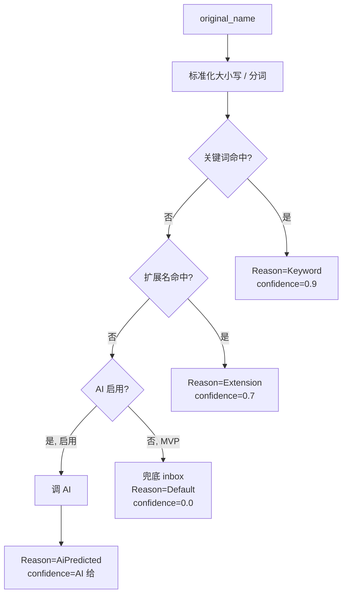

# 模块：分类引擎（classify）

> 输入文件名，输出分类 + 建议命名 + 决策依据。MVP 阶段是纯规则引擎；Stage 3 加 AI 兜底。
>
> 阅读时长：约 5 分钟。

---

## 模块边界

输入：

- `repo_path`（用于读 classifier.yaml）
- `original_name`（如 `Invoice_2026_Q1.pdf`）

输出：

```rust
pub struct ClassifyResult {
    pub category: String,        // 英文 slug，如 "finance"
    pub suggested_name: String,  // 建议的目标文件名
    pub reason: ClassifyReason,  // 决策依据
    pub confidence: f32,         // 0.0 ~ 1.0
}

pub enum ClassifyReason {
    Keyword,
    Extension,
    AiPredicted,    // Stage 3
    Default,        // 兜底到 inbox
}
```

无副作用、无 IO（除一次 classifier.yaml 加载，建议缓存）。

---

## 算法



### Step 1: 标准化

- Unicode NFKC 归一化
- 转小写
- 分词：按 `[_\-\.\s]+` 切分

### Step 2: 关键词匹配（L1, 优先）

遍历 `classifier.yaml` 中每个分类的 keywords，任意匹配即命中。**关键词优先于扩展名**，因为关键词更能反映文件语义（`Invoice.pdf` → finance 而非 docs）。

### Step 3: 扩展名匹配（L2）

按文件扩展名查 `classifier.yaml` 的 `extensions` 列表。

### Step 4: 兜底 / AI（L3）

MVP：归 `inbox`，confidence=0.0。
Stage 3：若用户启用 AI，调本地 Ollama 或云端 API。

---

## classifier.yaml 规范

详见 [../api/classifier-yaml.md](../api/classifier-yaml.md)。

简短示例：

```yaml
version: 1
default: inbox
categories:
  - slug: docs
    display_name_zh: 文档
    display_name_en: Documents
    extensions: [pdf, docx, txt, md, rtf]
    keywords: [report, manual, doc, 报告, 手册]

  - slug: finance
    display_name_zh: 财务
    display_name_en: Finance
    extensions: []
    keywords: [invoice, receipt, tax, 发票, 收据, 税务]

  - slug: code
    display_name_zh: 代码
    display_name_en: Code
    extensions: [rs, swift, py, js, ts, go, java, cpp, h]
    keywords: []
```

---

## 命名建议

`suggested_name` 算法（MVP 简化版）：

1. 保留原文件名（去除非法字符）
2. 不主动改名（用户自己懂得用什么文件名）

Stage 2+ 起加：

- 模板：`{category-prefix}{original}` 或 `{date}_{original}`
- 用户在设置里配置模板

> MVP 不做激进改名，以免出现「我刚拖入的文件叫什么名字了」的迷惑。

---

## 实现骨架

文件：`core/src/classify/mod.rs`

```rust
pub mod rules;
pub mod naming;

use crate::{config, error::*};
use std::path::Path;

pub fn classify(repo: &Path, original_name: &str) -> ClassifyResult {
    let rules = match rules::load_rules(repo) {
        Ok(r) => r,
        Err(_) => return ClassifyResult::default_inbox(original_name),
    };

    let normalized = normalize(original_name);

    if let Some((cat, kw)) = rules::match_keyword(&rules, &normalized) {
        return ClassifyResult {
            category: cat.slug.clone(),
            suggested_name: naming::suggest(original_name, &cat),
            reason: ClassifyReason::Keyword,
            confidence: 0.9,
        };
    }

    if let Some(cat) = rules::match_extension(&rules, original_name) {
        return ClassifyResult {
            category: cat.slug.clone(),
            suggested_name: naming::suggest(original_name, &cat),
            reason: ClassifyReason::Extension,
            confidence: 0.7,
        };
    }

    ClassifyResult::default_inbox(original_name)
}

fn normalize(s: &str) -> String {
    use unicode_normalization::UnicodeNormalization;
    s.nfkc().collect::<String>().to_lowercase()
}
```

---

## 缓存

`classifier.yaml` 加载是 IO 操作。MVP 实现是每次调 classify 都加载（< 1ms 量级），简单。

Stage 2 起：

- 在 Core 持有 `OnceCell<RwLock<Rules>>`，`classifier.yaml` mtime 变化时 reload
- watcher 监听 `.areamatrix/classifier.yaml` 也触发 reload

---

## 用户自定义

用户可直接编辑 `~/AreaMatrix/.areamatrix/classifier.yaml`：

- 加分类
- 加关键词 / 扩展名
- 改 display_name

应用启动 / yaml 改动时校验：

- yaml 语法正确
- slug 唯一
- slug 符合 `^[a-z][a-z0-9_-]*$`
- display_name 非空

校验失败时**不替换**当前规则，弹出错误提示用户改正。

详见 [../api/classifier-yaml.md](../api/classifier-yaml.md)。

---

## AI 兜底（Stage 3 预留）

### 接口

```rust
pub trait AiClassifier: Send + Sync {
    fn classify(&self, name: &str, sample_bytes: Option<&[u8]>) -> CoreResult<AiResult>;
}

pub struct AiResult {
    pub category_slug: String,
    pub confidence: f32,
    pub reasoning: Option<String>,  // 可解释性
}
```

### 实现方案

| 方案 | Stage |
|---|---|
| Ollama 本地（llama3 / qwen2） | 3 |
| OpenAI / DeepSeek API | 3 (opt-in) |

详见后续 ADR / 0010-ai-fallback.md（Stage 3 起）。

### 隐私原则

- 默认关闭，启用必须用户明确点开
- 设置里清晰标注"会发送文件名到云端"
- 永远不发送文件内容（除非另一开关）

---

## 测试

文件：`core/tests/classify_test.rs`

```rust
#[test]
fn keyword_priority_over_extension() {
    let repo = setup_test_repo();
    let r = classify(&repo, "Invoice_Q1.pdf");
    assert_eq!(r.category, "finance");
    assert_eq!(r.reason, ClassifyReason::Keyword);
}

#[test]
fn extension_match_when_no_keyword() {
    let repo = setup_test_repo();
    let r = classify(&repo, "report.pdf");
    assert_eq!(r.category, "docs");
    assert_eq!(r.reason, ClassifyReason::Extension);
}

#[test]
fn fallback_to_inbox() {
    let repo = setup_test_repo();
    let r = classify(&repo, "unknown.xyz");
    assert_eq!(r.category, "inbox");
    assert_eq!(r.reason, ClassifyReason::Default);
}

#[test]
fn case_insensitive() {
    let repo = setup_test_repo();
    let r = classify(&repo, "INVOICE_2026.PDF");
    assert_eq!(r.category, "finance");
}

#[test]
fn cjk_keyword() {
    let repo = setup_test_repo();
    let r = classify(&repo, "2026年第一季度发票.pdf");
    assert_eq!(r.category, "finance");
}
```

---

## Related

- [../architecture/overview.md](../architecture/overview.md)
- [../api/classifier-yaml.md](../api/classifier-yaml.md)
- [storage.md](storage.md)
