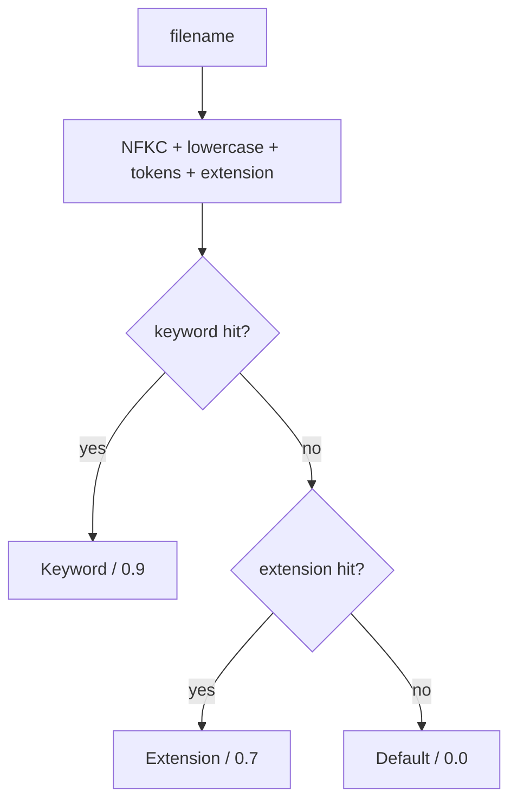

# 分类模块

> 记录 AreaMatrix 当前规则分类、命名建议和独立 AI 分类建议的实现边界。
>
> 阅读时长：约 6 分钟。

---

## 规则分类入口

规则预测实现在单文件 `core/src/classify/mod.rs`：

```text
predict_category(repo_path, filename) -> CoreResult<ClassifyResult>
```

公开 FFI 入口由 Core API/UDL 暴露。输入只使用资料库路径和文件名，不读取文件正文，不移动文件，不写 DB，
也不调用 AI/network provider。

## 配置来源

1. 优先读取 `<repo>/.areamatrix/classifier.yaml`。
2. 文件不存在时进入 degraded read-only，浏览只显示稳定 slug；不得静默使用内嵌规则。
3. 文件存在但无法读取、YAML 无效或字段校验失败时进入同一 degraded read-only，不静默改用旧规则或 inbox。
4. 缺失文件只能通过显式 Create Default 创建；可读取但无效的文件只能在编号、非覆盖 backup 后显式恢复；
   因权限不可读的文件必须先恢复可读权限，不得直接覆盖。

解析使用 `deny_unknown_fields`，当前字段见 [classifier.yaml 规范](../api/classifier-yaml.md)。

## 匹配顺序


```mermaid
flowchart TB
    input["filename"] --> normalize["NFKC + lowercase + tokens + extension"]
    normalize --> keyword{"keyword hit?"}
    keyword -->|yes| keywordResult["Keyword / 0.9"]
    keyword -->|no| extension{"extension hit?"}
    extension -->|yes| extensionResult["Extension / 0.7"]
    extension -->|no| defaultResult["Default / 0.0"]
```

Keyword：

- CJK keyword 使用 normalized filename 子串匹配。
- 其他 keyword 使用 token 等值匹配。
- 多个 hit 依次按 category priority 高、keyword 长、配置顺序早选择。

Extension：

- 使用最后一层 extension，小写且不含点。
- 多个 hit 按 category priority 高、配置顺序早选择。

Keyword 整体优先于 extension。

## 输出

`ClassifyResult` 包含：

- `category`
- `suggested_name`
- `reason = Keyword | Extension | Default`
- `confidence = 0.9 | 0.7 | 0.0`

default category 必须存在于 categories 中。

## Naming template

命中 category 且配置非空 `naming_template` 时支持：

| Placeholder | 值 |
|---|---|
| `{original}` | 完整原文件名 |
| `{stem}` | 最后一层扩展名前的 stem |
| `{ext}` | 不含点的最后一层 extension |
| `{date}` | 本地日期 `YYYY-MM-DD` |
| `{date_iso}` | UTC RFC3339 秒级时间 |
| `{slug}` | category slug |

模板当前执行直接字符串替换。最终文件名安全仍由 import/rename 的 storage validation 负责。

## 配置编辑

规则保存、影响预览和规则编辑不是 `classify/mod.rs` 的内部子模块，分别由：

- `classifier_rules.rs`
- `classifier_impact/**`
- `classifier_rule_editor/**`
- `classifier_correction.rs`

这些 API 只修改未来分类规则或显式用户选择；不会因为保存规则自动重分类、移动或删除已有文件。

category 的 `display_name` 和 `description` 是完整 locale map。规则列表 snapshot 返回全部 map、资料库的
exact raw policy、canonical policy 和可选 `editing_locale`。已知显式/alias policy 按 exact raw locale、
canonical concrete locale、`en`、slug 回退；`system` 按调用方传入的 current concrete locale、`en`、slug
回退；unknown policy 的只读浏览按 exact raw locale、`en`、slug 回退。打开 create/update
draft 时冻结 supported `editing_locale`，保存请求同时带回观察到的 raw policy，并且只 patch 该 locale
的值。custom category 的 locale map 可以稀疏，不自动生成翻译。
Core 在写入前重验 policy；变化时返回 `Conflict`，不能覆盖其他语言条目。
编辑 surface 必须区分“显式 locale 值”和“展示 fallback”：缺失值返回为空，fallback 另行作为只读预览，
不得把 fallback 注入可编辑字段或随未相关的保存写回 locale map。

unknown repository policy 下仍可浏览 fallback 结果，但 create、update、delete、rule toggle 和任何其他
classifier mutation 或生成式分类建议都保持 fail closed。只有 Repository 设置页能把 policy 明确保存为
canonical `system`、`zh-Hans` 或 `en`。

## AI 分类建议

AI 分类是独立 `suggest_category_with_ai` 合同，不是规则预测的自动 fallback：

- 必须经过 AI settings、privacy rules、provider/runtime 和 call-log 边界。
- 只返回 suggestion，不自动移动文件或保存规则。
- provider 未配置、隐私拒绝或网络失败不会改变规则分类结果。
- 在进入 privacy/provider await 前冻结 content locale；automatic provider fallback 复用同一值，新 attempt
  才重新捕获。可持久化 suggestion display name 与 reason 使用该值，用户原始名称保持 verbatim。
- category slug、已有 candidate tag、用户自定义 tag 和用户输入始终 verbatim。AI/provider 不得把它们
  隐式翻译后回写，也不得把跨语言近义词当作同一 tag/category 做未授权语义合并；建议只携带明确的生成
  文本和稳定引用，最终接受继续走现有用户确认与冲突规则。

## 缓存与性能

当前规则预测每次读取并解析 classifier YAML，没有 global cache、`OnceLock<RwLock>`、FSEvents invalidation
或 `invalidate_cache` API。引入缓存前必须定义多资料库 key、配置原子更新和失效协议。

## 验证

- Keyword 优先于 extension。
- NFKC、大小写、ASCII token 与 CJK contains。
- priority、keyword length 和配置顺序 tie-break。
- invalid YAML、unknown field、重复 slug/value 和非法 default 返回错误。
- naming placeholders 与日期格式。
- AI suggestion 不影响规则路径和用户文件。
- locale map 更新不丢失未编辑语言，policy 竞态返回 Conflict。
- unknown policy 下只有 list 可用，所有 classifier mutation 与 AI generation fail closed。

## Related

- [../api/classifier-yaml.md](../api/classifier-yaml.md)
- [../api/core-api.md](../api/core-api.md)
- [../product/privacy.md](../product/privacy.md)
- [storage.md](storage.md)
