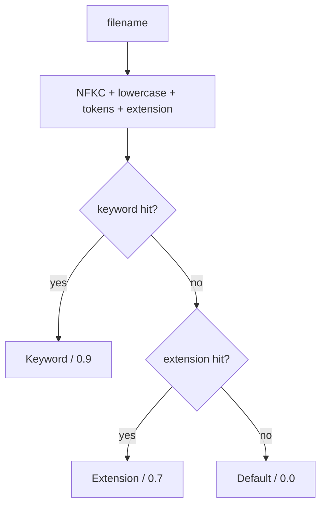

# 分类模块

> 记录 AreaMatrix 当前规则分类、命名建议和独立 AI 分类建议的实现边界。
>
> 阅读时长：约 6 分钟。

---

## 规则分类入口

规则预测实现在单文件 `core/src/classify/mod.rs`：

```text
predict_category(repo_path, filename) -> CoreResult<ClassifyResult>
```

公开 FFI 入口由 Core API/UDL 暴露。输入只使用资料库路径和文件名，不读取文件正文，不移动文件，不写 DB，
也不调用 AI/network provider。

## 配置来源

1. 优先读取 `<repo>/.areamatrix/classifier.yaml`。
2. 文件不存在时使用内嵌 `core/resources/classifier.yaml`。
3. 文件存在但无法读取、YAML 无效或字段校验失败时返回错误，不静默改用旧规则或 inbox。

解析使用 `deny_unknown_fields`，当前字段见 [classifier.yaml 规范](../api/classifier-yaml.md)。

## 匹配顺序


```mermaid
flowchart TB
    input["filename"] --> normalize["NFKC + lowercase + tokens + extension"]
    normalize --> keyword{"keyword hit?"}
    keyword -->|yes| keywordResult["Keyword / 0.9"]
    keyword -->|no| extension{"extension hit?"}
    extension -->|yes| extensionResult["Extension / 0.7"]
    extension -->|no| defaultResult["Default / 0.0"]
```

Keyword：

- CJK keyword 使用 normalized filename 子串匹配。
- 其他 keyword 使用 token 等值匹配。
- 多个 hit 依次按 category priority 高、keyword 长、配置顺序早选择。

Extension：

- 使用最后一层 extension，小写且不含点。
- 多个 hit 按 category priority 高、配置顺序早选择。

Keyword 整体优先于 extension。

## 输出

`ClassifyResult` 包含：

- `category`
- `suggested_name`
- `reason = Keyword | Extension | Default`
- `confidence = 0.9 | 0.7 | 0.0`

default category 必须存在于 categories 中。

## Naming template

命中 category 且配置非空 `naming_template` 时支持：

| Placeholder | 值 |
|---|---|
| `{original}` | 完整原文件名 |
| `{stem}` | 最后一层扩展名前的 stem |
| `{ext}` | 不含点的最后一层 extension |
| `{date}` | 本地日期 `YYYY-MM-DD` |
| `{date_iso}` | UTC RFC3339 秒级时间 |
| `{slug}` | category slug |

模板当前执行直接字符串替换。最终文件名安全仍由 import/rename 的 storage validation 负责。

## 配置编辑

规则保存、影响预览和规则编辑不是 `classify/mod.rs` 的内部子模块，分别由：

- `classifier_rules.rs`
- `classifier_impact/**`
- `classifier_rule_editor/**`
- `classifier_correction.rs`

这些 API 只修改未来分类规则或显式用户选择；不会因为保存规则自动重分类、移动或删除已有文件。

## AI 分类建议

AI 分类是独立 `suggest_category_with_ai` 合同，不是规则预测的自动 fallback：

- 必须经过 AI settings、privacy rules、provider/runtime 和 call-log 边界。
- 只返回 suggestion，不自动移动文件或保存规则。
- provider 未配置、隐私拒绝或网络失败不会改变规则分类结果。

## 缓存与性能

当前规则预测每次读取并解析 classifier YAML，没有 global cache、`OnceLock<RwLock>`、FSEvents invalidation
或 `invalidate_cache` API。引入缓存前必须定义多资料库 key、配置原子更新和失效协议。

## 验证

- Keyword 优先于 extension。
- NFKC、大小写、ASCII token 与 CJK contains。
- priority、keyword length 和配置顺序 tie-break。
- invalid YAML、unknown field、重复 slug/value 和非法 default 返回错误。
- naming placeholders 与日期格式。
- AI suggestion 不影响规则路径和用户文件。

## Related

- [../api/classifier-yaml.md](../api/classifier-yaml.md)
- [../api/core-api.md](../api/core-api.md)
- [../product/privacy.md](../product/privacy.md)
- [storage.md](storage.md)
