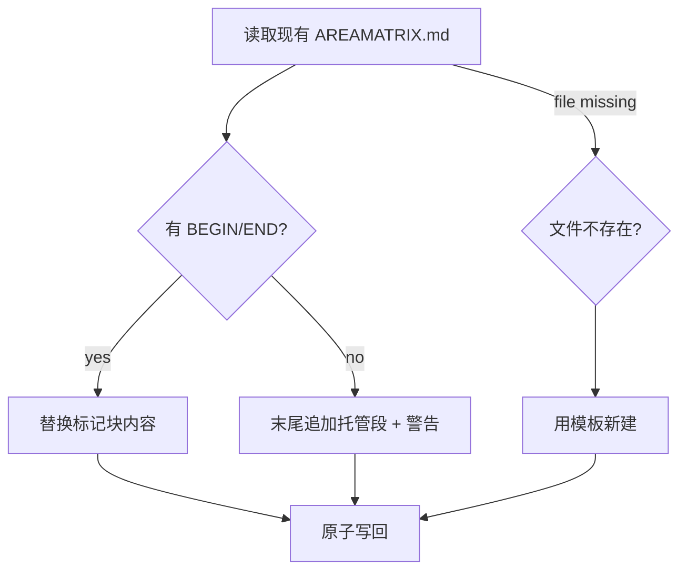

# 模块：资料库概览生成（overview）

> AreaMatrix 默认在 `.areamatrix/generated/` 内生成资料库概览，并可选维护根目录 `AREAMATRIX.md`。本模块不写入、不覆盖、不插入用户已有的 `README.md`。
>
> 阅读时长：约 10 分钟。

---

## 设计目标

1. 用户在 Finder / VSCode 中能查看 AreaMatrix 专属概览（不依赖应用）
2. 接管已有 GitHub 项目时不污染或覆盖项目自己的 `README.md`
3. 可选根目录 `AREAMATRIX.md` 用作显式的外部导览入口
4. 用户在 `AREAMATRIX.md` 标记块外手动添加的备注在重生成时**不丢**
5. 性能：单分类概览重生成 < 50ms（< 1000 文件）

---

## 何时重生成

| 触发 | 重生成范围 |
|---|---|
| import_file | 该分类概览 + 根概览 |
| rename_file | 该分类概览 + 根概览 |
| move_to_category | 旧分类概览 + 新分类概览 + 根概览 |
| delete_file | 该分类概览 + 根概览 |
| 笔记编辑 | 不重生成（不影响文件清单） |
| sync external 检测到变化 | 受影响分类概览 + 根概览 |
| 用户手动触发 | 全部 |

---

## 输出位置

| 输出 | 默认 | 路径 | 说明 |
|---|---|---|---|
| 根概览 | 是 | `.areamatrix/generated/root.md` | 应用内部与外部工具都可读 |
| 分类/目录概览 | 是 | `.areamatrix/generated/categories/<slug>.md` | 不写入用户分类目录 |
| 根目录入口 | 否 | `AREAMATRIX.md` | 用户在设置中显式启用后维护 |
| 用户 README | 否 | `README.md` / `*/README.md` | 永不作为自动输出目标 |

---

## 标记块协议

`.areamatrix/generated/*.md` 是全文件托管，不需要保留用户内容。`AREAMATRIX.md` 是可选文件，若存在用户内容，托管区域用配对标记包裹：

```text
<!-- AREAMATRIX:BEGIN auto-generated content; do NOT edit between markers -->
...受应用控制的内容...
<!-- AREAMATRIX:END -->
```

**关键约束**：

- BEGIN 行必须以 `<!-- AREAMATRIX:BEGIN` 开头
- END 行必须包含完整 `<!-- AREAMATRIX:END -->`
- 标记之间的所有内容每次重生成都被替换
- 标记之外的所有内容永远保留



---

## 分类概览结构

```markdown
# 文档 (docs)

> 这个分类目录存放标准文档（PDF / DOCX / Markdown）。

<!-- AREAMATRIX:BEGIN auto-generated content; do NOT edit between markers -->

**统计**：12 个文件，总 24.5 MB · 最近导入：2026-04-25

## 文件列表

| 文件 | 大小 | 导入时间 |
|---|---|---|
| [Q1_报告.pdf](Q1_%E6%8A%A5%E5%91%8A.pdf) | 2.1 MB | 2026-04-25 |
| [契约.docx](%E5%A5%91%E7%BA%A6.docx) | 0.8 MB | 2026-04-23 |

## 近 30 天改动

- 2026-04-25 imported `Q1_报告.pdf`
- 2026-04-23 renamed `合同.pdf` → `契约.docx`
- 2026-04-20 deleted `旧版.pdf`

<!-- AREAMATRIX:END -->

```

---

## 根概览结构

```markdown
# AreaMatrix 资料库

> 自动维护，请勿删除 .areamatrix/ 目录。

<!-- AREAMATRIX:BEGIN auto-generated content; do NOT edit between markers -->

**总览**：156 个文件 · 1.2 GB · 6 个分类

| 分类 | 文件数 | 大小 | 最近导入 |
|---|---|---|---|
| [文档 (docs)](docs/) | 12 | 24.5 MB | 2026-04-25 |
| [代码 (code)](code/) | 89 | 320 MB | 2026-04-26 |

## 近 7 天跨分类改动

- 2026-04-26 imported `code/main.rs`
- 2026-04-25 imported `docs/Q1_报告.pdf`

<!-- AREAMATRIX:END -->
```

---

## 文件布局

```text
core/src/overview/
├── mod.rs        // regenerate_for_category / regenerate_root
├── markers.rs    // AREAMATRIX.md 标记块解析与替换
├── template.rs   // 文案模板（locale-aware）
├── format.rs     // 字节、日期、url 编码
└── i18n.rs       // 文案翻译表
```

---

## 入口

```rust
// core/src/overview/mod.rs
mod format;
mod i18n;
mod markers;
mod template;

use std::path::Path;
use crate::db;
use crate::error::CoreResult;
use crate::repo::RepoLayout;

pub fn regenerate_for_category(repo: &Path, category: &str) -> CoreResult<()> {
    let out_path = RepoLayout::for_repo(repo)
        .generated_dir()
        .join("categories")
        .join(format!("{}.md", category));
    let locale = current_locale(repo)?;
    let content = template::build_category_overview(repo, category, &locale)?;

    write_atomic(&out_path, &content)?;
    regenerate_root(repo)?;
    Ok(())
}

pub fn regenerate_root(repo: &Path) -> CoreResult<()> {
    let layout = RepoLayout::for_repo(repo);
    let generated_path = layout.generated_dir().join("root.md");
    let locale = current_locale(repo)?;
    let content = template::build_root_overview(repo, &locale)?;

    write_atomic(&generated_path, &content)?;

    if db::get_repo_config(repo)?.overview_output == OverviewOutput::RootAreaMatrixFile {
        let root_entry = repo.join("AREAMATRIX.md");
        let final_content = match std::fs::read_to_string(&root_entry) {
            Ok(existing) => markers::merge(&existing, &content),
            Err(_) => content,
        };
        write_atomic(&root_entry, &final_content)?;
    }
    Ok(())
}

fn current_locale(repo: &Path) -> CoreResult<String> {
    let cfg = db::get_repo_config(repo)?;
    Ok(cfg.locale.unwrap_or_else(|| "zh-Hans".into()))
}

fn write_atomic(path: &Path, content: &str) -> CoreResult<()> {
    let tmp = path.with_extension("md.tmp");
    std::fs::write(&tmp, content)?;
    std::fs::rename(&tmp, path)?;
    Ok(())
}
```

---

## markers 模块（标记块解析器）

```rust
// core/src/overview/markers.rs
const BEGIN_PREFIX: &str = "<!-- AREAMATRIX:BEGIN";
const END_FULL: &str = "<!-- AREAMATRIX:END -->";

pub fn merge(existing: &str, new_managed_block: &str) -> String {
    match find_block(existing) {
        Some((before, _, after)) => {
            let mut out = String::with_capacity(existing.len() + new_managed_block.len());
            out.push_str(before);
            out.push_str(new_managed_block);
            out.push_str(after);
            out
        }
        None => append_block(existing, new_managed_block),
    }
}

fn find_block(existing: &str) -> Option<(&str, &str, &str)> {
    let begin = existing.find(BEGIN_PREFIX)?;
    let end_search_start = begin + BEGIN_PREFIX.len();
    let end_rel = existing[end_search_start..].find(END_FULL)?;
    let end = end_search_start + end_rel + END_FULL.len();

    Some((&existing[..begin], &existing[begin..end], &existing[end..]))
}

fn append_block(existing: &str, new_managed: &str) -> String {
    let mut out = existing.trim_end().to_string();
    if !out.is_empty() {
        out.push_str("\n\n");
    }
    out.push_str(new_managed);
    out.push('\n');
    out
}

#[cfg(test)]
mod tests {
    use super::*;

    #[test]
    fn replaces_existing_block() {
        let input = "# Title\n\n<!-- AREAMATRIX:BEGIN x -->\nold\n<!-- AREAMATRIX:END -->\n\n## User\n";
        let new_block = "<!-- AREAMATRIX:BEGIN y -->\nnew\n<!-- AREAMATRIX:END -->";
        let out = merge(input, new_block);
        assert!(out.contains("new"));
        assert!(!out.contains("old"));
        assert!(out.contains("## User"));
    }

    #[test]
    fn appends_when_no_block() {
        let input = "# Title\n\n## User content\n";
        let new_block = "<!-- AREAMATRIX:BEGIN z -->\nx\n<!-- AREAMATRIX:END -->";
        let out = merge(input, new_block);
        assert!(out.contains("## User content"));
        assert!(out.contains(new_block));
    }

    #[test]
    fn handles_crlf_line_endings() {
        let input = "# Title\r\n\r\n<!-- AREAMATRIX:BEGIN x -->\r\nold\r\n<!-- AREAMATRIX:END -->\r\n\r\n## User\r\n";
        let new_block = "<!-- AREAMATRIX:BEGIN y -->\nnew\n<!-- AREAMATRIX:END -->";
        let out = merge(input, new_block);
        assert!(out.contains("new"));
        assert!(!out.contains("old"));
    }

    #[test]
    fn malformed_begin_no_end_treated_as_no_block() {
        let input = "# Title\n<!-- AREAMATRIX:BEGIN orphan\nstuff\n";
        let new_block = "<!-- AREAMATRIX:BEGIN x -->\nnew\n<!-- AREAMATRIX:END -->";
        let out = merge(input, new_block);
        assert!(out.contains("# Title"));
        assert!(out.contains("orphan"));
        assert!(out.contains("new"));
    }
}
```

---

## template + i18n 模块

```rust
// core/src/overview/i18n.rs
pub fn t(key: &str, locale: &str) -> &'static str {
    match (locale, key) {
        ("zh-Hans", "stats") => "统计",
        ("zh-Hans", "files") => "文件列表",
        ("zh-Hans", "recent") => "近 30 天改动",
        ("zh-Hans", "size") => "大小",
        ("zh-Hans", "imported") => "导入时间",
        ("zh-Hans", "user_section") => "用户备注（手动添加）",
        ("zh-Hans", "summary") => "总览",
        ("zh-Hans", "category") => "分类",
        ("zh-Hans", "category_count") => "文件数",
        ("zh-Hans", "do_not_edit") => "请勿编辑标记之间内容，会被自动覆盖",

        ("en", "stats") => "Statistics",
        ("en", "files") => "Files",
        ("en", "recent") => "Recent changes (30 days)",
        ("en", "size") => "Size",
        ("en", "imported") => "Imported",
        ("en", "user_section") => "User Notes (manual)",
        ("en", "summary") => "Overview",
        ("en", "category") => "Category",
        ("en", "category_count") => "Files",
        ("en", "do_not_edit") => "Do not edit between markers; will be overwritten",

        (_, k) => k,
    }
}

pub fn category_display(category: &str, locale: &str) -> String {
    match (locale, category) {
        ("zh-Hans", "docs") => "文档".into(),
        ("zh-Hans", "code") => "代码".into(),
        ("zh-Hans", "media") => "媒体".into(),
        ("zh-Hans", "finance") => "财务".into(),
        ("zh-Hans", "inbox") => "收件箱".into(),
        ("en", _) => capitalize(category),
        _ => category.to_string(),
    }
}

fn capitalize(s: &str) -> String {
    let mut c = s.chars();
    c.next().map(|f| f.to_uppercase().to_string() + c.as_str()).unwrap_or_default()
}
```

```rust
// core/src/overview/template.rs
use std::path::Path;
use crate::db;
use crate::error::CoreResult;
use crate::overview::{format, i18n};

const BEGIN_TAG: &str = "<!-- AREAMATRIX:BEGIN auto-generated content; do NOT edit between markers -->";
const END_TAG: &str = "<!-- AREAMATRIX:END -->";

pub fn build_category_overview(repo: &Path, category: &str, locale: &str) -> CoreResult<String> {
    let files = db::list_active_in_category(repo, category)?;
    let recent = db::recent_changes_for_category(repo, category, 30)?;

    let total: i64 = files.iter().map(|f| f.size_bytes).sum();
    let latest = files.iter().map(|f| f.imported_at).max().unwrap_or(0);

    let mut out = String::new();
    out.push_str(BEGIN_TAG);
    out.push('\n');
    out.push('\n');
    out.push_str(&format!(
        "**{}**: {} · {} · {}\n\n",
        i18n::t("stats", locale),
        format::file_count(files.len(), locale),
        format::bytes(total),
        format::date(latest, locale),
    ));
    out.push_str(&format!("## {}\n\n", i18n::t("files", locale)));
    out.push_str(&format!("| {} | {} | {} |\n|---|---|---|\n",
        i18n::t("category", locale),
        i18n::t("size", locale),
        i18n::t("imported", locale)));
    for f in &files {
        out.push_str(&format!(
            "| [{}]({}) | {} | {} |\n",
            f.current_name,
            format::url_encode(&f.current_name),
            format::bytes(f.size_bytes),
            format::date(f.imported_at, locale),
        ));
    }
    out.push_str(&format!("\n## {}\n\n", i18n::t("recent", locale)));
    for c in &recent {
        out.push_str(&format!(
            "- {} {} `{}`\n",
            format::date(c.occurred_at, locale),
            describe_action(&c.action),
            c.filename,
        ));
    }
    out.push('\n');
    out.push_str(END_TAG);
    Ok(out)
}

pub fn build_root_overview(repo: &Path, locale: &str) -> CoreResult<String> {
    let summary = db::list_categories_summary(repo)?;
    let recent = db::recent_changes(repo, 7)?;

    let total_files: i64 = summary.iter().map(|s| s.file_count).sum();
    let total_bytes: i64 = summary.iter().map(|s| s.total_bytes).sum();

    let mut out = String::new();
    out.push_str(BEGIN_TAG);
    out.push('\n');
    out.push('\n');
    out.push_str(&format!(
        "**{}**: {} · {} · {} {}\n\n",
        i18n::t("summary", locale),
        format::file_count(total_files as usize, locale),
        format::bytes(total_bytes),
        summary.len(),
        i18n::t("category", locale),
    ));
    out.push_str(&format!(
        "| {} | {} | {} | {} |\n|---|---|---|---|\n",
        i18n::t("category", locale),
        i18n::t("category_count", locale),
        i18n::t("size", locale),
        i18n::t("imported", locale),
    ));
    for s in &summary {
        let display = i18n::category_display(&s.slug, locale);
        out.push_str(&format!(
            "| [{} ({})]({}/) | {} | {} | {} |\n",
            display, s.slug, s.slug, s.file_count, format::bytes(s.total_bytes),
            format::date(s.last_imported_at, locale),
        ));
    }
    out.push_str(&format!("\n## {}\n\n", i18n::t("recent", locale)));
    for c in &recent {
        out.push_str(&format!(
            "- {} {} `{}/{}`\n",
            format::date(c.occurred_at, locale),
            describe_action(&c.action),
            c.category, c.filename,
        ));
    }
    out.push('\n');
    out.push_str(END_TAG);
    Ok(out)
}

pub fn default_root_entry_template(locale: &str, managed: &str) -> String {
    let title = match locale {
        "zh-Hans" => "AreaMatrix 资料库",
        _ => "AreaMatrix Repository",
    };
    format!("# {}\n\n> Auto-managed.\n\n{}\n", title, managed)
}

fn describe_action(action: &str) -> &'static str {
    match action {
        "imported" => "imported",
        "renamed" => "renamed",
        "deleted" => "deleted",
        "moved" => "moved",
        "external_modified" => "modified",
        "external_added" => "added",
        "external_removed" => "removed",
        _ => "changed",
    }
}
```

---

## format 工具

```rust
// core/src/overview/format.rs
pub fn bytes(n: i64) -> String {
    const KB: f64 = 1024.0;
    const MB: f64 = KB * 1024.0;
    const GB: f64 = MB * 1024.0;
    let n = n as f64;
    if n >= GB {
        format!("{:.1} GB", n / GB)
    } else if n >= MB {
        format!("{:.1} MB", n / MB)
    } else if n >= KB {
        format!("{:.0} KB", n / KB)
    } else {
        format!("{} B", n as i64)
    }
}

pub fn date(ts: i64, locale: &str) -> String {
    if ts == 0 { return "—".into(); }
    let dt = chrono::DateTime::<chrono::Utc>::from_timestamp(ts, 0)
        .unwrap_or_else(|| chrono::DateTime::<chrono::Utc>::from_timestamp(0, 0).unwrap());
    let local: chrono::DateTime<chrono::Local> = dt.into();
    match locale {
        "en" => local.format("%Y-%m-%d").to_string(),
        _ => local.format("%Y-%m-%d").to_string(),
    }
}

pub fn file_count(n: usize, locale: &str) -> String {
    match locale {
        "zh-Hans" => format!("{} 个文件", n),
        _ => format!("{} files", n),
    }
}

pub fn url_encode(s: &str) -> String {
    use percent_encoding::{utf8_percent_encode, NON_ALPHANUMERIC};
    utf8_percent_encode(s, NON_ALPHANUMERIC).to_string()
}
```

---

## 用户内容与输出位置测试

```rust
#[cfg(test)]
mod tests_protection {
    use super::*;
    use std::path::PathBuf;

    fn fixture_repo() -> (tempfile::TempDir, PathBuf) {
        let d = tempfile::tempdir().unwrap();
        let p = d.path().to_path_buf();
        crate::api::init_repo(
            p.to_string_lossy().into(),
            RepoInitOptions::adopt_existing_generated_only(),
        ).unwrap();
        std::fs::create_dir_all(p.join("docs")).unwrap();
        (d, p)
    }

    #[test]
    fn does_not_touch_existing_readme() {
        let (_d, p) = fixture_repo();
        let readme = p.join("docs/README.md");
        std::fs::write(&readme, "# Project\n\n用户自己的 README\n").unwrap();

        regenerate_for_category(&p, "docs").unwrap();
        let new_content = std::fs::read_to_string(&readme).unwrap();
        assert_eq!(new_content, "# Project\n\n用户自己的 README\n");
    }

    #[test]
    fn category_overview_goes_to_generated_dir() {
        let (_d, p) = fixture_repo();

        regenerate_for_category(&p, "docs").unwrap();
        let content = std::fs::read_to_string(
            p.join(".areamatrix/generated/categories/docs.md")
        ).unwrap();
        assert!(content.contains("AREAMATRIX:BEGIN"));
        assert!(content.contains("AREAMATRIX:END"));
    }

    #[test]
    fn locale_switch_updates_text() {
        let (_d, p) = fixture_repo();
        crate::api::set_locale(p.to_string_lossy().into(), "en".into()).unwrap();
        regenerate_for_category(&p, "docs").unwrap();
        let content = std::fs::read_to_string(
            p.join(".areamatrix/generated/categories/docs.md")
        ).unwrap();
        assert!(content.contains("Statistics"));
        assert!(!content.contains("统计"));
    }

    #[test]
    fn root_areamatrix_file_preserves_user_content() {
        let (_d, p) = fixture_repo();
        crate::api::set_overview_output(
            p.to_string_lossy().into(),
            OverviewOutput::RootAreaMatrixFile,
        ).unwrap();
        std::fs::write(p.join("AREAMATRIX.md"), "# My overview\n\nuser\n").unwrap();

        regenerate_root(&p).unwrap();
        let content = std::fs::read_to_string(p.join("AREAMATRIX.md")).unwrap();
        assert!(content.contains("# My overview"));
        assert!(content.contains("user"));
        assert!(content.contains("AREAMATRIX:BEGIN"));
    }

    #[test]
    fn generated_root_summary_correct() {
        let (_d, p) = fixture_repo();
        regenerate_root(&p).unwrap();
        let content = std::fs::read_to_string(p.join(".areamatrix/generated/root.md")).unwrap();
        assert!(content.contains("AREAMATRIX:BEGIN"));
        assert!(content.contains("AREAMATRIX:END"));
    }
}
```

---

## 性能与去抖

每次重生成 = 2 次 SQL 查询（list + changes）+ 1 次文件写。1000 文件下 < 30ms。

批量导入场景（一次性 50 个文件）下，重生成可能被触发 50 次。MVP 接受这个开销；Stage 2 加 debounce：

```rust
pub struct OverviewRegenScheduler {
    pending: Arc<Mutex<HashSet<String>>>,
    flush_interval: Duration,
}

impl OverviewRegenScheduler {
    pub fn schedule(&self, category: &str) {
        self.pending.lock().unwrap().insert(category.into());
    }
    pub async fn flush_loop(&self, repo: PathBuf) {
        loop {
            tokio::time::sleep(self.flush_interval).await;
            let snapshot: Vec<_> = {
                let mut p = self.pending.lock().unwrap();
                p.drain().collect()
            };
            for cat in snapshot {
                let _ = regenerate_for_category(&repo, &cat);
            }
        }
    }
}
```

---

## 边界情况速查

| 情况 | 行为 |
|---|---|
| 分类目录被用户删除 | regenerate 检测目录不存在 → 生成空/缺失提示或跳过 |
| `.areamatrix/generated/*.md` 被改 | 下次重生成整文件覆盖 |
| `AREAMATRIX.md` 被改成无标记 | 在末尾追加托管段 + 标记 |
| 用户修改 `AREAMATRIX.md` 标记块内 | 下次重生成被覆盖（已有警告） |
| 用户修改/重命名 `README.md` | 视为普通用户文件，应用不重建、不覆盖 |
| 文件名含 emoji / unicode | url_encode 后写入链接，浏览器/IDE 正常显示 |
| 文件清单超 1000 行 | 按 imported_at DESC 截断前 200 + 提示「另有 N 项」 |
| 有循环符号链接 | walkdir 的 follow_links=false 已规避 |
| `AREAMATRIX.md` / generated 文件本身被记入 files 表 | reindex 用 `is_managed_file` 过滤 |

---

## i18n 扩展

新增 locale（如 `ja`）：

1. 在 `i18n::t` 加一组分支
2. 在 `category_display` 加该 locale 的翻译
3. 在 `format::date` / `format::file_count` 视情况调整
4. 在 `apps/macos/Localizations/` 添加对应的 SwiftUI strings

不需要改概览模板结构。

---

## Related

- [../architecture/overview.md](../architecture/overview.md)
- [../adr/0010-adopt-existing-folders-and-overviews.md](../adr/0010-adopt-existing-folders-and-overviews.md)
- [../adr/0007-readme-granularity.md](../adr/0007-readme-granularity.md)
- [../adr/0008-naming-and-i18n.md](../adr/0008-naming-and-i18n.md)
- [storage.md](storage.md)
- [tree-scan.md](tree-scan.md)
- [change-log.md](change-log.md)
