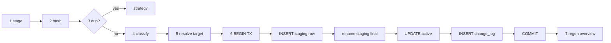

# 模块：文件存储（storage）

> 负责所有文件级写操作：事务式导入、移动 / 复制 / 索引、SHA256、冲突重命名、软删除、外部变化处理。
>
> 阅读时长：约 14 分钟。

---

## 职责

| 子模块 | 文件 | 职责 |
|---|---|---|
| ops | `core/src/storage/ops.rs` | `import_file` 主流程、状态机 |
| hash | `core/src/storage/hash.rs` | SHA256 计算、流式拷贝并哈希 |
| conflict | `core/src/storage/conflict.rs` | 同名冲突时追加 `_1`、`_2` |
| recovery | `core/src/storage/recovery.rs` | 启动时清 staging |
| reindex | `core/src/storage/reindex.rs` | 从文件系统重建索引 |
| validate | `core/src/storage/validate.rs` | 文件名 / 路径 / 大小校验 |

外部依赖：`rusqlite`、`sha2`、`walkdir`、`trash`、`chrono`、`serde_json`。

---

## 关键 API（完整签名）

```rust
// core/src/storage/mod.rs
pub mod conflict;
pub mod hash;
pub mod ops;
pub mod recovery;
pub mod reindex;
pub mod validate;

pub use ops::{import_file, delete_file, rename_file, move_to_category};
pub use recovery::recover_on_startup;
pub use reindex::reindex_from_filesystem;
```

```rust
pub fn import_file(
    repo: &Path,
    src: &Path,
    options: ImportOptions,
) -> CoreResult<FileEntry>;

pub fn delete_file(repo: &Path, file_id: i64, hard: bool) -> CoreResult<()>;
pub fn rename_file(repo: &Path, file_id: i64, new_name: &str) -> CoreResult<FileEntry>;
pub fn move_to_category(repo: &Path, file_id: i64, new_category: &str) -> CoreResult<FileEntry>;

pub fn recover_on_startup(repo: &Path) -> CoreResult<RecoveryReport>;
pub fn reindex_from_filesystem(repo: &Path) -> CoreResult<ReindexReport>;
```

类型定义见 [../api/core-api.md](../api/core-api.md)。

---

## import_file 完整流程



### 完整实现

```rust
// core/src/storage/ops.rs
use std::path::{Path, PathBuf};
use std::time::SystemTime;
use rusqlite::params;
use serde_json::json;

use crate::api::types::{
    DuplicateStrategy, FileEntry, ImportOptions, StorageMode,
};
use crate::change_log::ChangeAction;
use crate::classify;
use crate::db;
use crate::error::{CoreError, CoreResult};
use crate::repo::RepoLayout;
use crate::storage::{conflict, hash, validate};

/// 主入口：把外部文件按 ImportOptions 落入仓库。
pub fn import_file(
    repo: &Path,
    src: &Path,
    options: ImportOptions,
) -> CoreResult<FileEntry> {
    validate::source_exists(src)?;
    validate::source_size(src, MAX_IMPORT_SIZE)?;

    let layout = RepoLayout::for_repo(repo);
    layout.ensure_dirs()?;

    let original_name = src
        .file_name()
        .and_then(|s| s.to_str())
        .ok_or_else(|| CoreError::InvalidPath {
            path: src.display().to_string(),
        })?
        .to_string();

    let _guard = StagingGuard::new(&layout);
    let staging_path = _guard.staging_path();

    materialize_to_staging(src, &staging_path, options.mode)?;
    let hash = hash::sha256_file(&staging_path)?;
    let size = std::fs::metadata(&staging_path)?.len() as i64;

    if let Some(existing) = db::find_by_hash(repo, &hash)? {
        match options.duplicate_strategy {
            DuplicateStrategy::Skip => {
                return Err(CoreError::DuplicateFile {
                    existing_path: existing.path.clone(),
                });
            }
            DuplicateStrategy::Overwrite => {
                db::soft_delete_by_id(repo, existing.id)?;
            }
            DuplicateStrategy::KeepBoth => { /* fall through */ }
        }
    }

    let category = options
        .override_category
        .clone()
        .unwrap_or_else(|| {
            classify::classify(repo, &original_name).category
        });
    let target_filename = options
        .override_filename
        .clone()
        .unwrap_or_else(|| original_name.clone());

    validate::filename(&target_filename)?;

    let category_dir = repo.join(&category);
    std::fs::create_dir_all(&category_dir)?;
    let final_abs = conflict::resolve_target(&category_dir, &target_filename)?;
    let final_rel = final_abs
        .strip_prefix(repo)
        .map_err(|_| CoreError::InvalidPath {
            path: final_abs.display().to_string(),
        })?
        .to_string_lossy()
        .to_string();
    let final_name = final_abs
        .file_name()
        .and_then(|s| s.to_str())
        .unwrap_or(&target_filename)
        .to_string();

    let imported_at = chrono::Utc::now().timestamp();
    let staging_rel = staging_path
        .strip_prefix(repo)
        .unwrap()
        .to_string_lossy()
        .to_string();

    let new_id = db::with_repo(repo, |conn| -> CoreResult<i64> {
        let tx = conn.transaction()?;
        let id = db::insert_staging(
            &tx,
            db::NewFileRow {
                path: staging_rel.clone(),
                original_name: original_name.clone(),
                current_name: final_name.clone(),
                category: category.clone(),
                size_bytes: size,
                hash_sha256: hash.clone(),
                storage_mode: options.mode,
                source_path: src.to_string_lossy().to_string(),
                imported_at,
            },
        )?;
        tx.commit()?;
        Ok(id)
    })?;

    rename_with_fsync(&staging_path, &final_abs)?;
    _guard.disarm();

    db::with_repo(repo, |conn| -> CoreResult<()> {
        let tx = conn.transaction()?;
        db::promote_active(&tx, new_id, &final_rel, &final_name)?;
        db::insert_change(
            &tx,
            new_id,
            ChangeAction::Imported,
            json!({
                "mode": options.mode,
                "source": src.display().to_string(),
                "category": category,
                "renamed_from_original": original_name != final_name,
            }),
        )?;
        tx.commit()?;
        Ok(())
    })?;

    crate::overview::regenerate_for_category(repo, &category)?;
    db::get_file_by_id(repo, new_id)
}

const MAX_IMPORT_SIZE: u64 = 50 * 1024 * 1024 * 1024;

fn materialize_to_staging(
    src: &Path,
    staging: &Path,
    mode: StorageMode,
) -> CoreResult<()> {
    match mode {
        StorageMode::Moved | StorageMode::Copied => {
            std::fs::copy(src, staging)?;
            sync_file(staging)?;
        }
        StorageMode::Indexed => {
            std::fs::hard_link(src, staging).or_else(|_| {
                std::fs::copy(src, staging).map(|_| ())
            })?;
        }
    }
    Ok(())
}

fn rename_with_fsync(from: &Path, to: &Path) -> CoreResult<()> {
    if let Some(parent) = to.parent() {
        std::fs::create_dir_all(parent)?;
    }
    if let Err(e) = std::fs::rename(from, to) {
        if e.raw_os_error() == Some(libc::EXDEV) {
            std::fs::copy(from, to)?;
            std::fs::remove_file(from)?;
        } else {
            return Err(e.into());
        }
    }
    if let Some(parent) = to.parent() {
        sync_dir(parent)?;
    }
    Ok(())
}

fn sync_file(p: &Path) -> CoreResult<()> {
    let f = std::fs::File::open(p)?;
    f.sync_all()?;
    Ok(())
}

fn sync_dir(p: &Path) -> CoreResult<()> {
    let f = std::fs::File::open(p)?;
    f.sync_all()?;
    Ok(())
}
```

### StagingGuard：RAII 自动清理

```rust
pub(crate) struct StagingGuard {
    path: PathBuf,
    armed: std::cell::Cell<bool>,
}

impl StagingGuard {
    pub fn new(layout: &RepoLayout) -> Self {
        let id = uuid::Uuid::new_v4();
        let path = layout.staging_dir().join(id.to_string());
        Self { path, armed: std::cell::Cell::new(true) }
    }

    pub fn staging_path(&self) -> PathBuf { self.path.clone() }

    pub fn disarm(&self) { self.armed.set(false); }
}

impl Drop for StagingGuard {
    fn drop(&mut self) {
        if self.armed.get() {
            let _ = std::fs::remove_file(&self.path);
        }
    }
}
```

---

## hash 模块

```rust
// core/src/storage/hash.rs
use sha2::{Digest, Sha256};
use std::fs::File;
use std::io::{BufReader, BufWriter, Read, Write};
use std::path::Path;

const CHUNK: usize = 64 * 1024;

pub fn sha256_file(path: &Path) -> std::io::Result<String> {
    let f = File::open(path)?;
    let mut reader = BufReader::with_capacity(CHUNK, f);
    let mut hasher = Sha256::new();
    let mut buf = [0u8; CHUNK];
    loop {
        let n = reader.read(&mut buf)?;
        if n == 0 { break; }
        hasher.update(&buf[..n]);
    }
    Ok(format!("{:x}", hasher.finalize()))
}

pub fn copy_and_hash(src: &Path, dst: &Path) -> std::io::Result<String> {
    let mut reader = BufReader::with_capacity(CHUNK, File::open(src)?);
    let mut writer = BufWriter::with_capacity(CHUNK, File::create(dst)?);
    let mut hasher = Sha256::new();
    let mut buf = [0u8; CHUNK];
    loop {
        let n = reader.read(&mut buf)?;
        if n == 0 { break; }
        writer.write_all(&buf[..n])?;
        hasher.update(&buf[..n]);
    }
    writer.flush()?;
    Ok(format!("{:x}", hasher.finalize()))
}

pub fn sha256_with_progress<F>(path: &Path, mut on_progress: F) -> std::io::Result<String>
where
    F: FnMut(u64, u64),
{
    let total = std::fs::metadata(path)?.len();
    let mut reader = BufReader::with_capacity(CHUNK, File::open(path)?);
    let mut hasher = Sha256::new();
    let mut buf = [0u8; CHUNK];
    let mut done: u64 = 0;
    loop {
        let n = reader.read(&mut buf)?;
        if n == 0 { break; }
        hasher.update(&buf[..n]);
        done += n as u64;
        on_progress(done, total);
    }
    Ok(format!("{:x}", hasher.finalize()))
}
```

---

## conflict 模块（同名冲突）

```rust
// core/src/storage/conflict.rs
use std::path::{Path, PathBuf};

pub fn resolve_target(category_dir: &Path, filename: &str) -> std::io::Result<PathBuf> {
    let candidate = category_dir.join(filename);
    if !candidate.exists() {
        return Ok(candidate);
    }
    let (stem, ext) = split_stem_ext(filename);
    for i in 1..1000 {
        let new_name = match ext {
            Some(e) => format!("{}_{}.{}", stem, i, e),
            None => format!("{}_{}", stem, i),
        };
        let path = category_dir.join(&new_name);
        if !path.exists() { return Ok(path); }
    }
    Err(std::io::Error::new(
        std::io::ErrorKind::AlreadyExists,
        "exceeded 1000 conflict suffix attempts",
    ))
}

fn split_stem_ext(filename: &str) -> (&str, Option<&str>) {
    if filename.starts_with('.') && filename.matches('.').count() == 1 {
        return (filename, None);
    }
    match filename.rfind('.') {
        Some(i) if i > 0 => (&filename[..i], Some(&filename[i + 1..])),
        _ => (filename, None),
    }
}
```

注意：

- 1000 次上限是防御无限循环，正常场景不会触发。
- 多层扩展（`archive.tar.gz`）只剥离最后一层，结果是 `archive.tar_1.gz`，符合大多数用户预期。

---

## delete_file

```rust
// core/src/storage/ops.rs (续)
pub fn delete_file(repo: &Path, file_id: i64, hard: bool) -> CoreResult<()> {
    let entry = db::get_file_by_id(repo, file_id)?;
    let abs_path = repo.join(&entry.path);

    if abs_path.exists() {
        if hard {
            std::fs::remove_file(&abs_path)?;
        } else {
            trash::delete(&abs_path).map_err(|e| CoreError::Io(e.to_string()))?;
        }
    }

    db::with_repo(repo, |conn| -> CoreResult<()> {
        let tx = conn.transaction()?;
        db::soft_delete(&tx, file_id)?;
        db::insert_change(
            &tx,
            file_id,
            ChangeAction::Deleted,
            json!({"hard": hard, "by": "user"}),
        )?;
        tx.commit()?;
        Ok(())
    })?;

    crate::overview::regenerate_for_category(repo, &entry.category)?;
    Ok(())
}
```

---

## rename_file

```rust
pub fn rename_file(repo: &Path, file_id: i64, new_name: &str) -> CoreResult<FileEntry> {
    validate::filename(new_name)?;

    let entry = db::get_file_by_id(repo, file_id)?;
    let old_abs = repo.join(&entry.path);
    let category_dir = old_abs.parent().ok_or_else(|| CoreError::InvalidPath {
        path: entry.path.clone(),
    })?;

    let new_abs = conflict::resolve_target(category_dir, new_name)?;
    let new_relative = new_abs
        .strip_prefix(repo)
        .unwrap()
        .to_string_lossy()
        .to_string();
    let final_name = new_abs
        .file_name()
        .and_then(|s| s.to_str())
        .unwrap_or(new_name)
        .to_string();

    rename_with_fsync(&old_abs, &new_abs)?;

    db::with_repo(repo, |conn| -> CoreResult<()> {
        let tx = conn.transaction()?;
        db::update_path(&tx, file_id, &new_relative, &final_name)?;
        db::insert_change(
            &tx,
            file_id,
            ChangeAction::Renamed,
            json!({"from": entry.current_name, "to": final_name}),
        )?;
        tx.commit()?;
        Ok(())
    })?;

    crate::overview::regenerate_for_category(repo, &entry.category)?;
    db::get_file_by_id(repo, file_id)
}
```

---

## move_to_category

```rust
pub fn move_to_category(
    repo: &Path,
    file_id: i64,
    new_category: &str,
) -> CoreResult<FileEntry> {
    classify::ensure_category_exists(repo, new_category)?;
    let entry = db::get_file_by_id(repo, file_id)?;
    if entry.category == new_category {
        return Ok(entry);
    }

    let old_abs = repo.join(&entry.path);
    let new_dir = repo.join(new_category);
    std::fs::create_dir_all(&new_dir)?;
    let new_abs = conflict::resolve_target(&new_dir, &entry.current_name)?;
    let new_rel = new_abs.strip_prefix(repo).unwrap().to_string_lossy().to_string();
    let final_name = new_abs
        .file_name()
        .and_then(|s| s.to_str())
        .unwrap_or(&entry.current_name)
        .to_string();

    rename_with_fsync(&old_abs, &new_abs)?;

    db::with_repo(repo, |conn| -> CoreResult<()> {
        let tx = conn.transaction()?;
        db::update_path_and_category(&tx, file_id, &new_rel, new_category, &final_name)?;
        db::insert_change(
            &tx,
            file_id,
            ChangeAction::Moved,
            json!({
                "from_category": entry.category,
                "to_category": new_category,
                "renamed_to": final_name,
            }),
        )?;
        tx.commit()?;
        Ok(())
    })?;

    crate::overview::regenerate_for_category(repo, &entry.category)?;
    crate::overview::regenerate_for_category(repo, new_category)?;
    db::get_file_by_id(repo, file_id)
}
```

---

## recover_on_startup

```rust
// core/src/storage/recovery.rs
use std::path::Path;
use crate::api::types::RecoveryReport;
use crate::db;
use crate::error::CoreResult;
use crate::repo::RepoLayout;

pub fn recover_on_startup(repo: &Path) -> CoreResult<RecoveryReport> {
    let mut report = RecoveryReport::default();
    let layout = RepoLayout::for_repo(repo);
    layout.ensure_dirs()?;

    let staging_rows = db::with_repo(repo, |c| db::list_staging_rows(c))?;
    for row in staging_rows {
        let abs = repo.join(&row.path);
        if abs.exists() {
            let _ = std::fs::remove_file(&abs);
            report.cleaned_staging_files += 1;
        }
        db::with_repo(repo, |conn| -> CoreResult<()> {
            let tx = conn.transaction()?;
            db::hard_delete(&tx, row.id)?;
            tx.commit()?;
            Ok(())
        })?;
        report.reverted_staging_db_rows += 1;
    }

    let staging_dir = layout.staging_dir();
    if staging_dir.exists() {
        for entry in std::fs::read_dir(&staging_dir)? {
            let entry = entry?;
            if entry.file_type()?.is_file() {
                let _ = std::fs::remove_file(entry.path());
                report.cleaned_staging_files += 1;
            }
        }
    }

    Ok(report)
}
```

---

## reindex_from_filesystem

`reindex_from_filesystem` 同时服务两个场景：

- 接管已有目录：首次扫描现有文件，以 `StorageMode::Indexed` 写入 DB，不移动文件
- DB 丢失/损坏后的重建索引：从文件系统重新推导 files 表

它必须跳过 `.areamatrix/`、可选根目录 `AREAMATRIX.md` 以及其他配置化忽略项，但**不跳过用户自己的 `README.md`**。

```rust
// core/src/storage/reindex.rs
use std::path::Path;
use walkdir::{DirEntry, WalkDir};

use crate::api::types::{ReindexReport, StorageMode};
use crate::db::{self, NewFileRow};
use crate::error::CoreResult;
use crate::storage::hash;

pub fn reindex_from_filesystem(repo: &Path) -> CoreResult<ReindexReport> {
    let mut report = ReindexReport::default();

    let walker = WalkDir::new(repo)
        .follow_links(false)
        .into_iter()
        .filter_entry(|e| !is_areamatrix_internal(e));

    for entry in walker {
        let entry = match entry {
            Ok(e) => e,
            Err(e) => { report.errors.push(e.to_string()); continue; }
        };
        if !entry.file_type().is_file() { continue; }

        let abs = entry.path();
        let rel = match abs.strip_prefix(repo) {
            Ok(r) => r,
            Err(_) => continue,
        };
        let path_str = rel.to_string_lossy().to_string();

        if is_managed_file(&path_str) { continue; }

        let hash_str = match hash::sha256_file(abs) {
            Ok(h) => h,
            Err(e) => { report.errors.push(e.to_string()); continue; }
        };
        let size = entry.metadata()?.len() as i64;

        match db::find_by_path(repo, &path_str)? {
            Some(existing) if existing.hash_sha256 == hash_str => {
                report.skipped += 1;
            }
            Some(existing) => {
                db::update_hash(repo, existing.id, &hash_str, size)?;
                report.updated += 1;
            }
            None => {
                let category = top_level_dir(&path_str)
                    .unwrap_or_else(|| "inbox".to_string());
                let original_name = abs
                    .file_name()
                    .and_then(|s| s.to_str())
                    .unwrap_or("unnamed")
                    .to_string();
                db::with_repo(repo, |conn| -> CoreResult<()> {
                    let tx = conn.transaction()?;
                    db::insert_active(&tx, NewFileRow {
                        path: path_str.clone(),
                        original_name: original_name.clone(),
                        current_name: original_name,
                        category,
                        size_bytes: size,
                        hash_sha256: hash_str.clone(),
                        storage_mode: StorageMode::Indexed,
                        source_path: abs.to_string_lossy().to_string(),
                        imported_at: chrono::Utc::now().timestamp(),
                    })?;
                    tx.commit()?;
                    Ok(())
                })?;
                report.inserted += 1;
            }
        }
    }
    Ok(report)
}

fn is_areamatrix_internal(e: &DirEntry) -> bool {
    e.file_name().to_str().map(|s| s == ".areamatrix").unwrap_or(false)
}

fn is_managed_file(path: &str) -> bool {
    path.starts_with(".areamatrix/")
        || path == "AREAMATRIX.md"
}

fn top_level_dir(path: &str) -> Option<String> {
    path.split('/').next().map(|s| s.to_string())
}
```

---

## validate 模块

```rust
// core/src/storage/validate.rs
use std::path::Path;
use crate::error::{CoreError, CoreResult};

const FORBIDDEN: &[char] = &['/', '\\', ':', '*', '?', '"', '<', '>', '|'];

pub fn filename(name: &str) -> CoreResult<()> {
    if name.is_empty() || name == "." || name == ".." {
        return Err(CoreError::InvalidPath { path: name.into() });
    }
    if name.len() > 255 {
        return Err(CoreError::InvalidPath { path: name.into() });
    }
    if name.chars().any(|c| FORBIDDEN.contains(&c)) {
        return Err(CoreError::InvalidPath { path: name.into() });
    }
    Ok(())
}

pub fn source_exists(p: &Path) -> CoreResult<()> {
    if !p.exists() {
        return Err(CoreError::FileNotFound { path: p.display().to_string() });
    }
    if !p.is_file() {
        return Err(CoreError::InvalidPath { path: p.display().to_string() });
    }
    Ok(())
}

pub fn source_size(p: &Path, max: u64) -> CoreResult<()> {
    let size = std::fs::metadata(p)?.len();
    if size > max {
        return Err(CoreError::Internal {
            message: format!("file too large: {} > {}", size, max),
        });
    }
    Ok(())
}
```

---

## 单元测试

### 通用 fixtures

```rust
// core/src/storage/tests/common.rs
use std::path::PathBuf;
use tempfile::TempDir;

pub struct TestRepo { pub dir: TempDir }

impl TestRepo {
    pub fn new() -> Self {
        let dir = tempfile::tempdir().unwrap();
        crate::api::init_repo(dir.path().to_string_lossy().into()).unwrap();
        Self { dir }
    }
    pub fn path(&self) -> PathBuf { self.dir.path().to_path_buf() }
    pub fn write_source(&self, name: &str, content: &[u8]) -> PathBuf {
        let p = self.dir.path().join(format!("__src_{}", name));
        std::fs::write(&p, content).unwrap();
        p
    }
}
```

### import_file 三种模式

```rust
#[cfg(test)]
mod tests {
    use super::*;
    use crate::api::types::*;
    use crate::storage::tests::common::TestRepo;

    fn opts(mode: StorageMode) -> ImportOptions {
        ImportOptions {
            mode,
            override_category: None,
            override_filename: None,
            duplicate_strategy: DuplicateStrategy::Skip,
        }
    }

    #[test]
    fn import_copy_keeps_source() {
        let repo = TestRepo::new();
        let src = repo.write_source("hello.pdf", b"hello");
        let entry = import_file(&repo.path(), &src, opts(StorageMode::Copied)).unwrap();
        assert!(src.exists(), "source should remain");
        assert!(repo.path().join(&entry.path).exists());
        assert_eq!(entry.category, "docs");
    }

    #[test]
    fn import_move_removes_source() {
        let repo = TestRepo::new();
        let src = repo.write_source("notes.pdf", b"content");
        let entry = import_file(&repo.path(), &src, opts(StorageMode::Moved)).unwrap();
        assert!(!src.exists(), "source should be moved");
        assert!(repo.path().join(&entry.path).exists());
    }

    #[test]
    fn import_indexed_keeps_source_no_copy() {
        let repo = TestRepo::new();
        let src = repo.write_source("ext.pdf", b"x");
        let entry = import_file(&repo.path(), &src, opts(StorageMode::Indexed)).unwrap();
        assert!(src.exists());
        assert_eq!(entry.storage_mode, StorageMode::Indexed);
    }

    #[test]
    fn import_dup_skip_returns_err() {
        let repo = TestRepo::new();
        let src = repo.write_source("a.pdf", b"same");
        import_file(&repo.path(), &src, opts(StorageMode::Copied)).unwrap();
        let src2 = repo.write_source("b.pdf", b"same");
        let r = import_file(&repo.path(), &src2, opts(StorageMode::Copied));
        assert!(matches!(r, Err(CoreError::DuplicateFile { .. })));
    }

    #[test]
    fn import_dup_keep_both_renames() {
        let repo = TestRepo::new();
        let src = repo.write_source("dup.pdf", b"same");
        let mut o = opts(StorageMode::Copied);
        o.duplicate_strategy = DuplicateStrategy::KeepBoth;
        let e1 = import_file(&repo.path(), &src, o.clone()).unwrap();
        let src2 = repo.write_source("dup2.pdf", b"same");
        let e2 = import_file(&repo.path(), &src2, o).unwrap();
        assert_ne!(e1.path, e2.path);
    }

    #[test]
    fn import_invalid_filename_rejected() {
        let repo = TestRepo::new();
        let src = repo.write_source("ok.pdf", b"x");
        let mut o = opts(StorageMode::Copied);
        o.override_filename = Some("bad/name.pdf".into());
        let r = import_file(&repo.path(), &src, o);
        assert!(matches!(r, Err(CoreError::InvalidPath { .. })));
    }
}
```

### conflict / rename / delete / move

```rust
#[cfg(test)]
mod tests_more {
    use super::*;
    use crate::api::types::*;
    use crate::storage::{conflict, tests::common::TestRepo};

    #[test]
    fn conflict_appends_suffix() {
        let repo = TestRepo::new();
        let dir = repo.path().join("docs");
        std::fs::create_dir_all(&dir).unwrap();
        std::fs::write(dir.join("a.pdf"), b"").unwrap();
        let p = conflict::resolve_target(&dir, "a.pdf").unwrap();
        assert_eq!(p.file_name().unwrap(), "a_1.pdf");
    }

    #[test]
    fn rename_updates_db_and_fs() {
        let repo = TestRepo::new();
        let src = repo.write_source("x.pdf", b"x");
        let e = import_file(&repo.path(), &src, ImportOptions::default()).unwrap();
        let renamed = rename_file(&repo.path(), e.id, "y.pdf").unwrap();
        assert_eq!(renamed.current_name, "y.pdf");
        assert!(repo.path().join(&renamed.path).exists());
        assert!(!repo.path().join(&e.path).exists());
    }

    #[test]
    fn delete_soft_marks_deleted() {
        let repo = TestRepo::new();
        let src = repo.write_source("d.pdf", b"x");
        let e = import_file(&repo.path(), &src, ImportOptions::default()).unwrap();
        delete_file(&repo.path(), e.id, false).unwrap();
        let after = crate::api::list_files(
            repo.path().to_string_lossy().into(),
            FileFilter::default(),
        ).unwrap();
        assert!(after.iter().all(|f| f.id != e.id));
    }

    #[test]
    fn move_changes_category() {
        let repo = TestRepo::new();
        let src = repo.write_source("m.pdf", b"x");
        let e = import_file(&repo.path(), &src, ImportOptions::default()).unwrap();
        let moved = move_to_category(&repo.path(), e.id, "archive").unwrap();
        assert_eq!(moved.category, "archive");
        assert!(moved.path.starts_with("archive/"));
    }
}
```

### recover_on_startup（崩溃模拟）

```rust
#[cfg(test)]
mod tests_recovery {
    use super::*;
    use crate::storage::tests::common::TestRepo;

    #[test]
    fn cleans_orphan_staging_files() {
        let repo = TestRepo::new();
        let staging = repo.path().join(".areamatrix/staging");
        std::fs::create_dir_all(&staging).unwrap();
        std::fs::write(staging.join("orphan-1"), b"x").unwrap();
        std::fs::write(staging.join("orphan-2"), b"x").unwrap();

        let report = recover_on_startup(&repo.path()).unwrap();
        assert_eq!(report.cleaned_staging_files, 2);
        assert!(staging.read_dir().unwrap().next().is_none());
    }

    #[test]
    fn reverts_staging_db_rows() {
        let repo = TestRepo::new();
        let id = crate::db::with_repo(&repo.path(), |conn| {
            let tx = conn.transaction().unwrap();
            let id = crate::db::insert_staging(&tx, sample_row()).unwrap();
            tx.commit().unwrap();
            Ok(id)
        }).unwrap();

        let report = recover_on_startup(&repo.path()).unwrap();
        assert!(report.reverted_staging_db_rows >= 1);
        assert!(crate::db::get_file_by_id(&repo.path(), id).is_err());
    }
}
```

---

## 错误返回示例

| 触发 | 返回 | UI 处理 |
|---|---|---|
| 源文件不存在 | `CoreError::FileNotFound { path }` | toast "源文件不存在：{path}" |
| 源文件 > 50GB | `CoreError::Internal { message }` | toast "文件过大" + 详情 |
| `override_filename` 含 `/` | `CoreError::InvalidPath { path }` | sheet 显示"文件名不允许包含 / \\ : * ? \" < > \|" |
| hash 已存在 + Skip | `CoreError::DuplicateFile { existing_path }` | toast"已存在：{existing_path}" + 跳转按钮 |
| 跨卷 rename + 目标无写权限 | `CoreError::PermissionDenied { path }` | sheet 引导授权 |
| 启动时 staging row 无对应文件 | 不报错，自动清理 | RecoveryReport 中计入 `reverted_staging_db_rows` |

---

## 集成测试落点

| 测试文件 | 关注点 |
|---|---|
| `core/tests/import_modes_test.rs` | 三种模式端到端 |
| `core/tests/dedup_test.rs` | hash 去重三策略 |
| `core/tests/conflict_test.rs` | 同名连续 _1.._N |
| `core/tests/recovery_test.rs` | panic 注入 + 子进程 SIGKILL |
| `core/tests/reindex_test.rs` | 仓库目录手动改后重建 |
| `core/tests/move_test.rs` | 跨分类移动同步 AreaMatrix 概览 |

---

## 性能目标

| 操作 | 目标（M1, SSD） | 备注 |
|---|---|---|
| 1MB 文件 import (Copy) | < 30 ms | 含 hash + DB |
| 100MB 文件 import (Copy) | < 1 s | 占主导是 IO |
| 重命名 | < 10 ms | 仅 rename + UPDATE |
| 软删除 | < 50 ms | 含废纸篓 IPC |
| reindex 1 万文件 | < 30 s | 含全量 hash |

---

## Related

- [../architecture/transactional-import.md](../architecture/transactional-import.md)
- [../architecture/data-model.md](../architecture/data-model.md)
- [../architecture/concurrency.md](../architecture/concurrency.md)
- [../architecture/migration.md](../architecture/migration.md)
- [../api/core-api.md](../api/core-api.md)
- [../api/error-codes.md](../api/error-codes.md)
- [../development/troubleshooting.md](../development/troubleshooting.md)
- [../development/observability.md](../development/observability.md)
- [classify.md](classify.md)
- [overview-gen.md](overview-gen.md)
