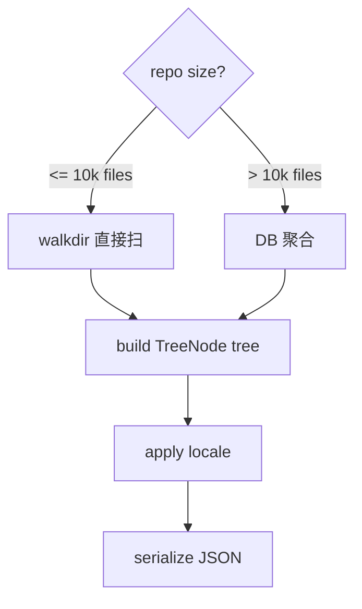
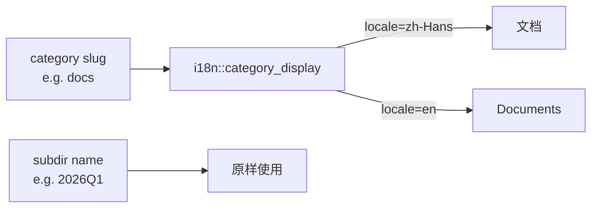

# 模块：目录扫描与树构建（tree）

> 给侧边栏树状图提供数据。输入资料库路径，输出 JSON 形式的目录树（含每节点文件数、显示名、英文 slug、深度等）。
>
> 阅读时长：约 9 分钟。

---

## 模块边界

输入：

- `repo_path`
- `locale`（`zh-Hans` / `en`，决定 `display_name`）
- `mode`：`Full` / `Incremental(changed_paths: Vec<String>)`

输出：

```rust
#[derive(Debug, Clone, serde::Serialize, serde::Deserialize)]
pub struct TreeNode {
    pub slug: String,
    pub display_name: String,
    pub kind: NodeKind,
    pub relative_path: String,
    pub file_count: i64,
    pub size_bytes: i64,
    pub depth: i32,
    pub children: Vec<TreeNode>,
}

#[derive(Debug, Clone, Copy, PartialEq, Eq, serde::Serialize, serde::Deserialize)]
pub enum NodeKind { Category, Subdir }
```

序列化为 JSON 给 Swift。Swift 解码为 `TreeNode`（Codable）。

---

## 数据源选择



MVP：仅 walkdir 路径；DB 路径 Stage 2 上线。

---

## 文件布局

```text
core/src/tree/
├── mod.rs       // build_tree / list_tree_json
├── walker.rs    // walkdir 扫描
├── aggregate.rs // 从 DB 聚合（Stage 2）
├── cache.rs     // 增量更新缓存
└── i18n.rs      // 复用 overview::i18n
```

---

## 入口实现

```rust
// core/src/tree/mod.rs
mod aggregate;
mod cache;
mod walker;

use std::path::Path;
use serde::{Deserialize, Serialize};

use crate::classify;
use crate::error::CoreResult;
use crate::overview::i18n;

#[derive(Debug, Clone, Serialize, Deserialize, PartialEq, Eq)]
pub enum NodeKind { Category, Subdir }

#[derive(Debug, Clone, Serialize, Deserialize)]
pub struct TreeNode {
    pub slug: String,
    pub display_name: String,
    pub kind: NodeKind,
    pub relative_path: String,
    pub file_count: i64,
    pub size_bytes: i64,
    pub depth: i32,
    pub children: Vec<TreeNode>,
}

pub fn build_tree(repo: &Path, locale: &str) -> CoreResult<TreeNode> {
    let cfg = classify::rules::load_or_default(repo)?;
    let raw = walker::walk(repo)?;

    let mut root = TreeNode {
        slug: "__root__".into(),
        display_name: match locale {
            "en" => "Repository".into(),
            _ => "资料库".into(),
        },
        kind: NodeKind::Category,
        relative_path: String::new(),
        file_count: 0,
        size_bytes: 0,
        depth: 0,
        children: Vec::new(),
    };

    for cat in &cfg.categories {
        if let Some(node) = raw.children.get(&cat.slug) {
            let mut tn = to_tree_node(node, &cat.slug, locale, 1, true);
            tn.display_name = i18n::category_display(&cat.slug, locale);
            root.file_count += tn.file_count;
            root.size_bytes += tn.size_bytes;
            root.children.push(tn);
        }
    }

    for (slug, node) in &raw.children {
        if cfg.has_category(slug) || slug.starts_with('.') {
            continue;
        }
        let mut tn = to_tree_node(node, slug, locale, 1, false);
        tn.display_name = slug.clone();
        root.file_count += tn.file_count;
        root.size_bytes += tn.size_bytes;
        root.children.push(tn);
    }

    Ok(root)
}

fn to_tree_node(
    raw: &walker::RawNode,
    slug: &str,
    locale: &str,
    depth: i32,
    is_category: bool,
) -> TreeNode {
    let mut children: Vec<TreeNode> = raw
        .children
        .iter()
        .map(|(name, child)| {
            let mut tn = to_tree_node(child, name, locale, depth + 1, false);
            tn.display_name = name.clone();
            tn
        })
        .collect();
    children.sort_by(|a, b| a.slug.cmp(&b.slug));

    TreeNode {
        slug: slug.into(),
        display_name: slug.into(),
        kind: if is_category { NodeKind::Category } else { NodeKind::Subdir },
        relative_path: raw.rel_path.clone(),
        file_count: raw.file_count,
        size_bytes: raw.size_bytes,
        depth,
        children,
    }
}

pub fn list_tree_json(repo: &Path, locale: &str) -> CoreResult<String> {
    let tree = build_tree(repo, locale)?;
    Ok(serde_json::to_string(&tree)?)
}
```

---

## walker 模块（walkdir 扫描）

```rust
// core/src/tree/walker.rs
use std::collections::BTreeMap;
use std::path::Path;

use walkdir::WalkDir;

use crate::error::CoreResult;

#[derive(Debug, Default)]
pub struct RawNode {
    pub rel_path: String,
    pub file_count: i64,
    pub size_bytes: i64,
    pub children: BTreeMap<String, RawNode>,
}

pub fn walk(repo: &Path) -> CoreResult<RawNode> {
    let mut root = RawNode::default();

    for entry in WalkDir::new(repo)
        .follow_links(false)
        .into_iter()
        .filter_entry(|e| !is_hidden_or_internal(e.file_name().to_string_lossy().as_ref()))
    {
        let entry = entry?;
        if !entry.file_type().is_file() { continue; }

        let abs = entry.path();
        let rel = match abs.strip_prefix(repo) {
            Ok(r) => r,
            Err(_) => continue,
        };
        let rel_str = rel.to_string_lossy().to_string();

        if is_managed_md(&rel_str) { continue; }

        let size = entry.metadata()?.len() as i64;
        insert_into_tree(&mut root, &rel_str, size);
    }

    Ok(root)
}

fn insert_into_tree(root: &mut RawNode, rel_path: &str, size: i64) {
    let parts: Vec<&str> = rel_path.split('/').collect();
    let mut node = root;
    for (i, part) in parts.iter().enumerate() {
        let is_file = i == parts.len() - 1;
        if is_file {
            node.file_count += 1;
            node.size_bytes += size;
            return;
        }
        let next = node
            .children
            .entry(part.to_string())
            .or_insert_with(|| RawNode {
                rel_path: parts[..=i].join("/"),
                ..Default::default()
            });
        next.file_count += 1;
        next.size_bytes += size;
        node = next;
    }
}

fn is_hidden_or_internal(name: &str) -> bool {
    name.starts_with('.')
}

fn is_managed_md(rel: &str) -> bool {
    rel == "AREAMATRIX.md" || rel.starts_with(".areamatrix/generated/")
}
```

---

## DB 聚合方案（Stage 2）

```rust
// core/src/tree/aggregate.rs
use std::collections::BTreeMap;
use std::path::Path;
use rusqlite::params;

use crate::db;
use crate::error::CoreResult;
use crate::tree::walker::RawNode;

pub fn aggregate_from_db(repo: &Path) -> CoreResult<RawNode> {
    db::with_repo(repo, |conn| {
        let mut root = RawNode::default();
        let mut stmt = conn.prepare(
            "SELECT category, path, size_bytes
             FROM files
             WHERE deleted_at IS NULL AND status = 'active'",
        )?;
        let rows = stmt.query_map([], |r| {
            Ok((r.get::<_, String>(0)?, r.get::<_, String>(1)?, r.get::<_, i64>(2)?))
        })?;
        for row in rows {
            let (_cat, path, size) = row?;
            super::walker::insert_into_tree_pub(&mut root, &path, size);
        }
        Ok(root)
    })
}
```

---

## cache 模块（增量更新）

```rust
// core/src/tree/cache.rs
use std::collections::HashMap;
use std::path::PathBuf;
use std::sync::Mutex;
use std::time::Instant;

pub struct TreeCache {
    inner: Mutex<Option<CachedTree>>,
}

struct CachedTree {
    repo: PathBuf,
    locale: String,
    snapshot: super::TreeNode,
    built_at: Instant,
    dirty_paths: HashMap<String, ()>,
}

impl TreeCache {
    pub fn new() -> Self { Self { inner: Mutex::new(None) } }

    pub fn invalidate_all(&self) {
        *self.inner.lock().unwrap() = None;
    }

    pub fn mark_dirty(&self, rel_path: &str) {
        if let Some(c) = self.inner.lock().unwrap().as_mut() {
            c.dirty_paths.insert(rel_path.into(), ());
        }
    }

    pub fn get_or_rebuild(
        &self,
        repo: &std::path::Path,
        locale: &str,
    ) -> crate::error::CoreResult<super::TreeNode> {
        let mut guard = self.inner.lock().unwrap();
        let need_rebuild = match guard.as_ref() {
            None => true,
            Some(c) => c.repo != repo || c.locale != locale || !c.dirty_paths.is_empty(),
        };
        if need_rebuild {
            let snapshot = super::build_tree(repo, locale)?;
            *guard = Some(CachedTree {
                repo: repo.to_path_buf(),
                locale: locale.into(),
                snapshot: snapshot.clone(),
                built_at: Instant::now(),
                dirty_paths: HashMap::new(),
            });
            return Ok(snapshot);
        }
        Ok(guard.as_ref().unwrap().snapshot.clone())
    }
}
```

由 FSEvents 监听器和应用内写操作两路调用 `mark_dirty`。下次 UI 拉树时触发重建。

---

## 性能基线

| 文件数 | 扫描耗时（M1 SSD，目标） | 备注 |
|---|---|---|
| 100 | < 5 ms | 主要是 dir 打开开销 |
| 1,000 | < 30 ms | walkdir 顺序扫 |
| 10,000 | < 300 ms | 单线程足够 |
| 100,000 | 1-3 s | 必须并行 / 切 DB 聚合 |
| 1,000,000 | 10-30 s | 不在 MVP 支持范围 |

### 优化清单

| 优化 | 阶段 | 收益 |
|---|---|---|
| `WalkDir::new().same_file_system(true)` | MVP | 防止跟随挂载点 |
| `metadata` 用 `DirEntry::metadata` 而非 `std::fs::metadata` | MVP | 减少 1 次 stat |
| 跳过 `.` 开头隐藏目录 | MVP | 跳过 `.git` `.areamatrix` 等大目录 |
| 增量更新（dirty_paths） | Stage 2 | UI 拉树 < 10ms |
| DB 聚合替代 walkdir | Stage 2 | 10 万文件 < 50ms |
| Rayon 并行 walkdir | Stage 3 | CPU 核心利用 |

---

## i18n / locale

display_name 来源：



子目录是用户起的名（包括中文 / 英文 / emoji），保持原样不本地化。

---

## 单元测试

```rust
#[cfg(test)]
mod tests {
    use super::*;
    use std::path::PathBuf;
    use tempfile::TempDir;

    fn setup() -> (TempDir, PathBuf) {
        let dir = tempfile::tempdir().unwrap();
        let p = dir.path().to_path_buf();
        crate::api::init_repo(p.to_string_lossy().into()).unwrap();
        (dir, p)
    }

    fn write_file(repo: &Path, rel: &str, size: usize) {
        let abs = repo.join(rel);
        std::fs::create_dir_all(abs.parent().unwrap()).unwrap();
        std::fs::write(&abs, vec![0u8; size]).unwrap();
    }

    #[test]
    fn empty_repo_zero_count() {
        let (_d, p) = setup();
        let tree = build_tree(&p, "zh-Hans").unwrap();
        assert_eq!(tree.file_count, 0);
    }

    #[test]
    fn counts_files_recursively() {
        let (_d, p) = setup();
        write_file(&p, "docs/a.pdf", 100);
        write_file(&p, "docs/sub/b.pdf", 200);
        let tree = build_tree(&p, "en").unwrap();
        let docs = tree.children.iter().find(|n| n.slug == "docs").unwrap();
        assert_eq!(docs.file_count, 2);
        assert_eq!(docs.size_bytes, 300);
    }

    #[test]
    fn skips_dot_areamatrix() {
        let (_d, p) = setup();
        write_file(&p, ".areamatrix/x", 1);
        write_file(&p, "docs/a.pdf", 100);
        let tree = build_tree(&p, "en").unwrap();
        assert!(!tree.children.iter().any(|n| n.slug == ".areamatrix"));
    }

    #[test]
    fn does_not_skip_user_readme_md() {
        let (_d, p) = setup();
        write_file(&p, "docs/README.md", 10);
        write_file(&p, "docs/x.pdf", 100);
        let tree = build_tree(&p, "en").unwrap();
        let docs = tree.children.iter().find(|n| n.slug == "docs").unwrap();
        assert_eq!(docs.file_count, 2);
    }

    #[test]
    fn skips_areamatrix_overview() {
        let (_d, p) = setup();
        write_file(&p, "AREAMATRIX.md", 10);
        write_file(&p, ".areamatrix/generated/root.md", 10);
        write_file(&p, "docs/x.pdf", 100);
        let tree = build_tree(&p, "en").unwrap();
        let docs = tree.children.iter().find(|n| n.slug == "docs").unwrap();
        assert_eq!(docs.file_count, 1);
    }

    #[test]
    fn locale_changes_display() {
        let (_d, p) = setup();
        write_file(&p, "docs/a.pdf", 1);
        let zh = build_tree(&p, "zh-Hans").unwrap();
        let en = build_tree(&p, "en").unwrap();
        let docs_zh = zh.children.iter().find(|n| n.slug == "docs").unwrap();
        let docs_en = en.children.iter().find(|n| n.slug == "docs").unwrap();
        assert_eq!(docs_zh.display_name, "文档");
        assert_eq!(docs_en.display_name, "Documents");
    }

    #[test]
    fn unknown_top_dir_kept_as_subdir() {
        let (_d, p) = setup();
        write_file(&p, "weird/x.pdf", 1);
        let tree = build_tree(&p, "en").unwrap();
        let weird = tree.children.iter().find(|n| n.slug == "weird").unwrap();
        assert_eq!(weird.kind, NodeKind::Subdir);
    }

    #[test]
    fn json_roundtrip() {
        let (_d, p) = setup();
        write_file(&p, "docs/a.pdf", 1);
        let json = list_tree_json(&p, "en").unwrap();
        let parsed: TreeNode = serde_json::from_str(&json).unwrap();
        assert_eq!(parsed.slug, "__root__");
    }

    #[test]
    fn cache_serves_after_first_build() {
        let (_d, p) = setup();
        write_file(&p, "docs/a.pdf", 1);
        let cache = cache::TreeCache::new();
        let t1 = cache.get_or_rebuild(&p, "en").unwrap();
        let t2 = cache.get_or_rebuild(&p, "en").unwrap();
        assert_eq!(t1.file_count, t2.file_count);
    }

    #[test]
    fn cache_rebuilds_after_dirty() {
        let (_d, p) = setup();
        let cache = cache::TreeCache::new();
        cache.get_or_rebuild(&p, "en").unwrap();
        write_file(&p, "docs/new.pdf", 1);
        cache.mark_dirty("docs/new.pdf");
        let t = cache.get_or_rebuild(&p, "en").unwrap();
        assert!(t.file_count >= 1);
    }
}
```

---

## 错误返回示例

| 触发 | 返回 |
|---|---|
| repo 不存在 | `CoreError::FileNotFound { path }` |
| 权限不足读子目录 | walkdir 的 `Err(io::Error)` 内层包装为 `CoreError::Io` |
| classifier.yaml 损坏 | fallback 到默认配置（不报错） |

---

## Related

- [../architecture/overview.md](../architecture/overview.md)
- [../architecture/data-model.md](../architecture/data-model.md)
- [../api/core-api.md](../api/core-api.md)
- [classify.md](classify.md)
- [overview-gen.md](overview-gen.md)
