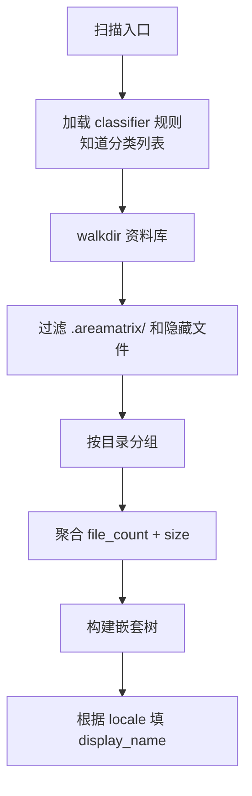

# 模块：目录扫描与树构建（tree）

> 给侧边栏树状图提供数据。输入资料库路径，输出 JSON 形式的目录树（含每节点文件数、显示名、英文 slug、深度等）。
>
> 阅读时长：约 4 分钟。

---

## 模块边界

输入：

- `repo_path`
- `locale`（"zh-CN" / "en"，决定 display_name）

输出：

```rust
pub struct TreeNode {
    pub slug: String,           // 英文 slug，唯一
    pub display_name: String,   // 本地化名
    pub kind: NodeKind,         // Category / Subdir
    pub relative_path: String,  // 相对资料库根
    pub file_count: i64,        // 含子节点
    pub size_bytes: i64,
    pub depth: i32,
    pub children: Vec<TreeNode>,
}

pub enum NodeKind { Category, Subdir }
```

序列化为 JSON 给 Swift。Swift 解码为 `TreeNode`（Codable）。

---

## 扫描算法



---

## 实现骨架

```rust
// core/src/tree/mod.rs
use std::collections::BTreeMap;
use std::path::{Path, PathBuf};

pub fn build_tree(repo: &Path, locale: &str) -> CoreResult<TreeNode> {
    let rules = crate::classify::rules::load_rules(repo)?;
    let categories: Vec<&CategoryDef> = rules.categories.iter().collect();

    let mut root = TreeNode {
        slug: "__root__".into(),
        display_name: t("repository", locale).into(),
        kind: NodeKind::Category,
        relative_path: "".into(),
        file_count: 0,
        size_bytes: 0,
        depth: 0,
        children: vec![],
    };

    for cat in &categories {
        let cat_dir = repo.join(&cat.slug);
        if !cat_dir.exists() { continue; }
        let mut node = build_category_node(repo, cat, locale)?;
        root.file_count += node.file_count;
        root.size_bytes += node.size_bytes;
        root.children.push(node);
    }

    // 处理 inbox（兜底）
    if !root.children.iter().any(|n| n.slug == "inbox") {
        let inbox_dir = repo.join("inbox");
        if inbox_dir.exists() {
            let inbox_def = CategoryDef::default_inbox();
            root.children.push(build_category_node(repo, &inbox_def, locale)?);
        }
    }

    Ok(root)
}

fn build_category_node(repo: &Path, cat: &CategoryDef, locale: &str) -> CoreResult<TreeNode> {
    let cat_dir = repo.join(&cat.slug);
    let mut node = TreeNode {
        slug: cat.slug.clone(),
        display_name: cat.display_name(locale).to_string(),
        kind: NodeKind::Category,
        relative_path: cat.slug.clone(),
        file_count: 0,
        size_bytes: 0,
        depth: 1,
        children: vec![],
    };
    walk_dir(&mut node, &cat_dir, repo, 1)?;
    Ok(node)
}

fn walk_dir(parent: &mut TreeNode, dir: &Path, repo: &Path, depth: i32) -> CoreResult<()> {
    let mut subdirs: BTreeMap<String, TreeNode> = BTreeMap::new();
    for entry in std::fs::read_dir(dir)? {
        let entry = entry?;
        let path = entry.path();
        let name = entry.file_name().to_string_lossy().to_string();
        if name.starts_with('.') { continue; }
        if name == "README.md" { continue; }
        if name.ends_with(".md") { continue; }  // 伴生笔记不进树

        if path.is_dir() {
            let mut sub = TreeNode {
                slug: name.clone(),
                display_name: name.clone(),
                kind: NodeKind::Subdir,
                relative_path: path.strip_prefix(repo).unwrap().to_string_lossy().to_string(),
                file_count: 0,
                size_bytes: 0,
                depth: depth + 1,
                children: vec![],
            };
            walk_dir(&mut sub, &path, repo, depth + 1)?;
            parent.file_count += sub.file_count;
            parent.size_bytes += sub.size_bytes;
            subdirs.insert(name, sub);
        } else if path.is_file() {
            parent.file_count += 1;
            parent.size_bytes += entry.metadata()?.len() as i64;
        }
    }
    parent.children = subdirs.into_values().collect();
    Ok(())
}

pub fn list_tree_json(repo: &Path, locale: &str) -> CoreResult<String> {
    let tree = build_tree(repo, locale)?;
    Ok(serde_json::to_string(&tree)?)
}
```

---

## 性能

| 文件数 | 扫描耗时（M1 SSD） |
|---|---|
| 1,000 | < 30ms |
| 10,000 | < 300ms |
| 100,000 | 1-3s |

10 万文件下需要优化：
- 用 `walkdir` 而不是递归 `read_dir`
- 跳过 `.areamatrix/`
- 不读文件内容、只看元数据

### Stage 2 优化方向

- 增量更新：只对受影响节点（FSEvents 报告的目录）局部刷新树
- 缓存：上次扫描结果存 SQLite，仅扫描修改过的目录

---

## DB 视图替代方案（Stage 2 起）

为大库性能，可改为从 DB 读：

```sql
SELECT
  category,
  COUNT(*) AS file_count,
  SUM(size_bytes) AS total_bytes
FROM files
WHERE status = 'active'
GROUP BY category;
```

子目录不在 DB 单独建表，而是从 path 字段动态聚合：

```sql
SELECT
  CASE
    WHEN INSTR(path, '/') = 0 THEN ''
    ELSE SUBSTR(path, 1, INSTR(SUBSTR(path, INSTR(path, '/')+1), '/') + INSTR(path, '/') - 1)
  END AS dir,
  COUNT(*), SUM(size_bytes)
FROM files
WHERE status = 'active'
GROUP BY dir;
```

DB 视图比 walkdir 快 10x（10 万文件下 < 50ms）。MVP 用 walkdir（简单），Stage 2 切换到 DB。

---

## i18n / locale

`display_name` 来自 classifier.yaml：

```yaml
- slug: docs
  display_name_zh: 文档
  display_name_en: Documents
```

```rust
impl CategoryDef {
    pub fn display_name(&self, locale: &str) -> &str {
        match locale {
            "zh-CN" | "zh" => &self.display_name_zh,
            _ => &self.display_name_en,
        }
    }
}
```

子目录暂时不本地化（用户起的名）。

---

## 测试

```rust
#[test]
fn empty_repo() {
    let repo = setup_empty_repo();
    let tree = build_tree(&repo, "zh-CN").unwrap();
    assert_eq!(tree.file_count, 0);
}

#[test]
fn counts_recursive() {
    let repo = setup_test_repo();
    add_file(&repo, "docs/a.pdf", 100);
    add_file(&repo, "docs/sub/b.pdf", 200);
    let tree = build_tree(&repo, "en").unwrap();
    let docs = tree.children.iter().find(|n| n.slug == "docs").unwrap();
    assert_eq!(docs.file_count, 2);
    assert_eq!(docs.size_bytes, 300);
}

#[test]
fn skips_areamatrix_internal() {
    let repo = setup_test_repo();
    let am = repo.join(".areamatrix");
    std::fs::create_dir_all(&am).unwrap();
    std::fs::write(am.join("foo"), b"x").unwrap();
    let tree = build_tree(&repo, "en").unwrap();
    assert!(!tree.children.iter().any(|n| n.slug == ".areamatrix"));
}

#[test]
fn skips_readme_and_companions() {
    let repo = setup_test_repo();
    add_file(&repo, "docs/README.md", 10);
    add_file(&repo, "docs/x.pdf", 100);
    add_file(&repo, "docs/x.pdf.md", 5);  // 伴生
    let tree = build_tree(&repo, "en").unwrap();
    let docs = tree.children.iter().find(|n| n.slug == "docs").unwrap();
    assert_eq!(docs.file_count, 1);
}
```

---

## Related

- [../architecture/overview.md](../architecture/overview.md)
- [classify.md](classify.md)
- [readme-gen.md](readme-gen.md)
