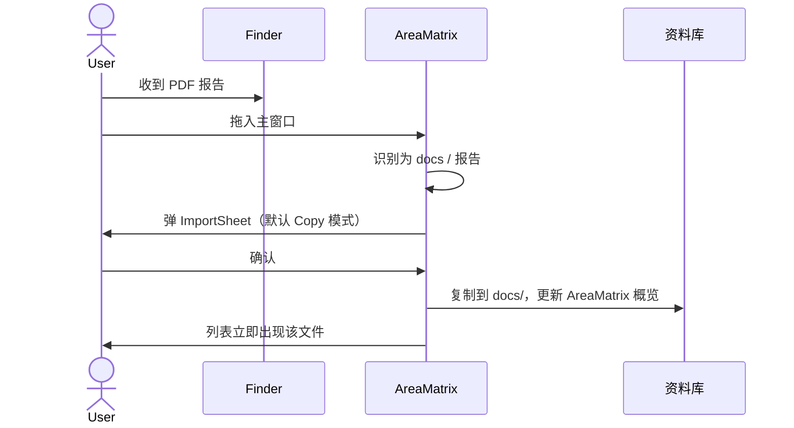

# 产品需求文档（PRD）

> AreaMatrix 是面向个人/小团队的 macOS 桌面端资料管理工具，通过拖拽自动归档、混合分类、改动追踪和树状视图，把散乱的文件变成可导航的知识仓库。
>
> 阅读时长：约 12 分钟。

---

## 1. 背景与问题陈述

### 1.1 用户当前的痛点

个人用户的资料文件（合同、发票、设计稿、源码、截图、学习资料）在日积月累中呈现以下症状：

| 症状 | 具体表现 |
|---|---|
| 桌面雪崩 | 几百个临时文件堆在桌面、`~/Downloads/` |
| 命名混乱 | `IMG_5821.jpg`、`新建文档(3).docx`、`final_v2_真的最终版.pdf` |
| 分类失败 | 想分类但每次手动建文件夹太麻烦，最终不分 |
| 找不到 | 知道存过但记不清放哪了，Spotlight 帮助有限（关键词记不准） |
| 改动失忆 | 不记得这个文件什么时候放进来的、之前改过什么 |
| 工具不连续 | Finder 看目录、Spotlight 搜索、备忘录写笔记 —— 三个分裂的工具 |

### 1.2 现有产品分析

| 产品 | 优势 | 不能解决我们的问题 |
|---|---|---|
| Finder | 系统集成、零成本 | 无自动分类、无改动历史、无概览 |
| Eagle | 视觉化资源库 | 只针对设计素材，文档/代码场景不友好 |
| DEVONthink | 强自动分类 | 重型工业品、收费高、UI 复杂 |
| Obsidian | 笔记 + 链接 | 不擅长二进制文件管理 |
| Hazel | 强规则引擎 | 只规则、无图形化资料库视图 |

### 1.3 我们的定位

> 个人版 DEVONthink 的现代轻量替代 + Hazel 的规则智能 + Obsidian 的活文档思想

面向**个人 / 小团队**，**轻量、原生、source-available**，第一性原则是"让资料整理这件事不再需要意志力"。

---

## 2. 目标用户

### 2.1 主要画像（P0）

**Alex，32 岁，独立开发者 / 研究者**

- 自由职业 / 在小团队工作
- macOS 重度用户，电脑里有 5 年累积的合同、PDF、代码、笔记、设计稿
- 试过文件夹整理、试过云盘、最后都放弃
- 隐私敏感（不愿全量上传到 Notion / Google Drive 做分类）
- 接受适度学习成本以换取长期可控的工作流

### 2.2 次要画像（P1）

**学者/研究生**：大量 PDF 论文、笔记、数据集
**自由设计师**：素材、客户文件、报价单、合同
**小团队负责人**：合同、发票、内部文档（团队共享留 Stage 4）

### 2.3 不是我们的用户（明确排除）

- 企业级文档管理（用 SharePoint）
- 云端协作场景（用 Notion / Google Drive）
- 媒体素材库（用 Eagle）
- 笔记/思考工具（用 Obsidian）

---

## 3. 核心价值主张

> 把文件**拖**进去，AreaMatrix 替你**分类、命名、记账**。

三个动词代表三个核心价值：
1. **分类**：自动决定文件归到哪里（规则 + 可选 AI）
2. **命名**：自动建议标准化命名
3. **记账**：每个改动都有日志，资料库有专属概览文件

---

## 4. 核心功能（按优先级）

### P0 - MVP（Stage 1 必须）

| 编号 | 功能 | 说明 |
|---|---|---|
| F1 | 拖拽导入 | 拖入文件到主窗口，自动分类到对应目录 |
| F2 | 三种存储模式 | 每次拖入选择 Move / Copy / Index |
| F3 | 规则分类引擎 | 基于扩展名 + 关键词的两层匹配 |
| F4 | 接管已有目录 | 任意空/非空文件夹都可作为资料库根，非空目录首次扫描建索引，扫描可恢复且遵守 `ignore.yaml` |
| F5 | AreaMatrix 概览 | 默认在 `.areamatrix/generated/` 生成概览，可选根目录 `AREAMATRIX.md`，不覆盖已有 `README.md` |
| F6 | 树状图导航 | 侧边栏完整目录树 |
| F7 | 文件列表 | 主区表格展示选中节点下的文件 |
| F8 | 详情面板 | 元数据 + 改动时间线 + 伴生笔记 |
| F9 | 改动日志 | SQLite 持久化所有操作 |
| F10 | FSEvents 同步 | 外部修改实时回流 UI 与 DB |
| F11 | 事务式导入 | 任何中断不留半文件 |
| F12 | 去重 | SHA256 检测重复，提示用户 |
| F13 | 设置面板 | 资料库路径、默认存储模式、概览生成策略、忽略规则入口 |
| F14 | 首次启动向导 | 选位置、打开已有库或接管已有目录 |
| F15 | iCloud 兼容 | 检测 iCloud 路径，处理占位符 |

### P1 - 可用版（Stage 2）

- F15 全文搜索（基于文件名 + 笔记）
- F16 批量操作（选中多个文件批量重分类）
- F17 撤销 / 历史回滚
- F18 自定义规则（UI 编辑 classifier.yaml）
- F19 标签系统（独立于分类的 cross-cutting 标签）
- F20 深色模式打磨

### P2 - 智能版（Stage 3）

- F21 AI 兜底分类（Ollama 本地 / OpenAI 云端可选）
- F22 智能命名（基于文件内容生成）
- F23 相似文件检测（语义级别）
- F24 OCR（图片 / PDF 文本提取，便于搜索）

### P3 - 多端版（Stage 4）

- F25 Windows 端（WinUI 3）
- F26 Linux 端（GTK）
- F27 iOS 端（SwiftUI 复用）
- F28 多设备同步（iCloud / 自托管）

---

## 5. 关键用户场景

### 场景 1：日常归档

### 场景 2：接管一个已有目录

用户已有一个 `/1/1/1/` 目录，里面混有代码、合同、截图、GitHub 项目：

1. 首次启动选择 `/1/1/1/` 作为资料库根
2. AreaMatrix 检测到目录非空，进入「接管已有目录」确认页
3. 用户确认后，应用只创建 `.areamatrix/` 内部目录并扫描现有文件
4. SQLite 建立索引，文件来源标记为 `adopted`，已有 `README.md`、项目文件、子目录全部保持原样
5. 应用生成 `.areamatrix/generated/root.md`，可选在根目录生成 `AREAMATRIX.md`
6. 侧边栏按现有目录树展示，后续拖入文件才按分类规则落位

### 场景 3：找一个旧文件

用户记得"上个月某个时候放进来过一份合同"：
1. 点侧边栏 docs 节点 → 主区列表只显示文档
2. 按导入时间倒序 → 上个月的条目集中
3. 详情面板「改动」Tab 看到 `imported 2026-03-15` 即可定位

### 场景 4：外部修改也不丢

用户在 Finder 里把 `docs/合同.pdf` 重命名为 `合同_2026Q1.pdf`：
1. FSEvents 监听到事件
2. Core 比对 hash 识别为重命名
3. SQLite 更新 path
4. 主窗口列表 1 秒内反映新名字
5. 该文件的改动时间线追加 `external_modified` 一条

### 场景 5：iCloud 同步场景

用户的资料库在 iCloud Drive 中，跨设备同步：
1. 设备 A 添加一个文件
2. iCloud 异步同步到设备 B（先是 `.icloud` 占位符）
3. 设备 B 的 AreaMatrix 检测到占位符，通过 NSFileCoordinator 触发下载
4. 下载完成后正常归档处理

### 场景 6：崩溃恢复

用户拖入 100 个大文件，导入到一半电脑断电：
1. 重启应用 → 自动检测 `.areamatrix/staging/` 残留
2. 比对 SQLite 中处于 staging 状态的记录
3. 已落位的不动，未落位的清理 staging
4. 提示用户："上次有 N 个文件未完成导入，已清理。请重新拖入。"

---

## 6. 非功能需求

### 6.1 性能

| 指标 | 目标 |
|---|---|
| 冷启动时间 | < 1.5s |
| 树状图渲染（10 万节点） | 首屏 < 500ms |
| 拖入单文件到落位 | < 200ms（不含 hash 计算） |
| SHA256 计算（100MB 文件） | < 500ms |
| FSEvents 事件 → UI 更新 | < 1s |
| 内存占用（空载） | < 150MB |
| 内存占用（10 万文件） | < 400MB |

### 6.2 可靠性

- 任何中断后**永不**丢失原文件（事务式 staging）
- SQLite 启用 WAL 模式 + 外键约束
- 崩溃后自动恢复，不需要用户介入

### 6.3 安全与隐私

- 所有数据保留在本地，**不上传任何信息**
- AI 兜底（Stage 3）默认关闭，启用时明确告知数据流向
- 不收集遥测、不发送崩溃报告（除非用户主动提交）
- 所有日志在用户本地 `~/Library/Logs/AreaMatrix/`

### 6.4 可访问性

- 完整的 VoiceOver 支持（Stage 2 起）
- 全键盘导航（不依赖鼠标也可完成核心操作）
- 高对比度模式适配

### 6.5 可扩展性

- 核心库（Rust）与平台无关，未来可扩 Windows/Linux/iOS
- 分类规则用户可通过 YAML 自定义
- 支持插件机制（Stage 4 考虑）

---

## 7. 设计原则（产品层）

1. **零意志力**：用户不需要思考"这个文件应该放哪儿"
2. **可逆**：所有操作可回滚（删除走回收站、改名留历史）
3. **不绑架**：用户可以随时弃用本工具，资料库目录在标准 Finder 里仍可访问；已有 `README.md`、项目结构和用户文件不被接管逻辑覆盖
4. **真相在文件系统**：DB 是索引，文件是真相（即使 DB 丢了，资料库目录依然完整可读）
5. **本地优先**：默认完全离线，AI 是可选项

> 第 4 点与"架构层"的真相源策略不同：架构层为了内部一致性以 DB 为主、外部变化通过 FSEvents 同步。但产品层向用户承诺：哪怕你把整个 `.areamatrix/` 删掉，你的文件也都还在标准目录里。

---

## 8. 商业模式

- 默认 PolyForm Noncommercial 1.0.0：个人/教育/研究/内部使用免费
- 商业使用需单独授权（见 [COMMERCIAL_LICENSE.md](../../COMMERCIAL_LICENSE.md)）
- 不做订阅、不做内购、不做 SaaS（Stage 1-3）
- 长期可能：企业版（多设备同步 + 团队协作）

---

## 9. 成功指标

### MVP 阶段（Stage 1）
- 完成所有 P0 功能
- 端到端验收清单 100% 通过
- 至少 1 位外部 alpha 用户使用 7 天无 P0 级别问题

### Stage 2
- GitHub Star ≥ 1000
- 月活贡献者 ≥ 5
- 0 已知 P0 bug

### Stage 3
- 月活用户 ≥ 5000（自报告）
- AI 分类准确率 ≥ 85%

---

## 10. 风险与缓解

| 风险 | 影响 | 缓解 |
|---|---|---|
| 用户接受度未知 | 投入打水漂 | 先做 MVP 找 5-10 位 alpha 用户验证 |
| 分类准确率不达预期 | 用户失望 | 规则透明可改，AI 是兜底不是替代 |
| FSEvents + iCloud 复杂度高 | 实施延期 | Stage 1 可降级为"仅警告 iCloud 路径"，Stage 2 完整支持 |
| 仅 macOS 限制用户基数 | 增长慢 | 接受这个限制，专注做精，Stage 4 再扩 |

---

## Related

- [user-stories.md](user-stories.md)
- [glossary.md](glossary.md)
- [../architecture/overview.md](../architecture/overview.md)
- [../roadmap/milestones.md](../roadmap/milestones.md)
- [../ux/first-launch.md](../ux/first-launch.md)
- [../ux/drag-import-flow.md](../ux/drag-import-flow.md)
- [../ux/ui-states.md](../ux/ui-states.md)
- [../ux/classifier-calibration.md](../ux/classifier-calibration.md)
- [../ux/dedup-conflict.md](../ux/dedup-conflict.md)
- [../ux/settings-panel.md](../ux/settings-panel.md)
- [../ux/error-messages.md](../ux/error-messages.md)
- [../ux/search.md](../ux/search.md)
- [../ux/deep-features.md](../ux/deep-features.md)
- [../ux/competitive-analysis.md](../ux/competitive-analysis.md)
