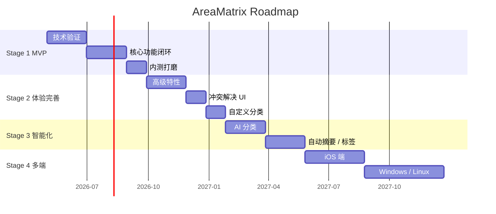

# 里程碑路线图

> AreaMatrix 分四阶段演进：MVP → 体验完善 → 智能化 → 多端扩展。每阶段 3-6 个月，按"先深后广"推进。
>
> 阅读时长：约 5 分钟。

---

## 总体路线图

---

## Stage 1：MVP（约 5 个月）

> **目标**：单机 macOS 上完成"拖入 → 自动归类 → 树状导航 → 详情查看"的完整闭环。能用、稳定、不丢数据。

### 核心交付

| 模块 | 范围 |
|---|---|
| Rust core | storage / classify / repo / db / change_log / sync 全部实现 |
| FFI | UniFFI bindings 完整，Swift 端 CoreBridge 稳定 |
| macOS UI | 主窗口三栏（侧栏 / 列表 / 详情）+ ImportSheet + 设置面板 |
| 文件操作 | 拖入、Move/Copy/Index 三模式、改名、跨分类移动、软删除 |
| 分类 | classifier.yaml 内置 10 类 + 关键词匹配 + 兜底 inbox |
| 监听 | FSEventStream + 200ms debounce + InFlight 过滤 + 启动 recovery |
| iCloud | 仓库可放 iCloud Drive，占位符按需下载 |
| README | 仓库根 + 分类目录 README 自动维护 |
| 单元测试 | core 加权覆盖率 ≥ 70% |
| 文档 | 本份完整文档随仓库交付 |

### 不做（明确推迟）

- AI 分类
- 标签系统（Stage 2）
- 全文搜索（Stage 2）
- 自定义分类规则编辑器 UI（仅命令行编辑 yaml）
- 多窗口 / 多仓库
- 主题切换 / 暗色模式深度优化
- 公开发布（仅内测分发）

### 验收

详见 [stage-1-mvp.md](stage-1-mvp.md) 完整任务清单与验收清单。

### 时间预算

- 月 1-2：技术验证 + Rust core 基础
- 月 3-4：UI 闭环 + FSEvents + iCloud
- 月 5：稳定性打磨 + 测试 + 文档

---

## Stage 2：体验完善（约 4 个月）

> **目标**：把 MVP 打磨到"日常用 30 天不出大问题"，并加入第二波核心特性。

### 计划交付

#### 高级文件操作

- 批量改名（按规则 / 按模板）
- 批量打标签 / 批量改分类
- 拖出（应用 → 外部）也记录到 change_log
- 撤销 / 重做最近 N 操作

#### 标签系统

- 多标签每文件
- 标签云 / 标签筛选
- 自动标签建议（基于文件名 / 路径关键词）

#### 全文搜索

- 文件名 + 备注 + 改动历史搜索
- 模糊匹配 + 拼音首字母（中文）
- 高亮匹配位置

#### 冲突解决 UI

- iCloud 冲突文件可视化对比 + 选择
- 同名导入冲突的批量决策

#### 自定义分类

- 新增 / 编辑分类的 UI（替代直接改 yaml）
- 规则可视化编辑器

#### 用户体验细节

- 暗色模式适配
- 快捷键体系
- 命令面板（⌘K）
- 拖拽预览动画
- Touch Bar / Stage Manager 适配

### 时间预算

- 月 1-2：标签 + 搜索
- 月 3：冲突 UI + 自定义分类
- 月 4：UX 细节 + 公开发布准备

---

## Stage 3：智能化（约 4 个月）

> **目标**：引入 AI 能力，让分类与组织自动化程度更高，但仍保持本地优先。

### 计划交付

#### AI 分类（L3）

- 默认本地：Ollama / llama.cpp 跑小模型
- 可选远程：OpenAI / Anthropic API（用户自带 key）
- 仅在 L1+L2 都失败时调用，结果带 confidence 显示
- 离线场景自动 fallback 到 inbox

#### 自动摘要

- PDF / 文档：提取首段 + AI 摘要
- 图片：OCR + 识别主题
- 视频 / 音频：识别长度 + 推断类型

#### 自动标签

- 基于文件内容生成 3-5 个候选标签
- 用户一键采纳 / 修改

#### 智能搜索

- 自然语言查询（"上个月的发票"）
- 跨字段语义搜索

#### 隐私与可控

- 所有 AI 调用记录可见 / 可清除
- 可配置"不发送到 AI 的目录 / 关键词"
- 远程模型可显式禁用

### 时间预算

- 月 1：本地 LLM 集成
- 月 2：分类 + 摘要
- 月 3：标签 + 搜索
- 月 4：隐私控制 + 性能调优

---

## Stage 4：多端扩展（约 7 个月）

> **目标**：把 macOS 的能力扩展到 iOS / Windows / Linux，复用 Rust core。

### 计划交付

#### iOS 端（约 3 个月）

- SwiftUI 移动端 UI（重新设计，非桌面 UI 缩小版）
- 与 macOS 共用同一 iCloud 仓库
- 拍照 → 自动归类
- 分享面板集成（其他 app 一键存入 AreaMatrix）

#### Windows 端（约 2 个月）

- WinUI 3 或 Avalonia
- Rust core 用 UniFFI 生成 C# binding（或 cbindgen 直通）
- 文件监听用 ReadDirectoryChangesW
- OneDrive 集成（替代 iCloud）

#### Linux 端（约 2 个月）

- GTK4 或 Qt 6
- inotify 文件监听
- 仅本地（云盘选项视用户偏好）

### 不做

- Android：暂缓，等 iOS 稳定后单独评估
- Web 端：违反"本地优先"，不做

### 时间预算

- 季度 1：iOS
- 季度 2：Windows
- 季度 3：Linux + 多端联调

---

## 长期愿景（Stage 5+）

不在当前路线图中，但可能未来纳入：

- **协作功能**：多人共享仓库（基于 git 或自建协议）
- **插件机制**：第三方扩展分类逻辑
- **企业版**：团队共享仓库 + 权限控制（独立商业授权）
- **公开 SDK**：第三方应用接入 AreaMatrix 仓库
- **CLI / Lua 脚本**：高级用户自动化

---

## 决策原则

不论哪个阶段，遵守：

1. **不破坏向后兼容**：DB schema / API / 配置文件升级必须有 migration 路径
2. **不引入云依赖**：核心功能离线可用
3. **不打破隐私承诺**：用户数据默认不出本机
4. **不为新功能牺牲稳定性**：现有功能必须保持稳定
5. **每个 Stage 结束**做一次完整 retrospective，更新本文件

---

## 重审节奏

- **每月**：检查当前 Stage 进度、调整短期任务
- **每个 Stage 结束**：评估下个 Stage 的范围与时间
- **每年 WWDC 后**：评估 macOS / Apple 生态变化对路线图的影响

---

## Related

- [stage-1-mvp.md](stage-1-mvp.md)
- [../product/prd.md](../product/prd.md)
- [../adr/README.md](../adr/README.md)
- [../../CHANGELOG.md](../../CHANGELOG.md)
